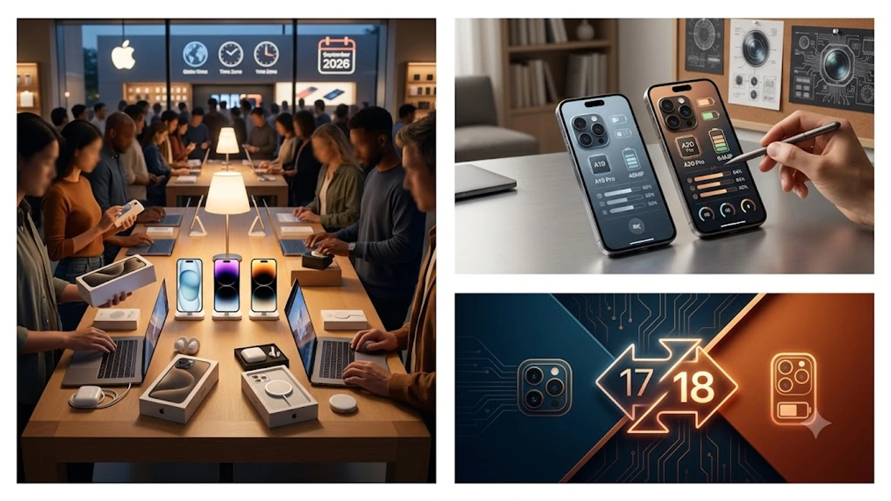

2026년 가을 스마트폰 시장을 뒤흔들 핵심 변수인 **아이폰18 출시일**과 신규 하드웨어 윤곽이 드디어 모습을 드러냈다. 매년 반복되는 교체 주기 속에서 이번 신제품은 한층 진화한 온디바이스 연산 구조와 완전히 재설계된 내부 아키텍처를 앞세워 기술적 도약을 시도한다. 혁신 피로감에 지친 실사용자들의 시선을 단숨에 사로잡을 핵심 포인트와 실제 체감 변화를 가감 없이 짚어본다.

## 아이폰18 공식 공개 일정과 사전예약 혜택

### 9월 애플 이벤트 발표 핵심 일정
애플은 늘 그렇듯 9월 둘째 주 화요일 키노트 행사를 통해 차세대 플래그십 라인업을 공개하는 전통을 고수한다. 이번 행사에서는 하드웨어 규격 개선 외에도 애플 인텔리전스의 고도화된 기능군이 대거 공개되어 관람객들의 탄성을 자아냈다. 전 세계 미디어의 이목이 쏠린 가운데 발표 직후 금요일부터 1차 사전 주문 접수가 일제히 시작된다.

### 국내 통신사별 사전예약 프로모션 비교
국내 이동통신 3사는 초기 물량 확보를 위해 새벽 배송과 전용 사은 혜택을 전면에 내세웠다.
- 통신사 공식몰 전용 카드 무이자 할부 혜택
- 개통 당일 즉시 수령 가능한 퀵 서비스 지원
- 전용 케이스 및 고속 충전 액세서리 패키지 기본 증정

선택약정 할인율과 공시지원금 규모를 면밀히 따져보지 않고 덜컥 고가 요금제에 묶이면 배보다 배꼽이 더 커질 수 있으니 꼼꼼한 계산이 필수다.

### 1차 출시국 포함 여부와 실제 수령일
한국 시장이 주요 1차 출시국 지위를 유지하면서 글로벌 정식 발매일과 동일한 날짜에 기기를 손에 쥘 수 있게 되었다. 통상 사전 예약 시작 일주일 뒤인 금요일 오전부터 전국 오프라인 매장 수령과 택배 배송이 일제히 시작된다. 물량 부족에 따른 배송 지연을 피하려면 1차 수령 확정 그룹에 진입하는 것이 관건이다.

## 아이폰18 vs 아이폰17 혁신 스펙 심층 비교

### 차세대 A20 바이오닉 칩셋과 온디바이스 AI
새롭게 탑재된 A20 프로세서는 차세대 2나노미터(nm) 공정 기반으로 설계되어 전력 효율과 그래픽 처리 속도 모두에서 비약적인 상승을 이뤄냈다. 특히 신경망 엔진(NPU)의 연산 대역폭이 획기적으로 넓어져 네트워크 연결 없이도 고난도 자연어 처리와 사진 보정을 즉각 끝마친다. 이는 단순한 기기 업그레이드를 넘어 사용자의 디지털 일상 통제권을 재정의하는 기술적 전환점이라 볼 수 있다. 기술 발전이 인간의 사고방식에 미치는 영향은 [제로 클릭 2026, 내 자유의지는 진짜 살아있을까?](/posts/humanities/zero-click-era-autonomy-2026/) 글에서도 깊이 있게 다룬 바 있다.

### 폼팩터 디자인 변화 및 디스플레이 개선점
외형적으로는 베젤 두께를 한계치까지 깎아내 화면 몰입감을 극대화했다. 화면 밝기 역시 직사광선 아래 야외 시인성을 대폭 끌어올려 대낮 야외 촬영 시에도 화면 속 피사체를 선명하게 확인할 수 있다.

> "소재 혁신은 단순히 무게를 줄이는 데 그치지 않고, 장시간 쥐었을 때 손목에 전해지는 하중 밸런스 자체를 바꾼다."

내구성을 한 단계 끌어올린 티타늄 합금 프레임은 낙하 충격을 효율적으로 분산하도록 재설계되었다.

### 카메라 센서 및 가변 조리개 기능 분석
프로 라인업의 백미는 단연 물리 가변 조리개 메커니즘의 도입이다. 빛의 양에 따라 조리개 구경이 유기적으로 조절되므로 야간 저조도 환경에서는 노이즈를 억제하고, 밝은 야외에서는 왜곡 없는 심도 표현을 완성한다. 4800만 화소 잠망경 망원 렌즈의 손떨림 보정(OIS) 성능도 한층 정교해져 움직이는 피사체를 놓치지 않고 선명하게 포착한다.

## 실제 구매 가이드 및 라인업별 가격 변화

### 일반형 vs 프로 라인업 장단점 체크
일반 모델은 경량화된 무게와 산뜻한 색상 조합으로 일상적인 웹 서핑, 소셜 미디어, 캐주얼 영상 시청에 가장 이상적인 밸런스를 보여준다. 반면 프로 모델은 120Hz 프로모션 디스플레이, 전문가급 ProRAW 사진 및 ProRes 영상 녹화, 고성능 외장 드라이브 전송 속도를 필요로 하는 헤비 유저에게 걸맞은 작업 도구다. 본인의 주 사용 패턴이 단순 소비인지 전문 창작인지 냉정하게 판단해야 불필요한 지출을 막는다.

### 환율 변동에 따른 국내 출고가 전망
글로벌 반도체 원자재 가격 상승과 원·달러 환율 변동 추이가 맞물리면서 국내 최종 출고가는 소폭 인상 압박을 받고 있다. 기본 용량 모델의 가격은 동결 수준을 유지하더라도, 대용량 스토리지 옵션으로 넘어갈수록 체감 가격 인상 폭이 가팔라지는 구조다. 용량 선택 시 클라우드 스토리지 활용 여부를 따져보는 전략이 예산 절약의 지름길이다.

### 전작 사용자 기기 변경 실익 분석
아이폰16이나 17 시리즈를 사용 중이라면 체감 성능 격차가 크지 않아 굳이 무리해서 기기를 바꿀 이유는 적다. 하지만 아이폰13, 14 시리즈 이하 모델을 유지해 온 사용자라면 배터리 지속 시간, 카메라 암부 표현력, 디스플레이 주사율 등 전 영역에서 즉각적인 체감 성능 향상을 경험하게 된다.

## 놓치면 후회하는 사전예약 성공 가이드

### 결제 수단 사전 등록과 빠른 성공 팁
사전 예약 당일에는 서버 트래픽이 폭주하기 때문에 1초 차이로 배송 차수가 밀려버린다.
- 오픈 10분 전 오픈마켓 로그인 상태 유지
- 간편결제 비밀번호 생체 인증(지문/Face ID) 활성화
- 배송지 주소 기본값 재확인

결제창 진입 시 보안 문자 입력이나 카드사 인증 앱 호출 과정에서 에러가 발생하는 경우가 잦으므로, 원클릭 간편결제를 미리 기본 결제 수단으로 지정해 두어야 안전하다.

### 자급제 구매와 알뜰폰 요금제 조합 추천
약정의 굴레에서 벗어나 통신비를 극적으로 아끼고 싶다면 자급제 단말기 구매 후 알뜰폰(MVNO) LTE/5G 무제한 요금제를 조합하는 방식이 경제적이다. 24개월 혹은 36개월 기준 총 납부 금액을 비교해 보면 통신사 공시지원금을 받는 것보다 수십만 원 이상 절약되는 경우가 허다하다.

### 기존 사용 기기 보상 판매(트레이드인) 활용법
기존 스마트폰의 상태가 양호하다면 보상 판매 프로그램을 적극 공략하는 편이 현명하다. 액정 파손이나 심한 외관 스크래치가 없다면 중고 플랫폼 개인 거래보다 신경 쓸 일 없이 확정 정산금을 받을 수 있어 기기 변경에 드는 실질 초기 비용을 대폭 낮춰준다.

[아이폰 전용 강화유리 및 고속 충전기 쿠팡에서 보기](https://www.coupang.com/np/search?q=%EC%95%84%EC%9D%B4%ED%8F%B0%20%EC%95%A1%EC%84%B8%EC%84%9C%EB%A6%AC&sourceType=affiliate&trackingCode=AF8691300)

#아이폰18 #아이폰18출시일 #아이폰18스펙 #아이폰사전예약 #애플이벤트 #자급제폰 #스마트폰교체