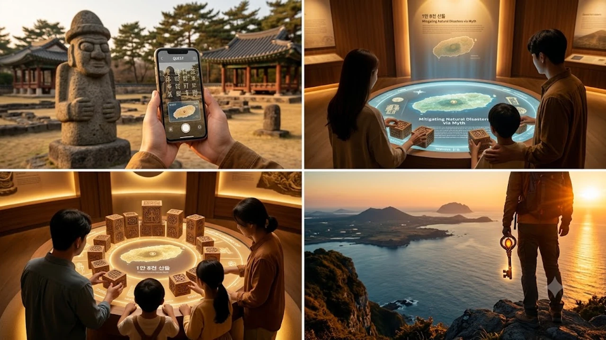

2026년 8월 말, 제주 전역이 거대한 신화 속 미션 공간으로 탈바꿈했습니다. 최근 여행 트렌드가 단순 휴양을 넘어 몰입형 현장 체험으로 진화하면서 **제주 신화 퀘스트** 투어가 로컬 인문 기행의 새로운 기준을 제시하고 있습니다. 탐라의 건국 설화와 세계자연유산이 결합한 이번 프로그램은 역사적 상상력과 현장 탐방의 묘미를 동시에 안겨줍니다.

## 제주 신화와 국가유산의 결합, 2026년 왜 화제인가

### 설문대할망·신구간 설화가 현실 미션투어로 바뀐 배경
제주는 1만 8천 신들의 고향이라 불릴 만큼 방대한 구전문학의 보고입니다. 거대한 체구로 제주 섬을 빚어냈다는 창조신 설문대할망, 지상의 모든 신들이 하늘로 올라가 임무를 교대하는 신구간 등 독특한 설화 체계가 지금까지 전해 내려옵니다.

과거에는 이러한 이야기들이 박물관의 안내판이나 책자 속에 갇혀 있었지만, 2026 국가유산 주간을 기점으로 현장 참여형 콘텐츠로 전면 재해석되었습니다. 문자로만 읽던 신화가 방문객의 발걸음을 이끄는 현실의 단서로 재탄생한 셈입니다.

### 단순 관람을 넘어선 대체현실게임(ARG) 방식의 인문 체험
단순히 유적지를 둘러보고 사진을 찍는 정적인 방식에서 벗어나, 참가자가 신화 속 비밀을 파헤치는 주인공이 되는 **대체현실게임(ARG, Alternate Reality Game)** 형식을 적용했습니다.

- 모바일 기기로 전송되는 암호문 해독
- 현장 문화유산 지형지물에 숨겨진 물리적 단서 탐색
- 증강현실 기술과 구전문학 고증 데이터의 결합

최근 활자 중심의 깊은 몰입과 아날로그 감성을 탐색하는 흐름은 [텍스트힙 진짜 트렌드인가? 완전 정리](/posts/humanities/text-hip-independent-humanities-2026/)에서도 확인할 수 있듯, 능동적으로 인문학적 맥락을 해석하려는 독자층의 갈증과도 맞닿아 있습니다.

## 제주 신화 퀘스트 투어의 핵심 포인트 3가지

### 설화 속 장소와 실제 문화유산(만장굴·제주목 관아)의 연결성
이번 투어의 돋보이는 특징은 지리적 실체와 설화적 상징의 정밀한 매핑입니다.

> 용암동굴의 웅장함을 품은 **만장굴**에서는 지하 세계를 다스리는 신화적 서사를, 조선 시대 제주의 중심 행정기관이었던 **제주목 관아**에서는 탐라국 개국 설화와 조선 시대 유교 문화의 교차점을 추적하도록 설계되었습니다.

참가자는 지도를 따라 걸으며 용암 지형의 지질학적 가치와 그 위에 덧입혀진 토속 신앙의 자취를 입체적으로 체감하게 됩니다.

### 모바일 미션 해결로 풀어보는 탐라국 역사 코드
단순 퀴즈 풀이가 아닌, 실제 역사 사료와 구전 설화의 교집합을 찾아내는 방식으로 운영됩니다.

- 삼신인(고을나·양을나·부을나) 설화 속 벽랑국 공주와의 만남
- 탐라국의 농경 시작과 방위별 오름의 배치 관계
- 고려·조선 시대를 거치며 변모한 제주의 굿 문화와 제의 공간

역사적 사건의 기록과 민간 설화 사이의 간극을 모바일 미션으로 채워가면서 탐구의 쾌감을 제공합니다.

### 세대 구분 없이 몰입하는 스토리텔링 기반 퀘스트 동선
난이도별 루트 설계 덕분에 가족 단위 여행자부터 깊이 있는 인문 탐방을 원하는 성인 참가자까지 맞춤형 참여가 가능합니다. 어린이 참가자를 위한 '아기 신 구출' 스토리라인부터 고문헌 기록을 바탕으로 한 심화형 '탐라 비기 해독' 코스까지 세분화하여 몰입도를 끌어올렸습니다.

## 역사와 설화가 만나는 인문학적 관람법

### 신화적 상상력과 유적지 고증의 조화로운 감상 팁
신화는 허구가 아니라 당대 사람들의 자연관과 세계관이 응축된 상징 체계입니다. 화산섬 제주의 거친 자연환경에 적응하기 위해 조상들이 신화를 어떻게 삶의 규범으로 삼았는지 이해하는 태도가 유익합니다.

- 돌하르방의 형태와 배치에 담긴 공간 수호 개념
- 본향당(마을 신을 모시는 사당)에 남은 공동체 유대 의식
- 자연 재해에 맞선 민초들의 소망이 투영된 영등할망 설화

### 로컬 헤리티지 콘텐츠가 전달하는 생태와 인문 가치
제주 신화의 바탕에는 자연을 향한 경외심이 흐릅니다. 바람, 돌, 바다, 오름 하나하나에 영혼이 깃들어 있다고 여겼던 선인들의 지혜는 현대 생태 철학과도 긴밀히 맞닿아 있습니다. 유적지를 걸으며 돌담 하나, 팽나무 한 그루에 깃든 옛 기억을 되살리는 과정 자체가 지속 가능한 인문 여행의 표본입니다.

## 방문 전 알아둘 실전 참여 가이드 및 유의사항

### 2026 제주 국가유산 주간 일정 및 무료 개방 혜택 활용법
2026년 8월 24일부터 열리는 국가유산 주간에는 제주목 관아, 성읍민속마을 등 주요 공공 유적지가 특별 야간 개장 및 무료입장 혜택을 운영합니다. 특히 야간 프로그램은 조명과 미디어아트가 어우러져 낮과는 사뭇 다른 신비로운 분위기를 연출합니다.

### 퀘스트 완료 혜택 및 현장 참여 시 필수 준비물
스마트폰 배터리 소모량이 많으므로 고용량 보조배터리는 챙겨야 할 준비물입니다. 유적지 간 도보 이동 구간이 포함되어 있으므로 편안한 운동화와 야외 활동용 모자를 갖추는 편이 좋습니다. 미션을 완수하면 탐라국 전통 문양이 각인된 친환경 완주 메달 및 지역 서점 연계 바우처를 수령할 수 있습니다.

[제주 여행 역사 인문 가이드북 쿠팡에서 보기](https://www.coupang.com/np/search?q=%EB%8F%84%EC%84%9C%20%EB%AC%B8%EA%B5%AC%EC%9A%A9%ED%92%88&sourceType=affiliate&trackingCode=AF8691300)

#제주신화퀘스트 #제주국가유산주간 #설문대할망 #탐라국역사 #만장굴 #제주목관아 #인문여행 #로컬헤리티지 #대체현실게임