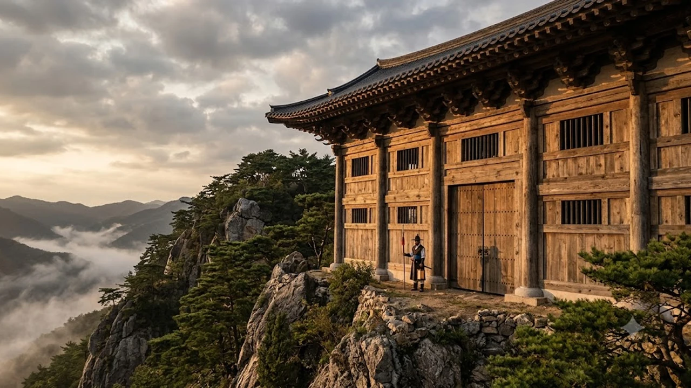

세계기록유산에 등재된 **조선왕조실록 보존** 기술은 수백 년의 전란과 혹독한 습기를 뚫고 글자 한 획 흐트러짐 없이 원형을 지켜낸 기록 과학의 정점입니다. 현대의 자기 디스크나 클라우드 스토리지조차 10~20년 주기로 데이터 증발 위험에 직면하지만, 선조들이 구축한 전통 **기록 관리 과학**은 500년 세월을 온전히 버텨냈습니다. 절대 권력자조차 함부로 열어볼 수 없었던 왕실의 엄격한 규율과 자연 생태를 꿰뚫어 본 보존 기술의 핵심을 짚어봅니다.

## 500년을 버텨낸 기록의 기적: 조선왕조실록 보존의 역사적 배경

### 조선 초기 4대 사고와 임진왜란 이후 5대 산악 사고 체제
조선 전기는 한양 춘추관을 비롯해 충주, 성주, 전주 네 곳의 평지 중심지에 실록을 나누어 보관했습니다. 하지만 1592년 임진왜란 당시 전주사고를 제외한 세 곳의 실록이 왜군의 방화와 약탈로 잿더미가 되는 참극을 맞았습니다. 전쟁의 참화를 겪은 조정은 살아남은 전주사고본을 저본 삼아 실록을 다시 인쇄한 뒤, 적의 침투와 화재를 원천 차단하기 위해 **마니산(후에 정족산), 태백산, 묘향산(후에 적상산), 오대산** 등 인적이 드문 험준한 산악 깊숙한 곳으로 사고를 전면 이전했습니다.

### 왜 왕조는 험준한 산속 깊은 곳으로 실록을 옮겼을까?
평지 도심에 위치한 사고는 외적 침입이나 민란, 실화에 무방비였습니다. 반면 험준한 산악 지대는 접근 자체가 차단벽 역할을 해 인위적인 훼손을 막아냈습니다. 또한 해발 700~1,000m 고지대 특유의 서늘한 기온과 일정한 통풍 환경은 종이의 노화를 늦추고 해충의 서식을 억제하는 천연 항온·항습실 역할을 톡톡히 해냈습니다.

### 전주사고본 수호와 조선 왕실의 기록 보존 집념
임진왜란 초기 전주가 함락 위기에 처하자, 정읍의 유생 안의와 손홍록은 사재를 털어 60여 궤짝에 달하는 실록과 고려사를 내장산 용굴암과 은적암으로 날랐습니다. 이들은 왜적의 칼날을 피해 370여 일간 교대로 산속을 지키며 기록을 수호했습니다. 이 단 한 질의 기록이 살아남았기에 472년에 걸친 왕조의 모든 국정 기록이 오늘날 인류의 유산으로 이어질 수 있었습니다.

## 습기와 해충을 막은 선조들의 첨단 과학: '포쇄(曝灑)'의 원리

### 3년에 한 번 열린 국가급 통풍 의식, 포쇄의 진행 과정
포쇄는 장마철 동안 종이가 머금은 습기를 털어내고 곰팡이를 방지하는 정기 환기 작업이었습니다. 조정은 통상 3년 주기로 정3품 이상의 **사관(史官)**을 포쇄관으로 사고 현장에 직접 파견했습니다. 사관은 사고 문을 봉인한 붉은 노끈(홍승)의 결박 상태를 확인한 뒤, 궤함을 열고 책장을 한 장씩 넘기며 실록의 훼손 여부를 꼼꼼히 기록으로 남겼습니다.

### 직사광선을 피하고 그늘 바람을 활용한 전통 항습 기술
포쇄 작업 시 햇볕에 책을 직접 노출하는 일은 엄격히 금지되었습니다. 강한 자외선은 한지의 섬유질을 산화시켜 바스러지게 만들고 먹물의 주성분인 아교를 변질시키기 때문입니다.
- **음건(陰乾) 원칙 고수:** 서늘한 사고 누각 회랑이나 그늘진 통풍 처마 밑에서 건조 진행
- **자연 대류 바람길 활용:** 사고 외벽의 들창과 판자벽 틈새를 개방해 산바람 순환 극대화
- **최적 건조 시기 선정:** 습도가 가장 낮고 청명한 늦가을(음력 8~9월) 맑은 날에만 작업 시행

### 천연 방충 약재 배치와 실록 궤함의 밀폐 과학
실록을 수납하는 궤함은 결이 치밀하고 습도 조절 능력이 뛰어난 소나무 원목에 옻칠을 입혀 제작했습니다. 옻칠은 방수·방충·항균 효과를 동시에 발휘했습니다. 궤함 바닥과 책갈피 사이에는 좀벌레가 기피하는 **천궁(川芎)**과 **창포(菖蒲)** 가루를 명주 주머니에 담아 넣어 유충과 곰팡이 침투를 2중으로 차단했습니다.

> "실록 궤를 열어 포쇄할 때는 반드시 마른 붓으로 먼지를 털어내고, 습기와 좀벌레가 있는지 낱낱이 살펴 형편을 치계하라." — 『조선왕조실록』 포쇄 절목 중

## 내구성을 극대화한 전통 제본의 결정체: '오침안정법'과 한지

### 다섯 개 구멍으로 영구성을 완성한 오침안정법의 구조
조선 왕실 의궤와 실록은 책 등에 구멍 다섯 개를 뚫고 붉은 명주실로 단단히 엮는 **오침안정법(五針眼訂法)**으로 제본했습니다. 이는 네 개의 구멍을 뚫던 중국의 사침안정법보다 책등 양 끝의 결속력을 획기적으로 높인 기술입니다. 수백 번을 펼치고 접어도 책등이 터지거나 낱장이 분리되지 않는 강인한 구조적 안정성을 자랑합니다.

### 천 년을 버티는 닥나무 전통 한지와 송연묵의 보존력
실록의 바탕이 된 닥종이는 닥나무 껍질을 잿물에 삶고 두드리는 도침(搗砧) 과정을 거친 알칼리성 종이입니다. 산성화로 인해 100여 년만 지나면 누렇게 변하고 부스러지는 서양 목재 펄프지와 달리 1,000년 이상 질긴 섬유질을 유지합니다. 여기에 소나무 관솔을 태워 만든 송연묵을 결합해 먹물이 종이 섬유 심층부까지 단단히 흡착되도록 제작했습니다.

### 동양의 5침 안정 제본과 서양식 양장 제본의 특성 비교
- **오침안정 한장본:** 접착제를 일절 쓰지 않고 천연 명주실로만 엮어 통기성이 뛰어나며 결로와 부패를 원천 차단
- **서양식 가죽 양장본:** 동물성 아교 접착제를 사용해 습기에 노출될 경우 접착면이 굳거나 썩어 책장이 분리되는 취약점 노출

손끝으로 넘기는 물리적 활자 기록의 영속성은 오늘날 종이책 본연의 물성을 탐구하는 [텍스트힙 진짜 트렌드인가? 완전 정리](/posts/humanities/text-hip-independent-humanities-2026/) 담론과도 깊은 맥이 닿아 있습니다.

## 디지털 증발 시대에 조선의 아카이빙 철학이 주는 교훈

### 데이터 손실 위험을 방지하는 분산 분할 백업 시스템
오늘날 클라우드 센터 화재나 사이버 공격으로 막대한 공공·민간 데이터가 한순간에 증발하는 사고가 잇따릅니다. 조선 조정이 실록 정본과 부본을 제작해 수백 킬로미터 떨어진 5대 산악 사고에 지리적으로 분산 격리했던 전략은 최신 IT 엔지니어링의 지리적 분산 백업(Geo-Replication) 아키텍처와 정확히 일치합니다.

### 오대산사고본 환수 역사와 세계가 주목하는 전통 보존 노하우
일제강점기 도쿄제국대학으로 불법 반출되었다가 관동대지진의 화마 속에서 기적적으로 살아남아 고국으로 돌아온 오대산사고본 실록과 의궤는 동양 보존 과학의 백미입니다. 화학 약품을 배제하고 천연 한지와 전통 찹쌀풀로 결실된 부분을 메우는 복원 기법은 현재 유수의 글로벌 박물관과 유네스코가 주목하는 표준 보존 솔루션으로 인정받고 있습니다.

### 인공지능·디지털 시대에 되새기는 영구 기록의 철학적 가치
모든 정보가 0과 1의 데이터로 치환되어 손쉽게 왜곡·삭제될 수 있는 인공지능 시대일수록, 역사의 진실을 붓끝에 담아 수백 년 뒤 미래 세대에게 있는 그대로 전하고자 했던 선조들의 아카이빙 철학은 시대를 초월한 무게를 전합니다.

[조선왕실 전통 제본 한지 노트 쿠팡에서 보기](https://www.coupang.com/np/search?q=%EC%A1%B0%EC%84%A0%EC%99%95%EC%8B%A4%20%ED%95%9C%EC%A7%80%EB%85%B8%ED%8A%B8&sourceType=affiliate&trackingCode=AF8691300)

#조선왕조실록 #조선왕조실록보존 #오대산사고 #오침안정법 #포쇄 #기록관리 #전통한지 #조선왕실문화