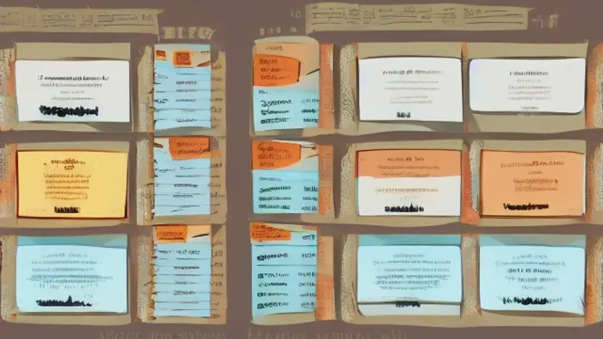

기술의 급격한 진화로 모든 것이 가벼워진 경량문명 시대, 역설적으로 삶의 중심을 잡게 하는 **경량문명 인문학**의 가치가 실존적 생존 전략으로 떠올랐습니다. 생성형 AI가 지식의 생산과 복제를 독점하는 현시점에, 인간만이 발휘할 수 있는 고유한 통찰과 본질을 꿰뚫는 힘은 대체 불가능한 자산이 됩니다.

## 경량문명의 본질과 인문학적 전환

### 파편화된 지식에서 맥락적 통찰로
과거엔 지식을 머릿속에 축적하는 능력이 곧 경쟁력이었으나, 지금은 클릭 한 번으로 모든 데이터에 접근합니다. 경량문명은 무거운 지식의 짐을 내려놓고 핵심 의미만을 선별해 실전 무기로 쓰는 흐름을 뜻합니다. 인문학은 파편화된 디지털 정보 속에서 파편들을 연결해 유의미한 전체 그림을 그려내는 강력한 접착제가 됩니다.

### 효율성 만능주의가 놓친 본질
알고리즘과 효율성이 비즈니스를 지배할수록, 정작 사람이 원하는 '예외'와 '맥락'은 소외되기 일쑤입니다. 
> "데이터는 과거의 박제된 기록일 뿐, 미래의 맥락을 설계하는 건 인간의 직관이다."

데이터만 쫓는 기업은 정체되지만, 인간 욕망의 근원을 파고드는 인문학적 사고를 갖춘 조직은 위기 상황에서 판을 뒤집습니다.

### 정보의 홍수 속 필터링 전략
쏟아지는 콘텐츠 더미에서 진짜 가치를 골라내는 안목은 인문학적 소양에서 비롯됩니다. 기술의 화려함에 현혹되지 않고 그 이면에 감춰진 설계자의 의도와 사회적 함의를 파헤치는 훈련이야말로 경량문명에서 살아남는 첫 번째 기술입니다. [관련 글 보기](/posts/humanities/)

## AI 시대, 기술 사고와 인문학적 사유의 격차

### 프롬프트에 담긴 질문의 격
AI로부터 최상의 결과물을 뽑아내는 프롬프팅 기술은 결국 질문을 던지는 인간의 사유 깊이에 종속됩니다. 현상을 비판적으로 이해하지 못한 질문은 AI에게 뻔한 요약만 받아내는 결과를 낳습니다. 철학적 뼈대가 있는 질문은 AI의 통계적 예측치를 넘어 창의적 답변을 끌어내는 치트키가 됩니다.

### 속도라는 함정과 본질이라는 무기
기술 중심 사고는 '어떻게(How)'를 통해 속도전에 몰두하지만, 인문학적 사고는 '왜(Why)'를 물으며 근본을 파고듭니다. 속도만으론 기술 발전을 절대 따라잡을 수 없습니다. 반면 본질을 꿰뚫는 관점은 어떤 기술이 쏟아져도 흔들리지 않는 개인의 차별화된 실력으로 남습니다.

### 결과물을 재해석하는 주체적 감각
AI의 결과물을 무비판적으로 수용하지 않고, 자신의 경험과 윤리적 판단으로 필터링하십시오. 데이터를 기반으로 삼되 인간의 감수성으로 최종 판단을 내리는 과정이 진정한 기술 활용입니다.

## 실용적 인문학을 위한 행동 지침

### 매일 10분, 고전으로 뉴스 읽기
고전은 인류가 수천 년간 겪어온 문제의 정답지입니다. 매일 뉴스를 읽을 때 마키아벨리의 권력론이나 스토아 학파의 수양론을 대입해 보십시오. 정보 소비를 넘어 정보를 해체하고 재구성하는 순간, 본인만의 관점이 형성됩니다.

### 손으로 쓰는 서사의 힘
디지털은 휘발되지만 손글씨는 뇌에 각인됩니다. 책을 읽고 그 내용을 삶의 구체적 문제와 연결하는 '적용 중심 메모'는 단순 독서와 차원이 다른 성장을 만듭니다. 본인의 문장으로 삶을 기록하는 습관은 데이터 세상에서 독보적인 브랜드 서사를 완성합니다.

### 통제 가능한 것에 집중하는 스토아적 태도
외부 변수에 휘둘리지 않고 통제 가능한 자신의 선택에 집중하는 스토아 철학은 업무 생산성을 극대화합니다. 복잡한 일상을 명료하게 정리하는 이 단순한 태도가 경량문명 시대의 가장 강력한 멘탈 무기가 됩니다.

## 커리어 성장을 위한 인문학적 설계

### 비즈니스 현장의 심리 해독
수치로 시장을 설명하는 분석가 위에, 고객의 욕망과 심리를 해석하는 마케터가 있습니다. 고객 행동을 인문학적으로 분석하면 데이터 너머의 '숨은 니즈'가 보입니다. 겉으로 드러난 통계보다 인간의 행동을 이끄는 서사에 집중하십시오.

### 사유 포트폴리오 구축
자신의 분야와 인문학적 주제를 결합한 글을 꾸준히 발행하십시오. 기술력에 인문학적 사유가 더해질 때 시장은 당신을 대체 불가능한 전문가로 대우합니다. 

### 토론이 빚어내는 통찰
정답을 주는 책보다는 질문을 던지는 책을 택하십시오. 비슷한 지적 고민을 하는 이들과 토론하며 자신의 생각을 검증받는 과정이 필요합니다. 타인의 시각이 더해질 때 사유는 비로소 날카로워집니다.

#경량문명 #인문학 #AI시대 #실용인문학 #인문학적사고 #커리어성장 #데이터리터러시 #생존전략