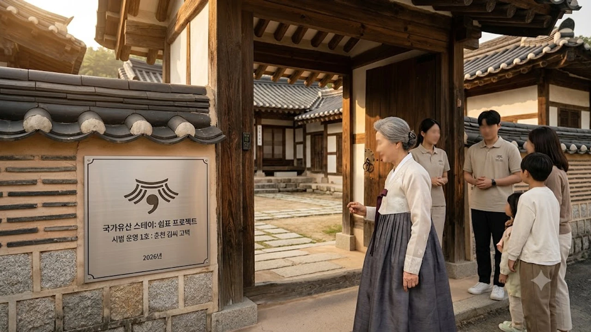

국가유산청이 발표한 2027년도 예산안에서 가장 시선을 끄는 대목은 단연 **국가유산 스테이** 사업이다. 수백 년 세월을 견딘 유서 깊은 고택을 하룻밤 묵어가는 숙박 공간으로 탈바꿈해 소멸 위기 지역의 숨통을 틔우겠다는 복안이다. 문턱 높은 문화재의 빗장을 풀어 대중의 품으로 돌려보낸다는 명분과, 자칫 상업화의 덫에 걸려 원형을 잃을 수 있다는 우려가 첨예하게 맞선다.

## 2026년 '국가유산 스테이' 정책 도입 배경과 추진 계획

### 국가유산청 2027년도 예산안과 61억 원 신규 편성 내역
국가유산청이 책정한 2027년도 총예산 1조 6,645억 원 가운데 이번 '국가유산 스테이' 사업에는 61억 원이 신규 배정됐다. 유리창 너머로 감상만 하던 지정 고택 10곳을 추려내 실질적인 숙박 시설로 전환하는 데 투입되는 초기 자금이다. 관람객의 발길이 뚝 끊긴 문화유산에 숨을 불어넣고 체류형 문화 거점으로 육성하겠다는 실행 의지가 읽힌다.

### 지정 고택 10곳 시범 개방과 '쉼표 프로젝트' 운영 구조
단순히 방을 내어주고 요금을 받는 펜션형 영업과는 궤를 달리한다. 고택의 역사적 골격을 건드리지 않는 선에서 최소한의 냉난방 설비를 갖추고, 지역 장인과 협업하는 인문학 프로그램이나 전통 다례를 묶은 **쉼표 프로젝트**가 함께 가동된다. 하룻밤 잠자리 이상의 깊이 있는 공간 경험을 설계하는 것이 이번 시범 운영의 뼈대다.

### 보존 일변도에서 체험형 문화유산 향유로의 패러다임 전환
그동안 문화재 정책의 철칙은 철저한 격리와 원형 박제였다. 하지만 인구 절벽으로 집주인이 떠난 고택이 빠르게 흉물로 변해가는 현실 앞에서 규제 중심 정책은 한계를 드러냈다. 사람이 문을 열고 마루를 밟아야 흙과 나무가 숨을 쉰다는 현장의 절박함이 규제 완화와 체험형 정책으로의 선회를 이끌어냈다.

## 문화재 보존 관점의 우려와 훼손 리스크

### 목조 문화유산의 화재 취약성과 숙박 시설화의 안전 한계
문화재 전문가들이 가장 날을 세우는 지점은 **화재 안전 대책의 실효성**이다. 수백 년 된 마른 나무는 작은 불씨 하나에도 순식간에 잿더미로 변한다. 불특정 다수의 투숙객이 머물면서 발생할 수 있는 전열기구 합선이나 부주의한 취사 행위는 치명적인 참사로 직결될 위험을 안고 있다.

### 일상적 숙박 이용에 따른 목재 변형 및 원형 훼손 가능성
사람이 머물며 내뿜는 호흡과 땀, 샤워 시설에서 발생하는 수증기는 오랜 세월 건조 상태를 유지해 온 전통 가옥에 치명적이다. 욕실과 정화조 배관을 매립하는 과정에서 주춧돌과 서까래 구조가 뒤틀릴 위험이 크며, 잦은 하중 이동은 삐걱거리는 대청마루의 마모를 가속화한다.

### 전통 고택 관리 전문 인력 부족과 사후 규제 실효성 문제
지역 현장의 실태를 보면 상주 관리 인력은 턱없이 부족하다. 만약 수익 창출에 눈이 먼 민간 위탁 업체가 무리하게 예약을 받거나 시설을 임의 개조할 경우 이를 제재할 감시망이 헐겁다. 파손이 발생한 뒤에 물리는 과태료는 잃어버린 수백 년의 역사를 되돌리지 못한다.

## 지역 소멸 위기 대응과 생활 인문학적 가치 창출

### 폐가 위기 고택의 실질적 유지·보수 및 온기 보존 효과
사람 온기가 사라진 빈집은 3년만 지나도 서까래가 내려앉고 흰개미가 갉아먹기 시작한다. 정기적으로 불을 때고 창문을 열어 바람길을 터주는 숙박 운영 방식은 오히려 건물의 수명을 연장하는 방패막이가 된다. 방치되어 썩어가는 것보다는 일정한 통제 속에서 사람의 손길을 타는 편이 고택의 생명력을 지키는 현실적 해법이다.

### 로컬 체류형 관광 연계를 통한 소멸 위험 지역 경제 활성화
스쳐 지나가는 2시간짜리 겉핥기 관광은 지방 상권에 푼돈조차 남기지 않는다. 고택 스테이에 묵는 체류객은 골목길 식당에서 아침을 먹고, 동네 양조장의 전통주를 사며, 읍내 책방에 들른다. 공간 하나가 살아나면서 주변 로컬 생태계로 돈과 사람이 도는 선순환이 구축된다.

> "박물관 진열장 속에 갇힌 유물은 지식을 줄 뿐이지만, 사람의 발길과 숨결이 머무는 고택은 삶의 철학을 일깨운다."

### 박제된 유산이 아닌 살아 숨 쉬는 생활 공간으로서의 인문학적 의미
도심의 빌딩 숲과 디지털 피로감에 짓눌린 현대인에게 서까래 아래서 바라보는 밤하늘은 그 자체로 치유의 경험이다. 이는 최근 젊은 세대가 종이책과 고요한 활자에 열광하는 [텍스트힙 진짜 트렌드인가? 완전 정리](/posts/humanities/text-hip-independent-humanities-2026/) 현상과도 일맥상통하며, 느린 호흡 속에서 삶의 본질을 되묻는 인문학적 성찰을 건넨다.

## 해외 역사 문화유산 숙박 성공 모델과 제도적 안착 조건

### 스페인 '파라도르(Parador)'와 일본 '코민카(古民家)' 스테이 운영 기준
국가 주도로 버려진 수도원과 중세 고성을 최고급 국영 호텔로 탈바꿈시킨 스페인의 '파라도르'는 문화재 보존과 관광 수익을 동시에 거머쥔 대표적 성공 사례다. 일본 역시 100년 넘은 전통 농가 '코민카'의 외형을 100% 보존하면서 최소한의 쾌적성만 보완해 전 세계 여행자를 끌어모으고 있다.

### 이용 인원 제한 및 엄격한 보존 지침 기반 예약 가이드라인 구축
한국형 스테이가 지속되려면 철저한 **입실 총량제와 예약 심사제**가 필수적이다. 무분별한 단체 관광객 유치를 원천 차단하고, 1박당 수용 인원을 엄격히 통제해야 한다. 화기 사용을 전면 금지하고 고택 훼손 시 강력한 복구 비용을 청구하는 법적 가이드라인이 명문화되어야만 비극을 막을 수 있다.

### 상업적 수익성과 공공 역사 보존의 균형을 맞춘 제도적 해결책
벌어들인 수익은 고스란히 고택 보수와 주변 문화재 보존 기금으로 강제 환원되는 회계 구조를 설계해야 한다. 영리 추구에 휘둘리지 않고 공공성을 담보할 때 비로소 61억 원의 예산은 문화재 파괴의 불씨가 아닌, 전통을 미래로 잇는 현명한 마중물이 된다.

[전통 고택 여행 필수 인문학 도서 모음](https://www.coupang.com/np/search?q=%EC%97%AD%EC%82%AC%20%EC%9D%B8%EB%AC%B8%ED%95%99%20%EB%8F%84%EC%84%9C&sourceType=affiliate&trackingCode=AF8691300)

#국가유산스테이 #국가유산청 #고택숙박 #전통문화 #문화재보존 #지역소멸대응 #한옥스테이 #인문학트렌드