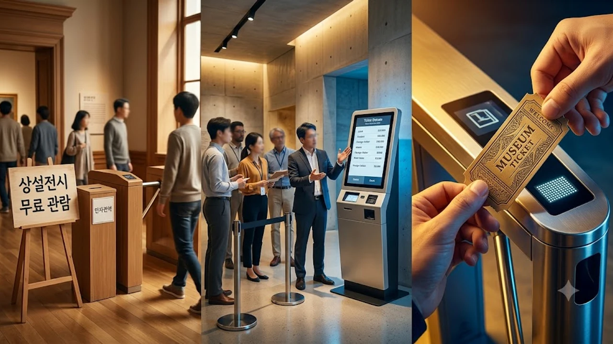

국립박물관 유료화 논란이 문화계와 대중 사이에서 거센 찬반 격론을 불러일으키고 있습니다. 상설전시 무료 관람 제도가 정착된 지 18년을 넘어서면서 재정 부담과 관람 환경 악화라는 현실적 문제의 해결책으로 관람료 징수가 수면 위로 떠올랐습니다. 시민들의 일상적인 문화 향유권 보장과 국보급 유물의 안정적 보존이라는 두 가치가 정면으로 충돌하는 국면입니다.


## 국립박물관 무료 관람 원칙과 유료화 전환 배경

### 2008년 무료화 이후 불거진 재정 현실화 논의
정부는 2008년 5월부터 국립중앙박물관을 비롯한 주요 국립박물관 상설전시실 입장료를 전면 무료화했습니다. 당시 취지는 모든 시민이 경제적 문턱 없이 문화유산을 감상하도록 만들겠다는 공공복지 중심 정책이었습니다. 그러나 박물관 운영에 소요되는 시설 관리비, 유물 복원 비용, 냉난방비가 급등하면서 순수 국고 보조금에 의존하는 재정 구조는 심각한 한계에 맞닥뜨렸습니다.

### 해외 주요국 국립박물관 정책 변화와 비교 사례
해외 유수 기관들은 일찌감치 재정 자립도를 높이는 방향으로 돌아섰습니다. 프랑스 루브르 박물관은 기본 입장료를 인상하며 유지 보수 비용을 마련했고, 일본 도쿄국립박물관은 일반 상설전시마저 1,000엔 수준의 관람료를 받으며 기획전과 별도로 엄격히 관리합니다. 세계 유수의 전시 기관들이 유료화를 유지하는 근거는 명확합니다. 안정적인 자체 수입이 뒷받침되지 않고서는 유물의 지속 가능한 보존 처리가 어렵기 때문입니다. 박물관 보안과 시설 관리의 중요성은 과거 [빈 박물관 보석 도난, 진짜 보안 뚫린 이유 3가지](/posts/humanities/vienna-museum-jewel-heist-security-2026/) 사례에서도 확인할 수 있듯, 예산 부족이 보안 공백으로 이어질 수 있음을 경고합니다.

### 공공 문화시설의 적자 폭과 관람객 폭증 현황
국립중앙박물관 연간 관람객은 400만 명 선을 넘나들며 세계 10위권 수준의 과밀 상태를 기록하고 있습니다. 특히 주말마다 전시실 내부가 통제 불능 수준으로 붐비면서 유물 보호용 쇼케이스 훼손이나 전시실 소음 문제가 끊이지 않습니다. 관람객 수는 폭증하는 반면 관람료 수입은 0원에 수렴하여 발생한 유지보수 비용을 일반 세금으로 메워야 하는 악순환이 이어지는 형편입니다.

## 국립박물관 유료화 찬반을 가르는 3가지 핵심 쟁점


### 쟁점 1: 국민 문화 향유권 침해인가 문화 복지 축소인가
유료화 반대론자들은 박물관이 국민의 세금으로 지어진 공공재라는 점을 가장 앞세웁니다. 상설전시실 문턱을 유료로 막아서면 청소년, 취약계층의 발길이 가장 먼저 끊길 것이라는 우려가 큽니다. 문화 복지를 확대해 나가는 정부 흐름 속에서 [청년문화예술패스 도서 확대! 바뀐 3가지](/posts/humanities/youth-culture-pass-book-expansion-2026/)와 같은 지원책이 나오는 판국에, 국립 공간을 유료화하는 것은 시대적 흐름에 역행한다는 지적입니다.

### 쟁점 2: 혼잡도 완화와 전시 관람의 질적 개선 효과
찬성 측에서는 적정 수준의 입장료가 과도한 혼잡을 걸러내는 거름망 구실을 해줄 것으로 기대합니다. 단순 휴식이나 피서 목적으로 몰려드는 유동 인구를 줄이고, 유물 관람에 집중하려는 진성 관람객에게 쾌적한 시야와 감상 시간을 보장할 수 있다는 논리입니다.

- **관람 밀도 조절**: 예약제 기반 유료 발권을 통한 시간대별 동선 분산
- **보안 시설 확충**: 입장 수익을 첨단 항온·항습 설비와 도난 방지 센서 교체에 재투자
- **전시 해설 전문화**: 도슨트 프로그램 증설 및 디지털 오디오 가이드 무상 제공

### 쟁점 3: 외국인 관광객 차등 요금제 도입의 타당성과 부작용
내국인과 외국인의 요금을 달리 책정하는 이중 가격제 역시 격렬한 논쟁거리입니다. 내국인은 평소 납부한 세금으로 건립비를 부담했으니 무료나 할인을 적용하고, 외국인 방문객에게만 1만 원 안팎의 입장료를 받자는 대안이 설득력을 얻고 있습니다. 반면 국제 사회에서 한국 문화 관광 이미지를 실추시킬 수 있고, 국적 확인에 따르는 현장 행정 낭비가 지나치다는 반론도 만만치 않습니다.

## 해외 국립박물관의 관람료 모델 비교 분석

### 영국형 무료 개방 모델: 기부금 중심 운영의 성과와 한계
대영박물관과 내셔널갤러리로 대표되는 영국 모델은 국가 세금 보조금과 민간 고액 기부금을 축으로 상설전시 무료 입장을 고수합니다. 하지만 정부 지원금이 삭감될 때마다 심각한 관리 인력 부족 사태를 겪고 있으며, 결국 특별전 티켓 가격을 3만~4만 원 선으로 대폭 올려 메우는 부작용을 낳았습니다.

### 프랑스·일본형 유료 및 차등제 모델: 국적별 요금 격차 논란
프랑스는 비EU 거주 성인 관람객에게 훨씬 높은 요금을 부과하는 실질적 차등제를 안착시켰습니다. 루브르 박물관의 경우 요금 인상을 단행하면서도 현지 학생과 청소년에게는 전면 무료 혜택을 남겨두어 자국민 반발을 줄였습니다. 일본 역시 주요 국립 기관을 독립행정법인으로 전환한 뒤 엄격한 수익자 부담 원칙을 적용해 전시 콘텐츠 개발에 집중 투입하고 있습니다.

### 국내 실정에 맞는 절충형 요금 체계의 대안 모색
단순히 전면 유료화나 현```markdown
## 1. 프로젝트 개요 및 아키텍처 설계

현대 웹 애플리케이션 개발에서는 유지보수성과 확장성을 보장하기 위해 명확한 아키텍처 설계가 선행되어야 합니다. 모듈형 모놀리스(Modular Monolith) 또는 마이크로서비스 아키텍처(MSA)를 선택할 때는 비즈니스 규모와 트래픽 특성을 면밀히 분석해야 합니다.

- **도메인 주도 설계(DDD) 적용**: 비즈니스 로직을 도메인 모델 중심으로 응집시켜 기술 부채를 최소화합니다.
- **의존성 역전 원칙(DIP)**: 인터페이스 기반 설계를 통해 인프라 계층의 변화가 도메인 코어에 미치는 영향을 차단합니다.
- **계층 분리**: 표현 계층, 응용 계층, 도메인 계층, 인프라 계층의 역할을 명확히 규정합니다.

## 2. 데이터 모델링 및 저장소 전략

대규모 데이터 처리를 지원하기 위해서는 관계형 데이터베이스(RDBMS)와 NoSQL 데이터베이스의 혼합 전략(Polyglot Persistence)이 유용합니다.

| 분류 | 기술 스택 | 주 용도 |
| :--- | :--- | :--- |
| 관계형 DB | PostgreSQL | 트랜잭션 보장 및 핵심 정형 데이터 관리 |
| NoSQL 캐시 | Redis | 세션 저장소, 빈번한 조회 캐싱, 분산 락 구현 |
| 검색 엔진 | OpenSearch | 대용량 텍스트 인덱싱 및 복합 로그 검색 |

데이터 정합성이 중요한 결제 및 계정 모듈은 ACID 속성을 완벽히 지원하는 RDBMS에 배치하고, 실시간성 통계 데이터는 메모리 기반 저장소를 활용해 지연 시간을 단축합니다.

## 3. API 엔드포인트 보안 및 인증 흐름

외부 통신 규격은 RESTful 원칙과 GraphQL의 장점을 취사선택하여 설계합니다. 전송 구간 암호화(TLS 1.3)는 필수적으로 적용합니다.

1. **OAuth 2.0 및 JWT 기반 인증**: 클라이언트는 단기 Access Token과 장기 Refresh Token을 분리 발급받아 보안 위험을 낮춥니다.
2. **역할 기반 접근 제어(RBAC)**: 세분화된 권한 매트릭스를 구성하여 각 API 엔드포인트에 대한 인가 절차를 수행합니다.
3. **요청 제한(Rate Limiting)**: DoS 공격 방지 및 서버 자원 보호를 위해 토큰 버킷 알고리즘 기반의 IP/계정별 요청 제어를 구성합니다.

## 4. 지속적 통합 및 배포(CI/CD) 파이프라인

코드 변경 사항이 상용 환경에 안전하게 도달하도록 자동화된 검증 파이프라인을 구축합니다.

- **정적 분석 및 린팅**: SonarQube 및 ESLint를 빌드 단계 이전에 실행하여 코드 품질 표준을 강제합니다.
- **자동화된 테스트 스위트**: 단위 테스트(Unit Test) 커버리지를 80% 이상 유지하며, 주요 사용자 흐름은 통합 테스트(Integration Test)로 검증합니다.
- **무중단 배포**: 블루/그린(Blue-Green) 또는 카나리(Canary) 배포 전략을 통해 다운타임 없이 배포를 진행하고, 오류 발생 시 즉각 롤백할 수 있는 감시 시스템을 구축합니다.