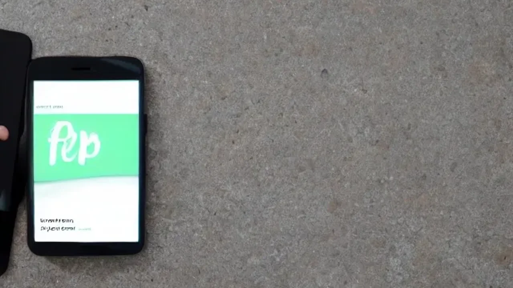

생성형 AI가 10초 만에 완벽한 요약본을 뱉어내는 시대에 역설적으로 많은 이들이 글을 읽고도 맥락을 파악하지 못하는 디지털 난독증을 호소합니다. 정보의 홍수 속에서 사유의 깊이를 되찾고 **문해력 느린 독서법**을 통해 뇌의 본질적인 인지 기능을 회복해야 할 때입니다. 뇌의 집중력을 깨우고 정보 장악력을 높이는 느린 독서의 구체적인 실천 방안과 그 효과를 정리합니다.

## 숏폼 시대의 도래와 문해력 저하의 진짜 원인

### 3초 요약과 생성형 AI가 우리 뇌에 미친 영향
유튜브 쇼츠, 인스타그램 릴스, 틱톡 등 1분 미만의 숏폼 콘텐츠가 미디어를 지배하면서 현대인의 뇌는 강한 자극에만 반응하는 이른바 **‘팝콘 브레인’** 상태로 변하고 있습니다. 마우스 클릭 한 번, 혹은 AI 프롬프트 명령 한 줄이면 방대한 논문도 몇 줄로 요약해 주는 환경은 인간에게서 ‘스스로 생각하고 유추하는 시간’을 완전히 빼앗아 갔습니다. 짧고 단편적인 정보에 지속적으로 노출된 뇌는 긴 글을 읽을 때 필요한 주의 집중 메커니즘을 제대로 가동하지 못한다는 사실이 정신의학계의 여러 임상 시험을 통해 입증되었습니다.

### 텍스트를 ‘스캔’하는 버릇이 가져온 생각의 표면화
현대인들은 웹 페이지를 읽을 때 글을 위에서 아래로 정독하지 않고, 알파벳 F자 모양으로 시선을 던지며 핵심 단어만 골라내는 **‘F자형 스캔(F-Shaped Pattern)’** 독서 습관에 젖어 있습니다. 미디어 학자 니콜라스 카가 저서 《생각하지 않는 사람들》에서 통찰했듯, 인터넷 환경은 우리를 단순히 정보를 효율적으로 수집하는 기계로 포맷할 뿐, 깊은 사유를 방해합니다. 문장과 문장 사이의 인과 관계를 따지기보다 자극적인 형용사와 결론만 빠르게 훑고 지나가기 때문에 사유의 깊이가 얕아질 수밖에 없습니다.

### 디지털 난독증: 글은 읽지만 맥락을 이해하지 못하는 이유
단어의 뜻은 소리 내어 읽을 수 있지만 문단 전체가 의미하는 바나 글쓴이의 숨은 의도를 전혀 파악하지 못하는 실질적 문맹이 급증했습니다. 교육계와 산업계 전반에서 2030 세대의 텍스트 이해도 저하를 심각한 사회적 당면 과제로 꼽는 이유도 여기에 있습니다. 행간을 읽는 능력이 퇴화하면 가짜 뉴스를 필터링하지 못하고, 타인의 주장에 쉽게 휩쓸리며, 업무 시 복잡한 가이드라인을 이해하지 못해 잦은 실수를 유발하는 치명적인 결과로 이어집니다.

## 느린 독서법(Slow Reading)이 뇌 과학적으로 필요한 이유

### 속독(Fast Reading)과 지식 축적의 한계점
한 장이라도 더 많이, 빠르게 읽는 것을 미덕으로 여기는 기존의 속독법은 정보의 인풋 양을 늘릴 수 있을지언정 장기 기억으로의 전환율은 극히 떨어집니다. 시각적 자극을 통해 뇌에 입력된 단어들은 단기 기억 저장소인 작업 기억(Working Memory) 공간에 잠시 머물다 금세 휘발됩니다. 텍스트를 빠르게 처리하느라 바쁜 뇌는 기존에 자신이 가지고 있던 배경지식과 새로운 정보를 연결하는 ‘정교화 과정’을 생략하기 때문에, 책을 덮고 나면 기억에 남는 것이 없는 허무한 상태가 반복됩니다.

### 전두엽을 자극하는 느린 독서의 놀라운 뇌 회복 효과
의도적으로 속도를 늦춰 글을 읽는 행위는 뇌의 최고위 조절 기관인 **전두엽(Prefrontal Cortex)**을 강력하게 활성화합니다. 인간의 뇌는 글을 천천히 정독할 때 비로소 문장의 논리 구조를 분석하고, 은유를 해석하며, 서사 속 인물의 감정에 깊이 공감하는 고차원적 인지 회로를 가동합니다. 뇌 가소성(Neuroplasticity) 원리에 따라 느린 독서를 지속하면 디지털 기기로 인해 도파민에 중독되고 둔해졌던 뇌 신경망이 스스로를 재배선하여 집중력과 인내력을 관장하는 영역이 다시 두터워집니다.

### 텍스트 이면의 맥락과 사실을 간파하는 비판적 사고력의 부활
AI가 그럴듯한 거짓말을 지어내는 '환각 현상(Hallucination)'이 빈번한 시대에, 문해력은 곧 생존을 위한 무기입니다. 느린 독서법은 저자의 주장을 무비판적으로 수용하지 않고, "이 문장의 근거는 확실한가?", "왜 이런 단어를 선택했을까?"라는 질문을 끊임없이 던지게 만듭니다. 이러한 사유 과정을 통해 획득한 비판적 사고력은 수많은 정보 속에서 진짜 가치 있는 지식만을 선별해 내는 강력한 메타 인지 능력으로 발현됩니다.

## AI 시대에 살아남는 실전 느린 독서법 3단계 튜토리얼

### 1단계: 디지털 기기와 완전히 격리된 ‘몰입의 공간’ 세팅하기
느린 독서를 시작하기 위한 첫걸음은 스마트폰, 태블릿, PC 등 주의를 분산시키는 모든 디지털 스크린을 시야에서 완전히 치우는 환경 통제입니다. 스마트폰이 옆에 놓여 있는 것만으로도 뇌는 알림을 기대하며 인지 자원의 일부를 소모한다는 미국 텍사스대 경영대학원의 연구 결과가 이를 뒷받침합니다. 일주일에 단 두 번이라도 좋으니, 타이머를 50분에 맞춰두고 전자기기가 없는 서재나 조용한 카페에서 오직 종이책과 아날로그 필기구만 가지고 책상에 앉는 의식이 필요합니다.

### 2단계: 문장 한 줄을 곱씹으며 여백에 질문을 던지는 ‘능동적 독서법’
책을 읽을 때는 눈으로만 활자를 좇지 말고 손을 바쁘게 움직여야 합니다. 마음에 와닿는 문장이나 논쟁적인 대목을 발견하면 그 아래에 밑줄을 긋고, 책의 여백에 자신의 생각이나 반론을 거칠게라도 적어 나갑니다. 

> "작가의 의견에 동의하는가? 만약 나라면 이 상황에서 어떤 선택을 했을까?"

스스로 질문을 던지고 여백을 채워가는 정독 행위는 텍스트와 독자 간의 치열한 대화이며, 정보가 온전히 개인의 지혜로 내면화되는 핵심 과정입니다.

### 3단계: 읽은 내용을 나만의 언어로 요약하고 기록하는 ‘출력 학습법’
단 한 챕터를 읽더라도 독서가 끝난 후 책을 덮고 자신이 이해한 내용을 노트에 딱 세 문장으로 요약하는 훈련을 진행합니다. 이때 책에 쓰인 표현을 그대로 베껴 쓰지 않고 반드시 **'나만의 언어와 단어'**로 재조합하여 문장을 완성해야 합니다. 인풋(Reading)에 머무르지 않고 아웃풋(Writing) 프로세스를 강제할 때 뇌는 해당 지식을 정말 유용하고 필요한 정보로 인식하여 장기 기억 저장소로 안전하게 이동시킵니다.

[관련 글 보기](/posts/humanities/)

## 내가 직접 경험한 일주일간의 ‘디지털 독서 디톡스’ 후기

### 스마트폰을 내려놓고 하루 20분, 종이책을 펼쳤을 때의 변화
매일 아침 눈을 뜨자마자 스마트폰 뉴스 피드를 확인하고, 출퇴근길 지하철에서 의미 없이 숏폼 영상을 넘기던 일상을 멈추고 일주일간 하루 딱 20분씩 인문학 서적을 천천히 정독하는 실험을 진행했습니다. 첫 이틀 동안은 활자가 눈에 들어오지 않고 몇 분마다 스마트폰을 확인하고 싶은 강한 충동, 이른바 '팬텀 알림 현상'에 시달렸습니다. 그러나 고비를 넘기고 고요함 속에서 활자 자체에 몰입하기 시작하자, 흩어져 있던 정신이 하나로 모이는 차분한 감각이 전신을 감쌌습니다.

### 정보 과부하로 인한 불면증과 불안감이 사라진 생생한 과정
잘 무렵까지 유튜브 영상을 보던 나쁜 수면 습관을 버리고 침대 머리맡에서 스탠드 불빛 아래 책을 읽기 시작한 지 나흘째 되던 날부터 수면의 질이 극적으로 향상되었습니다. 뇌를 쉬지 않고 자극하던 블루라이트와 자극적인 알고리즘의 굴레에서 벗어나자, 밤마다 찾아오던 원인 모를 불안감과 미래에 대한 조급증이 눈에 띄게 줄어들었습니다. 쓸데없는 세상의 소음에서 멀어지고 책 속의 깊은 사유와 마주하는 시간은 정신적 피로를 치유하는 최고의 심리적 요새가 되었습니다.

### 2026년 현대인에게 책을 천천히 읽는다는 것의 진짜 가치
속도와 효율성만을 아날로그의 가치보다 숭상하는 현시점에서 책을 천천히 읽는 행위는 단순한 취미 생활을 넘어 고도의 지적 저항 운동입니다. AI가 인간보다 글을 더 잘 쓰고 빠르게 요약하는 세상이기에 역설적으로 인간에게 필요한 것은 지식의 양이 아닌, 깊게 고뇌하고 스스로 답을 찾아내는 사유의 힘입니다. 속도를 늦추고 활자 속을 거니는 느린 독서법이야말로 디지털 노예로 전락하지 않고 주체적인 인간으로 당당히 살아남기 위한 가장 확실한 생존 전략입니다.

#문해력 #느린독서법 #슬로우리딩 #디지털디톡스 #집중력회복 #뇌과학독서 #문해력기르기 #AI시대인문학 #비판적사고