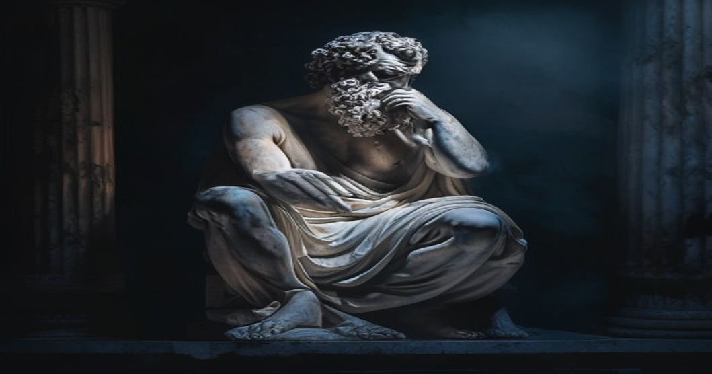
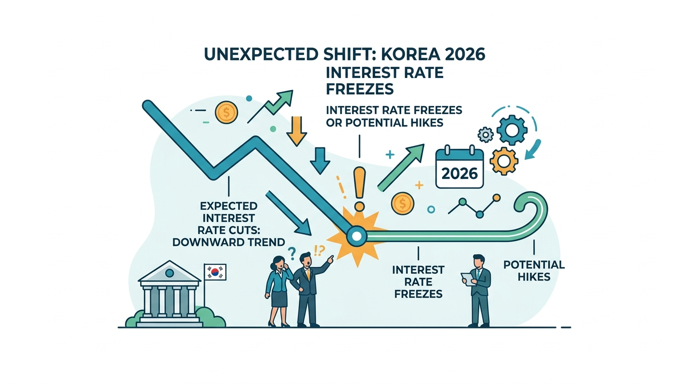

AI 도구의 확산으로 직업이 재편되고, 글로벌 경제 불안이 일상을 흔드는 2026년 — 스토아 철학이 유독 뜨겁게 다시 소환되고 있습니다. 2000년 전 로마 황제 마르쿠스 아우렐리우스가 진영 막사에서 써 내려간 《명상록》이 세계 10대 자기계발서 순위에 오른 것은 우연이 아닙니다. 지금 이 시대가 딱 그 철학을 필요로 하고 있기 때문입니다.

## 스토아 철학이란 무엇인가

스토아 철학은 기원전 3세기 그리스에서 시작해 로마 시대에 꽃을 피운 사상 체계입니다. 핵심은 단순합니다. 내가 통제할 수 있는 것에 집중하고, 통제할 수 없는 것에는 흔들리지 마라. 이 원칙 하나가 오늘날 수백만 명에게 정신적 닻이 되어 주고 있습니다.

### 통제할 수 있는 것과 없는 것

스토아 철학의 가장 기초적인 도구는 이분법입니다. 에픽테토스는 세상 모든 것을 두 가지로 나눴습니다. 내가 선택하는 것(판단, 욕구, 행동)과 내가 선택하지 못하는 것(날씨, 타인의 평가, 경제 상황, 건강 결과). 내 영역 바깥의 것에 에너지를 쏟는 순간 고통이 시작된다는 것이 스토아의 가르침입니다.

2026년 직장인들이 가장 많이 호소하는 불안 중 하나는 AI 대체 공포입니다. 이 공포의 상당 부분은 내가 통제할 수 없는 기술 변화에 대한 반응입니다. 스토아는 이렇게 묻습니다. 그래서 지금 당신이 할 수 있는 것은 무엇인가? 역량을 키우고, 오늘 할 일을 성실히 하고, 주어진 역할에 최선을 다하는 것 — 그것만이 내 영역입니다.

### 덕이 유일한 선이다

스토아 철학자들은 부, 명예, 건강을 선호되는 것이라 불렀습니다. 있으면 좋지만 없다고 불행해서는 안 된다는 뜻입니다. 진정한 선은 오직 용기, 정의, 절제, 지혜 — 네 가지 덕뿐입니다. 이 덕은 외부 상황과 상관없이 언제나 실천 가능합니다.

## 현대인이 스토아 철학을 찾는 이유

소셜미디어가 불안을 먹고 자라는 구조, 끊임없는 비교의 문화, 정보 과부하 — 이 모든 것이 2026년 현대인을 스토아 철학 쪽으로 밀고 있습니다. 심리학계에서도 스토아의 핵심 개념이 인지행동치료(CBT)의 근간과 상당 부분 겹친다는 연구가 꾸준히 나오고 있습니다.

### 소셜미디어 피로와 에픽테토스

인스타그램 피드를 보다가 상대적 박탈감을 느끼는 경험, 누구나 한 번쯤 있을 겁니다. 에픽테토스는 이렇게 말했습니다. 사람들이 너를 비웃을 때 고통스러운 것은 그들의 웃음이 아니라, 네가 그것을 고통스럽다고 판단하기 때문이다. 타인의 시선에 내 감정의 조종권을 줘버리지 않는 것, 이것이 디지털 시대의 핵심 생존 기술입니다.

### 변화 앞에서 쓰는 무기, 아모르 파티

스토아에는 아모르 파티(amor fati)라는 개념이 있습니다. 운명을 사랑하라는 뜻입니다. 닥친 현실을 저주하는 것이 아니라, 그것이 성장의 재료가 될 수 있다고 믿는 태도입니다. 직장을 잃거나, 계획이 틀어지거나, 예상치 못한 변화에 마주쳤을 때 이것이 나를 어디로 데려갈 것인가라고 묻는 연습 — 스토아는 그것을 가르칩니다.

## 일상에서 스토아 철학 실천하기

철학은 책 속에만 있어서는 의미가 없습니다. 마르쿠스 아우렐리우스 자신도 황제 자리에서 매일 명상록에 자신의 실천을 기록했습니다. 지금 당장 실천할 수 있는 스토아 훈련을 정리했습니다.

### 아침 성찰 루틴 — 5분 저널

하루를 시작하기 전, 노트에 세 가지를 씁니다. 오늘 내가 통제할 수 없는 것 하나, 내가 통제할 수 있는 것 하나, 오늘 실천할 덕목 하나. 이 간단한 루틴이 하루 내내 판단의 기준점이 됩니다. 저널 앱 대신 손으로 쓰는 것이 더 효과적이라는 연구 결과가 많습니다.

### 저녁 리뷰 — 하루를 돌아보는 질문

에픽테토스의 제자 아리안이 전한 저녁 성찰의 질문은 세 가지입니다. 나는 무엇을 잘못했는가? 나는 무엇을 잘했는가? 어떻게 더 잘할 수 있었는가? 이 질문을 자책이 아닌 학습의 관점으로 던지는 것이 핵심입니다. 스스로를 판사가 아닌 코치로 바라보는 연습입니다.

## 스토아 철학을 더 깊이 공부하고 싶다면

스토아 철학 입문서로 가장 널리 추천되는 책은 마르쿠스 아우렐리우스의 명상록, 에픽테토스의 엔키리디온, 세네카의 루킬리우스에게 보내는 편지입니다. 세 권 모두 얇고 짧아서 출퇴근 길에 읽기 좋습니다.

실천 중심으로 접근하고 싶다면 라이언 홀리데이의 에고라는 적과 스틸니스가 현대어로 잘 번역해 놓은 책입니다. 불안한 시대일수록 단단한 철학이 필요합니다. 스토아는 거창한 이론이 아니라, 오늘 하루를 조금 더 의연하게 살아내는 작은 습관의 집합입니다.

> [인문 섹션의 다른 글도 확인해보세요](/posts/humanities/)

#스토아철학 #철학실천 #마음챙김 #자기계발 #인문학 #멘탈관리 #명상록 #불안극복