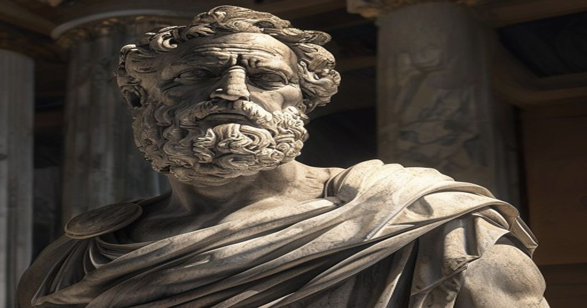

틱톡에서 '#stoicism' 해시태그가 수십억 뷰를 넘어섰고, 마르쿠스 아우렐리우스의 『명상록』이 2년 연속 글로벌 베스트셀러 목록에 올라 있습니다. 2000년 전 로마 황제가 쓴 철학 일기가 왜 지금 2026년에 이토록 강하게 공명하는 걸까요? 답은 의외로 단순합니다. 우리가 마주한 혼란이, 그가 마주한 혼란과 본질적으로 닮아 있기 때문이에요.

## 스토아 철학이란 무엇인가 — 핵심 개념 정리

### 통제할 수 있는 것과 없는 것의 구분

스토아 철학의 핵심은 놀랍도록 명료합니다. 에픽테토스는 말했습니다. "어떤 것은 우리의 힘 안에 있고, 어떤 것은 그렇지 않다." 우리가 통제할 수 있는 건 판단, 욕구, 행동뿐이고, 날씨나 타인의 반응, 경제 상황은 통제 밖입니다. 여기에 인지적 에너지를 쏟지 않는 것이 스토아 실천의 출발점이에요.

### 아파테이아 — 감정을 없애는 게 아니라 다스리는 것

스토아주의를 오해하는 가장 흔한 방식은 '감정을 억누르는 냉혹한 철학'으로 보는 것입니다. 실제로 스토아 철학자들이 추구한 아파테이아(apatheia)는 감정 제거가 아니라 충동적 반응에서 벗어나는 상태를 뜻해요. 화가 날 때 5초를 멈추는 것, 그것이 스토아적 실천의 첫 단계입니다.

### 메멘토 모리와 네가티브 시각화

"죽음을 기억하라"는 메멘토 모리와 최악의 시나리오를 미리 상상하는 네가티브 시각화는 불안을 키우는 것이 아니라 현재의 소중함을 일깨우는 도구입니다. 매일 아침 "오늘 이 커피를 마실 수 없다면?"이라고 한 번 떠올리는 것만으로 평범한 하루의 가치가 달리 보여요.

## 왜 지금 스토아 철학인가

### 과잉 자극의 시대에 대한 처방

SNS 피드, 뉴스 알림, 쏟아지는 콘텐츠 — 현대인의 주의는 끊임없이 외부로 빼앗깁니다. 스토아 철학의 '자신의 헤게모니콘(이성적 판단 중추)으로 돌아오기' 실천은 이 과잉 자극에 대한 가장 오래된 해독제예요. 소셜미디어 피드에서 10분을 끊어내는 것이 2000년 전 마르쿠스가 전투 사이에 명상록을 쓴 행위와 같은 맥락입니다.

### 성과 중독 사회에서 '충분함'을 찾는 철학

"충분히 좋은 삶"이라는 스토아적 관점은 끊임없이 더 많은 것을 추구하도록 설계된 현대 자본주의 사회에서 조용한 반항처럼 읽힙니다. 마르쿠스 아우렐리우스는 로마 최고 권력자였지만 일기에는 더 많은 것에 대한 욕망이 아니라 지금 가진 것에 대한 감사가 넘칩니다.

### MZ 세대의 '조용한 퇴장'과 스토아적 가치

'조용한 퇴사', '소확행', 'JOMO(고립의 기쁨)' — 젊은 세대가 추구하는 가치들이 스토아 철학의 언어로 설명됩니다. 남의 기준이 아닌 자신이 통제할 수 있는 것에 집중하겠다는 선언이에요.

## 일상에서 스토아 철학을 실천하는 방법

### 아침 저널링 — 마르쿠스의 방식으로

마르쿠스 아우렐리우스는 매일 아침 그날의 어려움을 미리 상상하고 어떻게 반응할지 준비했습니다. 5분짜리 아침 저널링으로 "오늘 어떤 어려움을 만날 수 있고, 나는 어떻게 반응할 것인가"를 적어두는 것만으로 하루가 달라집니다.

### '일시 정지' 훈련 — 자극과 반응 사이의 공간

에픽테토스가 강조한 핵심은 자극(어떤 일이 일어남)과 반응(내가 어떻게 행동함) 사이에 선택의 공간이 있다는 것입니다. 누군가 날카로운 말을 했을 때 즉각 반응하지 않고 1초라도 멈추는 습관이 스토아적 삶의 핵심 근육이에요.

### 스토아 독서 입문 — 무엇부터 읽을까

처음 스토아 철학을 접한다면 마르쿠스 아우렐리우스의 『명상록』보다 라이언 홀리데이의 『에고라는 적』이나 『데일리 스토익』이 더 접근하기 쉬운 입문서입니다. 2000년 전 언어를 현대 비즈니스·심리학 언어로 번역해놓았어요.

[디지털 피로 탈출 트렌드](/posts/society/)에서 다룬 과잉 연결 문제와 스토아 철학의 실천은 매우 자연스럽게 맞닿아 있습니다. 외부의 소음을 줄이고 내면의 판단 기준으로 돌아오는 것 — 이것이 2026년에 스토아 철학이 울리는 이유예요.

**함께 읽으면 좋은 글**
- [소통 심리학 핵심만! 진짜 인생 바뀌는 대화법](/posts/humanities/communication-psychology-tips-2026/)
- [문해력 위기 탈출법, 2026년 진짜 살아남는 질문의 기술](/posts/humanities/critical-thinking-questioning-skills-2026/)

#스토아철학 #마르쿠스아우렐리우스 #명상록 #인문학트렌드 #철학 #자기계발 #MZ철학
