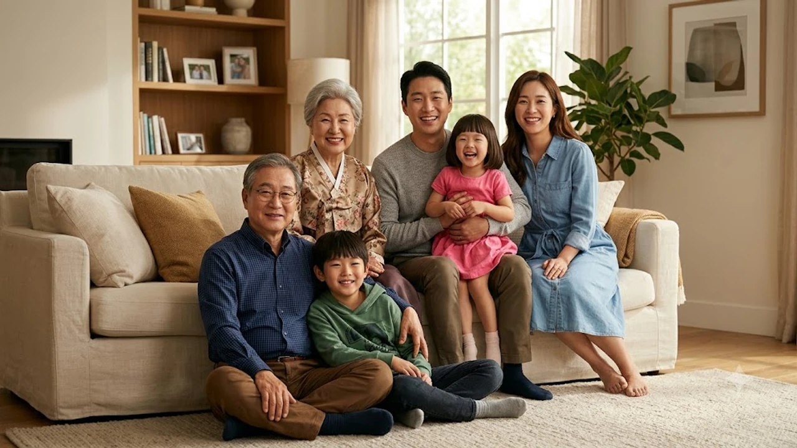

2026 아이치·나고야 아시안게임을 앞두고 문화 행사 공간에 설치된 **도요토미 히데요시 포토존**이 국제적 공분을 일으키고 있습니다. 평화와 연대를 내건 국제 스포츠 제전에서 임진왜란의 주범이자 침략 전범으로 규정되는 인물을 지역 문화유산이라는 명분으로 내세운 조치는 심각한 역사 왜곡 논란으로 번졌습니다.

## 평화의 제전에 드리운 침략자의 그림자

### 아시안게임 헌장 정신과의 정면 충돌
아시아올림픽평의회(OCA) 헌장은 상호 존중과 갈등 해소를 핵심 가치로 규정합니다. 피해국의 씻기지 않은 상흔을 자극하는 인물의 갑옷을 비치하고 기념 촬영을 유도한 행태는 스포츠맨십에 정면으로 위배됩니다.

### 피해국 배려 없는 로컬리즘의 민낯
아이치현과 나고야시는 '전국 3영걸(오다 노부나가·도요토미 히데요시·도쿠가와 이에야스)'의 고향이라는 향토사적 자부심만 앞세웠습니다. 자국 내부의 관광 상품화에 매몰되어 인접국 국민들이 느낄 역사적 박탈감과 모욕감을 완전히 배제한 폐쇄적 시각을 드러냈습니다.

## 문화콘텐츠 소비 뒤에 숨겨진 역사 왜곡의 메커니즘

### 전국시대 낭만화와 침략사 지우기
일본 서브컬처와 지자체 홍보물은 전국시대를 영웅들의 무용담으로만 각색하는 경향이 짙습니다. 도요토미 히데요시가 자행한 대륙 침략 야욕, 조선 팔도에서 자행된 인명 학살과 문화재 약탈이라는 어두운 진실은 '통일 군주'라는 화려한 프레임 속에 철저히 은폐됩니다.

### 공공 외교의 실패와 반복되는 둔감증
과거 올림픽이나 국제 행사에서도 욱일기 응원, 군함도 등 강제동원 시설의 일방적 홍보가 끊임없이 물의를 빚었습니다. 국제 규범에 대한 학습 결여와 관료주의적 방관이 결합해 외교적 마찰을 자초하는 패턴이 이번에도 고스란히 재현되었습니다.

## 팝컬처와 역사 교육이 마주한 비판적 과제

### 캐릭터 소비가 낳은 윤리적 불감증
게임, 만화 속 무장 캐릭터로 도요토미를 접한 대중은 역사적 실체보다 가공된 이미지를 먼저 소비합니다. 역사의 무게를 제거한 오락화가 침략 범죄에 대한 비판적 사유를 가로막는 방패막이가 되고 있습니다.

### 기록 문화의 왜곡에 맞서는 인문학적 성찰
우리가 역사를 기억하는 방식은 과거의 비극을 답습하지 않기 위한 최소한의 안전장치입니다. 일방적 선전과 기억의 편집에 휩쓸리지 않으려면 비판적 안목으로 사료를 교차 검증하고 주체적 해석력을 지켜내야 합니다. 이와 관련된 사유의 전환은 [인문 전체 글 보기](/posts/humanities/)에서도 심도 있게 다루어집니다.

## 갈등을 넘어 진정한 아시아 연대로 나아가려면

### 미화 중단과 공인된 역사적 사실 명시
국제 행사장 내 포토존 철거는 물론, 인물을 소개할 때 국내적 통일 업적과 함께 주변국 침략 사실을 병기하는 최소한의 균형 감각을 회복해야 합니다. 사실의 일부만 선택적으로 전시하는 기만적 홍보는 국제사회의 신뢰를 얻지 못합니다.

### 상호주의에 입각한 역사 대화 재개
진정한 문화 교류는 가해와 피해의 역사를 솔직히 인정하는 토대 위에서만 가능합니다. 침략자를 일방적으로 영웅시하는 기획을 철회하고, 아시아 이웃 국가들과의 연대와 공존을 논의하는 진정성 있는 태도 변화가 요구됩니다.

[관련 한일 역사도서 쿠팡에서 보기](https://www.coupang.com/np/search?q=%ED%95%9C%EC%9D%BC%EC%97%AD%EC%82%AC%EA%B4%80%EA%B3%84%EC%82%AC&sourceType=affiliate&trackingCode=AF8691300)

#도요토미히데요시포토존 #나고야아시안게임 #임진왜란 #역사인식 #역사왜곡논란 #아이치나고야 #동아시아역사갈등