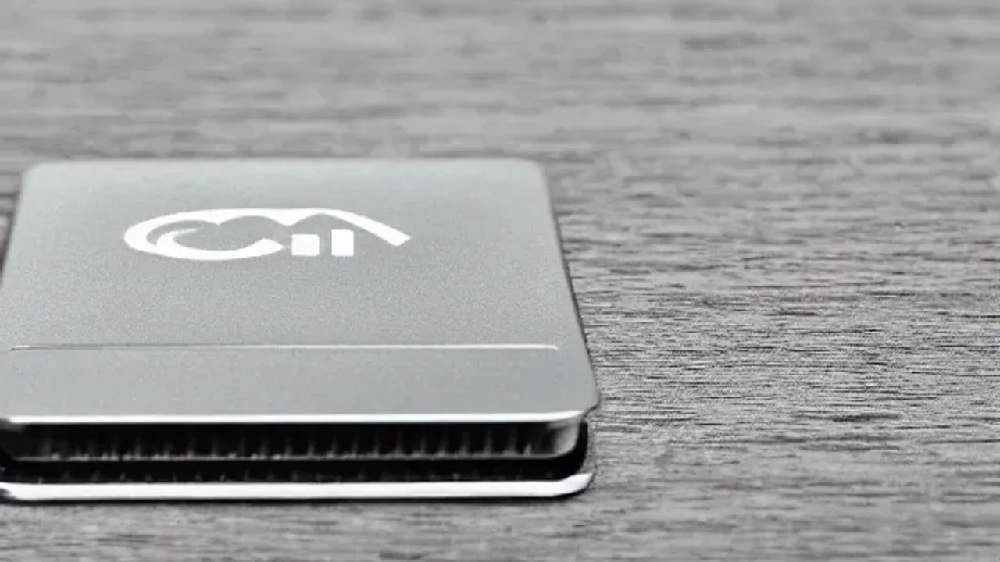
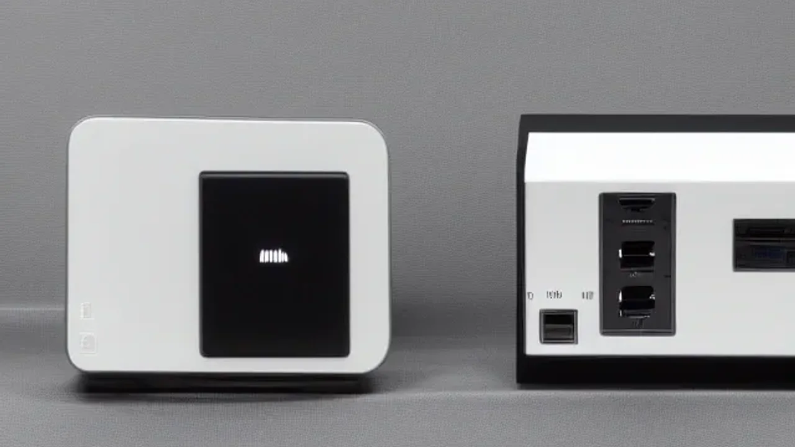

공간 효율성과 압도적인 퍼포먼스를 동시에 잡으려는 유저들 사이에서 **미니 PC 추천** 제품에 대한 관심이 어느 때보다 뜨겁습니다. 과거의 미니 PC는 성능이 떨어지는 사무용 기기라는 인식이 강했지만, 최근 칩셋의 비약적인 발전으로 메인 데스크톱을 대체할 만큼 강력한 존재감을 과시하고 있습니다. 특히 온디바이스 AI 연산 능력을 갖춘 프로세서들이 대거 등장하면서 홈 오피스와 크리에이터의 작업 환경을 완전히 바꾸어 놓았습니다.

## 왜 지금 미니 PC인가? 테크 패러다임의 변화

### 노트북 vs 데스크톱 vs 미니 PC, 공간 대비 성능 효율 비교
전통적인 타워형 데스크톱은 확장성이 좋지만 책상 위 공간을 지나치게 차지하고 소비 전력이 높다는 단점이 명확합니다. 반면 고성능 랩톱은 휴대성은 좋으나 동일 스펙 대비 가격이 비싸고 화면 크기의 제약과 발열 제어의 한계가 존재합니다. 미니 PC는 가로세로 15cm 안팎의 콤팩트한 크기로 타워형 데스크톱의 공간 압박을 완벽히 해결하면서도, 모니터와 주변 기기 확장성을 랩톱 이상으로 확보할 수 있는 제3의 대안으로 자리 잡았습니다. 

### 온디바이스 AI 칩셋 탑재가 불러온 미니 PC의 비약적 성장
과거 미니 PC의 고질적인 약점은 그래픽 연산과 멀티태스킹 능력이었습니다. 하지만 신경망처리장치(NPU)가 내장된 차세대 프로세서가 보급되면서 인터넷 연결 없이도 로컬 환경에서 대형 언어 모델(LLM)을 구동하거나 생성형 AI 이미지를 뽑아내는 작업이 가능해졌습니다. 클라우드 서버를 거치지 않으므로 데이터 유출 우려가 없고 반응 속도가 압도적으로 빨라진 점이 시장의 판도를 바꾸고 있습니다.

### 전력 소비와 유지비 관점에서 본 미니 PC의 숨은 경제성
정격 출력이 600W에서 1000W에 달하는 일반 게이밍 데스크톱과 달리, 미니 PC는 고부하 작업 시에도 대개 65W에서 최대 120W 내외의 전력만 소비합니다. 하루 8시간 이상 영상 편집이나 데이터 연산 작업을 수행하는 프리랜서나 소규모 사무실 환경에서는 전기요금을 70% 이상 절감할 수 있는 확실한 메리트가 있습니다. 초기 기기 구매 비용뿐만 아니라 장기적인 유지비 관점에서도 뛰어난 경제성을 자랑합니다.

## 2026년형 AI 미니 PC 핵심 프로세서 성능 분석

### AMD 루나 레이크(Lunar Lake) 계열 APU의 그래픽 및 NPU 성능
AMD의 최신 초소형 APU 라인업은 강력한 내장 그래픽 아키텍처를 기반으로 벤치마크 점수에서 이전 세대 외장 그래픽 카드를 위협하는 수준에 도달했습니다. 향상된 NPU 덕분에 이미지 생성 툴인 스테이블 디퓨전(Stable Diffusion) 구동 시 장당 렌더링 속도가 획기적으로 단축되었습니다. 그래픽 가속과 AI 연산이 동시에 필요한 작업에서 독보적인 효율을 보여줍니다.

> **프로세서 성능 참고 수치**
> - NPU 연산 속도: 최대 50+ TOPS 달성 (로컬 AI 모델 실시간 추론 가능)
> - 내장 그래픽: 이전 세대 보급형 외장 GPU 대비 렌더링 효율 약 35% 향상

### 인텔 코어 울트라 기반 미니 PC의 멀티태스킹 및 호환성
인텔 코어 울트라 프로세서를 채택한 미니 PC는 고효율 코어와 고성능 코어가 정밀하게 분배되어 복잡한 연산에 강점을 보입니다. 어도비 프리미어 프로나 포토샵 같은 기존 상용 소프트웨어들과의 호환성이 완벽하여 작업 중 강제 종료되거나 호환 에러가 발생할 확률이 극히 낮습니다. 썬더볼트4 포트를 기본 지원하므로 초고속 외장 스토리지나 eGPU(외장 그래픽 카드) 연동이 매끄럽다는 것도 큰 장점입니다.

### 로컬 LLM 및 생성형 AI 이미지 툴 구동 시 발열과 소음 수준
크기가 작은 만큼 쿨링 성능에 의문을 가질 수 있으나, 최신 기기들은 증기 챔버(Vapor Chamber) 기술과 대형 저소음 팬을 적극 도입했습니다. 단순 문서 작업이나 웹서핑 시에는 팬 소음이 거의 들리지 않는 15dB 이하를 유지합니다. 최고 부하 상태에서 로컬 AI 연산을 지속하더라도 코어 온도를 80도 이하로 억제하며 소음 역시 일반 노트북 수준인 38dB 수준에서 제어됩니다.

## 용도별·예산별 최적의 가성비 미니 PC 추천 모델 TOP 3

### 40\~60만 원대: 웹서핑 및 사무용 가성비 종결 모델
중국계 전문 브랜드(GMKtec, Beelink 등)의 보급형 라인업이 이 가격대를 주도합니다. AMD 라이젠 5 또는 7 계열의 가성비 프로세서를 탑재하고 16GB\~32GB 램을 기본 장착하여 엑셀, 파워포인트, 4K 동영상 시청, 간단한 포토샵 편집까지 막힘없이 소화합니다. 가성비를 최우선으로 고려하면서 거실용 홈 시어터 PC(HTPC)나 자녀 인강용 기기를 찾는 유저에게 가장 합리적인 선택지입니다.

### 80\~100만 원대: 유튜버 영상 편집 및 4K 미디어 크리에이터용 모델
본격적인 콘텐츠 제작을 위한 구간으로, 고성능 프로세서와 32GB 이상의 고대역폭 램이 조합된 고성능 미니 PC가 포진해 있습니다. 다빈치 리졸브나 프리미어 프로를 활용한 4K 60fps 영상 편집 작업에서 컷 편집과 색보정을 매끄럽게 처리합니다. 성능 저하 없는 고속 NVMe SSD가 탑재되어 대용량 소스 파일을 읽고 쓰는 속도가 쾌적합니다.

### 120만 원 이상: 로컬 AI 연산 및 고사양 게이밍 겸용 플래그십 모델
미니 PC 전용 최상위 프로세서나 모바일용 외장 칩셋이 결합된 하이엔드 디바이스입니다. 미니 PC 단독으로 로컬 AI 에이전트를 상시 구동하거나, AAA급 고사양 게임을 중상옵 이상으로 플레이할 수 있는 괴물 같은 퍼포먼스를 뿜어냅니다. 미니 PC 특유의 작은 폼팩터를 유지하면서도 타협 없는 성능을 원하는 하드코어 유저와 개발자에게 적합한 영역입니다.

[관련 글 보기](/posts/it-devices/)

## 실패 없는 미니 PC 구매 및 초기 세팅 가이드

### 직구 제품 구매 시 주의해야 할 OS 라이센스 및 어댑터 규격
해외 직구를 통해 가성비 제품을 구매할 때는 윈도우 정품 인증 포함 여부를 반드시 대조해야 합니다. 일부 초저가 모델은 OS 미포함(Free DOS)이거나 출처가 불분명한 볼륨 라이센스가 설치되어 있어 추후 보안 문제가 생길 수 있습니다. 또한 소비 전력이 높은 고성능 모델의 경우 어댑터 부피가 미니 PC 본체만큼 큰 경우가 있으므로 책상 밑 배선 공간을 미리 계산해 두는 것이 좋습니다. 한국형 220V 플러그 규격을 정확히 지원하는지 여부 확인도 필수적입니다.

### 쾌적한 데스크테리어를 위한 모니터 후면 VESA 마운트 활용법
미니 PC 박스 안에는 모니터 뒤쪽에 기기를 고정할 수 있는 VESA 마운트 브래킷이 기본 포함된 경우가 많습니다. 이를 활용해 모니터 후면에 미니 PC를 장착하면 책상 위에는 모니터 받침대와 키보드, 마우스만 남는 극단적인 공간 미니멀리즘을 구현할 수 있습니다. 

- **VESA 마운팅 단계별 팁**
  - 모니터 뒷면의 베사홀 규격(75x75mm 또는 100x100mm) 확인
  - 제공된 브래킷을 모니터 암 연결 부위나 빈 베사홀에 나사로 고정
  - 미니 PC 본체를 브래킷에 슬라이딩 방식으로 결합
  - 짧은 HDMI/DP 케이블을 사용하여 선 정리 최소화

### 초기 불량 테스트 및 AI 연산 최적화를 위한 필수 드라이버 세팅법
제품을 수령하면 부하 테스트 프로그램(Cinebench, 3DMark)을 최소 30분 이상 구동하여 비정상적인 전원 꺼짐이나 과열 현상이 없는지 검증해야 합니다. 온디바이스 AI 작업을 원활하게 진행하려면 윈도우 기본 드라이버에 의존하지 말고 AMD나 인텔 공식 홈페이지에 접속하여 최신 NPU 및 GPU 전용 드라이버 패키지를 수동으로 설치해야 성능 잠재력을 100% 끌어낼 수 있습니다. BIOS 설정 진입 후 내장 그래픽에 할당되는 공유 메모리(UMA Frame Buffer Size)를 최소 4GB\~8GB 이상으로 높여주는 세팅을 적용하면 그래픽 및 AI 연산 효율이 눈에 띄게 올라갑니다.

#미니PC추천 #AI미니PC #가성비PC #온디바이스AI #데스크테리어 #AMD루나레이크 #인텔코어울트라 #미니데스크톱 #소형PC #컴퓨터추천