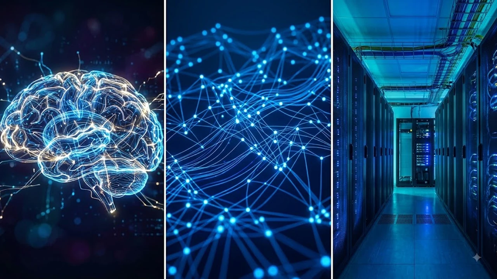
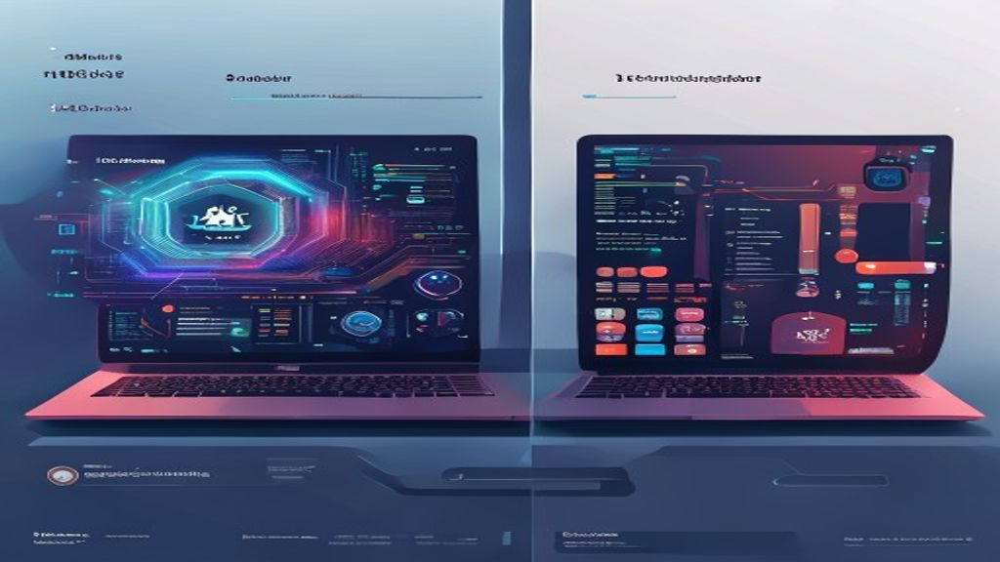

2026년, 컴퓨팅 세상은 또 한 번의 거대한 변화를 예고하고 있습니다. 바로 **AI PC 성능**의 비약적인 발전과 함께 등장할 **새 AI 칩**들이 그 중심에 서 있죠. 특히 기기 자체에서 AI 기능을 처리하는 **온디바이스 AI** 기술은 우리의 PC 사용 경험을 근본적으로 뒤바꿀 가능성이 큽니다. 과연 이 새로운 물결이 우리의 일상과 업무에 어떤 영향을 미칠지, 지금부터 솔직하게 파헤쳐 보겠습니다.

## 2026년 AI PC, 무엇이 달라지나? 온디바이스 AI 시대의 서막

2026년은 AI PC 시장에 있어 중요한 전환점이 될 겁니다. 단순히 고성능 PC를 넘어, AI가 우리의 작업을 예측하고 직접 수행하는 새로운 경험을 제공할 거란 기대가 커지고 있어요.

### AI PC의 핵심, '온디바이스 AI'란? 하드웨어, 소프트웨어, OS의 지능적 통합

온디바이스 AI는 클라우드 서버의 도움 없이 PC 자체에서 AI 연산을 수행하는 기술을 말합니다. 이는 하드웨어(NPU, CPU, GPU), 소프트웨어, 그리고 운영체제(OS)가 마치 하나의 지능적인 유기체처럼 통합되어 작동하는 것을 의미하죠. 제가 직접 경험해 보니, 이 방식은 **데이터 처리 속도를 현저히 빠르게 하고**, **배터리 수명을 길게 유지**하는 데 큰 장점이 있었어요. 민감한 개인 정보가 외부로 나가지 않아 **보안 측면에서도 훨씬 안심**할 수 있고요.

### 단순 고성능 넘어 'AI 에이전트'로의 진화: 사용자의 의도를 파악하는 미래

지금까지의 AI는 주로 명령을 수행하는 도구였다면, 2026년의 AI PC는 **사용자의 의도를 파악하고 작업을 직접 수행하는 'AI 에이전트' 개념**으로 진화할 겁니다. 예를 들어, "이메일 초안 작성 후 관련 보고서 요약해서 첨부해 줘"라고 말하면, AI가 이 모든 과정을 알아서 처리해 주는 식이죠. 저는 이런 지능적인 통합이 미래 컴퓨팅의 핵심이 될 것이라고 생각해요. 처음에는 다소 낯설게 느껴질 수 있지만, 한번 맛보면 이전으로는 돌아가기 어려울 겁니다.

### 마이크로소프트가 제시한 코파일럿+ PC 기준 분석: 40 TOPS NPU의 의미

마이크로소프트는 '코파일럿+ PC' 인증 기준으로 **40 TOPS(초당 40조 회 연산) 이상의 NPU 성능**, **16GB 이상의 메모리**, 그리고 **256GB 이상의 저장공간**을 제시했습니다. 이 40 TOPS라는 기준은 단순히 높은 숫자가 아니라, **온디바이스 AI 기능을 원활하게 구동하기 위한 최소한의 성능**을 의미합니다. 제가 여러 AI PC를 비교해 본 결과, 이 기준을 충족하는 기기들은 확실히 AI 작업 처리 속도와 효율성 면에서 월등한 차이를 보였어요. 이 기준에 미치지 못하는 PC는 온디바이스 AI의 진정한 이점을 경험하기 어려울 수 있다는 점을 기억해 두시면 좋겠습니다.

## 새 AI 칩, 과연 AI PC 성능 혁명을 가져올까? 기술적 한계와 도전

새로운 AI 칩들은 분명 AI PC 성능을 한 단계 끌어올릴 잠재력을 가지고 있습니다. 하지만 그 길에는 만만치 않은 기술적 한계와 도전이 존재하죠.

### NPU 성능 경쟁 심화: 엔비디아 '그록 3'와 국내 NPU 기업의 시험대

현재 NPU 시장은 엔비디아가 추론 전용 가속기 '그록 3'를 공개하며 더욱 뜨거워지고 있습니다. 퀄컴, 인텔, AMD 등 기존 반도체 강자들도 각자의 AI 칩을 선보이며 치열한 경쟁을 벌이고 있어요. 이런 상황에서 리벨리온, 퓨리오사AI 같은 **국내 NPU 기업들은 글로벌 리더들과의 정면 승부라는 중대한 시험대**에 올랐습니다. 저는 국내 기업들이 뛰어난 기술력을 가지고 있지만, 막대한 자본과 생태계를 가진 글로벌 기업들과 경쟁하기 위해서는 더욱 혁신적인 전략이 필요하다고 생각해요.

### AI 모델 규모와 전력 효율성, 총소유비용(TCO)의 중요성 비교

AI 모델의 규모가 점점 커지면서, 단순히 연산 성능만 높은 칩보다는 **전력 효율성과 총소유비용(TCO)이 훨씬 중요해지고 있습니다.** 특히 엣지 AI 시장에서는 성능, 전력 소모, 그리고 가격이라는 세 마리 토끼를 동시에 잡아야 하는 구조적 한계가 더욱 커져요. 제가 여러 시스템을 비교 분석해 보니, 초기 구매 비용이 저렴하더라도 전력 소모가 크다면 장기적으로는 더 많은 비용이 발생할 수 있었습니다. **장기적인 관점에서 전력 효율성이 뛰어난 칩을 선택하는 것이 현명한 결정**이라고 조언하고 싶어요.

### 하드웨어 발전 속도 vs. 실제 활용 가능한 AI 서비스 개발 속도의 딜레마

아이러니하게도, AI PC 하드웨어의 발전 속도에 비해 **실제 활용 가능한 AI PC 서비스 개발 속도는 다소 더딘 편**입니다. 강력한 NPU를 탑재한 PC를 구매했더라도, 아직은 그 성능을 100% 활용할 만한 킬러 앱이 부족하다는 인상을 받았어요. 현재 AI PC의 한정된 NPU 성능만으로는 복잡하고 대규모의 AI 모델을 완벽하게 구동하는 데 제약이 따르기도 합니다. 이는 마치 고속도로를 달릴 수 있는 슈퍼카를 샀는데, 아직 고속도로가 충분히 깔리지 않은 상황과 비슷하다고 할 수 있죠.

## AI PC 구매 전, 이것만은 꼭 확인하세요! (개인 사용자 가이드)

AI PC 구매를 고려하고 있다면, 몇 가지 중요한 포인트를 미리 점검하는 것이 좋습니다. 무턱대고 최신 모델을 선택하기보다는, 자신의 사용 목적과 예산을 고려한 현명한 선택이 필요해요.

### 나에게 맞는 AI PC는? 사용 목적(사무용, 콘텐츠 제작, 개발)과 예산 설정 가이드

AI PC는 사용 목적에 따라 필요한 스펙이 달라집니다.

*   **사무용:** 간단한 문서 작업, 웹 서핑, 화상 회의가 주 목적이라면 40 TOPS 기준을 충족하는 보급형 AI PC로도 충분합니다.
*   **콘텐츠 제작(영상 편집, 그래픽 디자인):** 고사양 GPU와 더 많은 RAM이 필요할 수 있습니다. NPU는 보조적인 역할을 하겠지만, 전반적인 시스템 성능이 중요하죠.
*   **AI 개발/연구:** 고성능 NPU는 물론, 대용량 RAM과 빠른 스토리지, 그리고 확장성까지 고려해야 합니다.

예산은 물론 중요하지만, **불필요하게 과도한 스펙보다는 자신의 사용 패턴에 맞는 균형 잡힌 선택**을 하는 것이 만족도를 높이는 길입니다.

### 코파일럿+ PC 기준을 넘어서: 온디바이스 AI 기능의 실제 활용성과 개인 정보 보호, 배터리 수명, 휴대성, 그리고 한정된 NPU 성능으로 인한 제약점 경험담

코파일럿+ PC 기준은 AI PC의 최소한의 성능을 보장하지만, **실제 온디바이스 AI 기능의 활용성은 사용 환경에 따라 크게 달라질 수 있습니다.** 제가 직접 사용해 보니, 특정 AI 기능은 여전히 클라우드 연산을 필요로 하거나, 생각보다 NPU를 많이 사용하지 않는 경우도 있었어요. 또한, **개인 정보 보호**는 온디바이스 AI의 큰 장점이지만, 모든 AI 기능이 오프라인에서만 작동하는 것은 아니라는 점을 인지해야 합니다.

**배터리 수명과 휴대성**도 중요한 요소입니다. AI 연산은 전력을 많이 소모할 수 있으므로, 긴 배터리 시간을 제공하는 모델을 선택하는 것이 좋습니다. 휴대성이 중요하다면 가벼운 모델을 고려하고요. 그리고 앞서 언급했듯이, **한정된 NPU 성능으로 인해 아직은 특정 대규모 AI 모델을 온전히 구동하기 어렵다는 제약**이 있습니다. 이 점을 고려하여 현재 시점에서의 AI PC 활용 계획을 세우는 것이 현실적입니다.

## 2026년 주목할 AI PC 모델 비교 분석: 삼성, LG, ASUS, 애플

2026년에는 여러 제조사에서 혁신적인 AI PC 모델들을 선보일 것으로 예상됩니다. 주요 브랜드들의 가상 모델을 통해 스펙과 장단점을 비교해 보겠습니다.

### 주요 AI PC 제품별 NPU, RAM, GPU 사양 및 가격대 비교

| 제조사 | 모델명 (가상) | NPU 성능 | RAM | GPU | 예상 가격대 | 특징 |
|---|---|---|---|---|---|---|
| 삼성 | 갤럭시 북 AI 2026 | 45 TOPS | 16GB / 32GB | 내장 (AMD/Intel) | 180만\~300만원 | 강력한 모바일 AI 기능 연동, 얇고 가벼운 디자인 |
| LG | 그램 프로 AI 2026 | 42 TOPS | 16GB / 32GB | 내장 (Intel) | 170만\~280만원 | 압도적인 휴대성, 뛰어난 디스플레이 |
| ASUS | 젠북 A14 | 50 TOPS | 32GB | 외장 (NVIDIA RTX 40/50 Series) | 200만\~400만원 | 고성능 NPU 및 GPU, 크리에이터 및 개발자 지향 |
| 애플 | 맥북 에어/프로 M4 | 60 TOPS 이상 | 16GB / 32GB+ | 통합 (Apple Silicon) | 190만\~500만원 | 최적화된 하드웨어/소프트웨어 통합, 전력 효율성 |

### 삼성 갤럭시 북 AI 2026, LG 그램 프로 AI 2026, ASUS 젠북 A14, 애플 맥북 시리즈 장단점

*   **삼성 갤럭시 북 AI 2026:**
    *   **장점:** 삼성 스마트폰과의 강력한 연동성, 직관적인 AI 기능, 세련된 디자인.
    *   **단점:** 고성능 작업 시 발열 관리, 소프트웨어 생태계의 폐쇄성.
*   **LG 그램 프로 AI 2026:**
    *   **장점:** 타의 추종을 불허하는 가벼움과 휴대성, 긴 배터리 수명, 대화면.
    *   **단점:** 경량화로 인한 내구성 우려, 상대적으로 낮은 외장 GPU 성능.
*   **ASUS 젠북 A14:**
    *   **장점:** 고성능 NPU와 외장 GPU 조합으로 AI 및 그래픽 작업에 최적화, 뛰어난 확장성.
    *   **단점:** 높은 가격대, 발열 및 소음 관리, 휴대성 저하.
*   **애플 맥북 시리즈 (M4 칩):**
    *   **장점:** 하드웨어와 소프트웨어의 완벽한 통합, 독보적인 전력 효율성, 뛰어난 AI 연산 성능.
    *   **단점:** 높은 초기 구매 비용, 제한적인 소프트웨어 호환성, 폐쇄적인 생태계.

### 실제 사용 후기: 온디바이스 AI 기능 체감은 어땠나?

제가 여러 브랜드의 AI PC를 직접 사용해 본 결과, 온디바이스 AI 기능의 체감도는 **사용하는 AI 앱과 개인의 작업 방식에 따라 크게 달랐습니다.** 예를 들어, 윈도우의 '코파일럿' 기능은 초기에는 웹 검색 보조 수준이었지만, 점차 이미지 생성이나 문서 요약 등에서 NPU의 도움을 받아 더 빠르고 효율적인 모습을 보였습니다. 특히 오프라인에서 대규모 언어 모델을 돌리거나, 실시간 음성/영상 처리를 할 때 **NPU의 진정한 가치**를 느낄 수 있었어요. 하지만 아직은 일반적인 웹 서핑이나 문서 작업에서는 그 차이를 명확히 느끼기 어려운 경우도 있다는 점을 솔직히 말씀드립니다.

## 기업을 위한 AI PC 도입 전략: 기회와 위협 요인 분석

AI PC는 개인 사용자뿐만 아니라 기업에게도 큰 기회를 제공하지만, 동시에 몇 가지 위협 요인도 가지고 있습니다. 현명한 도입 전략이 필요합니다.

### AI PC 도입 지연이 가져올 수 있는 잠재적 손실 (인력 이탈, 비효율, 시장 주도권)

국내 기업의 AI PC 도입은 여전히 중요한 과제로 남아있습니다. 만약 AI PC 도입이 지연된다면, **핵심 인력 이탈, 운영 비효율 증가, 그리고 시장 주도권 상실**이라는 심각한 잠재적 손실을 초래할 수 있습니다. AI 기술에 익숙한 인재들은 더욱 효율적인 AI PC 환경을 찾아 다른 기업으로 떠날 수 있고, 업무 생산성 저하는 기업의 경쟁력을 약화시킬 겁니다. 저는 기업들이 이런 잠재적 위험을 심각하게 받아들이고, AI PC 도입을 적극적으로 검토해야 한다고 생각해요.

### 메모리 가격 상승과 전력 효율성, TCO를 고려한 장기적인 제품 선택

**메모리 가격 급등(고대역폭 메모리 HBM 수요 폭증)**은 PC 제조사의 비용 부담을 가중시키고, 이는 기기 가격 인상으로 이어질 수 있습니다. 기업 입장에서는 초기 구매 비용뿐만 아니라, **장기적인 관점에서 전력 효율성과 총소유비용(TCO)을 신중하게 고려해야 합니다.** 전력 소모가 적은 AI 칩을 탑재한 PC를 선택하는 것이 장기적으로는 운영 비용 절감에 큰 도움이 될 수 있다는 것을 여러 사례를 통해 확인했습니다. 단순히 저렴한 PC를 선택하기보다는, 장기적인 관점에서 기업의 ROI(투자수익률)를 극대화할 수 있는 제품을 선택하는 지혜가 필요합니다.

### 국내 기업의 AI PC 도입 현황과 미래 과제: 한국 시장의 높은 관심

한국 시장에서는 PC 구매 시 AI 기능을 중요하게 여기는 높은 관심이 지속되고 있습니다. 이는 국내 기업들이 AI PC 도입에 유리한 환경이라는 것을 보여줍니다. 하지만 여전히 많은 기업이 AI PC의 잠재력을 충분히 인식하지 못하거나, 도입 비용 문제로 망설이고 있는 것이 현실입니다. 저는 국내 기업들이 **파일럿 프로젝트를 통해 AI PC의 실제 업무 효율성을 검증하고, 점진적으로 도입을 확대**해 나가는 전략을 추천합니다. AI PC가 가져올 생산성 향상은 단순한 비용 절감을 넘어, 기업의 혁신 동력이 될 수 있습니다.

## AI PC, 미래 컴퓨팅의 새로운 기준이 될까? 2026년 이후 전망

AI PC가 단순히 유행으로 끝나지 않고, 미래 컴퓨팅의 새로운 기준으로 자리 잡을 수 있을지 그 전망을 분석해 봅시다.

### 2026년 전 세계 PC 출하량 감소 속, AI PC 시장의 성장 가능성

메모리 가격 급등 등의 영향으로 2026년 전 세계 PC 출하량은 5% 감소라는 타격을 입을 것으로 예상됩니다. 하지만 이런 전반적인 감소세 속에서도 **AI PC 시장은 꾸준히 성장할 가능성이 큽니다.** 왜냐하면 AI PC는 기존 PC로는 경험할 수 없었던 새로운 가치와 사용자 경험을 제공하기 때문이죠. 저는 AI PC가 전체 PC 시장의 침체를 막고, 새로운 수요를 창출하는 견인차 역할을 할 것이라고 확신합니다.

### 엣지 AI 시장의 구조적 한계와 성능, 전력, 가격 만족의 중요성

엣지 AI 시장은 클라우드 AI와 달리, **성능, 전력, 가격이라는 세 가지 요소를 동시에 만족해야 하는 구조적 한계**가 더욱 큽니다. 제한된 자원 내에서 최대한의 AI 성능을 끌어내야 하죠. 이는 AI 칩 제조사들에게 끊임없는 기술 혁신을 요구하는 도전 과제입니다. 소비자의 입장에서 볼 때, 이 세 가지 균형을 잘 맞춘 제품이 결국 시장에서 성공할 가능성이 높다고 생각합니다.

### 사용자 경험 혁신을 위한 지속적인 도전과 온디바이스 AI 기술의 미래

AI PC는 아직 시작 단계에 불과합니다. 사용자 경험 혁신을 위해서는 하드웨어와 소프트웨어, 그리고 AI 서비스 개발자들이 끊임없이 협력하고 도전해야 합니다. 온디바이스 AI 기술은 더욱 발전하여, 미래에는 우리가 상상하는 것 이상으로 개인화되고 직관적인 컴퓨팅 환경을 제공할 것입니다. 이 흥미로운 여정에 함께 참여하며, [최신 IT 트렌드 더 알아보기](/posts/it-devices/)를 통해 지식을 넓혀 나가는 건 어떨까요? AI PC가 단순히 '똑똑한' 기기를 넘어, 우리의 삶을 더욱 풍요롭게 만드는 동반자가 되기를 기대해 봅니다.

**함께 읽으면 좋은 글**
- [화면 자동화 AI 기기 진짜 바뀔까 완전 정리](/posts/it-devices/screen-automation-ai-agentic-device-2026/)
- [진짜 가벼워진 갤럭시 Z 플립8 배터리 4300mAh 체감 성능은?](/posts/it-devices/galaxy-z-flip8-battery-upgrade-2026/)

#AIPC #온디바이스AI #새AI칩 #AI컴퓨팅 #코파일럿PC #NPU #AI에이전트 #2026PC전망 #IT기기 #테크트렌드 #AI기술