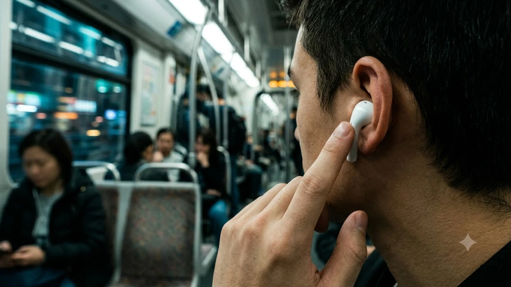

커널형 이어폰의 실리콘 팁이 주는 먹먹한 이압과 외이도염으로 고생하던 이들에게 이번 출시는 꽤 반갑습니다. 물리적인 밀폐 팁이 없는 개방형 구조를 유지하면서 고성능 연산 칩을 얹어, **에어팟 5 노이즈캔슬링**이 과연 출퇴근길 소음을 실질적으로 깎아낼 수 있을지 이목이 쏠립니다. 귓구멍을 꽉 틀어막지 않고도 정숙함을 챙겨주는 오픈형 ANC 기술의 실제 차음 체감과 한계를 솔직하게 정리했습니다.

## 에어팟 5세대 오픈형 액티브 노이즈 캔슬링(ANC)의 작동 원리와 한계

### 귓구멍을 막지 않는 오픈 폼팩터에서 소음을 상쇄하는 구조
인이어 이어폰은 실리콘 팁으로 귓구멍을 틀어막는 물리적 차음(패시브 캔슬링)을 바탕에 깔고 역위상 음파를 쏩니다. 반면 에어팟 5세대는 귓바퀴에 살짝 걸치는 오픈형이라 외부 틈새로 소음이 쉴 새 없이 밀고 들어옵니다. 이를 상쇄하려면 연산 반응 속도가 극단적으로 빨라야 합니다. 기기 안팎의 초소형 마이크가 초당 4만 8천 번 소리를 읽어내고, H2 기반 프로세서가 귀 형태와 공명 주파수를 실시간 계산해 반대 파형을 귓속으로 밀어 넣는 방식으로 작동합니다.

### 저주파 소음 50% 추가 감쇄 수치와 실제 차음 성능의 현실
공식 발표에서 언급된 50% 감쇄라는 수치는 프로급 인이어 모델과 견준 결과가 아닙니다. 이전 오픈형 프로토타입 대비 버스 엔진음이나 환풍기 바람 소리 같은 특정 저음역대에서 거둔 벤치마크 결과입니다.
* **상쇄 성공률이 높은 영역**: 100~300Hz 사이의 일정하게 울리는 기계음, 실내 에어컨 송풍음, 차량 공회전 저음
* **상쇄가 어려운 영역**: 1kHz 이상의 날카로운 사람 목소리, 자동차 경적, 전철 바퀴 쇠 마찰음

> 물리적인 차음벽이 없으므로 주변 소리가 마법처럼 사라지는 적막을 기대하면 실망하기 쉽습니다. 귀로 쏟아지는 소음의 볼륨 다이얼을 절반 수준으로 부드럽게 낮춰주는 필터에 가깝습니다.

### 외이도염과 귀 통증 압박감에서 완전히 자유로운 착용감 비교
커널형을 오래 꽂을 때 생기는 귓속 땀 참 현상과 염증은 실리콘 팁이 귓속 통기를 막기 때문에 일어납니다. 에어팟 5세대는 귓구멍 바깥에 살포시 걸쳐 공기가 통하므로 장시간 귀에 꽂아도 귓속 압력이 팽팽해지는 증상이 전혀 없습니다. 출퇴근길 내내 착용하거나 긴 시간 통화를 이어가도 귀가 짓무르지 않는 편안함이야말로 이 제품이 지닌 가장 강력한 무기입니다.

## 대중교통·카페 실측 테스트: 프로 모델을 완벽히 대체할 수 있을까

### 지하철 주행음 및 버스 엔진 저음 차단 성능 체감 비교
혼잡한 출퇴근 시간대 서울 지하철 2호선과 광역버스 내부에서 테스트해보면 차체의 둔탁한 진동음과 엔진 구동음은 놀라울 만큼 정돈됩니다. 팟캐스트 진행자의 목소리나 음악 베이스가 소음에 묻히지 않아 볼륨을 70% 이상으로 무리하게 키울 필요가 없습니다. 다만 선로 커브 구간에서 발생하는 쇠 긁히는 날카로운 쇳소리는 여과 없이 귓속으로 스며듭니다.

### 카페 말소리 및 고음역 파열음 환경에서의 한계점
원두 그라인더 작동음, 에스프레소 머신의 고압 스팀 소리, 바로 옆자리 대화 소리가 뒤섞이는 카페에서는 오픈형의 물리적 한계가 선명하게 드러납니다.
* 에스프레소 머신의 치찰음과 컵 달그락거리는 소리는 차음 체감이 20% 미만에 그침
* 가까운 테이블의 대화 내용은 말의 형태가 또렷하게 인식될 정도로 유입
* 배경에 잔잔히 깔린 실내 음악 비트는 부드럽게 지워져 문서 작업 몰입도는 개선

### 에어팟 프로 3세대 인이어 밀폐 차음력과의 결정적 격차
인이어 플래그십인 프로 라인은 귀마개로 틀어막은 상태에서 역위상을 쏘기 때문에 비행기 기내나 번잡한 카페에서도 주변 세상을 음소거 상태로 만듭니다. 반면 에어팟 5세대는 주변 소리의 볼륨을 10에서 5 수준으로 깎아주는 성격입니다. 완벽한 고립과 적막을 원한다면 커널형 모델을 선택해야 하며, 주변 상황을 인지하면서 청력 피로를 줄이는 용도라면 오픈형 ANC가 딱 알맞습니다.

## 온디바이스 실시간 음성 번역 기능 활용법과 언어 지원 현황

### 해외여행과 현지 대화 시 실시간 통역 반응 속도 점검
기기 내부 신경망 엔진(NPU)을 거치는 온디바이스 번역 덕분에 해외여행 중 현지인과의 대화 지연이 눈에 띄게 줄었습니다. 상대방이 영어로 질문을 건네면 음성을 인식한 직후 0.8초 안팎에 귀로 번역 음성이 들려옵니다. 비행기 기내처럼 통신망이 끊긴 환경에서도 오프라인 언어 팩을 미리 내려받아 두면 막힘없이 돌아갑니다. 여행 짐을 쌀 때 충전기 부피를 극단적으로 줄여주는 [GaN 충전기, 2026년 진짜 사야 할 숨은 꿀템 3선](/posts/it-devices/supertiny-gan-charger-travel-tech-2026/) 글도 함께 챙겨보면 테크 기기 활용도를 한층 높일 수 있습니다.

### 한국어 인식률과 오프라인 상황에서의 작동 안정성
온디바이스 한국어 언어 모델의 문맥 파악 능력이 향상되어 억양 차이나 구어체 표현도 매끄럽게 번역합니다. 외부 통신 서버를 거치지 않으므로 와이파이 상태가 불안정하다고 해서 통역이 중간에 뚝 끊기는 일이 없습니다.
- 지하철 개찰구 안내, 식당 주문, 호텔 체크인 시 끊김 없는 1:1 대화 지원
- 오프라인 모드 구동 시에도 배터리가 비정상적으로 닳지 않고 안정적으로 유지

### 시리(Siri) 제스처 제어와 결합된 핸즈프리 인터랙션
머리를 위아래로 끄덕이거나 좌우로 젓는 모션 센서가 들어있어 손을 주머니에서 뺄 필요가 없습니다. 양손에 짐을 가득 들고 공항 터미널을 이동할 때 번역 모드를 켜거나 알림을 확인할 때 고개를 끄덕이는 것만으로 승인할 수 있어 체감 편의성이 뛰어납니다.

## 에어팟 5 vs 에어팟 프로: 내 사용 패턴에 맞는 최종 선택 기준

### 하루 4시간 이상 이어폰을 꽂고 일하는 재택·사무직 사용자
사무실이나 재택 환경에서 동료의 부름에 바로 답해야 하거나, 잦은 화상 회의로 귓속 통증을 달고 사는 직장인에게는 고민할 것 없이 에어팟 5세대가 현명한 선택입니다. 주변 안내 방송이나 동료의 목소리를 놓치지 않으면서도 공조기 웅웅거림을 지워주므로 퇴근길 귀의 피로도가 눈에 띄게 줄어듭니다.

### 비행기 출장이나 시끄러운 환경에서 극강의 몰입이 필요한 사용자
장거리 비행기 탑승이 잦거나 오픈형 열람실, 소음이 심한 카페에서 공부하는 학생이라면 차음 성능의 한계가 아쉬울 수밖에 없습니다. 고주파 소음과 사람 말소리까지 틀어막는 압도적인 고립감이 1순위라면 밀폐 구조를 갖춘 에어팟 프로 라인업을 고수하는 쪽이 돈을 아끼는 길입니다.

### 출고가 대비 체감 가치와 사전예약 기간 구매 우선순위 판단
오픈형 특유의 시원한 착용감에 일상 소음 감쇄를 더했다는 사실 하나만으로도 구매 가치는 뚜렷합니다. 커널형을 끼지 못해 일반 오픈형만 고집해 왔던 유저라면 일상생활 전반의 듣는 경험이 한 차원 쾌적해집니다.

[에어팟 5세대 및 최신 무선 이어폰 쿠팡에서 보기](https://www.coupang.com/np/search?q=%EC%97%90%EC%96%B4%ED%8C%9F%20%EB%85%B8%EC%9D%B4%EC%A6%88%EC%BA%94%EC%8A%AC%EB%A7%81&sourceType=affiliate&trackingCode=AF8691300)

#에어팟5 #에어팟5노이즈캔슬링 #오픈형ANC #에어팟비교 #에어팟프로차이 #무선이어폰추천 #외이도염이어폰 #애플신제품 #온디바이스번역