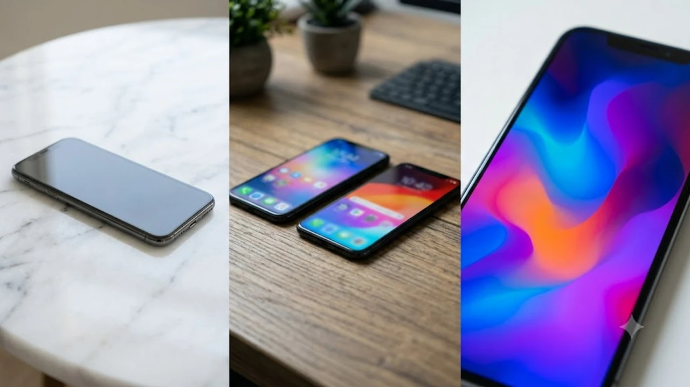

2026년 하반기 애플의 첫 폴더블 스마트폰인 **아이폰 폴드** 관련 하드웨어 설계 스펙이 유출되며 테크 씬이 요동치고 있습니다. 펼쳤을 때 4.5mm라는 극단적인 초박형 두께를 맞추기 위해 상징과도 같던 페이스 ID 모듈을 과감히 걷어낸다는 소식이 전해졌기 때문입니다. 프리미엄 폴더블폰 시장의 판도를 뒤흔들 차세대 폼팩터 변화의 핵심 포인트를 짚어봅니다.


## 애플 최초 폴더블 '아이폰 폴드' 핵심 설계 유출

### 4.5mm 초박형 두께를 위한 하드웨어 다이어트
블룸버그를 비롯한 주요 외신에 따르면, 애플은 펼쳤을 때 단 4.5mm 수준의 극도로 얇은 두께를 목표로 기구 설계를 진행 중입니다. 기존 바형 스마트폰 대비 절반 수준에 불과한 섀시 공간에 디스플레이 패널, 배터리, 메인보드를 적층해야 하므로 전면 트루뎁스(TrueDepth) 카메라 모듈의 탑재 공간 확보가 물리적으로 불가능해졌습니다.

### 페이스 ID 제거와 측면 터치 ID 부활의 배경
애플이 선택한 대안은 전원 버튼에 통합된 **정전식 터치 ID 센서**입니다. 아이패드 에어 및 미니 라인업에서 검증된 측면 버튼 지문 인식 기술을 플래그십 폰에 역으로 이식하는 형태입니다.

> **하드웨어 제약에 따른 선택:** 
> 3D 안면 인식을 구현하는 도트 프로젝터와 적외선 카메라의 모듈 두께는 최소 5.2mm 이상을 요구합니다. 따라서 4.5mm 섀시를 구현하려면 페이스 ID 제외가 불가피한 공학적 선택이었습니다.

### 내부 7.9인치 및 커버 6.5인치 듀얼 디스플레이 구조
내부에는 주름을 최소화한 7.9인치 폴더블 OLED 패널이 들어가며, 외부에는 한 손 조작이 용이한 6.5인치 화면이 장착됩니다. 차세대 힌지 메커니즘을 적용해 접었을 때의 틈새를 완벽히 없애고 방수 및 방진 성능을 최고 등급으로 끌어올렸습니다.

## 두께와 사용성을 맞바꾼 트레이드오프 비교 분석


### 생체 인증 UX의 장단점 체감
- **페이스 ID 부재의 아쉬움:** 기기를 열거나 바라보는 것만으로 잠금이 풀리던 직관적인 사용자 경험이 사라집니다.
- **터치 ID의 실전 이점:** 마스크를 착용하거나 테이블 위에 기기를 올려둔 상태에서도 버튼 터치 한 번으로 빠르게 잠금 해제와 애플페이 결제를 끝낼 수 있습니다.
- **파지 안정성:** 대화면 기기를 펼쳐 쥘 때 자연스럽게 엄지손가락이 닿는 측면 프레임 위치에 센서를 배치해 그립 안정성을 높였습니다.

### 초박형 폼팩터가 가져올 휴대성 혁신
펼쳤을 때 4.5mm, 접었을 때 약 9.5mm 내외의 두께는 기존 바형 아이폰 프로 맥스와 비교해도 손색없는 휴대성을 제공합니다. 경량 복합 티타늄 프레임과 탄소섬유 지지 플레이트를 결합해 230g대 초경량 무게를 달성했습니다.

### 배터리 용량과 방열 설계의 딜레마
초박형 구조로 인해 내부 공간이 극도로 제약되면서 실리콘-탄소 음극재를 적용한 고밀도 분할 배터리가 탑재됩니다. 얇아진 프레임에서 발열을 효과적으로 분산시키기 위해 베이퍼 챔버의 면적을 대폭 확장하는 특수 방열 시트가 더해졌습니다.

## 차세대 칩셋과 온디바이스 AI 구동 환경

### A20 프로 칩셋과 전용 NPU의 조합
차세대 2나노 공정 기반 **A20 프로 칩셋**이 탑재되어 전력 효율과 연산 성능을 극한으로 끌어올립니다. 애플 인텔리전스(Apple Intelligence)의 고도화된 생성형 작업을 지연 없이 로컬 환경에서 처리합니다.

### 멀티태스킹 전용 폴더블 iOS 환경
화면을 반으로 접어 세우는 플렉스 모드 인터페이스와 분할 화면 최적화 기능이 새롭게 도입됩니다. 상단 화면으로 화상 회의를 진행하면서 하단 화면에서 실시간 메모나 온디바이스 번역을 수행하는 식의 생산성 확장이 가능합니다.

### 차세대 무선 연결성과 에코시스템 연동
초고속 데이터 전송 규격을 지원하여 고용량 영상 파일과 AI 데이터를 유무선으로 쾌속 전송합니다. 미래형 기기 생태계와의 연결 구조가 궁금하다면 [2026 차세대 XR 기기 바뀌는 미래 완전 정리](/posts/it-devices/spatial-3d-display-xr-device-2026/) 글에서도 애플의 공간 컴퓨팅 연동 전략을 확인할 수 있습니다.

## 가격 및 글로벌 출시 일정 예측

### 예상 출고가와 타깃 포지셔닝
- **예상 가격대:** 최소 2,000달러(국내 출고가 약 260만~280만 원대) 선에서 시작할 것으로 전망됩니다.
- **라인업 포지셔닝:** 기존 프로 맥스를 뛰어넘는 최상위 울트라 티어로 자리 잡아 하이엔드 테크 유저층을 공략합니다.

### 1차 출시국 일정과 국내 출시 전망
애플은 통상 9월 스페셜 이벤트에서 신제품을 공개한 뒤 1차 출시국을 중심으로 사전 예약을 진행합니다. 한국 시장 역시 최근 1차 출시국에 연속 포함된 선례에 비추어 볼 때 9월 말에서 10월 초 사이 정식 출시가 유력합니다.

### 초박형 스마트 기기 충전 솔루션 준비
초박형 디바이스를 외부에서 장시간 안정적으로 운용하려면 고출력 소형 충전 액세서리가 필수적입니다. [초소형 GaN 고속 충전기 쿠팡에서 보기](https://www.coupang.com/np/search?q=%EC%8A%A4%EB%A7%88%ED%8A%B8%EA%B8%B```markdown
작성할 본문 내용이나 주제를 알려주시면 요청하신 형식에 맞춰 마크다운으로 작성해 드리겠습니다. 어떤 내용의 글이 필요하신가요?