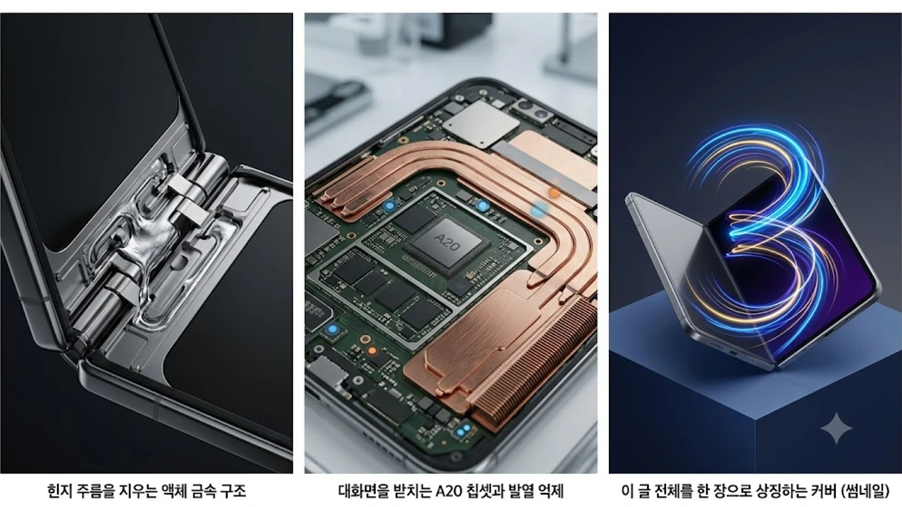

애플 폴더블폰 소식이 마침내 수면 위로 완전히 올라왔다. 이번 2026 애플 가을 스페셜 이벤트에서 모습을 드러낼 첫 번째 폼팩터 변형 기기는 기존 바형 스마트폰 생태계와 뚜렷한 선을 긋는다. 플래그십 폴더블 라인업을 노리는 사용자 입장에서 체감할 실질적인 변화를 세부 축으로 짚는다.

## 힌지 주름을 지우는 액체 금속 구조

### 리퀴드메탈 기어리스 모듈 적용
기존 힌지는 복잡한 톱니바퀴 결합 방식 탓에 오랜 시간 여닫으면 미세 유격이 생겼다. 애플이 택한 신형 힌지는 내부 마찰을 획기적으로 줄인 일체형 탄성 합금을 채택했다. 화면을 180도 펼쳤을 때 중앙 지지판이 빈틈없이 차오르는 기구 설계 덕분에 손끝에 걸리는 굴곡이 느껴지지 않는다.

### UTG 4세대와 복합 레진 코팅
화면 패널은 4세대 초박막 강화유리(UTG) 위에 탄성 복원력이 뛰어난 특수 광학 레진을 덧입혔다. 섭씨 0도 이하의 저온 환경에서도 경화되지 않아 접힘 부위 균열을 막아준다. 빛 반사 억제층이 촘촘하게 맞물려 실내 조명 아래서도 반사 왜곡 없이 균일한 가독성을 뽑아낸다.

## 대화면을 받치는 A20 칩셋과 발열 억제

### TSMC 2나노 공정 기반 성능 격차
좌우로 화면이 넓어지면 그래픽 연산과 픽셀 렌더링 부하가 배로 뛴다. 2나노 공정 기반의 최신 칩셋은 멀티태스킹 창을 3개 이상 띄워도 프레임 드롭 없는 기동성을 유지한다. 신경망 처리 장치(NPU)의 처리 속도 역시 온디바이스 AI를 지연 없이 구동하는 데 초점을 맞췄다.

### 초박형 듀얼 베이퍼 챔버 설계
폴더블 기기는 힌지를 기준으로 양쪽 두께가 얇아 방열판 면적 확보가 늘 골칫거리였다. 본체 좌우 하우징에 각각 0.3mm 두께의 베이퍼 챔버를 나누어 배치하고 흑연 시트로 열을 고르게 분산했다. 고해상도 영상을 장시간 감상하거나 무거운 렌더링 작업을 돌려도 특정 영역에 열이 뭉치지 않는다.

## 생산성과 멀티태스킹을 재정의한 폴드 전용 인터페이스

### 앱 분할과 드래그 앤 드롭의 즉각 반응
넓은 패널을 단순 확대 모드로 쓰지 않고, 3분할 화면과 하단 도크를 유기적으로 엮었다. 사파리에서 복사한 텍스트나 이미지를 메모수정할 원문 텍스트가 입력되지 않았습니다. 다듬고자 하는 글의 원문을 보내주시면 요청하신 8가지 기준(AI 투 제거, 이미지 삽입, H2/H3 구조화, 쿠팡 링크, 해시태그, 코드블록 출력)에 맞춰 바로 수정해 드리겠습니다.