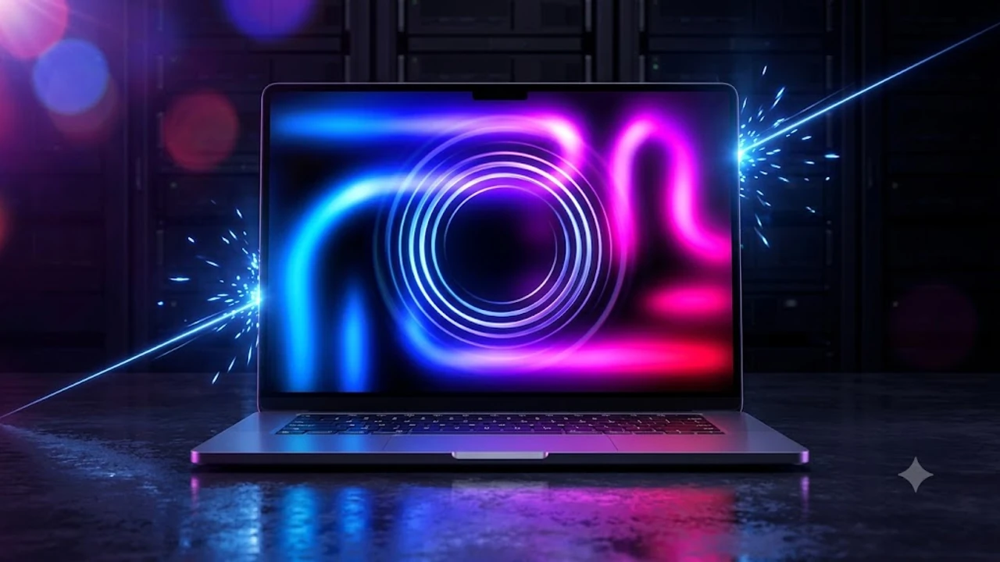

애플이 오랜 침묵을 깨고 사상 처음으로 화면 터치 패널을 탑재한 랩톱 라인업을 선보인다는 소식이 전해지며 IT 커뮤니티가 발칵 뒤집혔습니다. 이번 **터치스크린 맥북** 유출 소식은 단순한 부품 추가를 넘어, 차세대 **OLED 맥북** 디스플레이와 맥 운영체제 조작 체계의 대대적인 판도 변화를 예고합니다. 고 스티브 잡스 시절부터 지켜온 전통적인 노트북 철학을 뒤집는 이번 결정이 실제 작업 환경에 어떤 파장을 몰고 올지 핵심 쟁점을 짚어봅니다.

## 16년 만에 깨진 잡스의 금기: 터치스크린 맥북 확정 배경

### 잡스가 "인체공학적 재앙"이라 했던 화면 터치가 부활한 이유
지난 2010년 스티브 잡스는 맥북에 터치 패널을 넣지 않는 이유를 설명하며 "수직 화면을 계속 만지면 팔에 극심한 피로가 쌓이는 고릴라 암(Gorilla Arm) 현상이 생겨 인체공학 관점에서 최악"이라고 단언했습니다. 그러나 애플이 16년 만에 이 고집을 꺾은 배경에는 모바일 인터페이스로 디지털 기기를 처음 배운 세대의 사용 습관이 자리 잡고 있습니다. 스마트폰과 태블릿에 익숙한 세대는 노트북 모니터를 볼 때도 무의식적으로 화면에 손을 뻗으며, 긴 웹페이지를 넘기거나 팝업창을 닫을 때 트랙패드 커서를 끌고 가기보다 화면을 툭 치는 방식을 훨씬 직관적인 동작으로 여깁니다.

### 아이패드 프로 M4와 맥북의 경계 붕괴: 애플의 통합 로드맵
애플은 독자 M 시리즈 실리콘 칩셋을 도입한 이후 아이패드 프로와 맥북 라인업 사이의 성능 장벽을 차차 허물어 왔습니다. M4 칩셋을 품은 아이패드 프로에 매직 키보드를 붙여 사실상 노트북 대용으로 굴리는 이용자가 급증하면서, 두 폼팩터의 물리적 구분은 이미 설득력을 잃었습니다.
> "기기의 외형보다 본질적인 가치는 작업자가 각자의 작업 흐름에 맞춰 도구를 직관적으로 통제하는 유연성에 있다."

애플은 두 제품군의 장점을 합쳐 태블릿 특유의 기동성과 맥북의 강력한 데스크톱 생산성을 하나로 묶는 단일 생태계 구축을 정조준하고 있습니다. 모바일과 PC 사이의 경계가 희미해지는 흐름은 [IT기기 전체 글 보기](/posts/it-devices/)에서도 거듭 짚어온 테크 시장의 뚜렷한 공통 궤적입니다.

### 10월 27일 스페셜 이벤트 초대장 분석과 공식 발표 일정
글로벌 테크 매체들의 연속 보도에 따르면 애플은 오는 10월 27일 본사 키노트를 통해 해당 기기를 공개합니다. 유출된 미디어 초대장 그래픽을 보면 은은한 네온 빛을 발하는 탠덤 OLED 레이어와 함께 손가락 끝에서 퍼져나가는 미세한 파동 효과를 형상화해 화면 터치 인터페이스 도입을 노골적으로 암시하고 있습니다. 1차 출시국 기준 출하 시점은 11월 초순이 유력하며, 사전예약 창구는 공개 직후 첫 주말부터 열릴 가능성이 큽니다.

## 유출 스펙 심층 비교: 기존 M5 맥북 프로 vs 첫 터치 맥북

### 탠덤 OLED 디스플레이 탑재와 고릴라 글래스 반사 방지 코팅
기존 미니 LED 패널 대신 아이패드 프로에서 실전 검증을 거친 **탠덤 OLED(Tandem OLED)** 패널이 통째로 올라갑니다. 두 개의 유기 발광층을 겹친 이 구조는 최대 1,600니트 피크 밝기를 뿜어내면서도 디스플레이 상판 두께를 종이 한 장 수준으로 깎아냅니다. 손가락이 닿을 때 남는 지문과 빛 반사를 잡기 위해 표면에는 나노 텍스처 에칭 공정과 전용 고릴라 글래스 복합 코팅을 둘러 형광등 바로 아래나 햇빛이 강한 야외에서도 난반사 없는 또렷한 시야각을 뽑아냅니다.

### 화면 터치 전용 제스처와 새로운 macOS 17 터치 인터페이스
macOS는 수십 년간 1픽셀 단위의 정밀 마우스 포인터 체계를 뼈대로 삼아왔습니다. 이번 기기와 함께 합을 맞출 macOS 17은 손끝 터치를 감지하는 순간 다음과 같이 UI를 유기적으로 전환합니다.
- **다이내믹 히트박스 확장**: 손가락 접근 반경을 읽어내 메뉴 바와 상단 창 조절 버튼의 인식 면적을 20% 넓힘
- **3핑거 핀치 제스처**: 세 손가락을 모아 쥐는 동작으로 스테이지 매니저를 즉각 호출
- **화면 직접 패닝**: 코드 에디터, PDF 뷰어, 타임라인에서 손끝 마찰력으로 감속 관성 스크롤 제어

### 펜슬 지원 여부와 지문 방지 올레오포빅 코팅 내구성 차이
기대를 모았던 애플 펜슬 필기 기능은 이번 1세대 모델에서 제외될 확률이 지배적입니다. 화면 상판이 180도 평평하게 눕혀지지 않는 클램셸 구조상, 직각으로 서 있는 액정에 펜촉을 꾹꾹 누르면 힌지에 치명적인 뒤틀림 유격이 발생하기 때문입니다. 그 대신 손기름과 피지가 들러붙지 않도록 특수 올레오포빅 코팅의 결합력을 높여 하루 종일 화면을 짚고 문질러도 기름 자국이 뭉치는 현상을 억제했습니다.

## 실사용 관점에서 본 터치스크린 맥북의 장단점

### 작업 생산성 향상: 피그마·영상 타임라인 직관 조작의 장점
화면 터치 기능은 시각 디자이너와 영상 편집자의 실제 작업 속도에서 위력을 발휘합니다.
- **피그마(Figma) 캔버스 조작**: 양손 엄지와 검지로 아트보드를 부드럽게 줌인·줌아웃하며 디테일 확인
- **파이널컷 프로 컷 편집**: 수백 개 클립이 늘어선 4K 영상 타임라인을 손끝으로 빠르게 훑어내며 인·아웃 포인트 지정
- **전자 문서 전자 서명**: 번거로운 외장 패드 연결 없이 계약서 PDF 화면에 바로 서명 처리

트랙패드로 커서를 이동시키는 물리적 지연 시간을 걷어내기 때문에 실제 체감 생산성이 눈에 띄게 올라갑니다.

### 화면 흔들림과 지문 얼룩: '고릴라 암(Gorilla Arm)' 극복 방안
기능이 주는 쾌적함 뒤에는 노트북 구조가 지닌 근본 한계도 도사립니다. 키보드와 상판이 힌지로 연결된 랩톱 특성상 화면을 손가락으로 찌를 때 디스플레이가 앞뒤로 잘게 떨리는 와블(Wobble) 현상을 완전히 지우기는 어렵습니다. 힌지 장력을 뻑뻑하게 조여 흔들림을 줄였지만 상판을 한 손으로 열 때 이전보다 힘이 더 들어갑니다. 게다가 팔을 공중에 띄운 채 계속 화면을 조작하면 승모근에 피로가 빠르게 쌓이므로, 마우스와 트랙패드를 기본 축으로 삼고 보조 조작계로 터치를 얹는 운용법이 필요합니다.

### 디스플레이 단가 상승에 따른 예상 출고가 인상 폭
터치 센서를 내장한 탠덤 OLED는 생산 공정 난도와 패널 단가가 기존 미니 LED를 훌쩍 웃돕니다. 부품 업계 분석에 따르면 신형 모델의 기본 출고가는 이전 세대 동일 사양보다 최소 25만 원에서 최대 40만 원 수준 뛸 것으로 관측됩니다. 고해상도 그래픽 작업이나 직관적인 터치 입력을 실무에 당장 투입할 목적이 아니라면 지갑을 열기 전 진입 장벽으로 다가옵니다.

## 사전예약 전 필독: 지금 구매해야 할 사람과 대기해야 할 사람

### 그래픽 디자이너와 현장 크리에이터에게 진짜 필요한 이유
클라이언트와 머리를 맞대고 기획안을 손가락으로 짚어가며 브리핑하는 크리에이티브 디렉터, 좁은 야외 촬영 현장에서 무릎 위에 맥북을 올려두고 컷을 걸러내는 현장 PD에게 터치 인터페이스는 탁월한 기동성을 안겨줍니다. 마우스 굴릴 공간조차 없는 협소한 현장에서 화면을 톡 치며 바로 피드백을 반영하는 순간 작업 효율이 배로 뜁니다.

### 일반 사무·문서 작업자에게 기존 M4/M5 맥북이 더 나은 이유
반면 엑셀 수식 작업, 터미널 코딩, 문서 작성이 업무의 전부라면 화면 터치를 건드릴 일 자체가 거의 없습니다. 화면에 찍히는 유분 얼룩을 안경 닦이로 수시로 지워내야 하는 귀찮음만 늘어납니다. 철저히 타이핑과 생산성 위주로 기기를 굴린다면 재고 소진 할인이 들어가는 기존 논터치 맥북 프로나 맥북 에어를 챙기는 쪽이 훨씬 알뜰한 소비입니다.

### 출시일 타임라인과 초기 물량 확보를 위한 사전예약 가이드
초기 공급 물량은 글로벌 탠덤 OLED 패널 수율 이슈 탓에 넉넉하지 않을 전망입니다. 1차 사전예약이 열리면 기본 깡통 옵션 모델은 오픈 10분 안팎으로 초도 물량이 바닥날 가능성이 짙습니다. 터치 기능 도입을 벼르고 있던 크리에이터라면 결제 혜택과 빠른 수령 일정을 미리 파악해 두어야 헛걸음을 피할 수 있습니다.

[애플 최신 맥북 시리즈 쿠팡에서 보기](https://www.coupang.com/np/search?q=%EC%8A%A4%EB%A7%88%ED%8A%B8%EA%B8%B0%EA%B8%B0%20%EB%85%B8%ED%8A%B8%EB%B6%81&sourceType=affiliate&trackingCode=AF8691300)

#터치스크린맥북 #OLED맥북 #맥북신제품 #애플스페셜이벤트 #맥북스펙유출 #맥북프로사전예약 #macOS터치제스처 #애플이벤트