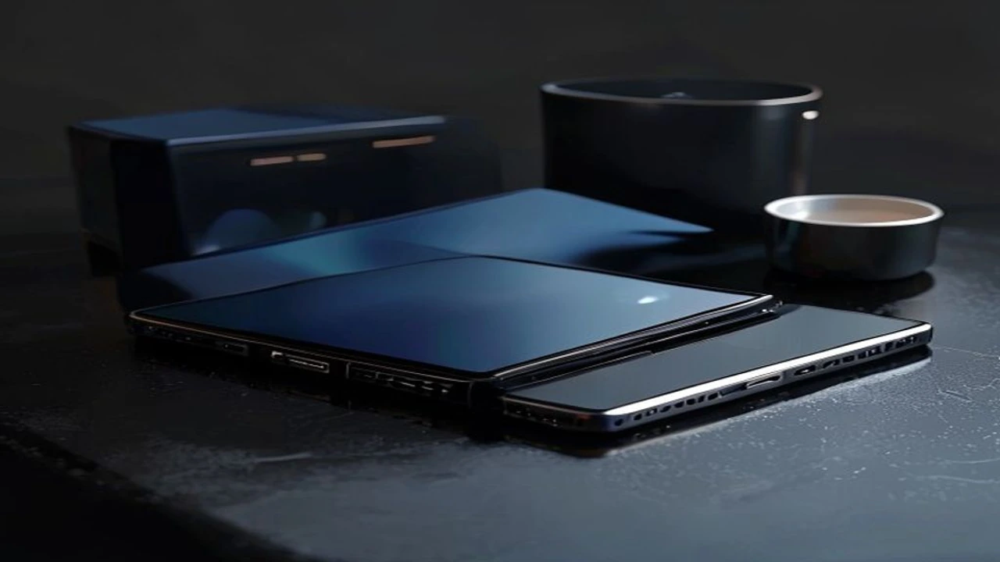
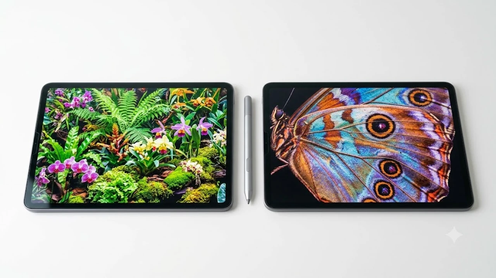

최근 스마트폰 화면이 7인치에 육박할 정도로 커지고 노트북을 대체하는 11\~13인치 대형 태블릿이 주류로 자리 잡았지만, 역설적으로 가볍게 들고 다닐 **미니 태블릿** 수요가 급증하고 있습니다. 한 손에 쏙 들어오는 8인치대 폼팩터는 거대해진 모바일 기기 사이에서 가장 완벽한 휴대성과 몰입감을 선사하는 독보적인 영역을 구축했습니다. 대형 화면의 피로감과 스마트폰의 작아진 개방감 사이에서 고민하던 유저들에게 2026년 현재 새로운 대안으로 떠오른 배경을 자세히 정리했습니다.

## 2026년 왜 다시 8인치 미니 태블릿인가?

### 스마트폰은 작고 패드를 들기엔 무거운 이들을 위한 대안
대형 스마트폰이 아무리 화면을 키워도 16:9 또는 21:9 비율의 한계로 인해 전자책을 읽거나 문서를 볼 때 답답함을 지우기 어렵습니다. 반면 11인치 이상의 플래그십 패드는 케이스를 장착하면 무게가 700\~800g을 훌쩍 넘어가기에 침대에 엎드리거나 버스 안에서 한 손으로 들고 쓰기엔 손목에 가해지는 부담이 상당합니다. 8인치대 기기는 **300g 중후반의 가벼운 무게**로 이러한 틈새 시장을 정확히 파고들었습니다.

### 8인치대 폼팩터가 선사하는 극강의 휴대성과 파지감
양손을 모두 사용해야만 겨우 지탱할 수 있는 대형 패드와 달리, 8인치 제품군은 성인 남성이 한 손으로 양 끝을 움켜쥘 수 있는 서적 크기의 파지감을 자랑합니다. 일반적인 외투 주머니나 미니 백팩, 슬링백에 별도 파우치 없이 쏙 들어가는 크기 덕분에 이동성이 극대화됩니다. 

> "바지 뒷주머니나 재킷 안주머니에 넣고 다니다가, 지하철에 자리가 나면 즉시 꺼내서 읽을 수 있는 크기는 오직 8인치뿐이다." - 테크 커뮤니티 실사용자 평

### 출퇴근길 OTT 스낵 컬처와 E-Book 헤비 유저의 선택
매일 왕복 2시간 이상을 대중교통에서 보내는 직장인들에게 8인치 화면은 최고의 이동식 영화관이 됩니다. 화면이 지나치게 크면 주변 사람들에게 디스플레이가 쉽게 노출되어 사생활 보호가 어렵지만, 8인치 크기는 시선 차단이 비교적 수월하면서도 자막과 세부 영상을 왜곡 없이 선명하게 감상할 수 있는 최적의 타협점입니다.

## 시장을 뒤흔든 고성능 미니 태블릿 대표 주자 비교

### 리전탭(Y700) 5세대 vs 아이패드 미니 차기작 스펙 맞대결
안드로이드 진영의 절대 강자인 레노버 **리전탭 5세대**는 퀄컴 스냅드래곤 8 Gen 3 프로세서와 144Hz 고주사율 디스플레이를 무기로 시장을 선점했습니다. 이에 맞서는 애플의 차세대 아이패드 미니는 A18 칩셋을 탑재해 인공지능 연산 능력을 극대화하는 전략을 취하고 있습니다. 순수 게이밍 성능과 주사율 면에서는 쿨링 시스템을 빵빵하게 밀어 넣은 리전탭이 우위를 점하며, 독자적인 OS 생태계와 영상 편집 등 생산성 측면에서는 아이패드가 판정승을 거두는 양상입니다.

### 가성비 중국산 직구 태블릿, 글로벌 정발 모델과의 차이점
내수용 직구 제품은 30만 원대라는 파괴적인 가격을 자랑하지만, 반글화 작업을 거쳐야 하거나 넷플릭스 L1 인증이 풀리는 자잘한 소프트웨어 오류 리스크를 감수해야 합니다. 반면 정식 발매 모델은 10\~20만 원 가량 비싼 가격 대를 형성하는 대신, 완벽한 한글 지원과 국내 공식 서비스센터를 통한 확실한 사후 관리(AS) 혜택을 보장하므로 기기 조작에 익숙하지 않은 초보자라면 정발판 선택이 안전합니다.

### 디스플레이 주사율과 주력 AP 칩셋 성능 완벽 비교
과거 미니 기기들은 성능이 떨어지는 보급형 프로세서를 넣어 '유튜브 재생기'에 그치는 경우가 많았습니다. 하지만 최신 제품들은 최고 등급의 AP를 탑재하여 연산 속도가 비약적으로 상승했습니다. 특히 **120Hz 이상의 고주사율**을 기본 채택하면서 화면을 스크롤할 때 발생하는 잔상이 사라졌고, 웹서핑이나 텍스트 리딩 시 눈 피로도가 획기적으로 줄어들었습니다.

[관련 글 보기](/posts/it-devices/)

## 모바일 게이머와 직장인이 체감한 솔직한 장단점

### 한 손 조작과 고사양 게임 플레이 시 발열 제어
스마트폰으로 '젠레스 존 제로'나 '붕괴: 스타레일' 같은 고사양 그래픽 게임을 구동하면 10분도 안 되어 카메라 주변이 뜨거워지며 프레임 드랍(쓰로틀링)이 발생합니다. 미니 제품군은 내부 면적이 스마트폰보다 넓어 방열 패드와 베이퍼 챔버를 훨씬 크게 구성할 수 있습니다. 덕분에 장시간 최고 옵션으로 게임을 구동해도 손바닥이 뜨거워지지 않고 안정적인 프레임을 유지합니다.

### 문서 작업 및 멀티태스킹 환경에서의 명확한 한계점
화면 배율이 작다 보니 두 개 이상의 앱을 동시에 띄우는 분할 화면(멀티윈도우) 기능을 쓸 때 텍스트가 지나치게 작아집니다. 블루투스 키보드를 연결해 카페에서 워드나 엑셀 작업을 하려고 해도, 눈을 화면 가까이 대야 하므로 거북목을 유발하기 쉽습니다. 생산성 작업 비중이 높다면 8인치보다는 최소 11인치 이상의 상위 라인업으로 가는 편이 정신 건강에 이롭습니다.

### 배터리 타임과 고속 충전 지원 여부가 가르는 만족도
물리적 크기가 작다 보니 탑재할 수 있는 배터리 용량이 보통 **5,000mAh\~6,500mAh** 내외로 제한됩니다. 10,000mAh에 육박하는 대형 제품들에 비해 절대적인 사용 시간이 짧을 수밖에 없습니다. 따라서 외부 활동이 잦다면 최소 45W 이상의 초고속 충전을 지원하는지 확인해야 방전으로 인한 불편을 겪지 않습니다.

## 나에게 맞는 미니 태블릿 실패 없이 고르는 꿀팁

### 내 사용 목적 분석: 게이밍 vs 단순 영상 시청 및 독서
구매 목적이 화려한 3D 액션 게임이라면 주사율과 AP 성능에 모든 예산을 쏟아부어야 합니다. 하지만 침대에 누워 유튜브를 보거나 밀리의 서재를 읽는 것이 목적이라면 굳이 고가의 플래그십을 선택할 이유가 없습니다. 목적에 맞는 하드웨어 스펙을 타협하면 최소 20만 원 이상의 지출을 방어할 수 있습니다.

### 반사방지(AR) 필름과 전용 케이스 등 필수 액세서리 매칭법
화면이 작은 기기는 야외나 대중교통 등 조명이 시시각각 바뀌는 환경에서 자주 쓰입니다. 이때 화면에 형광등이나 햇빛이 반사되면 가독성이 심각하게 떨어지므로, **반사방지(AR) 코팅이 적용된 필름**을 부착하는 편이 좋습니다. 케이스 역시 무거운 가죽 형태보다는 기기 본연의 가벼움을 살릴 수 있는 얇은 투명 TPU 소재나 마그네틱 폴리오 타입을 골라야 손목을 보호합니다.

### 글로벌 롬 교체 및 국내 AS 가능 여부 체크리스트
중국 내수용 기기를 직구로 들여올 경우, 구글 플레이스토어가 기본 설치되어 있지 않아 수동으로 APK 파일을 내려받아 설치해야 하는 번거로움이 존재합니다. 시스템 업데이트가 진행될 때마다 한글 패치가 풀리는 현상이 나타나기도 하므로, 이러한 소프트웨어 튜닝 과정을 귀찮아한다면 반드시 글로벌 롬이 탑재되어 출고되거나 국내 공식 수입 정품 마크가 붙은 모델을 선택해야 이중 지출을 막을 수 있습니다.

#미니태블릿 #8인치태블릿 #가성비태블릿 #리전탭5세대 #아이패드미니 #게이밍태블릿 #소형패드 #전자책태블릿 #직구태블릿