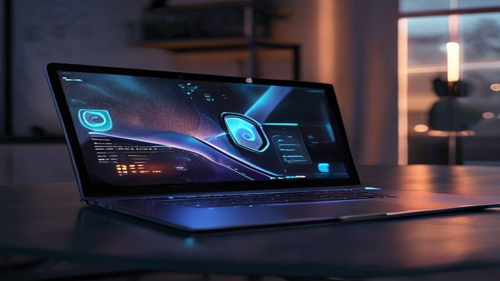

매일 쏟아지는 업무와 데이터 속에서 효율적인 작업 환경을 구축하려는 직장인과 크리에이터들의 고민이 깊어지는 시점입니다. 기존의 일반 노트북으로는 클라우드 기반 연동의 한계와 느린 처리 속도 때문에 답답함을 느끼기 일쑤였습니다. 네트워크 연결 없이 노트북 내부에서 똑똑하게 인공지능 작업을 수행하는 2026년형 코파일럿 플러스 PC 제품들이 새로운 대안으로 급부상한 이유가 여기에 있습니다.

## 온디바이스 차세대 하드웨어 스펙의 변화

### 초당 40조 번 연산하는 NPU의 등장

과거의 랩톱이 중앙처리장치(CPU)와 그래픽카드(GPU)의 순수 연산 속도에만 의존했다면, 코파일럿 플러스 PC 규격을 충족하는 가젯들은 신경망처리장치(NPU)의 성능이 핵심 지표로 자리 잡았습니다. 마이크로소프트가 제시한 최소 40 TOPS(초당 40조 회 연산) 기준을 가뿐히 넘어서는 칩셋들이 대거 탑재되면서 복잡한 생성형 알고리즘을 로컬 환경에서 부드럽게 구현해 냅니다. 클라우드를 거치지 않으므로 개인 정보 유출 우려가 적고 반응 속도가 획기적으로 빨라졌습니다.

### 최소 16GB RAM 하드웨어 가이드라인

단순한 문서 작성을 넘어 상시 대기 형태의 인공지능 비서 기능을 매끄럽게 구동하려면 메모리 대역폭이 뒷받침되어야 합니다. 새로운 세대의 디바이스들은 기본 사양이 16GB LPDDR5X RAM부터 출발하며 고속 데이터 전송 속도를 보장합니다. 저장 공간 역시 로컬 인공지능 모델을 상시 탑재할 수 있도록 최소 256GB 이상의 고성능 NVMe SSD를 채택하여 병목 현상을 방지하는 구조를 완성했습니다.

## 3대 프로세서 브랜드의 실전 성능 비교 분석

### 전력 효율의 최강자 퀄컴 스냅드래곤 X 시리즈

모바일 아키텍처 기반의 퀄컴 스냅드래곤 X 엘리트 및 X 플러스 프로세서는 배터리 수명 측면에서 독보적인 우위를 점합니다. 한 번의 충전으로 20시간이 넘는 실사용 시간을 보여주며 외부 작업이 잦은 비즈니스맨들에게 최적의 선택지로 꼽힙니다. 윈도우 운영체제와 암(ARM) 하드웨어 간의 최적화 수준도 초기와 달리 눈부시게 발전하여 일상적인 오피스 프로그램이나 웹서핑 환경에서 맥북에 버금가는 쾌적함을 선사합니다.

### 전통의 호환성 리더 인텔 루나레이크 계열

기존 x86 기반 소프트웨어와의 완벽한 궁합을 원하는 사용자라면 인텔 코어 울트라(루나레이크 및 팬서레이크) 계열이 든든한 대안이 됩니다. 금융권 보안 프로그램이나 국내 특정 커스텀 소프트웨어 구동 시 에뮬레이션을 거치지 않으므로 오류 발생률이 현저히 낮습니다. 내장 그래픽 아크(Arc)의 그래픽 처리 능력도 수준급이어서 가벼운 영상 편집이나 캐주얼 게임까지 무난하게 소화해 내는 범용성이 강점입니다.

### 강력한 멀티코어 연산의 AMD 라이젠 AI 300

작업의 강도가 높은 크리에이티브 영역에서는 AMD 라이젠 AI 300 시리즈(젠 5 아키텍처)의 멀티코어 성능이 빛을 발합니다. 대용량 소스 코딩을 실행하거나 복잡한 3D 그래픽 렌더링을 걸어두었을 때 처리가 늘어지지 않고 안정적인 클럭을 유지합니다. 높은 부하가 걸리는 상황에서도 NPU가 영리하게 전력을 분배하여 발열과 팬 소음을 효과적으로 제어하는 모습을 보여줍니다.

## 실생활을 바꾸는 코파일럿 플러스 핵심 킬러 기능

### 과거의 작업 기록을 추적하는 타임라인 리콜

내가 며칠 전에 보았던 웹페이지 화면이나 수정하던 PPT의 특정 문구가 기억나지 않을 때 시각적 타임라인을 통해 즉각적으로 찾아주는 기능입니다. 화면에 노출되었던 텍스트와 이미지를 하드웨어 자체적으로 자동 인식하여 데이터베이스화하므로 사용자는 단지 기억나는 파편적인 키워드만 검색창에 입력하면 됩니다. 인터넷 연결이 차단된 비행기 안에서도 완벽히 작동하므로 업무 연속성이 깨지지 않습니다.

### 실시간 대화식 인공지능 도구와 크리에이터 툴

화상 회의를 진행할 때 실시간으로 다국어 자막을 생성해 주는 라이브 캡션 기능은 글로벌 협업이 잦은 환경에서 유용합니다. 어떠한 음성이든 지연 시간 없이 즉각적인 텍스트 변환과 번역이 이루어집니다. 기본 그림판 앱에 내장된 코크리에이터를 활용하면 대략적인 스케치와 몇 줄의 텍스트 설명만으로 프로 수준의 일러스트레이션을 몇 초 만에 완성할 수 있어 아이디어 구체화 단계의 시간을 단축시킵니다.

## 내 작업 스타일에 맞는 맞춤형 제품 매칭 추천

### 이동이 잦고 문서 작업이 중심인 직장인

사무실 밖이나 카페에서 온종일 전원 어댑터 없이 업무를 처리해야 한다면 마이크로소프트 서피스 랩톱 7세대나 갤럭시 북 Edge 같은 퀄컴 스냅드래곤 기반 디바이스가 유리합니다. 얇고 가벼운 폼팩터 디자인 덕분에 휴대성이 뛰어나며 가방에 넣고 다녀도 어깨에 부담이 거의 없습니다. 화면을 열자마자 스마트폰처럼 즉각적으로 깨어나는 반응성 또한 답답함을 덜어주는 요소입니다.

### 고화질 편집과 멀티미디어를 즐기는 크리에이터

사진 보정 툴을 상시 구동하거나 유튜브 영상 컷 편집을 자주 하는 유저라면 디스플레이 품질과 그래픽 가속력이 뛰어난 델 엑스피에스(XPS) 시리즈나 아수스 젠북 라인업이 알맞습니다. 올레드(OLED) 패널의 화려한 색감과 고성능 인텔/AMD 칩셋의 시너지 덕분에 고용량 미디어 파일을 다룰 때 끊김 현상이 발생하지 않습니다. 고주사율 화면이 적용되어 장시간 화면을 쳐다보아도 눈 피로감이 덜합니다.

## 합리적인 예산 책정과 구매 시 필수 체크포인트

[관련 글 보기](/posts/it-devices/)

### 구형 소프트웨어 실행 여부와 에뮬레이션 확인

아무리 뛰어난 인공지능 하드웨어를 갖추었더라도 본인이 매일 사용하는 특수 프로그램이 호환되지 않는다면 가치가 반감됩니다. 퀄컴 ARM 기반 모델의 경우 일부 레거시 소프트웨어가 에뮬레이션 모드로만 작동하여 속도 저하가 발생할 수 있습니다. 구매 전 제조사 공식 호환 목록을 확인하고 가능하면 매장에서 직접 설치 테스트를 거쳐보아야 실패가 없습니다.

### 사후 지원과 장기적인 가치 고려하기

노트북은 한 번 구매하면 최소 3년 이상 사용하는 고관여 가전제품인 만큼 제조사의 사후 관리(AS) 망이 촘촘한지 점검해야 합니다. 국내 거주 환경에서는 신속한 부품 수급과 방문 수리 서비스 여부가 기기 수명을 결정짓는 요소가 되기도 합니다. 소프트웨어 업데이트가 지속해서 이루어지는 브랜드의 플래그십 제품군을 선택하는 것이 장기적으로 중고 잔존 가치를 방어하는 데도 유리한 전략입니다.

#코파일럿플러스PC #온디바이스AI #AI노트북 #스냅드래곤X엘리트 #루나레이크 #신형노트북추천 #IT트렌드