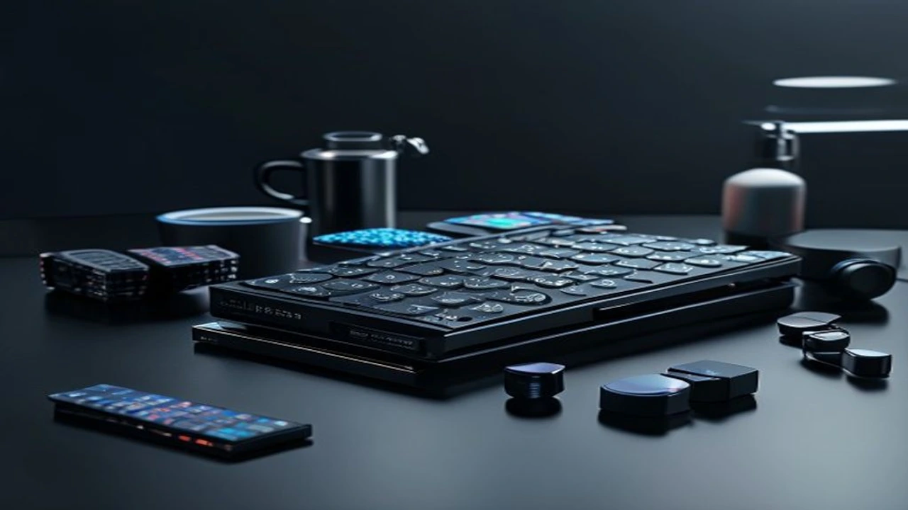
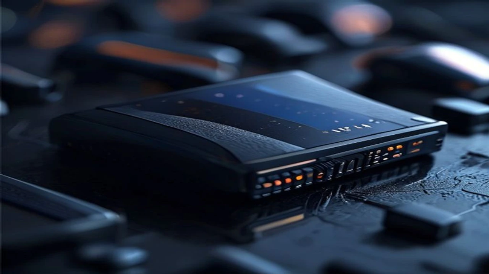

2026년 7월 22일 런던 갤럭시 언팩 행사에서 삼성전자와 구글이 공동 개발한 **갤럭시 글라스**가 드디어 실체를 드러냈습니다. 시각적 인공지능과 온디바이스 AI를 결합한 이번 신제품은 안경형 폼팩터 시장의 판도를 바꿀 핵심 기기로 떠올랐습니다.

## 런던 언팩에서 베일 벗은 갤럭시 글라스의 핵심 정체성

### 삼성과 구글의 온디바이스 AI 기기 협업 배경
이번 기체는 삼성의 기구 설계 노하우와 구글 안드로이드 XR 플랫폼이 밀접하게 결합된 결과물입니다. 네트워크 연결 없이 기기 자체에서 초거대 언어모델 기반 시각 인지 처리를 끝내는 기술이 실장됐습니다. 모바일 생태계의 입력 체계를 화면 터치에서 시선과 음성으로 확장하려는 양사의 시도가 본격적인 결실을 맺은 셈입니다.

### 안경형 폼팩터의 무게와 착용감 및 디자인 요소
일반 뿔테 안경과 구분하기 힘들 만큼 자연스러운 외형을 자랑합니다. 초경량 티타늄 프레임 구조를 적용해 전체 무게를 49g으로 맞췄습니다. 코받침과 안경다리 부분의 무게 배분을 정밀하게 조정해 장시간 쓰고 있어도 짓눌림이나 피로감이 적습니다.

### 기존 메타 레이벤 스마트글래스와의 명확한 차별점
단순 촬영이나 단순 음성 명령에 머물렀던 기존 제품과 달리, 시야 전면에 증강현실 정보를 투사하는 초고해상도 Micro-LED 디스플레이를 렌즈에 내장했습니다. 사용자가 바라보는 시선과 손짓 제스처를 실시간으로 추적해 작동하는 고도화된 모션 인식 능력을 갖췄습니다.

## 실사용성 중심으로 파헤치는 주요 스펙 및 성능 비교

### 차세대 AI 칩셋과 온디바이스 지능형 시각 인지 기능
자체 개발된 전용 AI 칩셋이 탑재되어 사물을 바라보는 즉시 0.2초 만에 분석 결과를 렌즈 위에 띄워줍니다. 외국어 표지판이나 길거리 메뉴판을 올려다보는 것만으로 번역된 문장이 렌즈 위에 자연스럽게 겹쳐 보이는 체감 성능을 보여줍니다.

### 배터리 라이프와 초경량 설계 기술
고밀도 초소형 배터리 셀 기술을 접목해 1회 충전 시 연속 4시간, 일반적인 혼합 사용 환경에서는 최대 12시간 동안 작동합니다. 이동 중 전원 공급이 필요할 때는 초소형 고출력 충전기를 활용하면 편리하며, 관련 정보는 [GaN 충전기, 2026년 진짜 사야 할 숨은 꿀템 3선](/posts/it-devices/supertiny-gan-charger-travel-tech-2026/) 글에서도 상세 분석을 확인할 수 있습니다.

### 독립 동작 가능성 및 갤럭시 스마트폰 연동 생태계
스마트폰이 주머니에 없어도 독립적인 Wi-Fi 및 저전력 블루투스 통신을 바탕으로 자율 동작을 수행합니다. 갤럭시 스마트폰이나 갤럭시 링 등 기존 기기와 연동할 때 데이터 전송 속도가 극대화되며, 착용자의 생체 신호를 정밀 분석하는 동기화 메커니즘을 보여줍니다.

## 스마트폰을 대체할까? 사용자 관점 장단점 분석

### 시각 중심 핸즈프리 인터페이스가 주는 강력한 장점
주머니나 가방에서 단말기를 꺼낼 필요 없이 보고 있는 길 위에 네비게이션 화살표가 바로 그려집니다. 메시지 수신 시 시선을 약간 위로 올리는 제스처만으로 내용을 읽고 음성으로 답장을 보낼 수 있어 운전이나 양손을 쓰는 작업 중 활용도가 높습니다.

### 발열 관리, 짧은 배터리 타임, 개인정보 침해 유의점
> 안경 프레임 내부에 기판과 배터리가 밀집되어 있어 지속적인 AI 연산 시 안경다리 부근에 약간의 미열이 발생하는 한계가 존재합니다. 

또한 콤팩트한 구조 특성상 하루 종일 고부하 작업을 수행하기에는 배터리 용량이 아쉬울 수 있습니다. 차세대 디스플레이 폼팩터의 변화 파급력은 [2026 차세대 XR 기기 바뀌는 미래 완전 정리](/posts/it-devices/spatial-3d-display-xr-device-2026/) 포스팅에서 더 깊이 다루고 있습니다.

### 카메라 탑재 디바이스로서의 사생활 보호 대책 및 제한사항
전면 초소형 카메라 작동 시 전면 LED 표시등이 물리적으로 점등되는 도촬영 방지 알고리즘이 들어갔습니다. 공공장소나 촬영 금지 구역에서는 자동으로 카메라 기능이 제한되는 위치 기반 지오펜싱 보안 기술을 수용했습니다.

## 출시일 일정 및 예상 출고가 가이드

### 글로벌 및 국내 공식 출시일 타임라인
공식 사전 예약은 오는 8월 초부터 시작될 예정입니다. 한국과 미국, 영국 등 1차 출시국을 대상으로 8월 21일부터 순차 배송이 확정되어 올 여름 테크 시장의 기대를 모으고 있습니다.

### 예상 출고 가격대와 요금제/사전예약 혜택 전망
출고가는 글로벌 기준 899달러(국내 출고가 약 119만~125만 원 선)로 책정되었습니다. 고성능 부품이 집약된 기기 특성을 감안할 때 납득할 수 있는 가격대라는 반응이 많으며, 통신사 결합 상품 이용 시 기기값 할인과 전용 케이스 증정 혜택이 이어질 전망입니다.

### 1세대 모델, 지금 바로 사전예약 구매할 가치가 있을까?
* 스마트폰 화면을 보지 않고 이동하는 핸즈프리 환경을 원하던 테크 얼리어답터
* 외국어 문서 번역 및 실시간 시각 검색 활용도가 높은 비즈니스 사용자
* 49g의 가벼운 착용감과 최신 온디바이스 AI 생태계를 경험하고 싶은 유저

새로운 차원의 모바일 인터페이스를 선점하고 싶다면 1세대 구매를 망설일 이유가 없습니다.

#갤럭시글라스 #삼성스마트글래스 #갤럭시언팩2026 #온디바이스AI #구글스마트글라스 #스마트글래스스펙 #갤럭시글라스출시일 #갤럭시글라스가격 #IT신제품