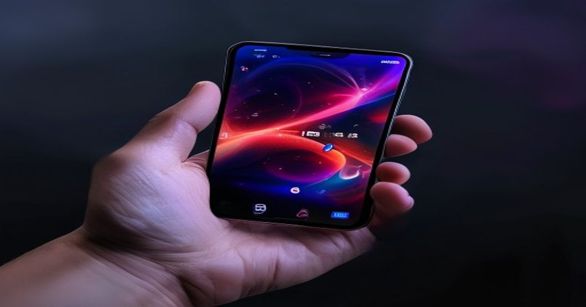

스마트폰에 AI가 들어간다는 말이 처음 나왔을 때 많은 사람들이 반신반의했습니다. 그런데 2026년 갤럭시 S26 시리즈는 AI가 정말로 쓸 만한가라는 질문에 조금 더 구체적인 답을 주고 있습니다. 마케팅 문구가 아니라 실제 사용 경험에서 무엇이 바뀌었는지 살펴봤습니다.

## 갤럭시 S26의 주요 AI 기능 한눈에 보기

삼성의 갤럭시 AI는 S24 시리즈부터 본격 도입됐고, S26에 이르러 더 정교해졌습니다. 전작 대비 달라진 핵심은 온디바이스 AI 처리 비중의 증가와 자연어 이해 능력의 향상입니다. 인터넷 없이도 작동하는 기능이 늘어나 프라이버시 우려도 줄어들었습니다.

### 써클 투 서치 — 손가락으로 그리면 검색된다

화면 어디서든 원을 그리면 그 안의 내용을 구글 렌즈로 즉시 검색하는 기능입니다. 유튜브 영상 속 옷 스타일, SNS에서 본 음식, 뉴스 기사의 건물 — 궁금한 모든 것을 브라우저 전환 없이 바로 검색할 수 있습니다. 실사용에서 가장 자주 쓰게 되는 기능으로, 익숙해지면 없어서는 안 될 습관이 됩니다.

### 라이브 번역 — 통화 중에 실시간으로

외국어로 걸려오는 전화를 받을 때, 통화 내용이 화면에 자막으로 표시되고 내 말도 자동으로 번역되어 전달됩니다. 업무상 해외 거래처와 통화가 잦은 사람이나 해외 여행 중에 현지 업체와 예약할 때 실질적인 도움이 됩니다. 번역 정확도는 복잡한 문장보다 간단한 문장에서 더 높습니다.

## S26에서 달라진 카메라 AI

스마트폰 시장에서 카메라 경쟁이 가장 치열한 만큼, 삼성도 S26에서 AI 기반 카메라 기능 강화에 집중했습니다. 하드웨어 스펙만큼이나 소프트웨어 처리 능력이 사진 품질을 결정하는 시대가 되었습니다.

### AI 줌 복원 — 먼 거리도 선명하게

디지털 줌을 쓸 때 발생하는 화질 저하를 AI가 실시간으로 보완하는 기능입니다. 10배 이상 확대해도 디테일이 뭉개지지 않고 살아있는 수준의 결과물을 보여줍니다. 스포츠 경기 관람석에서 선수를 찍거나, 자연 풍경 속 먼 피사체를 포착할 때 체감 차이가 큽니다.

### 제너레이티브 편집 — 사진 속 불필요한 요소 삭제

원치 않는 사람이나 사물을 사진에서 자연스럽게 제거하는 기능은 S24부터 있었지만, S26에서는 경계선 처리가 훨씬 매끄러워졌습니다. 배경이 복잡한 사진에서도 피사체만 남기고 나머지를 깔끔히 채워줍니다. 다만 단색이 아닌 패턴이 있는 배경에서는 완성도가 다소 떨어집니다.

## 갤럭시 S26, 이런 사람에게 맞다

AI 기능을 최대한 활용하는 사람이라면 S26의 가치가 크게 느껴집니다. 반면 스마트폰을 전화·문자·유튜브 용도로만 쓴다면 중저가 라인업과 체감 차이가 크지 않을 수 있습니다.

### 업무 생산성을 높이고 싶은 직장인

갤럭시 AI의 통화 요약, 노트 정리, 실시간 번역은 업무 효율을 실질적으로 높여줍니다. 회의 녹음을 자동으로 텍스트 요약해주는 기능은 분주한 회의가 많은 직장인에게 특히 유용합니다.

### 콘텐츠 크리에이터

S26의 카메라와 AI 편집 기능은 별도 편집 앱 없이도 SNS에 올릴 만한 품질의 결과물을 빠르게 만들어 줍니다. 인스타그램 릴스, 유튜브 쇼츠 제작에 활용하면 작업 시간을 단축할 수 있습니다.

## S26 구매 전 체크해야 할 사항

갤럭시 S26 구매를 고민 중이라면 몇 가지를 먼저 확인하세요. 기존 S24·S25 사용자라면 AI 기능의 체감 차이가 제한적일 수 있습니다. 삼성 멤버십 등급에 따라 구형 기기 보상 판매 금액이 달라지니 교환 프로그램을 먼저 확인하는 것이 좋습니다.

> [IT기기 최신 리뷰 목록](/posts/it-devices/)도 확인해보세요.

#갤럭시S26 #갤럭시AI #삼성스마트폰 #AI스마트폰 #갤럭시카메라 #IT기기추천 #스마트폰2026 #삼성갤럭시