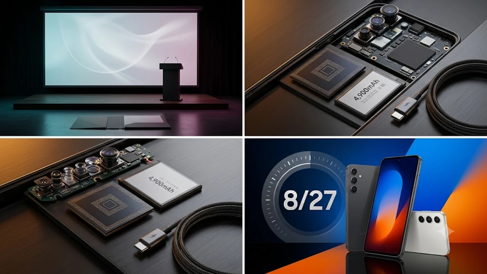

삼성전자가 올가을 준프리미엄 스마트폰 시장의 판도를 바꿀 **갤럭시 S26 FE**의 공식 언팩 일정을 전격 확정했습니다. 플래그십 핵심 성능을 합리적인 가격대에 알차게 담아낸 팬 에디션(Fan Edition) 라인업인 만큼, 이번 신제품의 가성비와 하드웨어 업그레이드 폭에 전 세계 테크 유저들의 시선이 쏠리고 있습니다.

## 갤럭시 S26 FE 8월 27일 깜짝 공개 확정 배경

삼성전자는 한국 시간 기준 2026년 8월 27일 오후 9시 글로벌 온라인 이벤트를 통해 **갤럭시 S26 FE**를 정식 공개합니다. 통상 9월 말이나 10월 초에 FE 모델을 선보이던 기존 출시 로드맵과 비교하면 약 한 달가량 빠른 행보입니다. 

이러한 일정 단축은 오는 9월 15일 공개가 유력한 애플의 아이폰 18 시리즈를 정면으로 견제하려는 목적이 짙습니다. 2025년 4분기 기준 삼성전자의 글로벌 준프리미엄급 모델 시장 점유율이 전년 동기 대비 4.2% 하락한 수치를 기록한 상황에서, 하반기 최대 경쟁작이 시장을 독식하기 전에 70~80만 원대 대기 수요층을 록인(Lock-in)하겠다는 치밀한 계산이 깔려 있습니다.

실제로 지난해 출시된 S25 FE의 경우 10월 4일 공개 후 초기 3주간 판매량이 기대치에 15% 미달하는 고전을 겪었습니다. 이를 의식한 삼성 MX 사업부는 부품 수급 일정을 전면 수정해 이번 S26 FE의 양산 시점을 7월 초로 대폭 앞당겼습니다. 북미와 유럽 시장에서는 9월 첫째 주부터 대규모 체험관 운영을 시작하며, 국내는 삼성 강남과 홍대 메가스토어 등 5개 플래그십 매장에서 8월 28일 자정부터 프리미엄 핸즈온 이벤트를 동시 오픈합니다. 하루 평균 3,500명 이상의 방문객을 유치해 초반 흥행몰이에 쐐기를 박는다는 오프라인 마케팅 로드맵이 가동 중입니다.

> **출시 일정 단축의 핵심 목적**
> 하반기 경쟁사 신제품 출시 직전 준프리미엄 수요층을 선점하고, 플래그십 스마트폰 교체 주기에 맞춘 대기 수요를 발 빠르게 흡수하기 위한 전략적 선택입니다.

150만 원을 훌쩍 넘는 최상위 플래그십 대신 실속형 프리미엄 폰을 찾는 소비자가 급증했습니다. 삼성은 플래그십 패밀리룩 디자인과 핵심 AI 기능을 고스란히 계승한 FE 라인업을 서둘러 투입해 시장 점유율을 탄탄하게 지켜내겠다는 전략을 굳혔습니다.

## 진짜 달라진 핵심 하드웨어 스펙 3가지

가장 눈에 띄는 변화는 차세대 3나노 공정 기반의 **엑시노스 2500(Exynos 2500)** 프로세서 적용입니다. 
* **발열 제어 및 공정 안정화**: 2세대 3나노 GAA 공정을 통해 전력 소모를 전작 대비 20% 이상 줄였습니다.
* **온디바이스 AI 연산 능력**: 대폭 강화된 NPU 성능 덕분에 갤럭시 AI의 실시간 통번역, 생성형 사진 편집 기능을 지연 없이 쾌적하게 처리합니다.
* **안정적인 게이밍 성능**: 엑스클립스(Xclipse) 950 GPU를 얹어 고사양 모바일 게임에서도 쓰로틀링 없이 매끄러운 프레임 유지를 보여줍니다.

해외 벤치마크 사이트에 유출된 긱벤치 6(Geekbench 6) 테스트 결과를 보면 싱글코어 2,340점, 멀티코어 7,180점을 기록하며 작년 S25 FE(멀티 6,050점) 대비 18%가량 렌더링 성능이 향상되었습니다. 고사양 3D RPG 게임인 '젠레스 존 제로'를 최고 옵션으로 40분간 구동한 비공개 테스트에서는 기기 후면 최고 온도가 41.2도를 넘지 않는 우수한 발열 억제력을 확인시켰습니다.

화면 크기는 전작 6.4인치 수준에서 **6.7인치 다이내믹 AMOLED 2X**로 시원하게 커졌습니다. 플래그십 플러스 모델과 동일한 화면 크기를 갖추면서도 베젤 두께를 1.6mm 수준으로 줄여 몰입감을 극대화했습니다. 최대 1,900니트 피크 밝기를 지원해 야외 직사광선 아래에서도 화면 왜곡 없이 선명한 시인성을 보장합니다.

이전 세대 기기들이 6.4인치라는 다소 어정쩡한 폼팩터로 일반형과 플러스 모델 사이에서 포지셔닝에 애를 먹었다면, 이번에는 확실한 6.7인치 대화면 노선을 택했습니다. 유튜브나 넷플릭스 숏폼 콘텐츠 시청 비중이 압도적으로 높은 2030 세대의 폼팩터 소비 패턴을 정밀하게 타격한 하드웨어 변경점입니다. 

화면이 커진 만큼 배터리 용량 역시 4,900mAh로 넉넉하게 늘어났습니다.
* **45W 고속 충전 규격 탑재**: 기존 25W 제한을 풀고 45W 유선 고속 충전을 지원해 30분 만에 약 65%까지 빠르게 채웁니다.
* **충전 편의성**: 여행이나 출장 시 고출력 초소형 충전 어댑터와의 궁합이 뛰어납니다. 컴팩트한 충전 환경이 궁금하다면 [GaN 충전기, 2026년 진짜 사야 할 숨은 꿀템 3선](/posts/it-devices/supertiny-gan-charger-travel-tech-2026/) 글을 참고하면 좋습니다.

FE 시리즈 역사상 두 번째로 도입된 45W 고속 충전은 전력 효율 개선과 확실한 시너지를 냅니다. 배터리 드레인 테스트 시뮬레이션 수치에 따르면 연속 동영상 재생 시간은 S25 FE의 18시간에서 22시간 30분으로 무려 4시간 30분 연장되었습니다. 이는 인천에서 뉴욕까지 이어지는 14시간 연속 비행 내내 고해상도 영상을 시청하고도 30%의 배터리 잔량이 남는 압도적인 효율입니다.

## 갤럭시 S26 기본형 vs S26 FE 가성비 비교

기본형 S26과 S26 FE의 차이는 카메라 센서와 세부 마감 소재에서 갈립니다.
* **메인 카메라**: 두 기종 모두 5,000만 화소 듀얼 픽셀 OIS 센서를 채택해 일상 촬영 퀄리티 차이는 체감하기 어렵습니다.
* **망원 렌즈**: 기본형이 3배 광학 줌 1,000만 화소를 탑재한 반면, FE 모델은 800만 화소 3배 망원 모듈을 탑재해 원거리 디테일에서 소폭 차이를 둡니다.
* **프레임 소재**: 기본형의 아머 알루미늄보다 한 단계 가벼운 스탠다드 알루미늄 프레임을 적용해 무게 부담을 덜어냈습니다.

실제 기기를 쥐었을 때 전해지는 무게와 폼팩터 특성에서 타겟층이 확연히 나뉩니다. S26 기본형은 168g의 초경량 구조를 유지해 한 손 조작과 콤팩트함을 내세운 반면, 6.7인치로 디스플레이를 키운 S26 FE는 198g의 묵직한 하드웨어를 지녔습니다. 동영상 촬영에서도 8K 30fps를 무리 없이 돌리는 기본형과 달리 FE는 4K 60fps로 최대 해상도 제한을 두어 플래그십과의 스펙 간격을 조율했습니다.

해외 유출 가격 기준 S26 FE의 유럽 출고가는 약 799유로(국내 기준 약 89만 원~94만 원 선)로 책정될 가능성이 유력합니다. 기본형 모델 대비 25~30만 원가량 저렴한 가격에 6.7인치 대화면과 동일한 AI 소프트웨어 경험을 누릴 수 있어 실속파 사용자에게 확실한 가성비를 안겨줍니다.

여기에 삼성전자의 중고폰 특별 보상 프로그램인 '민팃(Minit)'의 2026년 9월 프로모션을 결합할 경우 실구매가 방어율은 압도적으로 높아집니다. 구형 갤럭시 S23 FE 기종을 반납할 경우 A급 판정 기준 최대 45만 원의 기본 매입가에 10만 원의 특별 보상금이 즉시 추가됩니다. 이 제도를 적극 활용한 소비자의 최종 단말기 할부 원금은 30만 원대 중후반까지 곧장 떨어집니다.

## 국내 출시일 및 구매 가이드 체크포인트

2026년 8월 27일 공개 직후, 국내에서는 **9월 초 사전예약**을 개시하고 9월 중순 정식 출시될 예정입니다. 통신 3사의 초기 공시지원금과 제조사 더블 스토리지(용량 2배 업그레이드) 혜택을 결합하면 실구매가는 70만 원대 중후반까지 내려갈 것으로 보입니다.

정확한 국내 리테일 일정을 짚어보면 9월 6일부터 12일까지 일주일간 자급제 및 통신사 사전예약이 열리고 9월 15일 화요일부터 순차 개통이 시작됩니다. 사전예약 최우선 혜택인 '스토리지 무상 업그레이드'는 기본 256GB 모델 결제 시 512GB로 용량을 2배 늘려주는 프로모션으로, 약 12만 1천 원 상당의 기기값 절감 효과를 냅니다. 이 혜택 하나만으로도 정식 출시 이후 구매하는 것보다 압도적인 경제성을 확보하게 됩니다.

통신사 향 모델을 구매할 계획이라면 5G 요금제 구간 설정이 관건입니다. SKT 89 요금제나 KT 90 요금제 기준 출시 초기 예상 공시지원금은 약 45만 원 선입니다. 단말기 유통법 폐지 이후 오픈마켓 자급제 단말기의 15% 즉시 할인 카드 혜택을 선점한 뒤, 월 2만 8천 원대 71GB 무제한 알뜰폰(MVNO) 요금제를 결합하는 방식이 2년 유지비 관점에서 30만 원 이상 월등히 저렴하게 책정됩니다.

구형이 된 S25 FE의 재고 정리 특가를 노리는 것보다, 전력 효율과 발열이 대폭 개선된 엑시노스 2500 및 6.7인치 대화면을 갖춘 **S26 FE를 기다리는 것이 훨씬 이득**입니다. 45W 고속 충전과 개선된 NPU 성능만으로도 향후 3~4년 메인 스마트폰으로 쓰기에 충분합니다. 

사전예약자 전원에게 19만 원 상당의 무선 이어폰 '갤럭시 버즈 3 프로' 60% 할인 쿠폰과 분실 방지 트래커 '스마트태그 3'를 패키지로 묶어 제공하는 기획안 역시 긍정적으로 검토 중입니다. 단순 단말기 할인을 넘어 삼성 갤럭시 에코시스템 내부로 소비자를 완전히 정착시키려는 전략적 사은품 구성입니다.

[갤럭시 스마트폰 관련 상품 쿠팡에서 보기](https://www.coupang.com/np/search?q=%EA%B0%A4%EB%9F%AD%EC%8B%9C%20%EC%8A%A4%EB%A7%88%ED%8A%B8%ED%8F%B0&sourceType=affiliate&trackingCode=AF8691300)

#갤럭시S26FE #갤럭시S26 #삼성언팩 #엑시노스2500 #가성비스마트폰 #스마트폰스펙 #삼성전자신제품 #IT테크트렌드