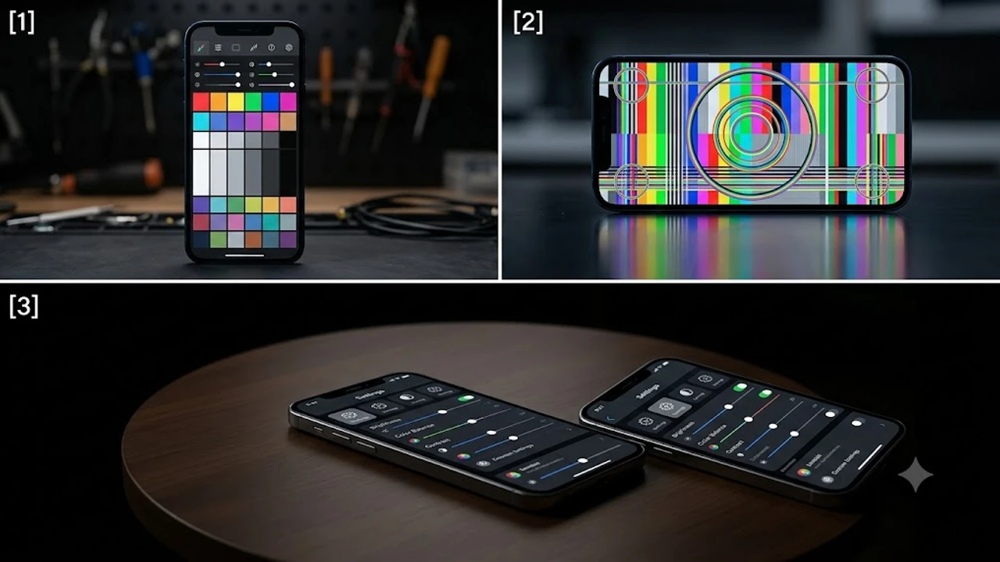

최근 하반기 스마트폰 시장을 뒤흔들고 있는 **갤럭시 S26 붉은 화면** 이슈가 뜨거운 감자로 떠올랐습니다. 대규모 프로모션과 생산량 증산으로 역대급 흥행을 기록하던 중, 디스플레이 품질과 관련된 '붉은 한지 현상' 제보가 잇따르며 초기 구매자들의 우려가 커지는 상황입니다. 아몰레드(AMOLED) 액정 불량 여부를 확인하고 올바른 대처법을 마련하는 것이 그 어느 때보다 필요한 시점입니다.

## 갤럭시 S26 디스플레이 불량 논란의 서막

### 국내외 커뮤니티를 달군 '붉은 한지 현상' 제보
주요 테크 커뮤니티와 해외 레딧을 중심으로 갤럭시 S26 울트라 모델의 화면이 비정상적으로 붉게 표현된다는 불만이 동시다발적으로 접수되었습니다. 특히 어두운 침실이나 조명이 제한된 환경에서 화면 밝기를 10% 이하로 낮추었을 때, 회색 바탕화면이 얼룩덜룩한 붉은색이나 보라색으로 물드는 증상이 집중적으로 보고되었습니다. 소비자들은 수백만 원을 호가하는 플래그십 스마트폰에서 이 같은 시각적 왜곡이 발생하는 현상에 대해 강한 당혹감을 감추지 못하고 있습니다.

### 뽑기 실패일까, 공정 문제일까?
초기 사용자들 사이에서는 이번 이슈가 단순한 기기 편차인지, 아니면 디스플레이 패널 자체의 공정상 결함인지를 두고 설전이 한창입니다. 특정 주차에 생산된 부품에서만 이 현상이 도드라진다는 주장이 나오면서, 온라인 커뮤니티에서는 자신이 받은 기기의 시리얼 넘버와 제조 연월을 대조하는 인증 글이 줄을 잇고 있습니다. 교환을 요구하는 소비자가 늘어남에 따라 초기 물량의 전반적인 품질 관리(QC) 프로세스에 대한 신뢰도 역시 도마 위에 올랐습니다.

---

## 삼성전자의 긴급 원인 조사와 공식 입장

### 소프트웨어 최적화 vs 하드웨어 결함
삼성전자 개발 부서는 이번 현상이 디스플레이 자체의 물리적 유기재료 결함인지, 혹은 구동 칩(DDI)의 색감 튜닝 소프트웨어 설정 오류인지 파악하기 위해 긴급 정밀 분석을 개시했습니다. 과거에도 새로운 디스플레이 패널이 도입될 때마다 미세한 색감 편차 논란이 있었으며, 상당수 소프트웨어 펌웨어 업데이트를 통해 적색 소자의 출력을 제어하는 방식으로 해결된 바 있습니다. 다만 이번에는 특정 영역에만 얼룩이 지는 '한지 형태'로 나타나 하드웨어 패널 자체의 균일도 문제일 가능성도 배제할 수 없습니다.

### 서비스센터 엔지니어들의 현장 판정 기준
현재 공식 서비스센터를 방문한 소비자들의 후기를 분석해 보면, 현장 엔지니어별로 불량 판정을 내리는 기준이 제각각이어서 혼선이 가중되는 모양새입니다. 육안상 명확히 붉은빛이 도는데도 센터의 측정 장비 기준치를 넘지 않았다며 불량 판정서 발급을 거부당한 사례가 있는 반면, 즉시 신품 교환 처리를 받은 사례도 있습니다. 가이드라인이 명확히 정비되기 전까지는 소비자가 직접 불량 증상을 동영상이나 사진으로 명확히 채록하여 방문하는 것이 유리합니다.

---

## 내 폰은 안전할까? 3분 자가 진단 및 임시 해결책

### 불량 유무를 확인하는 디스플레이 테스트 방법
기기의 이상 여부를 확실하게 감별하기 위해서는 암실 환경에서 테스트를 진행해야 합니다. 구글 플레이스토어 등에서 '디스플레이 테스트' 앱을 내려받거나 저조도용 회색(Hex code: #212121 혹은 #303030) 이미지를 전체 화면으로 띄운 뒤, 화면 밝기를 5%에서 15% 사이로 조절하며 관찰합니다. 

> **체크포인트:** 화면의 좌우측 가장자리, 혹은 특정 중앙 부위가 주변부보다 확연하게 붉거나 보라색 음영이 지는 얼룩(Grid pattern)이 육안으로 관찰된다면 패널 균일도 저하 증상을 의심해야 합니다.

### 디스플레이 색상 최적화 임시 조치법
제조사의 공식 수정 패치가 나오기 전까지 화면 피로도를 줄일 수 있는 임시 세팅 노하우가 존재합니다. 기기 설정의 '디스플레이' 메뉴로 이동하여 '화면 모드'를 선택한 뒤, 기본 설정된 '선명한 화면' 대신 '자연스러운 화면'으로 변경하면 적색 소자의 과도한 강조를 완화할 수 있습니다. 

* **고급 설정 활용:** 선명한 화면 모드 하단의 고급 설정을 열어 적색(R) 슬라이더를 왼쪽으로 1~2단계 수동 조절합니다.
* **시력 보호 기능:** '편안하게 화면 보기' 기능을 활성화하고 색온도를 중간 값으로 맞추면 야간 시간대 붉은 얼룩이 주는 시각적 자극이 줄어듭니다.

새로운 스마트폰을 구매한 뒤 쾌적한 디지털 환경을 구축하고 싶다면 초고속 무선 네트워크 환경을 보장하는 최신 공유기 정보나 여행용 고출력 충전기 선택법을 함께 확인하는 것도 좋은 방법입니다. 예컨대 [Wi-Fi 8 공유기 진짜 살까? 2026 차세대 네트워크 완전 정리](/posts/it-devices/wifi-8-next-gen-router-trend-2026/) 글이나 [GaN 충전기, 2026년 진짜 사야 할 숨은 꿀템 3선](/posts/it-devices/supertiny-gan-charger-travel-tech-2026/) 내용을 참고하면 최신 스마트 디바이스의 성능을 온전히 이끌어내는 데 큰 도움을 얻을 수 있습니다.

---

## S26 예비 구매자를 위한 구매 가이드 및 향후 전망

### 생산량 50% 증산이 독이 되었나?
이번 품질 이슈의 배경에는 무리한 초기 생산 물량 확대가 자리 잡고 있다는 지적이 업계 전문가들 사이에서 나옵니다. 삼성이 7월 한 달간 생산 목표를 기존 계획 대비 50% 이상 공격적으로 상향 조정하면서, 협력사들의 패널 전수 검사 과정에서 미세한 오차를 걸러내지 못했을 개연성이 높습니다. 안정적인 품질을 원하고 리스크를 피하고 싶은 소비자라면 공정이 본궤도에 오르고 안정화가 이루어지는 다음 생산 주차 물량(대략 8월 이후 출하분)을 노리는 것이 현명한 선택입니다.

### 교환/환불 규정과 향후 업데이트 일정 예측
소비자분쟁해결기준에 의거하여 스마트폰은 개통 후 14일 이내에 기능상 하자가 발견될 경우 서비스센터의 불량 판정서를 첨부해 구매처에서 교환이나 환불을 받을 수 있습니다. 현재 삼성 내부적으로도 사안의 심각성을 인지하고 있는 만큼, 다음 주 초반에 색감 제어 알고리즘을 보완한 긴급 소프트웨어 업데이트를 배포할 확률이 지배적입니다. 만약 14일 이내의 초기 구매자인데 임시 조치나 소프트웨어 패치 이후에도 화면 왜곡이 지속된다면, 기간이 만료되기 전에 신속히 공식 서비스센터를 찾아 엔지니어의 판정을 받아두는 편이 권장됩니다.

#갤럭시S26 #갤럭시S26불량 #갤럭시S26붉은화면 #한지현상 #액정불량 #삼성서비스센터 #갤럭시S26울트라 #디스플레이테스트