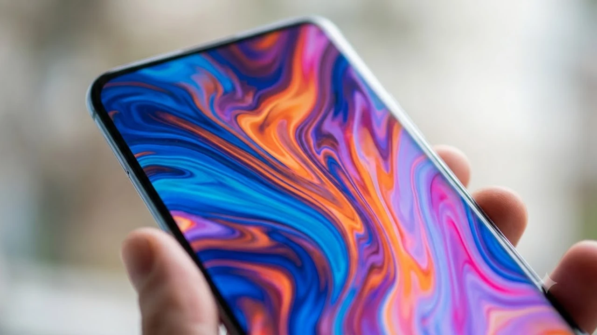

2026년 10월 6일 삼성전자가 신형 모바일 위치 추적기 **갤럭시 스마트태그3**를 발표하면서 테크 씬의 시선이 쏠리고 있다. 이번 모델은 갤럭시 중심의 폐쇄망 울타리를 걷어내고 공식적으로 **스마트태그3 아이폰** 연동 경로를 열어두면서 애플 에어태그(AirTag) 진영을 정조준했다. 위치 트래커 구매를 앞두고 두 기기 사이에서 갈등 중인 사용자라면, 실제로 손에 쥐었을 때 체감되는 지원 범위와 제약 사항을 빈틈없이 따져볼 필요가 있다.

## 갤럭시 스마트태그3 전격 출시와 iOS 연동의 진실

### 2026년 10월 6일 공식 발표 핵심 스펙 요약
삼성전자가 오늘 오전 발표한 스마트태그3는 폼팩터 압축과 전력 효율 극대화에 초점을 맞췄다.

- **출고가**: 44,000원 (전작과 동일한 수준 책정)
- **크기 및 무게**: 부피 35% 감소, 본체 중량 33% 경량화
- **배터리 수명**: 일반 구동 기준 최대 790일 (절전 모드 적용 시 900일 돌파)
- **내구성**: IP68 방수방진 기본 탑재
- **무선 규격**: BLE 5.4 및 차세대 UWB 칩셋 통합

국내 시장 정식 배송은 10월 7일부터 순차 개시되며, 소형 파우치나 반려견 하네스에 결착하기 편한 물방울형 슬림 바디를 갖췄다.

### 아이폰(iOS) 지원 범위: 에어태그를 완벽히 대체할 수 있을까?
소비자들이 가장 궁금해하는 핵심은 과연 아이폰에서 에어태그처럼 매끄럽게 굴러가느냐다. 단도직입적으로 확인하자면 **애플 앱스토어의 SmartThings 앱을 거쳐 기기 등록과 지도상 위치 추적이 정상 구동**된다.

> "아이폰 사용자는 SmartThings iOS 최신 빌드(v1.7.15 이상)를 통해 스마트태그3를 독립 등록하고, 지도 화면에서 실시간 핑(Ping) 위치를 확인할 수 있다."

다만 100% 에어태그 대체재로 보기는 어렵다. 아이폰 내부 U1·U2 칩과 삼성 UWB 프로토콜이 직접 통신하지 못하므로 카메라 화면에 증강현실 화살표를 띄워 센티미터 단위로 찾아가는 '정밀 탐색(Precision Finding)' 뷰는 켜지지 않는다. 어디까지나 지도 위 핀포인트와 신호음 발생에 의존하는 구조다.

### 스마트싱스 파인드 vs 애플 나의 찾기 네트워크 비교
위치 추적기의 생명줄은 주변을 오가는 스마트폰 단말기들의 신호 중계망이다.

- **애플 나의 찾기(Find My)**: 규제 완화 이후 국내 서비스가 개방되었으나, 지역별 기기 보급 편차로 인해 외곽 지역이나 실내 지하 공간에서 신호 갱신이 간헐적으로 지연된다.
- **스마트싱스 파인드(SmartThings Find)**: 국내 스마트폰 시장의 70% 안팎을 점유한 방대한 갤럭시 단말기가 거대한 감지 그물망 역할을 맡는다. 

지하 주차장 깊숙한 구석이나 상가 비상계단 같은 통신 음영 지대에서도 근처를 지나친 갤럭시 사용자의 신호를 타고 서버로 좌표가 빠르게 갱신된다.

## 전작 대비 무엇이 달라졌나? 체감 업그레이드 포인트

### 35% 줄어든 부피와 가벼워진 휴대성 체감
스마트태그2에서 불만을 샀던 길쭉한 타원형 프레임은 열쇠고리에 걸었을 때 주머니를 찌르는 이질감이 컸다. 이번 3세대는 중앙 고리 크기를 살리면서도 테두리 베젤을 얇게 깎아냈다.

본체 두께가 6.2mm로 얇아져 얇은 카드지갑이나 여권 케이스 내피에 찔러 넣어도 배가 불룩 튀어나오지 않는다. 3kg 안팎의 소형견 목줄에 걸어두어도 아래로 축 늘어지지 않아 일상적인 산책 부담을 덜어준다.

### 최대 790일 배터리 수명과 저전력 기술의 비밀
스마트태그3는 CR2032 규격 코인 전지 하나로 꼬박 2년 이상 버틴다. 가속도 센서와 통신 모듈 간 동기화 효율을 끌어올려 움직임이 멈춘 상태에서는 불필요한 비콘 발송 주기를 늘려 전력을 아끼는 설계를 입혔다.

매년 전지를 교체해야 했던 에어태그와 비교하면 유지보수 번거로움이 사실상 절반 이하로 줄어든 셈이다. 바이크 프레임 안쪽이나 여행용 하드 캐리어 지퍼 안감처럼 분해가 까다로운 위치에 숨겨둘 때 든든한 강점이다. 모바일 기기를 챙겨 이동하는 환경이 잦다면 [GaN 충전기, 2026년 진짜 사야 할 숨은 꿀템 3선](/posts/it-devices/supertiny-gan-charger-travel-tech-2026/)을 참고해 장비 전력 체계를 묶어두는 것도 실용적인 접근이다.

### UWB 정밀 탐색 거리 및 방향 인식 성능 향상
새로 얹은 2세대 저전력 UWB 칩셋은 벽면 투과 성능을 끌어올렸다. 석고보드와 콘크리트 벽이 겹친 실내 구조에서도 감쇄 현상을 줄여 유효 수신 거리를 전작 대비 15미터가량 넓혔다. 가구 틈새나 두꺼운 외투 주머니 속에 기기가 숨어 있어도 전작보다 굵직한 데시벨로 신호음을 뿜어내 쉽게 찾아낼 수 있다.

## 아이폰 유저 관점에서 본 스마트태그3 장단점 분석

### 에어태그보다 매력적인 가격과 범용 호환성
에어태그 정가(단품 45,000원 선)와 비교했을 때 본체 자체 가격은 엇비슷하지만 부대비용에서 뚜렷한 격차가 벌어진다.

* **추가 액세서리 지출 제로**: 몸체에 펀칭 홀이 뚫려 있어 2~3만 원대 정품 키링 케이스를 강제로 살 필요가 없다.
* **가족 간 단말 크로스 공유**: 부모는 갤럭시, 자녀는 아이폰을 쓰는 교차 가구에서도 단일 계정 기반으로 추적 권한을 묶을 수 있다.

외부 하우징 역시 유광 스테인리스 대신 스크래치에 강한 무광 강화 플라스틱을 둘러 케이스 없이 생기기로 거칠게 다루기에 제격이다.

### iOS 생태계에서 겪는 기능 제한과 숨은 단점
아이폰과 묶어 쓸 때 감수해야 할 시스템적 장벽도 만만치 않다.

1. **위젯 및 시리(Siri) 연동 단절**: 아이폰 잠금화면 위젯에서 즉각 배터리 게이지를 볼 수 없고, 시리를 불러 소리를 울리게 하는 음성 조작이 막혀 있다.
2. **백그라운드 푸시 지연**: iOS 특유의 서드파티 앱 백그라운드 억제 성향 때문에 앱을 완전히 종료해 두면 분실물 이탈 알림이 1~2분씩 늦게 뜬다.
3. **태그 물리 버튼 제어 제한**: 스마트태그 가운데 버튼을 딸깍 눌러 내 스마트폰을 울리거나 집 안 조명을 끄는 루틴 명령을 iOS 단말기에서는 쓸 수 없다.

### 반려동물 및 귀중품 추적 시 실질적 활용도 평가
야외 분실이나 반려견 실종 대응 측면에서는 에어태그보다 스마트태그3가 체감상 든든하다. 국내 길거리에서 마주치는 스마트폰 열 대 중 대다수가 갤럭시인 현실 덕분이다.

에어태그 신호를 받아줄 아이폰이 뜸한 한적한 주택가 골목이나 둘레길에서도 주변 갤럭시 기기를 통해 위치 핑이 찍힐 확률이 훨씬 높다. 액정 위 3D 화살표를 포기하더라도, 지도 위 위치 갱신 빈도 자체를 우선하는 사용자라면 충분히 납득할 만한 등가교환이다.

## 스마트태그3 아이폰 연동 설정법 및 구매 가이드

### SmartThings 앱을 통한 아이폰 초기 페어링 3단계
복잡한 수동 등록 절차 없이 간결하게 페어링을 마칠 수 있다.

- **1단계**: 애플 앱스토어에서 `SmartThings` 앱을 최신 버전으로 판올림한 뒤 삼성 계정으로 로그인한다.
- **2단계**: 스마트태그3 본체 한가운데 버튼을 한 번 딸깍 누르면 차임벨 소리와 함께 등록 대기 상태로 바뀐다.
- **3단계**: 앱 우측 상단 '+' 아이콘을 눌러 [기기 추가] → [태그/트래커] 목록을 누르면 화면에 검색된 기기가 곧바로 나타난다.

초기 기동 시 약 2~3분간 펌웨어 패치가 진행되므로 스마트폰 화면을 끄지 않고 태그 곁에 두어야 중간 연결 끊김을 방지한다.

### 분실 모드 활성화 및 위치 공유 필수 세팅 팁
기기 연동 직후 아이폰 설정 창에서 백그라운드 권한을 반드시 손봐야 한다.

> **필수 세팅**: 아이폰 [설정] → [SmartThings] 진입 → 위치 접근을 **'항상'**으로 지정하고 **'정확한 위치'** 토글을 켜두어야 앱이 닫힌 상태에서도 위치 누락을 막는다.

이 세팅을 마친 뒤 분실 모드를 켜두면, 습득자가 기기 뒷면에 스마트폰 NFC를 태그하는 순간 사전 지정한 비상 연락처와 반환 안내 문구가 사파리 브라우저 화면에 즉시 뜬다.

### 지금 구매해야 할 사람 vs 에어태그를 유지해야 할 사람
현재 들고 있는 스마트폰 구성과 사용 패턴에 따라 명확하게 갈린다.

- **스마트태그3가 유리한 사람**: 국내 아파트 단지 및 도심 위주로 생활하는 유저, 집 안에 갤럭시와 아이폰이 섞여 있는 가구, 별도 케이스 구매 비용을 아끼고 싶은 실속파
- **에어태그를 유지해야 할 사람**: 아이폰 단일 생태계에 묶여 카메라 기반 초근접 방향 지시 화살표가 필수인 유저, 애플워치와 시리를 활용한 음성 호출을 매일 쓰는 헤비 유저

본인의 주력 단말기 생태계와 분실 방지 목적에 맞춰 기기 규격을 면밀히 확인한 뒤 결정하는 것이 좋다.

[관련 스마트 주변기기 및 IT 장비 쿠팡에서 보기](https://www.coupang.com/np/search?q=%EC%8A%A4%EB%A7%88%ED%8A%B8%ED%83%9C%EA%B7%B8%20%EC%97%90%EC%96%B4%ED%83%9C%EA%B7%B8%20%EC%95%A1%EC%84%B8%EC%84%9C%EB%A6%AC&sourceType=affiliate&trackingCode=AF8691300)

#갤럭시스마트태그3 #스마트태그3아이폰 #스마트태그3출시일 #스마트태그에어태그비교 #스마트싱스파인드 #위치추적기추천 #아이폰스마트싱스 #반려동물위치추적