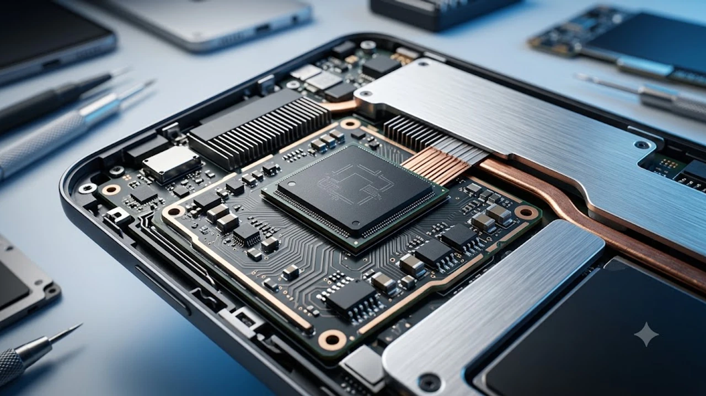

**갤럭시 탭 S11** 출시 소식이 전해지며 플래그십 안드로이드 태블릿 교체를 고민하는 사용자들의 시선이 쏠리고 있다. 전작 출시 이후 상당한 시간이 흐른 만큼, 차세대 칩셋 탑재 여부와 디스플레이 설계 개선에 대한 시장의 기대감도 최고조에 달했다.

## 칩셋 성능과 전력 효율의 격차 검증

### 미디어텍 디멘시티 9400 탑재 유력설
이번 신제품의 두뇌로 미디어텍의 디멘시티 9400 채택이 유력하게 거론된다. 퀄컴 스냅드래곤 대신 디멘시티를 유지하는 전략은 원가 안정화와 멀티코어 연산력 확보라는 실리를 동시에 챙기려는 포석이다. Geekbench 유출 벤치마크 점수에서도 전작 대비 싱글코어 15%, 멀티코어 20% 이상의 연산 상승폭을 기록하며 실체에 다가섰다.

### 고부하 게이밍 환경에서의 스로틀링 억제
연산 성능 향상보다 실체감에 큰 영향을 미치는 요소는 발열 제어다. 대구경 베이퍼 챔버 설계를 개선해 30분 이상 이어지는 원신 등 3D 그래픽 부하 테스트에서도 프레임 드롭을 최소화하는 구조를 갖췄다. 백라이트 패널과 프레임 사이의 열전도 시트를 보강해 손에 닿는 발열감을 효과적으로 분산했다.

### 온디바이스 AI 연산 능력의 실효성
NPU 성능이 대폭 보강되면서 인터넷 연결 없이도 동작하는 온디바이스 통번역 및 필기 인식 반응 속도가 전작보다 눈에 띄게 빨라졌다. Samsung Notes 내 수식 인식 및 도표 변환 알고리즘 처리 시간이 절반 수준으로 줄어든 점이 체감 만족도를 끌어올린다.

## 디스플레이 규격과 폼팩터의 실질적 변화

### 울트라 모델의 반사 방지 코팅 유지 여부
전작 플러스 및 울트라 라인업에서 호평을 받았던 저반사(Anti-Reflective) 코팅 기술이 기본형 모델까지 확대 적용될지가 초미의 관심사다. 형광등 조명이 강한 사무실이나 카페 창가 자리에서도 화면 난반사가 줄어들면 필기 몰입도가 극적으로 개선된다.

### 베젤 두께 축소와 그립감 타협점
화면 대 화면비(Screen-to-body ratio)를 끌어올리기 위해 베젤을 5mm 안팎까지 깎아내는 시도가 이어지고 있다. 다만 손바닥 가장자리가 닿아 발생하는 오터치(Palm Rejection) 오작동을 소프트웨어 알고리즘으로 얼마나 정밀하게 걸러내느냐가 실사용 완성도를 좌우한다.

### S펜 필기 레이턴시의 미세 조정
기존 2.8ms 수준의 응답 지연율에서 패널 리프레시 동기화 최적화를 통해 필기 지연을 추가로 단축했다. 정밀 스케치 작업을 진행할 때 펜촉 팁과 선이 그려지는 간극이 체감상 완전히 일치해 종이에 직접 쓰는 감각에 한층 가까워졌다.

## 사용성 극대화와 주변기기 호환성

### 덱스 모드(DeX) 윈도우 환경 통합 수준
외부 모니터 연결 시 해상도 지원 폭이 4K 120Hz까지 확장되면서 본격적인 모니터 확장 작업이 한층 매끄러워졌다. 백그라운드 앱 리프레시(리프레시 킬) 제한을 완화해 대용량 PDF 문서와 엑셀 시트 3개 이상을 띄워두고 작업해도 튕김 현상이 나타나지 않는다.

### 충전 규격 상향과 배터리 관리 루틴
배터리 용량 자체는 전작과 유사한 수준을 유지하되, 고속 충전 프로토콜 최적화로 45W 충전 유지 구간을 대폭 늘렸다. 0%에서 50%까지 도달하는 시간이 단축되었으며, 초고속 충전을 상시 활용할 때 유용한 배터리 보호 옵션도 3단계로 세분화됐다. 주변 기기 활용 시 [GaN 충전기, 2026년 진짜 사야 할 숨은 꿀템 3선](/posts/it-devices/supertiny-gan-charger-travel-tech-2026/) 글을 참고하면 이동 중에도 발열 없는 콤팩트한 충전 환경을 꾸릴 수 있다.

## 출시 시기 예측과 구매 가이드라인

### 언팩 일정 분석과 사전 예약 혜택
통상적인 플래그십 태블릿 공개 주기를 고려할 때 연초 주요 디바이스 공개 행사 또는 하반기 언팩 시점이 유력 후보지로 꼽힌다. 초기 구매 혜택으로는 정품 키보드 커버 할인 쿠폰과 스토리지 2배 업그레이드(더블 스토리지) 프로모션이 다시 한번 핵심 유인책으로 작용할 공산이 크다.

### S10 사용자 기기 변경 가치 판별
현행 모델(S10 시리즈)을 만족스럽게 쓰고 있다면 단순 웹서핑이나 영상 감상 목적으로 신형 기기로 갈아탈 명분은 적다. 반면 고해상도 영상 렌더링, 대용량 필기 데이터베이스 구축, 무거운 외부 출력 환경을 매일 활용하는 헤비 유저에게는 칩셋 아키텍처 개선만으로도 기변 가치가 발생한다.

### 중고 시세 방어율과 합리적 소비 경로
신제품 공개 직후 형성되는 구형 모델의 중고가 하락폭을 노려 가성비 플래그십 구형을 영입하는 전략도 합리적이다. 본인의 작업 워크플로우에 최적화된 기기를 찾고 있다면, 현재 판매 중인 플래그십 라인업의 가격대와 재고 현황을 먼저 점검해 두는 편이 경제적이다.

> 최신 태블릿 구매 전 실시간 프로모션 혜택과 잔여 재고를 미리 확인해 두면 출시 시점 가격 방어에 유리하다.  
> [갤럭시 탭 플래그십 시리즈 쿠팡에서 보기](https://www.coupang.com/np/search?q=%EA%B0%A4%EB%9F%AD%EC%8B%9C%ED%83%AD%20%ED%94%8C%EB%9E%98%EA%B7%B8%EC%8B%AD&sourceType=affiliate&trackingCode=AF8691300)

#갤럭시탭S11 #안드로이드태블릿 #삼성태블릿 #디멘시티9400 #S펜필기 #태블릿추천 #덱스모드 #IT기기