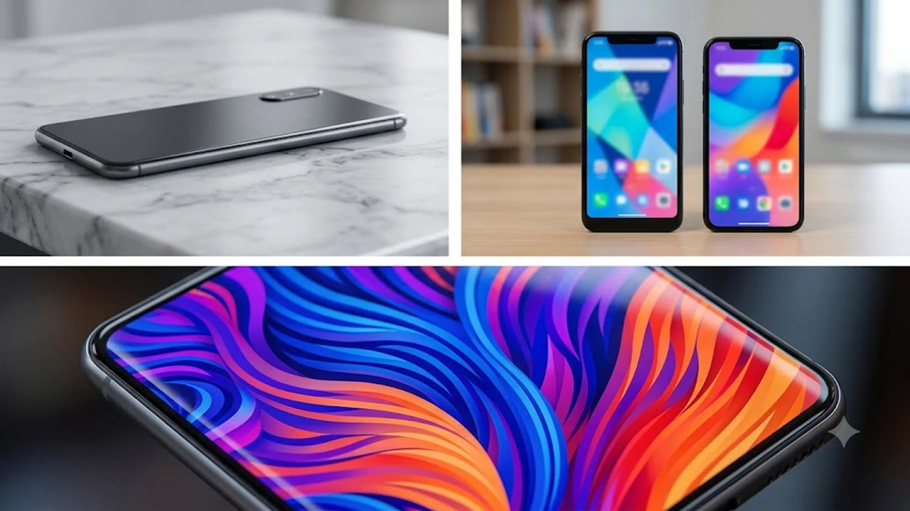

2026년 10월 1일 공개된 **갤럭시 탭 S12** 시리즈 출고가가 전작 대비 큰 폭으로 뛰면서 테크 커뮤니티의 계산기가 바쁘게 돌아가고 있습니다. 3나노 2세대 모바일 AP와 온디바이스 AI 하드웨어 설계를 전면에 내세웠으나, 기본형마저 100만 원대 중반에 근접하자 실구매자들 사이에서는 체감 만족도를 둘러싼 눈치싸움이 치열합니다. 가격 인상을 정당화할 만한 하드웨어의 실질적 진화와 기기 교체 타이밍을 냉정하게 짚었습니다.

## 플래그십 태블릿 가격 인상을 이끈 세 가지 원인

### 반도체 미세 공정 전환과 부품 원가 부담
가격 변동 폭이 커진 핵심 배경에는 첨단 반도체 파운드리 생산 비용 상승이 자리 잡고 있습니다. 3나노 미세 공정 수율 비용이 상승 곡선을 그리면서 메인보드 집적 원가 자체가 가파르게 올랐습니다.

- **모바일 AP 단가 인상**: 플래그십 프로세서 웨이퍼당 공급 단가가 전 세대 대비 약 18% 상승
- **고대역폭 LPDDR5X 메모리 탑재**: 기기 내 대규모 AI 모델 처리를 위해 기본 램 용량을 키우며 원가 압박 가중
- **디스플레이 드라이버 IC(DDI) 공급망 비용**: 초박형 베젤 설계와 120Hz 가변 주사율 패널 단가 상승

### 온디바이스 인공지능 NPU 하드웨어 재설계
외부 서버와의 통신 없이 기기 단독으로 도면 수식 연산과 실시간 영상 편집을 끝내는 NPU 모듈이 대폭 커졌습니다. 고출력 연산 칩셋을 집어넣으면서 필연적으로 발열 제어 구조를 다시 짜야 했습니다. 베이퍼 챔버 면적을 전작 대비 30% 넓히고 흑연 방열 시트를 2중으로 보강하는 과정에서 기구물 부품 단가 역시 덩달아 뛰었습니다.

소프트웨어 흉내내기에 그치지 않고 하드웨어 기판부터 완전히 뜯어고친 결과물입니다. 기기 자체 연산 능력에 따른 작업 흐름의 진화는 [텍스트 AI의 한계와 진화](/posts/it-devices/text-based-ai-limits-and-evolution/) 분석에서도 생생히 드러납니다.

### 환율 변동성과 글로벌 부품 물류비 누적
달러 강세 기조가 장기화되면서 국내 출고가 책정 선에 직격탄을 날렸습니다. 해외 파운드리 가공비와 광학 부품 조달 대금이 원화 가치 하락과 맞물려 국내 소비자 체감 가격을 밀어 올렸습니다. 해외 출시 가격 인상분을 통제하더라도 국내 유통가는 환율 방어를 위해 기본형 기준 10만 원 안팎, 울트라 라인업은 15만 원 이상의 가격 조정이 불가피했습니다.

## 하드웨어 스펙 업그레이드 체감 가치 분석

### Dynamic AMOLED 2X와 반사 방지 코팅
디스플레이는 야외 시인성과 장시간 필기 피로도를 낮추는 데 초점을 맞췄습니다. 최대 밝기를 1,750니트까지 끌어올렸으며, 난반사를 줄여주는 저반사 코팅 기술이 기본형부터 플러스, 울트라 전 모델에 균일하게 들어갔습니다.

> **실사용 체감 포인트**: 대낮 카페 창가 자리나 형광등 바로 아래에서도 화면에 주변 조명이 거울처럼 비치지 않아 필기 몰입도가 흐트러지지 않습니다.

### S펜 레이턴시 단축과 필기 엔진 고도화
입력 지연 속도가 2.8ms 수준으로 수렴하면서 종이 노트에 젤펜으로 글씨를 내려쓰는 반응 속도를 손끝에 구현했습니다. 정밀 틸트 인식 각도가 넓어져 스케치 선 두께를 미세하게 조절하기 수월합니다. S펜 내부 전력 관리도 손봐 블루투스 제스처 기능을 켠 채로 작업해도 펜 완충 후 사용 시간이 기존보다 20%가량 늘었습니다.

### 배터리 효율 및 65W 고속 충전 프로토콜 지원
대용량 배터리와 맞물린 65W 고속 충전 규격 덕분에 방전 상태에서 50%까지 차오르는 시간이 30분 안쪽으로 줄었습니다. 대화면 태블릿의 고질적 약점이었던 답답한 충전 속도를 구조적으로 덜어낸 셈입니다. 외근이나 출장이 잦다면 벽돌만 한 번들 어댑터 대신 휴대성 높은 서드파티 어댑터로 파우치를 가볍게 비울 수 있습니다. 크기와 발열을 줄이는 충전기 구성 팁은 [GaN 충전기, 2026년 진짜 사야 할 숨은 꿀템 3선](/posts/it-devices/supertiny-gan-charger-travel-tech-2026/) 글을 참고하면 좋습니다.

## 전작 대비 실성능 향상 폭과 작업 생산성

### 덱스(DeX) 모드 멀티태스킹 확장성
외장 모니터를 연결했을 때 4K 60Hz 해상도를 프레임 드롭 없이 밀어붙이며 최대 3개의 독립 작업 공간을 띄웁니다. 무거운 데이터 시트 2개와 브라우저 탭 10개를 동시에 열어두어도 넉넉해진 RAM 대역폭 덕분에 백그라운드 앱이 강제 종료되지 않습니다.

- **외장 디스플레이 독립 해상도 매핑**: 태블릿 화면 비율에 구애받지 않는 모니터 전용 와이드 뷰 구현
- **단축키 커스텀 최적화**: 윈도우 단축키 배열과 유사하게 손에 익은 매핑 지원
- **파일 드래그 앤 드롭 응답성 개선**: 대용량 이미지 일괄 전송 시 버퍼링 제로화

### 4K 60fps 비디오 렌더링 벤치마크
모바일 영상 편집 툴인 루마퓨전(LumaFusion)과 캡컷(CapCut) 환경에서 진행한 인코딩 테스트 결과, H.265 코덱 기준 10분 길이 4K 60fps 영상 렌더링 시간이 전작 대비 35% 단축되었습니다. 장시간 렌더링 시 발생하는 스로틀링 현상도 억제되어 3회 연속 인코딩 작업에서도 90% 이상의 클럭 유지력을 보여줍니다.

## 사용자 유형별 구매 가이드와 합리적 선택지

### 구형 기기 사용자의 기변 효용성
갤럭시 탭 S7이나 S8 시리즈를 손에 쥐고 있다면 기변을 단행할 명분이 충분합니다. 디스플레이 밝기, S펜 응답 반응, 스피커 음향 분리도, 충전 속도까지 기기 전반에서 격차를 선명하게 체감합니다. 4년 주기로 태블릿을 바꾸는 흐름이라면 인상된 비용을 웃도는 효용을 건질 수 있습니다.

### 전작 보유자의 교체 실익 비교
반면 S10이나 S11 시리즈를 이미 쓰고 있다면 기기 교체에 신중을 기해야 합니다. 웹서핑, OTT 스트리밍 감상, 기본 PDF 교재 필기가 주된 용도라면 전작 역시 넘치는 하드웨어 자원을 갖췄습니다. 중고 매각 대금과 추가 지출액을 냉정하게 따졌을 때 실부담금이 70만 원을 넘어선다면 당장 갈아탈 이유가 약합니다.

### 사전 예약 혜택과 중고 보상 프로그램 활용 팁
초기 출고가 부담을 덜어내려면 사전 예약 기간에 집중되는 카드사 청구 할인과 중고 추가 보상 제도를 적극 공략해야 합니다. 보유 중인 구형 기기의 일반 중고 시세보다 추가 보상가가 최소 10만 원 이상 높게 잡히는 편이므로 공기계를 보유하고 있다면 보상 절차를 밟는 쪽이 지출을 줄이는 지름길입니다.

[갤럭시 탭 S 시리즈 최저가 및 호환 액세서리 쿠팡에서 보기](https://www.coupang.com/np/search?q=%EC%8A%A4%EB%A7%88%ED%8A%B8%EA%B8%B0%EA%B8%B0%20%EB%85%B8%ED%8A%B8%EB%B6%81&sourceType=affiliate&trackingCode=AF8691300)

#갤럭시탭S12 #태블릿PC추천 #삼성플래그십태블릿 #S펜필기 #태블릿가격인상 #덱스모드 #온디바이스AI태블릿 #태블릿스펙비교 #사전예약혜택