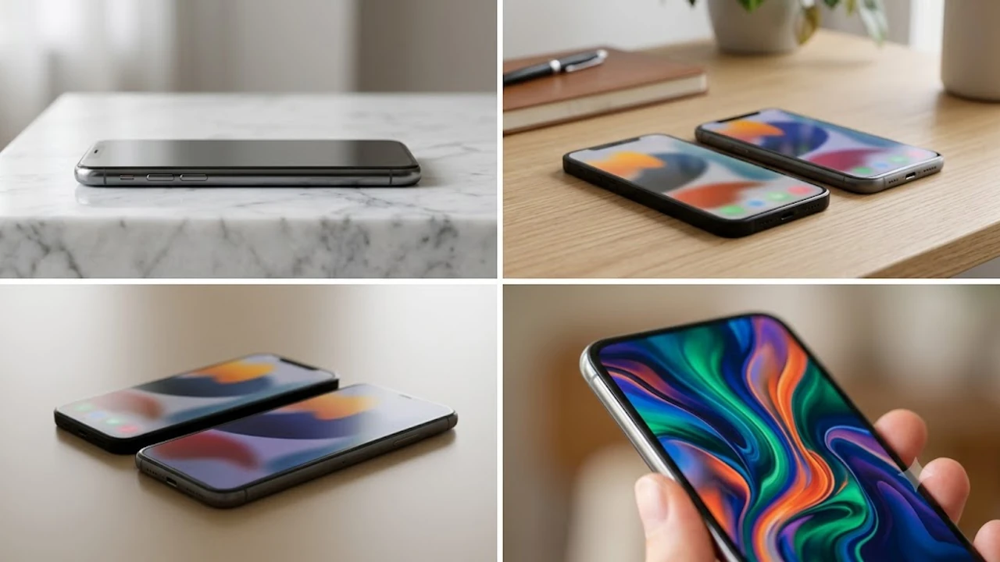

2026년 8월 7일 국내 정식 출시된 삼성전자의 차세대 폴더블폰 **갤럭시Z폴드8 내구성**을 둘러싸고 테크 커뮤니티가 뜨겁게 달아오르고 있습니다. 글로벌 IT 유튜버들의 정밀 가학 테스트 결과가 공개되면서 플렉스 티타늄 신소재 적용 여부와 실제 한계 스펙에 관한 궁금증이 증폭되는 양상입니다. 이번 신제품의 디스플레이 경도 및 힌지 유격 변화를 구체적 데이터로 확인하여 실구매자의 리스크를 최소화할 수 있는 핵심 정보를 정리합니다.

## 정식 출시 직후 불거진 갤럭시 Z 폴드8 내구성 논란의 핵심

### 해외 테크 유튜버 가학 테스트에서 제기된 힌지 변형 이슈
해외 유명 IT 채널에서 진행한 반대 방향 굽힘(Reverse Bending) 테스트 결과, 특정 각도 이상에서 고중량이 가해졌을 때 프레임 미세 변형이 측정되었습니다. 전작보다 얇아진 하우징 두께로 인해 측면 수직 압력 흡수 구조가 변경된 점이 주요 원인으로 지적됩니다. 

### 커버 및 메인 디스플레이 경도 측정 결과 상세
모스 경도계 측정 결과, 메인 폴더블 디스플레이는 모스 수치 2단계에서 미세 긁힘이, 3단계에서 깊은 홈이 파이는 현상이 유지되었습니다. 신형 초박막 강화유리(UTG)가 채택되었으나 표면 보호 필름 레이어의 물리적 한계는 여전히 존재합니다. 반면 외부 커버 글래스는 모스 6단계까지 긁힘 없이 견디는 뛰어난 내구성을 증명했습니다.

### 전작 대비 개선된 부분과 여전히 취약한 물리적 한계
* **개선점:** 프레임 모서리 낙하 충격 시 내부 패널로 전달되는 파손 충격을 15% 이상 분산시키는 신형 감쇄 구조 적용
* **물리적 한계:** 먼지 입자 크기가 100㎛ 이상인 환경에서 지속적인 마찰 발생 시 힌지 내부 가스켓 마모 가능성 존재

## 플렉스 티타늄 소재 적용과 실제 실사용 환경 충격 비교

### 티타늄 프레임 및 신형 힌지 구조의 낙하 내구성 평가
새롭게 적용된 플렉스 티타늄 프레임은 기존 아머 알루미늄 대비 측면 인장 강도가 약 25% 향상되었습니다. 1.2m 높이에서 콘크리트 바닥으로 진행된 낙하 시험에서 외부 프레임에는 미세한 흠집만 남았으며 internal circuit 작동 이상은 관찰되지 않았습니다.

### 일상적 굽힘 작용 및 반대 방향 인장력 내성 테스트
바지 뒷주머니에 기기를 넣고 앉는 상황을 모사한 50kgf 가압 시험에서 하우징 복원력은 합격점을 받았습니다. 단, 완전히 펼친 상태에서 중앙 힌지 축에 직접적인 인장력이 가해지는 가학 시험에서는 일정 수준의 유격 증가가 관찰되었습니다. 초고속 충전 단자나 고출력 서드파티 액세서리 조합 시 발열에 의한 접착제 연화 현상도 체크해야 하므로, 안정적인 전력 공급을 위해 [GaN 충전기, 2026년 진짜 사야 할 숨은 꿀템 3선](/posts/it-devices/supertiny-gan-charger-travel-tech-2026/) 정보를 참고하여 규격에 맞는 충전 환경을 갖추는 것이 안전합니다.

### 먼지·이물질 침투 방지(IP 등급)의 실제 작동 수준
IP48 등급을 획득하여 1mm 이상 크기의 고체 이물질 방수·방진을 보장합니다. 미세한 모래알이나 해변가의 자갈 입자가 힌지 틈새로 침투하는 것은 차단하지만, 미세먼지 수준의 초공극 입자는 완벽히 제어하기 어려우므로 수중 및 먼지 밀집 지역 사용 시 주의를 요합니다.

## 실구매 유저 관점에서의 장단점 및 파손 리스크

### 케이스 미착용 상태에서의 스크래치 발생 가능성
티타늄 아머 마감 코팅 기술로 생활 흠집 저항성은 대폭 향상되었습니다. 다만 후면 카메라 섬 마감 경계면은 날카로운 쇠붙이와 직접 마찰할 경우 코팅 벗겨짐 현상이 관찰되므로 슬림 케이스 장착이 권장됩니다.

### 폴더블 특유의 화면 주름 부위 열화 및 내구성 체감
> "신형 힌지 메커니즘 적용으로 화면 중앙 주름 깊이가 전작 대비 약 18% 감소했으나, 영하 10도 이하 저온 환경에서 장시간 노출 후 갑작스럽게 기기를 펼칠 경우 UTG 경화로 인한 찌걱거림 소음과 자국 발생율이 올라갑니다."

### 초반 파손율 데이터를 통해 본 자급제 대 개통 파손보험 실익
초기 출고 물량 분석 결과, 메인 패널 교체 비용이 전작 대비 약 7% 인상된 것으로 확인됩니다. 따라서 초기 자급제 구매자 및 통신사 개통 유저 모두 파손 보장형 보험 상품 가입이 경제적 손실을 막는 핵심 수단입니다.

## Z 폴드8 구매 전 반드시 알아야 할 안심 케어 및 케어플러스 팁

### 삼성케어플러스 파손 보상 범위 및 자기부담금 변경점
2026년 기준 삼성케어플러스 폴더블 전용 상품은 자기부담금 비율이 일부 조정되었습니다. 패널 단독 수리와 힌지 통합 수리의 수리비 책정이 달라졌으므로, 가입 전 자기부담금 상한선을 확실하게 숙지해야 합니다. 최신 모바일 생태계 및 다양한 차세대 디바이스 동향이 궁금하다면 [IT기기 전체 글 보기](/posts/it-devices/)를 통해 유용한 정보를 추가로 찾아볼 수 있습니다.

### 초기 불량 및 내구성 결함 판정을 위한 서비스센터 방문 가이드
개봉 직후 디스플레이 평평도 측정 및 힌지 펼침 각도(179도~180도 유지 여부)를 서비스 센터 엔지니어를 통해 보증받는 절차가 필요합니다. 구매 후 14일 이내 제기된 힌지 장력 이상은 초기 불량 판정 기준에 포함됩니다.

### 힌지 보호형 케이스 선택 시 필수 체크 리스트 3가지
- **힌지 커버 쿠션 구조 유무:** 낙하 시 힌지 중앙부에 직접적인 충력이 전달되지 않도록 에어쿠션이 설계되었는지 확인합니다.
- **무게 및 두께 증가율:** 힌지 보호용 케이스 장착 시 기기 전체 두께가 15mm를 넘지 않는 슬림형 제품을 선택해야 그립감을 유지합니다.
- **자성 간섭 여부:** 힌지 부근의 강력한 자석 내장 케이스는 내부 S펜 인식 센서 및 캘리브레이션 오작동을 유발할 수 있어 정격 인증 여부를 체크합니다.

#갤럭시Z폴드8 #갤럭시Z폴드8내구성 #폴더블폰내구성 #폴드8힌지결함 #삼성케어플러스 #Z폴드8스크래치 #티타늄프레임 #폴더블폰파손보험 #IT기기이슈 #폴드8테스트