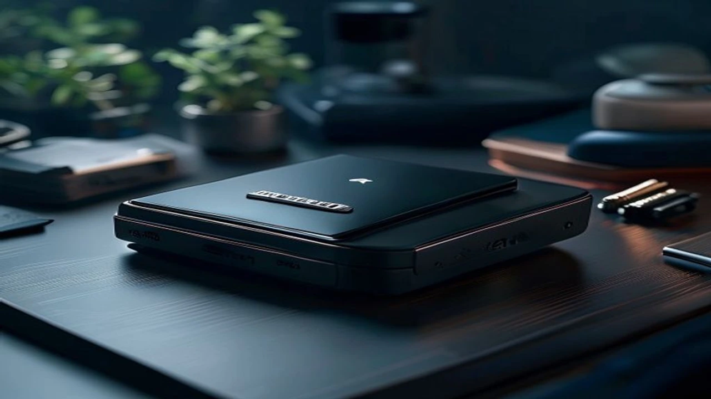
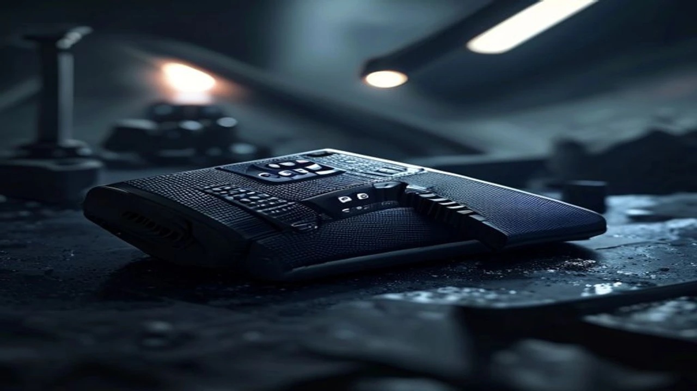

2026년 7월 영국 런던 언팩 현장에서 **갤럭시 Z 폴드8 울트라**가 마침내 공개됐습니다. 바형 플래그십 기기를 위협하는 파격적인 체급 감량과 카메라 스펙 업그레이드로 테크 커뮤니티가 뜨겁게 달아올랐습니다. 사전예약 창이 열리기 전, 주머니를 털어 실구매로 이어질 가치가 명확한지 핵심 변경점을 날카롭게 짚어봤습니다.

## 갤럭시 Z 폴드8 울트라 최초 등장과 주요 변화

### 두께 4.1mm 구현과 초슬림 디스플레이 기술
기기를 펼쳤을 때 두께는 겨우 **4.1mm**, 접었을 때도 **9.9mm**에 불과합니다. 바형 스마트폰인 갤럭시 S26 울트라와 비교해도 주머니에 넣었을 때 이질감이 없는 수준입니다. 
무게를 **215g**까지 다이어트한 비결은 차세대 울트라 슬림 글래스(UTG) 패널과 항공 소재급 탄소 섬유 프레임 결합에 있습니다. 생폰 상태로 쥐었을 때의 그립감은 역대 폴더블 중 단연 최고 수준입니다.

### 2억 화소 카메라 탑재 및 힌지 구조 개선
그간 폴더블 유저들의 숙원이던 카메라 성능 잔혹사가 마침내 끝났습니다.
* **메인 카메라:** 바형 최상위 모델과 동일한 2억 화소 센서
* **망원 카메라:** 5000만 화소 5배 광학 줌
* **개선된 물방울 힌지:** 중앙 주름 접힘 폭을 전작 대비 **40% 이상 완화**

### 기본형 폴드8 및 기존 폴더블 시리즈와의 라인업 차이
삼성전자는 이번에 폴더블 라인업을 기본형과 울트라 투트랙으로 전격 재편했습니다. 
출시설이 무성하던 보급형 FE 라인업은 최종 백지화됐으며, 울트라라는 단일 하이엔드 기종에 기술력을 모아 프리미엄 시장을 정조준하겠다는 계산이 깔려 있습니다.

## 전작 대비 핵심 스펙 비교와 실제 성능 체감

### 스냅드래곤 8 Elite Gen5 프로세서 성능 및 발열 관리
두뇌 역할을 맡은 **Snapdragon 8 Elite Gen5**는 긱벤치 6 멀티코어 10,000점을 가볍게 상회합니다. 
> 기기 내부의 초슬림 베이퍼 챔버 면적을 전작 대비 **1.8배** 확충해 고사양 3D 게임인 원신이나 4K 영상 레더링 작업 중에도 스로틀링 없이 안정적인 프레임을 유지합니다.

### 배터리 용량 효율과 실사용 시간 테스트 결과
두께는 비약적으로 얇아졌으나 실리콘-탄소 음극재 기술을 접목해 **5,000mAh** 용량을 방어했습니다. 신형 AP의 전력 효율 개선 덕분에 화면 켜짐 시간 기준 14시간 이상의 실사용 스크린 타임을 뽑아냅니다.

### S펜 내장 여부와 화면 주름 개선 수준 비교
* **S펜 탑재 방식:** 4.1mm 두께 한계상 내장 슬롯은 여전히 빠졌으며 전용 케이스 외장 방식을 취합니다.
* **주름 체감:** 화면 중앙을 손가락으로 문지르면 확연히 완만해진 경사를 느낄 수 있고, 실내 조명 반사로 인한 눈엣가시 현상도 눈에 띄게 줄었습니다.

초고속 차세대 무선 네트워크 원천 기술이 궁금하다면 [Wi-Fi 8 공유기 진짜 살까? 2026 차세대 네트워크 완전 정리](/posts/it-devices/wifi-8-next-gen-router-trend-2026/) 포스팅에서 자세히 확인할 수 있습니다.

## 사전예약 시 꼭 알아야 할 장점과 단점

### 역대급 두께와 압도적 카메라 스펙이 주는 확실한 이점
- **무게 부담 탈출:** 215g 가벼움 덕에 장시간 누워서 유튜브나 웹툰을 봐도 새끼손가락 통증이 덜합니다.
- **주간/야간 정밀 촬영:** 2억 화소 센서의 픽셀 바이닝 덕분에 어두운 야경 속에서도 노이즈 없는 또렷한 결과물을 건집니다.
- **야외 반사광 차단:** 빛 반사 방지(AR) 코팅이 적용되어 강렬한 한여름 햇빛 아래서도 화면이 선명하게 눈에 들어옵니다.

### 출고가 인상 및 보급형 'FE' 라인업 부재로 인한 부담감
- **체감 체급 가격:** 울트라 칭호가 붙은 만큼 기본 256GB 출고가가 250만 원선에 육박해 선뜻 지갑을 열기 부담스럽습니다.
- **입문용 선택지 소멸:** 가성비 FE 모델 출시가 무산되면서 폴더블 기기에 입문하려는 라이트 유저의 진입 장벽이 대폭 높아졌습니다.

### 실사용자 입장에서 본 실용적인 구매 추천 대상
- 대화면 태블릿 태스크와 최상급 카메라를 단 하나의 기기로 해결하려는 헤비 유저
- Z 폴드4 이전 구형 기기를 수년째 유지하며 무게 때문에 기변을 참아온 유저

## 갤럭시 Z 폴드8 울트라 구매 가이드 및 사전예약 팁

### 자급제 구매와 통신사 공시지원금 혜택 조건 비교
초기 쌩돈 지출을 줄이려면 카드사 혜택(7~10% 즉시 할인)과 무이자 할부를 조합한 **자급제 모델**이 유리합니다. 알뜰폰 요금제를 결합해 고정 통신비를 대폭 깎는 방식이 정석입니다. 반면 11만 원대 이상 고가 요금제를 줄곧 써온 유저라면 통신사 추가 지원금 액수를 비교한 뒤 정하는 편이 낫습니다.

### 중고 보상 프로그램(트레이드인) 최대 활용 전략
구형 폴더블이나 갤럭시 S 시리즈를 보유 중이라면 정가보다 중고가를 넉넉히 얹어주는 **삼성 트레이드인** 이벤트를 무조건 챙겨야 합니다. S24 울트라나 폴드5 기종을 반납할 경우 기기 변경 체감가가 100만 원대 중후반까지 대폭 낮아집니다.

가벼워진 스마트폰과 함께 들고 다닐 고속 충전 장비 정보는 [GaN 충전기, 2026년 진짜 사야 할 숨은 꿀템 3선](/posts/it-devices/supertiny-gan-charger-travel-tech-2026/) 글에 상세히 정리되어 있습니다.

### 사전예약 사은품 혜택 및 최적의 구매 시점 제안
> 사전예약 기간(7월 28일~8월 3일)에 신청해야 **더블 스토리지(256GB 가격에 512GB 획득)**와 **삼성케어+ 파손보장형 1년권**을 챙길 수 있습니다. 초기 자급제 카드 할인과 더블 스토리지 혜택이 겹치는 사전예약 첫날이 가장 저렴하게 살 수 있는 골든타임입니다.

#갤럭시Z폴드8울트라 #갤럭시언팩2026 #폴더블폰추천 #갤럭시Z폴드8스펙 #Z폴드8사전예약 #삼성전자신제품 #자급제스마트폰 #플래그십스마트폰 #스마트폰구매가이드