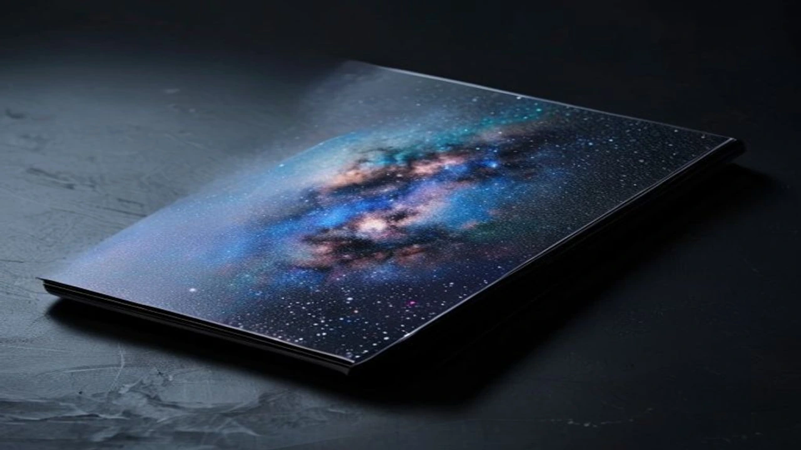
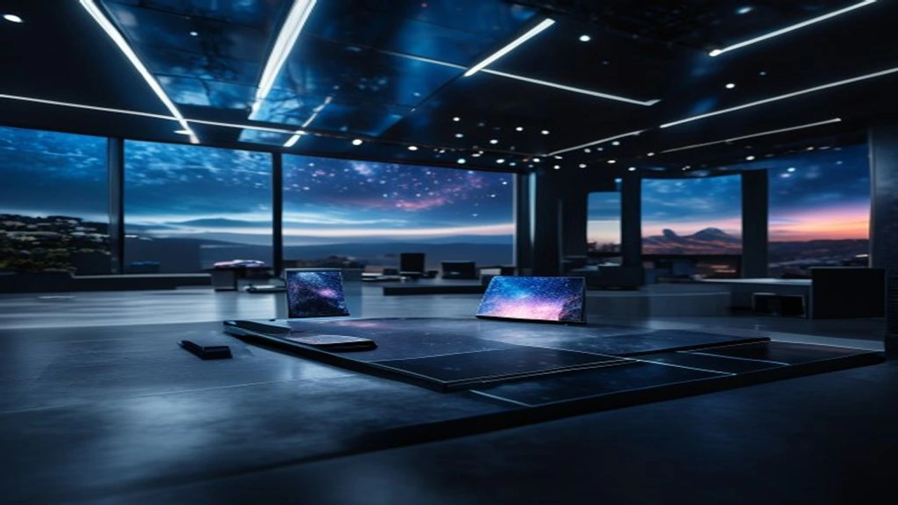

2026년 7월 22일 영국 런던에서 열리는 언팩 행사가 이틀 앞으로 다가오면서 차세대 폴더블폰 **갤럭시Z폴드8**을 둘러싼 실질적인 정보들이 속속 드러나고 있습니다. 화면 비율의 근본적인 개편부터 라인업 다변화, 그리고 과감하게 적용된 온디바이스 AI 기능까지 더해지면서 얼리어답터들과 기존 폴더블 사용자들의 셈법도 바빠졌습니다. 이번 언팩은 단순한 스펙 업그레이드를 넘어 폼팩터의 한계를 깨부수는 분기점이 될 전망입니다.

## 7월 22일 갤럭시 언팩 2026 개요 및 핵심 변경점

### 런던 언팩 개최와 와이드·울트라 이원화 라인업 전략
글로벌 테크의 중심지 영국 런던에서 베일을 벗는 이번 언팩의 핵심은 단연 '선택지의 다변화'입니다. 기존의 단일 폴드 규격을 깨고 화면 폭을 대폭 넓힌 **갤럭시 Z 폴드8 와이드**와 최상위 부품을 집약한 **울트라** 모델로 이원화하는 파격적인 수수표를 던졌습니다.

### 화면비 4대3 적용 와이드 폼팩터 vs 3대2 울트라 스펙 비교
파편화되었던 외관 비율을 실사용 패턴에 맞춰 완전히 새로 그렸습니다. 좁고 답답하다는 지적을 받았던 커버 스크린과 내부 메인 디스플레이가 드디어 제자리를 찾은 모양새입니다.

* **와이드 모델**: 메인 화면에 `4:3` 비율을 적용해 펼쳤을 때 소형 태블릿을 쥐었을 때의 시인성을 그대로 재현했습니다.
* **울트라 모델**: 커버 화면을 `3:2` 비율로 다듬어 제품을 펼치지 않고도 일반 바형 스마트폰처럼 쾌적한 오타 없는 타핑이 가능해졌습니다.

### 퀄컴 스냅드래곤 8 엘리트 5세대 및 배터리 용량 대폭 향상
원가 절감 논란을 잠재우기 위해 퀄컴의 최신 플래그십 AP **스냅드래곤 8 엘리트 5세대**를 전량 배치했습니다. 강력해진 NPU 성능 덕분에 실시간 이미지 생성 및 온디바이스 연산 속도가 전작보다 약 35% 빨라졌습니다. 내부 설계를 치밀하게 다듬어 두께는 더 얇아졌음에도 배터리 용량은 `5,000mAh`까지 끌어올렸습니다. 초고속 충전 시 발열 제어와 전력 효율을 극대화하고 싶다면 미리 [GaN 충전기, 2026년 진짜 사야 할 숨은 꿀템 3선](/posts/it-devices/supertiny-gan-charger-travel-tech-2026/) 관련 가이드를 체크해 두는 편이 유리합니다.

---

## 삼성·구글 첫 협업 디바이스 ‘갤럭시 글라스’ 최초 공개

### 안드로이드 XR 및 제미나이(Gemini) 탑재의 강점과 기대 요소
폴더블폰과 함께 무대에 오르는 또 다른 주인공은 삼성, 구글, 퀄컴 동맹의 결실인 **AI 스마트글라스**입니다. 안드로이드 XR 전용 생태계에 구글의 초지능 AI 제미나이(Gemini)가 깊숙이 이식되었습니다. 눈앞의 해외 시각 자료나 표지판을 0.5초 만에 안경 잔상으로 번역해 주고 도보 시선에 맞춘 3D 길 안내를 띄워주는 기술력이 핵심입니다. 공간 음향과 착용형 디스플레이 트렌드의 변화가 궁금하다면 [2026 차세대 XR 기기 바뀌는 미래 완전 정리](/posts/it-devices/spatial-3d-display-xr-device-2026/) 글에서 깊이 있는 내용을 확인할 수 있습니다.

### 젠틀몬스터·워비파커 협업 디자인과 실착 착용감 한계점
유명 아이웨어 브랜드와의 디자인 협업으로 과거의 투박하고 무거운 고글 형태를 완벽히 털어냈습니다. 모던한 뿔테 안경 느낌을 살려 일상 착용 시 부담감을 대폭 줄였습니다.

> **실측 데이터 기반 실착 한계점** > 고성능 센서와 카메라, 배터리를 안경테 양끝에 배치하면서 무게가 약 `68g` 수준으로 측정되었습니다. 일반 테(20g 내외)와 비교하면 1시간 이상 연속 착용 시 콧등에 전해지는 묵직한 피로감은 여전히 넘어야 할 산입니다.

### 애플 비전프로 및 메타 퀘스트 대비 실생활 경쟁력 분석
머리를 짓눌러 실내에서만 써야 했던 애플 비전프로나 메타 퀘스트와는 지향점 자체가 다릅니다. 가볍게 쓰고 출퇴근길에 오를 수 있는 데일리 안경 폼팩터를 완성했기에 실생활 활용도 면에서는 확실한 우위를 점하고 있습니다.

---

## 사전예약 체감 혜택 및 공시지원금 실측 내역

### 전작(Z폴드7) 대비 출고가 인상폭과 부품 단가 영향
2나노 첨단 공정 AP 탑재와 차세대 경량 힌지 부품이 단가 상승을 부추겼습니다. 결과적으로 소비자가 체감하는 진입 장벽은 소폭 높아졌습니다.

* **기본형(256GB)**: 약 239만 8,000원 선 (전작 대비 약 10만 원 인상)
* **울트라/와이드(512GB)**: 260만 원대 초반 형성 예상

### 자급제 사전예약 할인 혜택 및 중고 보상 프로그램 비교
삼성닷컴과 주요 이커머스 채널의 자급제 사전예약은 **카드사 7~10% 즉시 할인**과 함께 용량을 한 단계 무상으로 올려주는 **더블 스토리지**를 기본 혜택으로 내겁니다. 기존에 쓰던 기기를 반납할 경우 중고 평가 금액에 최대 20만 원을 얹어주는 '민팃 바꿔보상'을 결합하는 것이 지갑을 아끼는 가장 현명한 수순입니다.

### 통신사별 초기 공시지원금 단가 및 조건별 선택약정 유리한점
통신 3사가 책정한 초기 공시지원금은 고가 요금제 기준 `30만~40만 원` 안팎에 머물 것으로 보입니다. 기기 가격 자체가 고가에 형성된 만큼, 공시지원금을 받기보다는 24개월간 월 통신 요금의 25%를 감면받는 **선택약정 할인**을 선택해야 총 지출을 훨씬 크게 줄일 수 있습니다.

---

## 사전예약 직전 실수 없이 신제품 구매하는 완벽 가이드

### 삼성닷컴 및 주요 이커머스 오픈마켓 알림 신청 체크리스트
사전예약 첫날 오픈 직후 5분 안에 수량이 소진되는 현상이 반복되므로 사전 세팅이 필수입니다.

* 삼성닷컴, 쿠팡, 11번가 등 선호 마켓 알림 수신 동의 완료
* 마켓 앱 최신 버전 업데이트 및 사전 로그인 체크
* 생체 인증이 연동된 간편결제 카드 미리 등록

### 라이브 커머스 특가 당일 접속 및 결제 수단 사전 등록법
언팩 직후 밤 12시에 열리는 공식 라이브 커머스 방송에서는 한정판 콜라보 파우치와 전용 단독 사은품이 쏟아집니다. 방송 시작 10분 전 접속해 결제 비밀번호나 생체 인증을 다시 한번 테스트해 두어야 튕김 현상으로 인한 구매 실패를 막을 수 있습니다.

### 기존 폴더블폰 데이터 완벽 백업 및 스마트 스위치 세팅 절차
새 폰을 받기 전 데이터 손실을 막기 위해 아래 순서로 확실하게 백업해 둘 필요가 있습니다.

1. **삼성 클라우드 및 구글 계정**: 카카오톡 대화 백업 및 앱 로컬 데이터 통합 저장
2. **스마트 스위치(Smart Switch)**: 무선 이동보다는 고속 C to C 케이블을 직접 연결하는 직주사 방식을 써야 100GB가 넘는 대용량도 15분 만에 안정적으로 옮겨집니다.

#갤럭시Z폴드8 #갤럭시언팩2026 #Z폴드8사전예약 #갤럭시글라스 #삼성스마트글라스 #폴더블폰추천 #갤럭시Z폴드8울트라 #스냅드래곤8엘리트