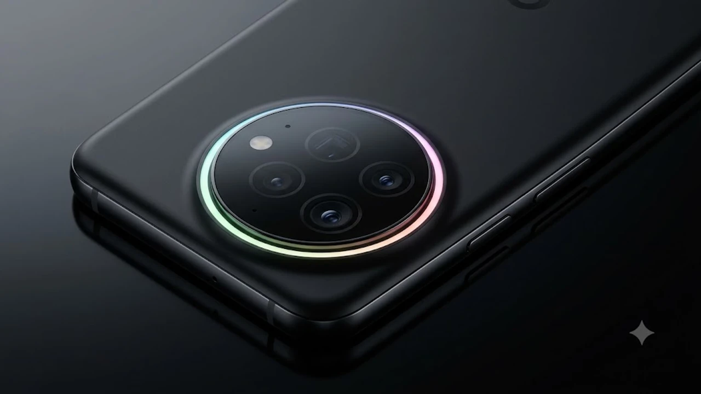

---
title: "구글 픽셀 11 프로 유출, 진짜 사야 할 3가지 이유"
date: 2026-08-09T05:30:00+09:00
slug: google-pixel-11-pro-leak-specs-release-date-2026
tags: ["구글 픽셀 11 프로", "IT기기"]
categories: ["IT기기"]
series: ["IT기기"]
description: "8월 12일 공개를 앞두고 유출된 구글 픽셀 11 프로의 픽셀 글로우, 120배 줌, Tensor G6 칩셋 등 핵심 스펙과 실구매 전 필수 체크 포인트를 정리합니다."
draft: false
cover:
  image: "google-pixel-11-pro-leak-specs-release-date-2026-thumb.webp"
  alt: "구글 픽셀 11 프로 유출 스펙 썸네일"
  hiddenInSingle: true
---

오는 8월 12일 'Made by Google' 행사를 앞두고 최신 플래그십 스마트폰 **구글 픽셀 11 프로**의 마케팅 유출 자료가 대거 공개되며 테크 커뮤니티가 뜨겁게 달아오르고 있습니다. 이번에 드러난 신형 안드로이드 스마트폰 스펙은 온디바이스 AI 성능 극대화와 독특한 외형 변화를 골자로 하여 프리미엄 기기를 기다리던 사용자들의 기대감을 대폭 끌어올렸습니다.

## 공개 D-4, 유출된 구글 픽셀 11 프로 실물 및 마케팅 분석

### '픽셀 글로우' RGB 라이팅과 풀 글래스 카메라이아일랜드 디자인

이번 유출 자료에서 가장 먼저 눈길을 사로잡는 부분은 후면 카메라 바이아일랜드의 파격적인 변화입니다. 기존 바이아일랜드의 금속 프레임을 가다듬어 매끄러운 풀 글래스 재질로 통합했습니다. 

특히 상단 라이팅 테두리에 **'픽셀 글로우(Pixel Glow)'**라 불리는 무드 라이팅 알림 시스템을 새로 넣었습니다. 
- 타이머 동작 시 잔여 시간에 맞춰 빛의 길이가 줄어드는 직관적인 비주얼 타이머 역할을 수행합니다.
- 카메라 촬영 시 셀프 타이머 카운트다운을 시각적으로 연출합니다.
- 야간 촬영 시 피사체에 부담을 주지 않는 보조 조명으로 활용할 수 있습니다.

### TSMC 2nm 기반 Tensor G6 칩셋 및 M90 모뎀 탑재

내부 심장부에는 TSMC의 차세대 2나노(nm) 파운드리 공정으로 전량 위탁 생산되는 **Tensor G6** 칩셋이 자리 잡았습니다. 기존 삼성 파운드리 공정 기반의 이전 세대 칩셋들에서 꾸준히 지적받던 발열 문제와 고부하 지속성 저하를 근본적으로 개선했습니다. 

함께 탑재된 신형 M90 5G 모뎀은 전력 소비량을 기존 대비 22% 절감하면서도 음영 지역에서의 수신율을 크게 올렸습니다. 초고속 무선 네트워크 환경을 원활하게 지원하므로 높은 배터리 효율과 안정적인 테더링 환경을 기대할 수 있습니다. 최신 무선 규격 도입에 맞춰 [Wi-Fi 8 공유기 진짜 살까? 2026 차세대 네트워크 완전 정리](/posts/it-devices/wifi-8-next-gen-router-trend-2026/) 포스팅을 참조해 두면 차세대 기기 네트워크 최적화에 도움이 됩니다.

> **Tensor G6 주요 개선 핵심 수치**
> - CPU 멀티코어 연산 성능: 전작 대비 약 18% 향상
> - NPU 온디바이스 AI 처리 속도: 전작 대비 약 40% 대폭 상승
> - 전력 대 성능비(전성비): 동일 작업 기준 발열 및 전력 소모 약 25% 감소

### 기본 용량 256GB 상향 및 글로벌 출고가 변동 전망

스토리지 옵션에서도 변화가 포착되었습니다. 고용량 AI 모델 저장과 8K 영상 녹화 수요를 반영해 기존 기본 모델이었던 128GB를 폐지하고 **256GB 기본 탑재**로 체질을 개선했습니다. 

다만 최근 메모리 반도체 단가 상승 여파로 인해 출고가 인상이 불가피해졌습니다. 북미 기준 시작 가격은 전작 대비 100달러 인상된 $1,099로 책정될 가능성이 높습니다. 국내 정식 발매가는 환율 변동 폭을 반영할 때 약 150만 원대 중후반 형성이 유력합니다.

## 120배 초망원 카메라와 차세대 제미나이 AI 스펙 비교

### 120배 Super Res Zoom 및 신형 메티스 ISP 화질 개선

카메라 파이프라인의 핵심인 이미지 시그널 프로세서(ISP)가 '메티스(Metis)' 엔진으로 개편되었습니다. 광학 5배 배율 렌즈와 센서 크롭 알고리즘을 조합해 최대 **120배 'Super Res Zoom'**을 구현합니다.

* **초고해상도 복원:** 30배 이상 고배율 생성 시 NPU가 렌즈의 노이즈 패턴을 실시간으로 계산해 명암비를 또렷하게 복원합니다.
* **천체 포토그래피 Pro:** 셔터 스피드를 확보하기 힘든 야간 환경에서 딥러닝 기반 3D 노이즈 감소 기술을 구동하여 궤적 잔상을 선명하게 다듬어 냅니다.

### 온디바이스 제미나이 인텔리전스와 실시간 이미지 처리

인터넷 연결이 끊긴 상태에서도 기기 내부 NPU만으로 작동하는 '제미나이 3.0 나노(Gemini 3.0 Nano)'가 적용됩니다. 이제 텍스트 요약뿐만 아니라 온디바이스 고화질 편집 기능을 네트워크 지연 없이 처리할 수 있습니다.

> **온디바이스 제미나이 핵심 기능 예시**
> 1. **매직 어레이 2.0:** 사진 속 원치 않는 피사체를 지울 때 배경 텍스처를 자연스럽게 재합성
> 2. **실시간 오디오 마술사:** 동영상 녹음 중 주변 바람 소리나 통화 잔음을 트랙별로 분류하여 완전 제거
> 3. **스마트 캡션 오토:** 오프라인 상태에서 촬영 중인 음성을 3개국 이상 언어로 즉시 번역하여 자막 생성

### 전작(픽셀 10 프로) 대비 실질적 렌즈 구성 및 성능 변화

구글은 센서 크기를 무리하게 키우는 대신 광학계 렌즈의 코팅을 바꾸어 빛 번짐(플레어) 현상을 대폭 축소했습니다. 전작인 픽셀 10 프로와 비교해 실질적인 변화를 요약하면 아래와 같습니다.

| 구분 항목 | 픽셀 10 프로 | 픽셀 11 프로 (유출 기준) |
| :--- | :--- | :--- |
| **메인 카메라** | 50MP (f/1.68) | 50MP (f/1.6) 대구경 광학 렌즈 |
| **망원 모듈** | 48MP (광학 5배, 최대 30배) | 48MP (광학 5배, **최대 120배 AI 줌**) |
| **AP 파운드리** | 삼성전자 4nm 공정 | **TSMC 2nm 차세대 공정** |
| **기본 스토리지** | 128GB | **256GB** |
| **외형 시그니처** | 메탈 카메라 바 | **풀 글래스 + '픽셀 글로우' LED** |

## 픽셀 11 프로 실구매 전 확인해야 할 장단점 종합

### TSMC 공정 전환에 따른 전력 효율 및 발열 개선 체감

과거 픽셀 라인업의 고질병으로 꼽히던 **스프클링 발열과 쓰로틀링(성능 제한) 현상이 현저히 완화**될 것으로 파악됩니다. 초기 테스터들이 유출한 벤치마크 기기 테스트에 따르면, 고화질 4K 60fps 렌더링 작업 시 기기 표면 온도가 39.5도 수준에서 안정적으로 유지되었습니다. 이는 고속 충전 환경에서도 빛을 발하는데, 고출력 충전기를 사용할 때 발열로 인한 충전 속도 저하를 최소화합니다. 여행이나 출장이 잦다면 [GaN 충전기, 2026년 진짜 사야 할 숨은 꿀템 3선](/posts/it-devices/supertiny-gan-charger-travel-tech-2026/) 포스팅에서 초소형 충전기 조합을 확인하는 것을 권장합니다.

### 고성능 그래픽 게임 구동 시 타사 플래그십 대비 한계점

다만 순수 GPU 그래픽 연산력 측면에서는 스냅드래곤 8 5세대나 아펠 A19 프로 칩셋 대비 약간의 격차가 존재합니다. 
- 3D 그래픽 부하가 극심한 오픈월드 게임을 원활히 돌리기에는 그래픽 프레임 방어가 다소 아쉬울 수 있습니다.
- 픽셀 시리즈의 정체성은 게이밍보다 **온디바이스 AI, 카메라 소프트웨어 연산, 안드로이드 순정 OS의 쾌적함**에 맞춰져 있습니다.

### 전작 사용자 입장에서의 업그레이드 체감 가치 분석

기존 픽셀 9 이전 세대 모델을 쓰는 사용자라면 이번 11 프로 기변으로 얻는 체감 가치가 상당합니다. 프로세서 제조 공정 자체가 바뀌면서 배터리 타임이 약 25% 이상 대폭 늘어나기 때문입니다. 반면 픽셀 10 프로 사용자는 카메라의 120배 줌이나 픽셀 글로우 외형이 꼭 필요한 경우가 아니라면 한 세대 더 관망하는 전략도 합리적입니다.

## 픽셀 11 프로 사전예약 준비 및 구매 튜토리얼

### 구글 스토어 프로모션 코드 발급 및 사전예약 절차

국내 직구 및 공식 스토어 사전예약을 노리는 경우 아래 단계를 사전에 진행해 두어야 기기 수량 확보가 수월합니다.

1. **구글 스토어 계정 로그인:** 결제 카드 수단(해외 결제 가능 카드) 미리 등록
2. **뉴스레터 수신 동의:** 사전예약 개시 직전 전송되는 $50~$100 상당의 크레딧 프로모션 코드 수령
3. **스토어 주문 결제:** 8월 12일 오피셜 언팩 직후 오픈되는 주문 페이지에서 색상 및 용량 선택 후 결제 진행

### 중고 기기 반납(Trade-in) 보상 프로그램 활용법

구글 스토어는 기기 구매 시 기존에 사용하던 기기를 반납하면 추가 보상금을 주는 'Trade-in' 제도를 운영합니다. 
- 기존 픽셀 시리즈뿐만 아니라 아이폰, 갤럭시 주요 플래그십 기기도 반납 대상에 포함됩니다.
- 사전예약 기간에는 중고 시세보다 약 15~20% 더 높은 특별 보상가가 책정되므로, 보상 판매 신청 항목을 체크해 실구입가를 낮추는 요령이 필요합니다.

### 출시 직후 초기 수령 기기 불량 점검 체크리스트

새 기기를 배송받은 직후라면 다음 항목을 우선하여 점검해야 초기 불량 교환을 신속히 받을 수 있습니다.

> **수령 직후 5분 필수 체크리스트**
> - [ ] **'픽셀 글로우' LED 점검:** 설정 메뉴의 테스트 모드에서 상단 무드등 불빛 단색 및 RGB 발색 정상 여부 확인
> - [ ] **카메라 유격 점검:** 풀 글래스 카메라이아일랜드 단차 및 내부 먼지 유입 유무 확인
> - [ ] **디스플레이 한지 현상:** 암전 상태에서 저밝기 설정 시 화면 얼룩이나 녹조 현상이 나타나는지 테스트
> - [ ] **무선 충전 코일 위치:** Qi2 규격 무선 충전기 밀착 시 정상 충전 인식이 유지되는지 체크

#구글픽셀11프로 #픽셀11프로유출 #TensorG6 #픽셀글로우 #스마트폰추천 #8월IT이슈 #구글언팩2026 #온디바이스AI #안드로이드17 #픽셀11스펙