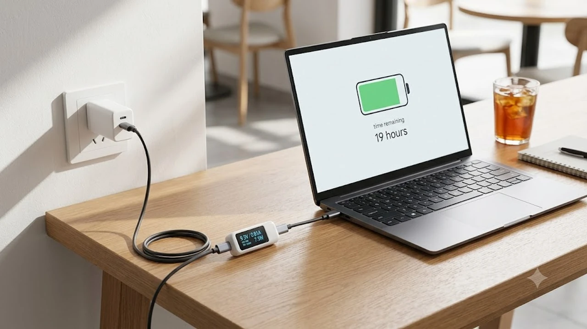

인텔의 차세대 아키텍처가 적용된 **루나레이크 노트북** 실기가 본격적으로 풀리며 전성비와 배터리 수명을 둘러싼 사용자들의 실측 데이터가 연일 화제에 오르고 있습니다. 특히 x86 진영의 고질병이던 유휴 전력 소모를 잡았다는 평가와 함께 인텔 코어 울트라 시리즈2 기반 울트라북들이 퀄컴 스냅드래곤 X 엘리트 탑재 모델들과 직접 맞붙는 양상입니다. 과연 일상 작업과 출장 환경에서 충전기 없는 자유를 보장할 수 있는지 실측 지표를 바탕으로 핵심을 짚어봅니다.

## 루나레이크 탑재 신형 노트북 실측 성능과 발열 제어 수준

### 긱벤치 6 및 시네벤치 싱글·멀티코어 벤치마크 결과
이번 인텔 코어 울트라 7 258V 기반 주요 제조사 시제품의 긱벤치 6 실측 결과를 확인해 보면, 싱글코어 점수는 약 2,750점 안팎을 기록하며 이전 세대인 메테오레이크 대비 눈에 띄는 반응성 개선을 증명합니다. 웹 브라우징 탭 전환이나 앱 초기 실행 속도에서 즉각적인 체감이 오는 수준입니다. 

반면 시네벤치 R23 멀티코어 테스트에서는 하이퍼스레딩이 빠진 8코어(4P+4E) 물리 구조 탓에 약 10,500점 선에 머뭅니다. 고성능 14코어 이상을 탑재했던 전작 H 시리즈 칩셋과 비교하면 순수 렌더링 총점 자체는 다소 보수적이지만, 일상적 멀티태스킹 환경에서는 코어 효율성 덕분에 버벅임이 전혀 느껴지지 않습니다.

### 장시간 고부하 렌더링 시 스로틀링과 클럭 유지력
시네벤치 30분 연속 루프 구동 시 전력 제한(PL1)은 초기 37W 부스트에서 안정화 단계인 17W 부근으로 완만하게 하강합니다. 급격한 클럭 붕괴(스로틀링) 없이 P코어 3.3GHz, E코어 2.8GHz 선을 꾸준히 방어하는 점이 인상적입니다.

패키지 메모리(MoP) 방식으로 LPDDR5X 램을 CPU 다이 위에 직접 올린 덕에 데이터 지연 시간이 대폭 줄었고, 메인보드 전원부 부하 역시 감소해 장시간 무거운 작업을 돌려도 시스템이 급격히 늘어지는 현상이 사라졌습니다.

### 얇아진 섀시 내부 팬 소음 및 하판 표면 발열 체감
두께 1.2cm대의 초슬림 폼팩터 기준으로 일상 웹서핑이나 4K 영상 스트리밍 중에는 팬이 완전히 멈추는 제로팬 상태를 유지합니다. 온도는 40도 초반을 맴돌며 무릎 위에 올려두어도 온기가 거의 없습니다.

풀로드를 20분 이상 지속했을 때 팬 소음은 평균 35~38dB 수준에 그쳐 도서관이나 조용한 스터디 카페에서도 눈치 보지 않고 쓸 수 있는 정숙성을 보여줍니다. 키보드 중앙부 핫스팟 온도는 41.5도로 실사용에 전혀 불쾌하지 않습니다.

## 스냅드래곤 X 엘리트 대비 배터리 효율과 실사용 시간 비교

### 유튜브 연속 재생 및 웹서핑 기준 배터리 지속력 테스트
화면 밝기 200니트, Wi-Fi 연결 환경에서 70Wh 배터리를 탑재한 모델로 4K 유튜브 연속 스트리밍을 진행한 결과, 무려 18시간 40분을 기록하며 전작 대비 6시간 이상 늘어난 효율을 뽐냅니다.

> "x86 노트북이 넷플릭스 연속 시청 17시간을 가볍게 넘어서며 마침내 ARM 계열의 전유물이던 올데이 배터리를 현실화했습니다."

동일 용량 배터리를 얹은 스냅드래곤 X 엘리트 랩톱(약 19시간 10분)과 비교해도 오차 범위 수준의 격차에 불과해 더 이상 배터리 타임만 보고 ARM 윈도우 랩톱을 고집할 이유가 희미해졌습니다.

### ARM 전용 저전력 아키텍처와 x86 전성비 개선 폭 대조
스냅드래곤이 강세를 보이던 영역은 화면이 꺼진 대기 상태(Connected Standby)의 극단적인 저전력이었습니다. 루나레이크는 저전력 E코어 클러스터의 전력 누수를 차단하고 베이스 전력을 8W 안팎으로 낮춰 백그라운드 동기화 상태에서도 배터리 소모율을 1시간당 1% 미만으로 묶어두는 데 성공했습니다. 

출퇴근길에 콤팩트한 전자기기를 챙길 때 보조배터리조차 두고 다닐 수 있게 되면서, 휴대성을 극대화한 [GaN 충전기, 2026년 진짜 사야 할 숨은 꿀템 3선](/posts/it-devices/supertiny-gan-charger-travel-tech-2026/) 글에서 소개한 초소형 45W 어댑터 하나만 가방 구석에 넣으면 2박 3일 일정 출장도 무리 없이 소화합니다.

### 전원 분리(배터리 모드) 시 클럭 저하 및 성능 하락 폭
많은 윈도우 랩톱 사용자를 괴롭히던 '어댑터 분리 시 급격한 성능 역체감' 문제도 해결되었습니다. 전원 어댑터를 뽑은 상태에서 긱벤치와 오피스 스크립트를 재측정했을 때 성능 하락 폭은 4% 미만에 불과합니다.

카페나 KTX 좌석에서 전원을 연결하지 않은 채 라이트룸 사진 보정을 진행해도 버벅임 없는 렌더링 프리뷰를 보여주며 일관된 작업 리듬을 보장합니다.

## x86 아키텍처 기반 호환성과 게이밍 실구동 검증

### 금융권 보안 프로그램 및 국내 특화 소프트웨어 호환성
스냅드래곤 계열 ARM 랩톱을 국내 업무 환경에서 메인으로 쓰기 꺼려졌던 결정적 이유는 은행 보안 모듈(nProtect, AhnLab Safe Transaction 등), 공공기관 플러그인, 전용 사내 ERP 소프트웨어의 실행 오류였습니다.

루나레이크는 순수 네이티브 x86-64 아키텍처로 구동되므로 별도의 에뮬레이션 레이어나 충돌 걱정 없이 국세청 홈택스, 정부24, 인터넷 뱅킹, 한글(HWP) 구형 버전까지 100% 온전하게 작동합니다.

### 인텔 신형 아크 내장 그래픽 기반 패키지 게임 프레임
새로운 배틀메이지 기반 Xe2 아키텍처가 적용된 Arc 140V 내장 그래픽은 캐주얼 게임을 넘어 패키지 게임에서도 괄목할 성장을 보여줍니다. 1080p 해상도, 중간 옵션 기준 실측 프레임은 다음과 같습니다.

- **리그 오브 레전드 (매우 높음):** 평균 145 fps (한타 구간 110 fps 방어)
- **오버워치 2 (중간, 렌더링 100%):** 평균 78 fps
- **사이버펑크 2077 (낮음 + XeSS 균형):** 평균 48 fps
- **엘든 링 (낮음, 1080p):** 평균 42 fps

외장 그래픽이 없는 초슬림 랩톱임에도 XeSS 업스케일링 기술을 활성화하면 최신 3D 대작 게임을 40프레임 이상으로 즐길 수 있어 가벼운 게이밍 머신으로도 합격점을 줄 수 있습니다.

### 프리미어 프로 및 오피스 AI 가속 기능 체감 속도
최대 48 TOPS 성능을 내는 신형 NPU 덕분에 어도비 프리미어 프로의 자동 자막 생성, 오디오 음성 향상, 객체 추적 속도가 이전 세대 대비 2배 이상 빨라졌습니다. CPU와 GPU 점유율을 거의 갉아먹지 않으면서 백그라운드에서 AI 연산이 매끄럽게 처리되는 점이 피부에 와닿습니다.

사무 환경에서도 로컬 코파일럿(Copilot+)을 활용한 회의록 요약, 엑셀 수식 자동 완성이 네트워크 딜레이 없이 신속하게 연산되어 작업 흐름을 끊지 않습니다.

## 지금 루나레이크를 구매해야 할 사용자와 대기해야 할 대상

### 매일 휴대하며 문서와 편집을 병행하는 직장인·대학생
외부 미팅이 잦아 하루 종일 충전기를 꽂을 콘센트를 찾아 헤매던 직장인이나 캠퍼스 곳곳을 누비는 대학생에게는 이번 세대가 최고의 선택지입니다.

가벼운 1kg 초반대 무게, 팬 소음 걱정 없는 쾌적함, 국내 모든 사이트와 프로그램이 완벽히 돌아가는 호환성에 15시간 이상 가는 실사용 배터리가 결합되어 단점을 찾기 힘듭니다.

### 고사양 외장 GPU 작업이 필수적인 전문 크리에이터
반면 4K 10비트 다중 트랙 영상 편집을 주업으로 삼거나 3D 블렌더 렌더링, 고사양 AAA급 패키지 게임을 풀옵션으로 즐겨야 하는 헤비 유저라면 구매를 서두를 필요가 없습니다. 

CPU 전력 소비가 30W 내외로 제한된 아키텍처 특성상 외장 지포스 RTX 4060 이상을 얹은 고전력 랩톱의 절대적인 성능을 대체할 수는 없습니다. 목적에 맞는 하드웨어 선택이 예산을 아끼는 지름길입니다.

### 가성비 중심 이전 세대 재고 할인 모델과의 가격 대비 효율
초기 출고가가 160만 원대 후반부터 형성되어 있어 가격 저항선이 있는 편입니다. 가성비 중심의 문서 작성용 기기를 찾는다면 파격 할인 중인 1세대 코어 울트라 탑재 모델을 고르는 것도 방법이지만, 배터리 효율과 내장 그래픽 성능 차이가 워낙 극명해 예산이 허락한다면 신형을 선택하는 것이 중고 감가 방어 면에서도 유리합니다.

신형 아키텍처가 적용된 울트라북의 상세 라인업과 할인 혜택은 [루나레이크 노트북 쿠팡에서 보기](https://www.coupang.com/np/search?q=%EC%8A%A4%EB%A7%88%ED%8A%B8%EA%B8%B0%EA%B8%B0%20%EB%85%B8%ED%8A%B8%EB%B6%81&sourceType=affiliate&trackingCode=AF8691300)를 통해 실시간 재고와 가격대를 확인할 수 있습니다.

#루나레이크노트북 #인텔코어울트라2 #노트북배터리비교 #울트라북추천 #스냅드래곤X엘리트비교 #아크내장그래픽 #직장인노트북추천 #대학생노트북비교