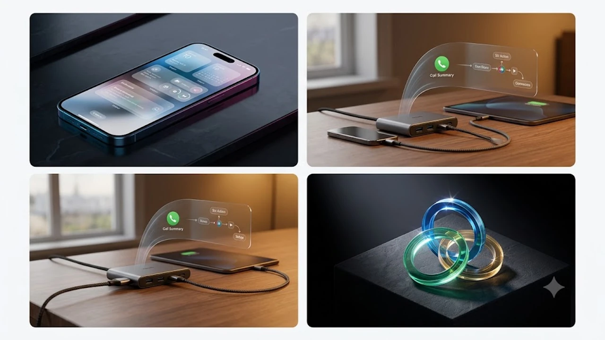

매년 가을 찾아오는 애플의 메이저 소프트웨어 업데이트 주기 속에서 이번 **iOS 20** 배포는 온디바이스 AI 기능의 전면적인 전환을 알리는 신호탄이다. 단순한 시각적 위젯 조정을 넘어서 기기 내부 NPU 자원을 극대화하는 머신러닝 엔진이 시스템 전반에 깊숙하게 결합했다. 평소 스마트폰 인터페이스의 반응 속도와 백그라운드 데이터 처리에 민감한 사용자라면 이번 판올림이 가져온 실질적인 차이를 즉시 체감하게 된다.

## 정식 출시된 iOS 20 구조적 변화
### 온디바이스 개인화 AI 엔진 전면 도입
과거 클라우드 서버에 의존하던 연산 구조에서 벗어나 기기 내부에서 독자적으로 언어 모델을 구동하는 비중이 대폭 늘었다. 텍스트 입력창에서 문맥을 파악해 다음 행동을 제안하거나 스케줄을 자동으로 추출하는 속도가 비약적으로 단축됐다. 데이터가 외부 통신망을 거치지 않으므로 개인정보 유출 걱정을 원천적으로 차단하면서도 비행기 탑승 모드 상태에서 온전한 비서 기능을 쓸 수 있다. 시스템 내부 알고리즘의 진화 양상은 [텍스트 AI의 한계와 진화](/posts/it-devices/text-based-ai-limits-and-evolution/) 분석에서도 다뤘듯 단순 텍스트 생성을 넘어선 실행형 에이전트 단계로 진입했다.

### 인터페이스 반응성과 시스템 UI 개편
제어 센터와 잠금 화면의 모듈 배치 자유도가 비약적으로 상승했다. 위젯의 크기 조절 단위가 세분화되어 한 화면에 배치 가능한 바로가기 밀도가 크게 높아졌다. 독 바(Dock)와 앱 보관함 사이를 오갈 때 발생하는 모션 블러를 덜어내 스크롤 전환 프레임이 훨씬 날렵하게 떨어진다. 

### 구형 칩셋 모델 최적화와 지원 분기점
신형 프로세서를 탑재한 기기군에서는 모든 신경망 엔진 기능이 실시간으로 활성화되지만 구형 칩셋 모델은 일부 복합 연산 기능이 제한된다. 발열 제어를 위한 스로틀링 곡선이 보수적으로 재설계되어 장시간 화면을 켜둘 때 배터리 소모율을 억제하도록 설계됐다.

## 실생활을 바꾸는 킬러 기능 분석

### 실시간 통화 녹음 스크립트 요약
통화 도중 오가는 약속 시간, 계좌 번호, 주소 같은 핵심 데이터를 음성 인식 파이프라인이 즉각 텍스트로 변환한다. 통화 종료 버튼을 누름과 동시에 메모 앱에 3줄 요약 형태로 자동 아카이빙된다. 번거롭게 별도 녹음기를 켜거나 통화 도중 메모장을 띄워 손가락으로 타건할 필요가 없다.

### 앱 연동 에이전트와 Siri 작동 한계
서드파티 배달, 내비게이션, 금융 앱을 제어하는 명령 체계가 단일 프롬프트 수준으로 정교해졌다. "지난주에 찍은 성수동 카페 사진을 찾아서 단체 대화방에 공유해 줘" 같은 복합 명령을 단계별로 끊어내어 수행한다. 다만 개발사가 새 프레임워크 API를 연동해 두지 않은 구형 앱에서는 화면 터치 매크로 수준에 머무는 단점이 존재한다.

### 로컬 리소스 점유와 상시 백그라운드 소비
상시 대기 상태에서 주변 환경 소음과 사용자 생활 패턴을 수집해 제안을 띄우다 보니 램 점유율이 기본적으로 1~1.5GB가량 높게 잡힌다. 저사양 메모리를 탑재한 기기에서는 고사양 3D 게임을 구동하다가 백그라운드로 전환했을 때 앱 리프레시(App Refresh) 현상이 체감될 수 있다.

## 실사용 72시간 성능 체감
### 초기 인덱싱 구간 발열 관리 요령
판올림 직후 24시간 동안은 사진 라이브러리 분석, 검색 색인 생성, 앱 최적화 작업이 백그라운드에서 동시다발적으로 돌아간다. 기기 후면 카메라 모듈 부근에서 미열이 지속되고 배터리가 빠르게 닳아도 하드웨어 결함이 아니므로 당황할 이유가 없다. 충전기에 꽂아둔 상태로 화면을 끄고 밤새 방치해 두면 인덱싱이 정상 종료되어 발열이 가라앉는다.

### 제스처 편의성과 작업 전환 속도
하단 홈 바를 대각선으로 쓸어 올릴 때 구동 중인 앱 카드들이 바둑판식으로 시원하게 펼쳐진다. 멀티태스킹 진입 딜레이가 0.1초 안팎으로 줄어들면서 손가락 피로도가 눈에 띄게 줄어든다. 특히 한 손 조작 모드에서 상단 알림 센터를 끌어내리는 제스처 정확도가 이전 판본보다 훨씬 직관적으로 맞물린다.

### 복합 생체 인증 보안 체계
얼굴 인식 각도가 상하좌우 15도 이상 넓어져 책상 위에 평평하게 스마트폰을 올려둔 상태에서도 잠금이 턱턱 풀린다. 보안 폴더나 금융 앱 접근 시에는 기기 파지 상태와 가속도 센서 패턴까지 결합해 사용자 본인 여부를 한 번 더 검증하는 다중 레이어가 작동한다.

## 실패 없는 백그라운드 설치 가이드
### 데이터 무결성을 위한 사전 조치
OTA(Over The Air) 무선 업데이트를 실행하기 전 컴퓨터 유선 연결을 통한 암호화 로컬 백업을 권장한다. 사진과 메시지 캐시가 클라우드 용량 한계에 부딪혀 누락되는 불상사를 막으려면 전체 백업 파일 생성이 가장 안전하다.

### 여유 저장 공간 확보와 불필요 파일 정리
운영체제 설치 패키지 용량은 약 6GB 수준이지만 압축 해제와 기존 시스템 이미지 스왑(Swap) 공간을 위해 최소 15GB 이상의 빈 스토리지가 필요하다. 

> **저장 공간 확보 체크리스트**
> - 카카오톡 대화방별 미디어 캐시 일괄 비우기
> - 사파리 오프라인 읽기 목록 및 웹사이트 데이터 삭제
> - 수개월간 열지 않은 대용량 동영상 및 무손실 음원 파일 정리

### 무선 OTA 벽돌 오류 방지 루틴
배터리 잔량이 50% 이상 남아있더라도 반드시 20W 이상의 정격 충전기를 연결한 상태에서 진행해야 전원 차단으로 인한 복구 모드(Recovery Mode) 진입 참사를 막을 수 있다. 안정적인 패킷 다운로드를 위해 혼선 없는 고속 무선 환경을 갖추는 것도 권장된다.

[아이폰 고속 무선 충전기 쿠팡에서 보기](https://www.coupang.com/np/search?q=%EC%95%84%EC%9D%B4%ED%8F%B0%20%EA%B3%A0%EC%86%8D%20%EB%AC%B4%EC%84%A0%20%EC%B6%A9%EC%A0%84%EA%B8%B0&sourceType=affiliate&trackingCode=AF8691300)

#iOS20 #아이폰업데이트 #애플OS #온디바이스AI #아이폰설정 #스마트폰최적화 #IT기기트렌드