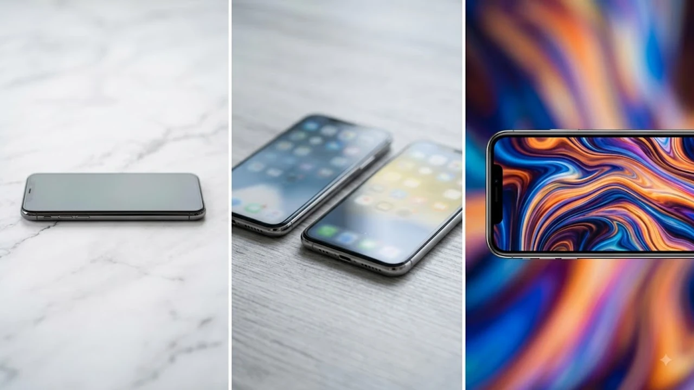

매년 가을 애플 스페셜 이벤트를 앞두고 소비자들이 가장 날카롭게 따져보는 쟁점은 디스플레이 주사율 정책입니다. 2026년 9월 공개를 앞둔 **아이폰 18 기본형 120Hz** ProMotion 디스플레이 탑재 소식이 글로벌 공급망 라인을 통해 구체화되면서, 일반형과 프로 라인업 사이에 수년간 그어졌던 선이 무너지고 있습니다. 고주사율 화면 전환과 저전력 LTPO 패널의 기본 적용은 일반 모델 사용자가 매일 만지는 화면의 반응 속도를 완전히 바꿔놓을 핵심 요소입니다.

## 아이폰 18 일반 모델 120Hz 탑재 유출의 실체

### 공급망 발 LTPO 패널 공급 확정 배경
디스플레이 공급망 관계자들에 따르면, 주요 패널 제조사들이 아이폰 18 전 라인업을 대상으로 저온다결정산화물(LTPO) 박막트랜지스터(TFT) 패널 양산 체제에 돌입했습니다. 기존 기본형에 쓰이던 LTPS(저온다결정실리콘) 공정 라인이 대거 전환되면서 일반 모델에서도 가변 주사율 구현이 기술적으로 가능해진 구조입니다.

- **원가 절감과 공정 수율 안정화**: LTPO 패널의 대량 생산 단가가 안정권에 진입
- **패널 공급처 다변화**: 국내외 주요 디스플레이 공급망 전반에서 규격 통일 완료

### 애플의 60Hz '급 나누기' 정책 공식 폐지 이유
안드로이드 진영은 30~40만 원대 보급형 스마트폰까지 120Hz 주사율을 기본 장착한 지 오래되었습니다. 100만 원을 훌쩍 넘는 플래그십 일반 모델에 60Hz를 유지하는 정책에 대한 소비자 저항이 한계에 도달한 데다, 고도화된 온디바이스 AI 인터페이스의 부드러운 전환 효과를 구현하려면 120Hz 환경이 필수적이라는 판단이 작용했습니다.

> "고도화된 모바일 AI 그래픽 인터페이스와 시각 효과는 정적 60Hz 화면보다 가변 120Hz 환경에서 훨씬 더 직관적인 조작감을 제공한다."

## 프로 vs 일반: 120Hz 같아도 남는 차이점

### AOD(Always-On Display) 기능 지원 여부
주사율이 120Hz로 올라가더라도 가변 범위에서 차등을 둘 가능성이 큽니다. 프로 라인업은 1Hz까지 주사율을 낮춰 배터리 소모를 극소화하는 방식으로 상시 표시형 화면(AOD)을 완벽 지원하지만, 기본형은 최저 10Hz 또는 24Hz까지만 내려가는 제한적인 가변 폭을 적용해 AOD 기능을 제외하거나 일부 제한할 수 있습니다.

### 카메라 및 칩셋 성능의 새로운 급 나누기 기준
디스플레이 급 나누기가 사라지는 대신 하드웨어 연산력과 광학 장비에서 확실한 격차를 둡니다.

- **망원 렌즈 및 광학 줌**: Pro 라인업 전용 테트라프리즘 잠망경 줌 유지
- **칩셋 및 대역폭**: A20 칩셋의 GPU 코어 수 차이 및 NPU 처리 속도 세분화
- **공간 비디오 및 전송 규격**: 초고속 썬더볼트 규격 및 전문가용 포맷 지원 여부

외출 시 최신 기기의 충전 효율과 이동성을 챙기고 싶다면 휴대성을 극대화한 [GaN 충전기, 2026년 진짜 사야 할 숨은 꿀템 3선](/posts/it-devices/supertiny-gan-charger-travel-tech-2026/) 글도 함께 확인해 볼 만합니다.

## 60Hz에서 120Hz ProMotion 전환 시 실체감 포인트

### 스크롤링 및 웹 서핑 시 느껴지는 반응 속도
초당 60장의 화면을 보여주던 환경에서 120장으로 늘어나면, 사파리 브라우징이나 긴 텍스트 피드를 빠르게 내릴 때 글자가 깨지거나 뚝뚝 끊기는 현상이 사라집니다. 터치 입력 신호를 초당 240Hz 속도로 스캔하여 손가락 움직임과 화면 이동 사이의 지연 시간(Latency)이 절반 가까이 줄어듭니다.

### 배터리 소모량과 발열 관리의 현실
단순 120Hz 고정 패널은 배터리를 빠르게 갉아먹지만, 가변 주사율 기술은 정지 화면에서 주사율을 대폭 낮춰 전력 소모를 억제합니다.

- **정적 텍스트 정독 시**: 주사율을 낮춰 불필요한 전력 낭비 방지
- **고주사율 지원 게임 구동 시**: 120fps를 유지하면서도 백라이트 소비 전력 최적화
- **발열 관리**: 그래픽 렌더링 부하 분산으로 기기 내부 온도 상승 완화

## 아이폰 18 기본형, 지금 기다릴 만한 가치가 있을까?

### 전작 일반형 사용자 대상 업그레이드 가이드
아이폰 15, 16, 17 일반 모델을 사용하는 유저라면 이번 세대는 확실한 체감 변화를 선사하는 교체 타이밍입니다. 화면 전환의 부드러움은 프로세서 성능 수치 향상보다 일상 사용에서 가장 즉각적으로 체감되는 요소이기 때문입니다.

| 구분 | 아이폰 17 일반형 | 아이폰 18 일반형 (유출 기준) |
| :--- | :--- | :--- |
| **패널 종류** | LTPS OLED | 저전력 LTPO OLED |
| **최대 주사율** | 60Hz 고정 | 120Hz ProMotion 가변 |
| **화면 반응성** | 표준 반응 속도 | 초저지연 터치 반응 |
| **조작감 체감** | 기본 스크롤 | 잔상 없는 고속 스크롤 |

### 9월 언팩 전 구매 대기자를 위한 최종 구매 전략
프로의 묵직한 무게와 높은 가격대가 부담스러웠던 소비자에게 120Hz를 탑재한 일반형은 최고의 가성비 선택지가 됩니다. 프로 전용 카메라 기능이나 전문 영상 촬영 규격이 필수적이지 않다면, 굳이 프로 라인업으로 넘어가지 않고 기본형 자급제 사전 예약을 노리는 편이 지출 대비 만족도를 극대화하는 길입니다.

**함께 읽으면 좋은 글**
- [2026 차세대 XR 기기 바뀌는 미래 완전 정리](/posts/it-devices/spatial-3d-display-xr-device-2026/)
- [GaN 충전기, 2026년 진짜 사야 할 숨은 꿀템 3선](/posts/it-devices/supertiny-gan-charger-travel-tech-2026/)

#아이폰18 #아이폰18기본형 #아이폰18주사율 #프로모션디스플레이 #120Hz스마트폰 #LTPO패널 #애플스마트폰 #아이폰사전예약 #IT디바이스