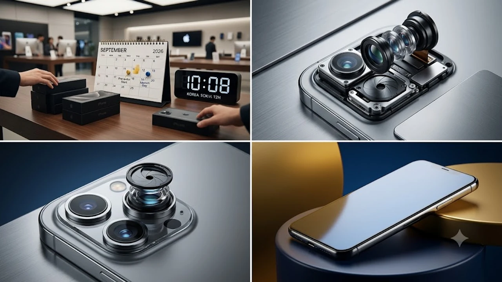

애플 가을 이벤트 직후 확정된 **아이폰18 출시일**과 사전예약 일정이 공개되면서 차세대 플래그십 교체를 노리는 사용자들의 셈법이 분주해졌다. TSMC 2나노 공정 기반의 A20 칩셋 탑재와 온디바이스 AI 구동 효율의 극대화는 스마트폰 하드웨어 체급 자체를 한 단계 끌어올렸다. 사전예약 타임라인과 출고가 책정 기준을 선제적으로 파악해 두면 불필요한 지출을 막고 원하는 색상과 용량의 초기 물량을 선점하는 데 유리하다.

## 아이폰18 출시일 및 국내 사전예약 일정 분석

글로벌 공개 직후 1차 출시국 일정이 빠르게 확정되었다. 한국 역시 1차 출시국 지위를 유지하면서 본토와 시차 없는 수령 타임라인이 가동된다.

### 글로벌 키노트 공개 직후 확정된 출시 타임라인
애플 공식 발표에 따라 공개 주간 금요일 오후 9시부터 공식 홈페이지 및 오픈마켓 사전예약이 일제히 시작된다. 공식 출시일이자 오프라인 매장 현장 수령 및 배송 시작일은 그 다음 주 금요일로 확정되었다. 초기 1~2차 출고 물량을 놓치면 배송 예정일이 한 달 이상 밀려나는 구조다.

### 통신 3사 및 자급제 사전예약 성공 팁
오픈마켓 자급제는 카드사 즉시 할인과 무이자 할부 혜택이 핵심이다. 결제 수단을 사전 등록하고 본인 인증을 미리 마쳐두어야 1분 컷 마감 속에서 결제창 오류를 피할 수 있다. 통신사 사전예약은 새벽 배송 옵션과 제휴 카드 결합 혜택을 꼼꼼하게 따져보는 것이 유리하다.

### 전작 대비 단축된 국내 배송 일정
국내 직영 애플스토어와 공식 리셀러 매장의 물량 배정 비율이 전작보다 늘어났다. 도심권 거주자는 픽업 서비스를 신청하면 출시 당일 오전 매장에서 바로 수령할 수 있어 택배 지연 걱정을 덜 수 있다.

## 주요 하드웨어 변화와 A20 칩셋 핵심 스펙

이번 세대의 하드웨어 도약은 공정 미세화와 메모리 아키텍처 재설계에서 출발한다. 연산 성능과 전력 효율 양면에서 체감 격차가 뚜렷하다.

### 2나노 공정 기반 A20 칩셋 성능 및 전력 효율
TSMC 차세대 2나노(N2) 공정으로 생산된 A20 바이오닉은 전력 소비를 15% 이상 줄이면서 고부하 작업 시 피크 성능 유지력을 대폭 끌어올렸다. 단일 코어 벤치마크 점수 향상보다 발열 스로틀링 억제력 개선이 더 체감되는 대목이다.

### 온디바이스 애플 인텔리전스 구동 역량
기본 모델까지 메모리를 대폭 확충하면서 기기 자체에서 실시간으로 처리하는 생성형 AI 기능이 쾌적해졌다. 네트워크 연결이 끊긴 상태에서도 복잡한 문서 요약, 이미지 생성, 음성 비서 명령을 지연 없이 즉각 실행한다.

### 디스플레이 베젤 축소와 카메라 모듈 개선점
보더 리덕션 스트럭처(BRS) 기술을 극대화해 테두리 베젤을 1mm 수준으로 좁혔다. 프로 라인업의 메인 카메라는 물리적 가변 조리개를 도입해 접사 왜곡을 방지하고 저조도 환경에서 광학 선예도를 확실히 챙겼다. 차세대 네트워크 환경과의 호환성은 [Wi-Fi 8 공유기 진짜 살까? 2026 차세대 네트워크 완전 정리](/posts/it-devices/wifi-8-next-gen-router-trend-2026/) 글에서 다룬 전송 규격과 맞물려 무선 성능을 한층 강화한다.

## 전작 대비 업그레이드 포인트 실사용 비교

수치상의 스펙 시트보다 일상적인 사용 패턴에서 무엇이 달라졌는지 직접 체감되는 요소들이 존재한다.

### 아이폰17 사용자가 체감할 수 있는 차이점
- **화면 몰입감:** 펀치홀 영역 축소로 영상 재생 시 시야 간섭이 대폭 줄어듦
- **충전 속도:** 유선 최대 45W 충전을 지원해 30분 만에 70% 충전 도달
- **발열 제어:** 장시간 4K 60fps 동영상 촬영이나 3D 게임 구동 시 프레임 드롭 최소화

> "일상적인 단순 웹서핑에서는 차이가 크지 않으나, 무거운 AI 연산이나 야간 저조도 촬영 모드에서는 셔터 랙 없이 결과물을 건질 수 있다는 점이 결정적이다."

### 배터리 지속 시간 및 발열 제어 실측 평가
배터리 셀 용량 자체가 소폭 커졌을 뿐 아니라 칩셋의 유휴 전력 누수가 줄었다. 화면 켜짐 시간(SoT) 기준 전작 대비 1시간 30분가량 늘어났으며, 외출 시 보조배터리 휴대 빈도를 실질적으로 줄여준다.

### 기기 무게 변화와 손에 쥐는 그립감
외곽 프레임 모서리의 곡률을 미세하게 조정하고 무게 배분을 중앙부로 집중시켰다. 200g을 넘나들던 프로 모델의 손목 부담감이 줄었고, 케이스를 씌우지 않은 상태에서도 안정적인 파지감을 준다.

## 모델별 출고가 인상 폭과 구매 가이드

환율 변동과 부품 단가 상승 여파로 기본 출고가에 조정이 발생했다. 실구매 부담을 줄이기 위한 계산이 필요하다.

### 일반 vs 프로 라인업 가격 차이 및 가성비 검토
일반 라인업은 120Hz 고주사율 디스플레이 탑재 여부에 따라 전작 프로 모델 대비 충분한 경쟁력을 갖췄다. 전문적인 영상 로그 촬영이나 광학 줌이 필수적이지 않다면 일반 모델로도 충분한 만족도를 얻을 수 있다.

### 보상 판매(트레이드인) 최대 할인 적용 방법
애플 공식 트레이드인이나 오픈마켓 중고 보상 프로그램을 활용하면 기존 기기 반납으로 최대 수십만 원의 기기값 상쇄가 가능하다. 외관 흠집이나 배터리 효율 상태에 따라 보상가가 달라지므로 예약 전 사전 감정을 미리 진행해 두는 편이 합리적이다.

### 약정 할인과 알뜰폰 자급제 조합 최종 유지비
24개월 할부 이자와 5G 고가 요금제 약정을 감안하면, 자급제 기기 카드 무이자 할부에 알뜰폰 무제한 요금제를 조합하는 방식이 총지출 면에서 30만 원 이상 절약된다. 

[관련상품 쿠팡에서 보기](https://www.coupang.com/np/search?q=%EC%8A%A4%EB%A7%88%ED%8A%B8%EA%B8%B0%EA%B8%B0%20%EB%85%B8%ED%8A%B8%EB%B6%81&sourceType=affiliate&trackingCode=AF8691300)

#아이폰18 #아이폰18출시일 #아이폰18사전예약 #A20바이오닉 #아이폰자급제 #아이폰스펙 #스마트폰교체 #애플신제품