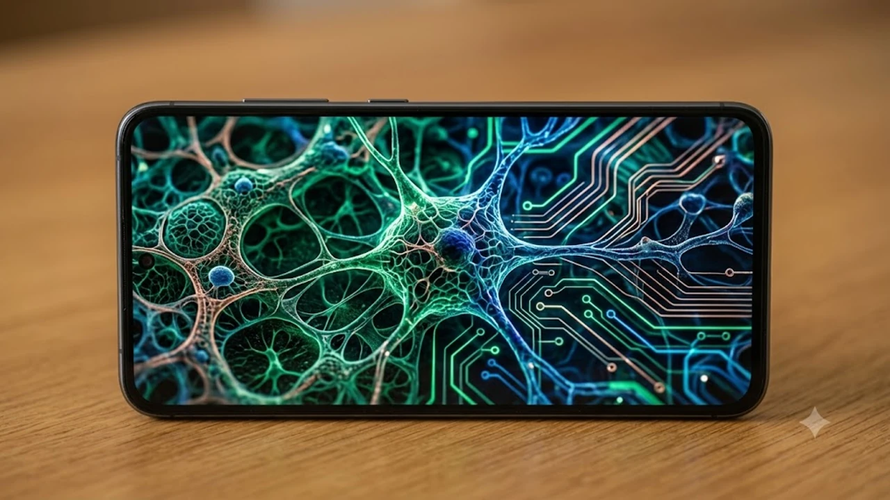

매년 초가을 테크 커뮤니티의 최대 화두인 **아이폰18 출시일** 윤곽이 서서히 드러나고 있습니다. 2나노 공정 전환과 모듈 재설계라는 굵직한 변화가 맞물린 만큼, 공개 타임라인과 사전예약 동선을 미리 파악해 두어야 1차 물량 확보가 수월합니다.

## 2026 애플 가을 언팩 일정과 출시일 전망

### 역대 9월 키노트 일정 기반 공개일 분석
쿠퍼티노 본사는 매년 9월 둘째 주 화요일이나 수요일에 플래그십 발표 무대를 마련해 왔습니다. 달력상 2026년 9월 둘째 주 화요일은 9월 8일, 수요일은 9월 9일이며, 미국 태평양 표준시 기준 오전 10시 행사가 열립니다.

- **초대장 배포**: 행사 7~10일 전 글로벌 미디어 대상 발송
- **키노트 생중계**: 한국 시간 기준 9월 9일 혹은 10일 새벽 2시 진행
- **사전예약 개시**: 키노트 당주 금요일인 9월 11일 오후 9시 일괄 진입

글로벌 공급망 이슈나 디스플레이 수율 문제가 돌출되지 않는다면 이 표준 사이클에서 벗어날 가능성은 매우 희박합니다.

### 국내 1차 출시국 유지 가능성과 사전예약 일정
국내 시장은 전작에 이어 1차 출시국 지위를 굳히는 흐름입니다. 국립전파연구원의 적합성평가(전파인증) 신청이 언팩 전부터 물밑에서 이뤄지는 구조 덕분에 이제는 해외 직구를 노릴 이유가 완전히 사라졌습니다.

> **예상 공식 타임라인**  
> 9월 9일 새벽 공식 발표 직후 각 통신사 전산망에 모델명이 등재되며, 9월 11일 금요일 밤 9시부터 오픈마켓과 통신사 채널에서 동시에 1차 사전예약이 시작됩니다.

### 통신사별 개통 혜택 및 수령 예상 시기
사전예약 첫 타임에 결제를 마친 사용자는 9월 18일 금요일 아침부터 기기를 손에 쥘 수 있습니다.

- **애플스토어 픽업**: 명동·강남·홍대 등 직영 매장에서 당일 오전 8시부터 예약 시간대별 수령
- **통신사 새벽 배송**: 1차 성공자 한정으로 9월 18일 출근 전 오전 7~8시 도착 서비스 가동
- **택배 수령 자급제**: 우체국 및 전용 물류망을 통해 출시 당일 낮 12시 전후 배송 완료

## 아이폰18 핵심 스펙과 전작 대비 변화점

### 2나노 공정 AP 탑재에 따른 성능 및 발열 변화
이번 세대의 핵심 심장부인 A20 바이오닉 칩셋은 TSMC의 최선단 2나노(N2) 공정으로 제작되었습니다. 게이트올어라운드(GAA) 나노시트 구조가 처음 도입되어 전류 누설을 틀어막고 전력 대 성능비를 크게 끌어올렸습니다.

- **연산 처리량**: 긱벤치 싱글코어 기준 전작 대비 15% 이상, NPU 연산 능력은 35% 향상
- **내부 방열 설계**: 메인보드와 후면 유리 사이에 티타늄-그래파이트 복합 시트를 더해 스로틀링 억제
- **소비전력 절감**: 4K 영상 인코딩 및 고부하 3D 렌더링 시 배터리 소모율 약 20% 감소

충전 발열 분산 설계 역시 한층 정교해졌습니다. 장거리 이동이나 출장이 잦은 유저라면 [GaN 충전기, 2026년 진짜 사야 할 숨은 꿀템 3선](/posts/it-devices/supertiny-gan-charger-travel-tech-2026/)을 참고해 알맞은 출력 규격을 갖춰두면 발열 부담 없이 기기를 충전할 수 있습니다.

### 가변 조리개 카메라와 언더디스플레이 센서 도입 여부
프로 라인업의 메인 카메라는 드디어 센서 크기 확대와 함께 물리적 가변 조리개 모듈을 채택했습니다. 렌즈 구경이 환경에 맞춰 기계식으로 움직이며 심도와 해상력을 동시에 확보합니다.

- **조리개 가변 제어**: f/1.4에서 f/2.4까지 빛의 양에 맞춰 렌즈 날개가 열리고 닫히는 구조
- **화면 하단 센서 배치**: 적외선 Face ID 송수신 센서를 패널 아래로 숨겨 상단 다이내믹 아일랜드 면적 축소
- **잠망경 망원 렌즈**: 프리즘 반사 구조 손실률을 줄여 최대 6배 광학 줌 상태에서도 선명한 디테일 유지

### 배터리 효율 개선과 고속 충전 규격 비교
실리콘-탄소 복합 음극재를 채택해 기기 두께 증가 없이 배터리 셀 용량을 약 8% 늘렸습니다.

- **유선 고속 충전**: 최대 45W 규격 지원(배터리 0%에서 65%까지 약 30분 소요)
- **무선 충전(MagSafe)**: 자석 배열 최적화와 함께 최대 25W 무선 충전 전력 수용
- **연속 구동 시간**: 프로 맥스 기기 기준 단일 충전으로 최대 31시간 연속 비디오 재생 지원

초고속 대용량 스트리밍 및 파일 전송 환경을 갖추고자 한다면 [Wi-Fi 8 공유기 진짜 살까? 2026 차세대 네트워크 완전 정리](/posts/it-devices/wifi-8-next-gen-router-trend-2026/) 글에서 최신 통신 규격을 함께 확인해 보는 것도 좋습니다.

## 전작 모델과의 실사용 관점 장단점 비교

### 아이폰16·17 사용자가 즉시 체감할 강점
기존 구형 기기 사용자가 기변했을 때 손끝에서 바로 체감되는 영역은 뚜렷합니다.

- **온디바이스 AI 응답 속도**: 서버 통신 대기 시간 없이 음성 비서 명령 및 실시간 통번역 작업 즉각 완료
- **야외 시인성 한계 돌파**: 탠덤 OLED 패널이 기본 라인업까지 들어가 직사광선 아래 피크 밝기 2,600니트 도달
- **야간 심도 연출**: 물리 가변 조리개 덕분에 인위적인 블러 소프트웨어 연산 없이도 자연스러운 배경 흐림 구현

### 여전히 아쉬운 무게와 급나누기 요소
반면 실사용자 입장에서 걸림돌이 되는 단점도 분명히 남아 있습니다.

- **상단부 무게 쏠림**: 가변 조리개 기구부와 대형 센서 배치로 인해 프로 맥스 상단 쏠림 현상 잔존
- **디스플레이 주사율 차등**: 일반 라인업의 상시표시형 디스플레이(AOD) 기능 제한 유지
- **유선 규격 제약**: 일반형 모델은 여전히 USB 2.0 대역폭에 묶여 대용량 파일 전송 시 속도 체감 한계

### 일반 모델 vs 프로 라인업의 가성비 격차
예산 지출 대비 실제 체감 가치를 따져본 비교 기준입니다.

| 구분 | 일반 모델 | 프로 라인업 |
| :--- | :--- | :--- |
| **탑재 칩셋** | 개선형 3나노 A20 | 최선단 2나노 A20 Pro |
| **카메라 구성** | 듀얼 (광각/초광각) | 트리플 (가변 조리개/6배 망원) |
| **데이터 전송** | USB-C (USB 2.0 속도) | USB-C (Thunderbolt 4 / 40Gbps) |
| **추천 대상** | 메신저, 웹서핑, 캐주얼 사진 촬영 | 프로급 영상 크리에이터, 하드 게이머 |

## 사전예약 성공을 위한 결제 및 세팅 가이드

### 오픈마켓 자급제 카드 할인 최적화 동선
첫날 몇 초 만에 마감되는 오픈마켓 자급제 수량을 잡기 위해서는 사전 세팅이 결제 성패를 가릅니다.

- **원클릭 간편결제 등록**: 네이버페이, 쿠팡페이에 무이자 할부 혜택이 큰 제휴 신용카드 단독 등록
- **생체 인증 사전 점검**: 결제 비밀번호 타이핑 대신 지문이나 얼굴 인식으로 1단계 단축
- **기획전 직행 링크 확보**: 상세 페이지에서 옵션을 고르지 말고 단품 직링을 북마크 바에 배치

### 공식 홈페이지 빠른 주문 세팅 체크리스트
애플 공식 홈페이지는 카드 할인은 없지만 14일 묻지마 반품 정책과 안정적인 물량 공급이 장점입니다.

- 애플 계정 배송 주소록에 도로명 주소와 우편번호 사전 저장
- 사파리 브라우저의 애플페이 결제 승인 테스트 완료
- 프로 및 프로 맥스 희망 옵션(용량, 색상)을 장바구니에 미리 담아두는 즐겨찾기 세팅

### 기존 기기 보상판매(트레이드인) 신청 절차
구형 폰을 반납해 초기 결제 부담을 낮추는 실전 순서입니다.

- **일련번호 확보**: 설정 창에서 IMEI와 시리얼 번호를 메모장에 복사
- **외관 자가 검수**: 모서리 찍힘, 액정 기스, 카메라 렌즈 균열 여부를 등급별로 체크
- **반납 키트 회수**: 신제품 수령 후 배송된 전용 박스에 기존 기기를 초기화해 담아 14일 내 회수 기사 인계

[아이폰18 케이스 및 보호필름 쿠팡에서 보기](https://www.coupang.com/np/search?q=%EC%8A%A4%EB%A7%88%ED%8A%B8%EA%B8%B0%EA%B8%B0%20%EB%85%B8%ED%8A%B8%EB%B6%81&sourceType=affiliate&trackingCode=AF8691300)

#아이폰18출시일 #아이폰18사전예약 #아이폰18스펙 #아이폰18프로 #A20바이오닉 #애플이벤트 #자급제사전예약