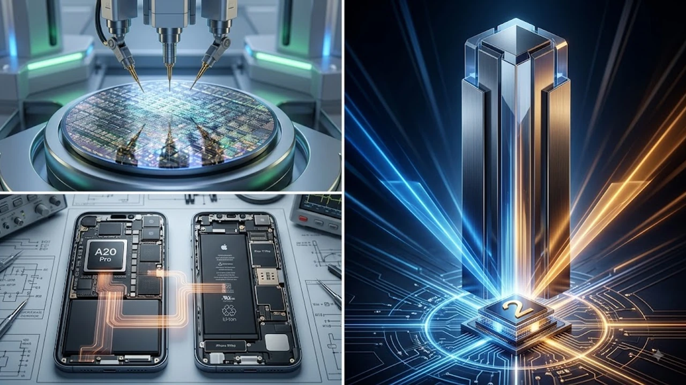

2026년 9월 애플 스페셜 이벤트를 목전에 두고 플래그십 라인업인 **아이폰 18 프로**의 최종 유출 스펙 시트가 대만 공급망을 통해 확인되었습니다. 이번 세대는 반도체 미세 공정의 물리적 한계를 깬 TSMC 2나노 공정과 거대 온디바이스 AI 구동을 위한 메모리 전면 개편이 핵심입니다. 올가을 기기 변경을 저울질하는 사용자라면 반드시 짚고 넘어가야 할 실질적 변화를 정리했습니다.

## 9월 공개 직전 유출된 아이폰 18 프로 핵심 스펙

### TSMC 2나노 A20 Pro 칩셋 탑재와 전력 효율 변화
아이폰 18 프로의 두뇌인 **A20 Pro 칩셋**은 업계 최초로 TSMC의 2나노(N2P) 공정을 적용했습니다. 차세대 트랜지스터 구조인 GAA(Gate-All-Around)를 도입해 3나노 대비 동일 클럭 기준 전력 효율을 25% 끌어올렸습니다. 장시간 4K ProRes 영상 촬영이나 고사양 3D 렌더링 시 기기 상단부가 뜨거워지며 프레임이 떨어지는 스로틀링 현상을 억제합니다.

### 드디어 기본 12GB RAM 탑재: 온디바이스 AI 성능 격차
수년간 8GB에 묶여 있던 기본 메모리가 마침내 **12GB LPDDR5X**로 상향됩니다. 클라우드 서버와의 통신 없이 기기 자체에서 대규모 온디바이스 LLM을 연산하기 위한 하드웨어 마지노선입니다. 무거운 앱을 여러 개 띄워도 백그라운드가 강제 종료되는 '앱 리프레시' 현상이 체감될 정도로 줄어들며, 실시간 음성 번역과 생성형 이미지 처리 반응 속도 역시 눈에 띄게 빨라집니다.

### 디스플레이 크기 유지와 초슬림 베젤 기술 적용
화면 크기는 6.3인치와 6.9인치 규격을 유지하되, 고도화된 BRS(Border Reduction Structure) 공정을 통해 베젤 두께를 1.1mm 선까지 줄였습니다. 외형 크기는 그대로 둔 채 화면 테두리를 극도로 깎아 시각적 몰입감을 극대화했으며, 순간 최대 밝기는 2,600니트까지 지원해 한여름 직사광선 아래에서도 화면이 또렷하게 보입니다.

## 전작 대비 체감 성능 및 하드웨어 비교

### A19 Pro vs A20 Pro 벤치마크 및 연산 성능 분석
유출된 긱벤치 6(Geekbench 6) 결과에 따르면, A20 Pro는 싱글코어 3,800점대, 멀티코어 10,500점대를 기록하며 전작 대비 약 20%의 멀티코어 성능 향상을 보였습니다. 16코어 뉴럴 엔진(NPU)의 연산 처리 성능 또한 45TOPS에서 60TOPS로 대폭 강화되어, 복잡한 비디오 객체 지우기나 실시간 오디오 믹싱 작업을 버벅임 없이 처리합니다.

### 카메라 센서 판형 확장과 기계식 조리개 탑재 여부
메인 광각 카메라는 1/1.14인치 맞춤형 소니 이미지 센서를 장착해 수광량을 늘렸습니다. 특히 프로 맥스 모델에는 조도에 따라 f/1.4와 f/2.8 사이를 물리적으로 전환하는 **가변 조리개 모듈**이 채택되어, 야간 촬영 시 가로등 빛 번짐을 잡고 인물 사진에서 자연스러운 광학 심도를 만들어냅니다.

### 발열 제어를 위한 그래파이트 시트 및 쿨링 구조 개선
기존 티타늄 프레임의 고질적인 열 축적 문제를 해결하기 위해 내부 그래파이트 시트 면적을 30% 넓히고 알루미늄 방열 프레임을 덧댄 복합 방열 설계를 적용했습니다. 발열로 인한 배터리 수명 저하를 막으려면 충전 시 전력 밀도를 정밀하게 제어하는 장비를 쓰는 습관도 필요합니다. 안정적인 충전 세팅은 [GaN 충전기, 2026년 진짜 사야 할 숨은 꿀템 3선](/posts/it-devices/supertiny-gan-charger-travel-tech-2026/)을 참고하면 좋습니다.

## 깜짝 등장한 아이폰 울트라 라인업 분석

### 북스타일 7.8인치 내부 화면과 4대3 비율의 실효성
이번 서플라이 체인 보고서에서 이목을 끈 기종은 가로로 펼치는 북스타일 폼팩터인 **아이폰 울트라**입니다. 내부 7.8인치 대화면은 4:3 비율을 갖춰 PDF 문서 열람과 멀티 윈도우 작업 시 시야를 시원하게 확보해 주며, 접었을 때 쓰는 외부 화면은 5.8인치로 설계해 한 손 파지감을 살렸습니다.

### 기존 폴더블폰과의 힌지 설계 차이점
기존 시장의 물방울 힌지와 달리, 애플은 비정질 액체 금속 합금(Liquidmetal)을 적용한 다축 기어 힌지를 도입했습니다. 접히는 부위의 주름 깊이를 0.1mm 이하로 평탄화해 디스플레이 이질감을 없앴고, 기계적 틈새를 정밀 밀폐해 폴더블 기기 최고 수준인 IP68 방수·방진 등급을 확보했습니다.

> "애플의 폴더블 폼팩터 진입은 단순한 화면 키우기가 아니라, iPadOS의 핵심 스플릿 뷰와 무대 관리자 기능을 모바일 환경에 이식하는 소프트웨어 생태계 확장에 가깝다." — 블룸버그 공급망 보고서

### 2026년 동시 출시 가능성과 예상 출고가 범위
초기 힌지 부품 수율 이슈로 인해 아이폰 울트라는 9월 이벤트에서 선공개된 후 2026년 4분기에 한정 물량으로 시장에 풀릴 가능성이 높습니다. 예상 출고가는 256GB 기본 모델 기준 약 2,000달러(국내 기준 약 280만 원 선)로 책정되어 초프리미엄 세그먼트를 형성할 전망입니다.

## 아이폰 18 프로 실구매 가이드 및 대기 전략

### 지금 아이폰 17 프로 vs 9월 18 프로 대기 비교
- **아이폰 17 프로 즉시 구매:** 통신사 재고 정리 보조금이나 카드 즉시 할인을 통해 가성비 위주로 실속을 챙기려는 실속파 사용자
- **아이폰 18 프로 대기:** 2나노 공정 기반의 긴 배터리 지속 시간과 12GB RAM 기반 로컬 AI 기능을 온전히 활용하려는 파워 유저

### 예상 출고가 인상폭과 사전예약 공략법
2나노 첨단 패키징 비용과 고용량 LPDDR5X 탑재로 인해 프로 모델 기준 출고가가 약 100달러(약 15만 원) 안팎으로 인상될 확률이 높습니다. 출시 초기 통신사 지원금이 낮은 만큼, 사전예약 당일 오픈마켓(쿠팡, 11번가 등)의 8~10% 카드 청구 할인과 12~24개월 무이자 할부를 확보하는 편이 지출을 줄이는 지름길입니다.

### 통신사 공시지원금 vs 자급제 알뜰폰 조합 추천
초기 10~20만 원 수준에 그치는 공시지원금을 받기 위해 월 9~10만 원대 5G 고가 요금제를 6개월 이상 의무 유지하는 방식은 배보다 배꼽이 큽니다. 카드 할인을 받은 **자급제 단말기에 월 2~3만 원대 알뜰폰(LTE/5G 무제한) 요금제**를 물리는 세팅이 2년 약정 기준 총지출액에서 60만 원 이상을 아끼는 검증된 조합입니다.

#아이폰18프로 #아이폰18 #A20Pro #2나노공정 #애플인텔리전스 #아이폰울트라 #아이폰사전예약 #자급제알뜰폰