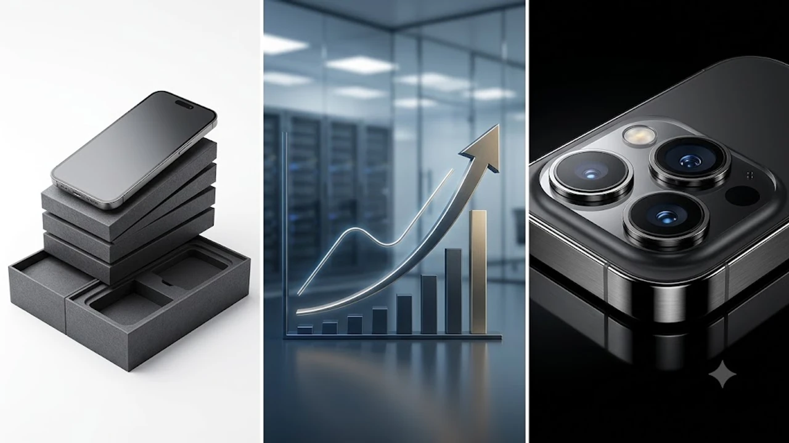

2026년 8월 최근 글로벌 테크 시장을 뜨겁게 달구고 있는 **아이폰18 프로 가격** 인상 유출 소식에 많은 소비자의 관심이 쏠리고 있습니다. 차세대 반도체 부품 단가 상승과 제조 공정 난이도 증가로 인해 출고가가 최대 300달러(약 40만 원) 이상 오를 것이라는 전망이 지배적입니다. 프리미엄 스마트폰 구매를 고려 중이라면 출고가 인상 원인과 스펙 변화를 미리 파악하여 전략적으로 접근하는 편이 유리합니다.

## 아이폰 18 프로 가격 300달러 인상 설의 진실과 핵심 원인

### LPDDR6 및 차세대 HBM 메모리 단가 상승의 압박
AI 모델 연산 처리를 위한 메모리 수요가 전 세계적으로 급증하면서 온디바이스 AI 전용 모듈 단가가 폭등했습니다. 글로벌 공급망 보고서에 따르면 아이폰 18 프로에 탑재되는 차세대 **LPDDR6 DRAM** 모듈의 공급 가격은 전작 대비 약 **25% 이상 상승**했습니다. 고성능 메모리 확보를 위한 모바일 제조사 간의 경쟁이 격화되면서 원가 부담이 소비자 판매가로 이관되는 모양새입니다.

### TSMC 2나노 공정 도입에 따른 제조 원가 급증
애플의 차세대 AP인 A20 바이오닉 칩셋은 **TSMC의 최첨단 2나노(nm) 초미세 공정**을 기반으로 양산됩니다. 웨이퍼당 생산 단가가 기존 3나노 공정 대비 약 30%가량 치솟았습니다. 초미세 공정 수율을 안정화하는 과정에서 발생한 초기 비용이 사상 최대 수준의 부품 원가 상승을 이끌었습니다.

> **주요 부품별 원가 인상률 추정치**
> * **A20 애플 실리콘 AP:** 전작 대비 약 +30% 상승
> * **LPDDR6 메모리 모듈:** 전작 대비 약 +25% 상승
> * **가변 조리개 카메라 모듈:** 전작 대비 약 +18% 상승

### 전작 아이폰 17 프로 시리즈와의 출고가 직격 비교
기본형 기준 출고가를 비교해 보면 인상 폭이 한눈에 들어옵니다. 미국 시장 기준으로 기존 999달러 선을 유지하던 프로 기본 모델이 1,199달러에서 최대 1,299달러까지 책정될 가능성이 높습니다. 한국 출시가 기준으로 환율 변동성까지 반영된다면 최소 20만 원에서 최대 40만 원 수준의 실질적인 가격 상승을 체감하게 됩니다.

---

## 가격 인상을 정당화할 아이폰 18 프로의 역대급 스펙 변화

### 온디바이스 AI 전용 차세대 A20 바이오닉 칩셋 성능
A20 바이오닉 칩은 단순 연산 속도 향상을 넘어 NPU(신경망 처리 장치) 성능을 전작 대비 40% 이상 강화했습니다. 실시간 음성 통화 번역, 온디바이스 이미지/비디오 생성 및 편집 작업 시 클라우드 연결 없이도 즉각적인 응답성을 보여줍니다.

### 가변 아퍼처(가변 조리개) 카메라 및 렌즈 모듈 업그레이드
메인 카메라에는 광학식 **가변 조리개(F/1.4 ~ F/4.0)** 메커니즘이 새롭게 적용됩니다. 조도 환경에 맞춰 광량을 물리적으로 조절하므로 야간 촬영 시 노이즈가 획기적으로 줄어들고 심도 표현이 풍부해집니다. 고용량 4K 120fps 공간 비디오 촬영 데이터 처리를 위해 초고속 유무선 전송 기술도 함께 도입됩니다. 최신 무선 규격에 관심이 많다면 [Wi-Fi 8 공유기 진짜 살까? 2026 차세대 네트워크 완전 정리](/posts/it-devices/wifi-8-next-gen-router-trend-2026/) 글에서 차세대 통신 네트워크 환경을 확인할 수 있습니다.

### 배터리 효율 향상과 초고속 유무선 충전 지원
고밀도 적층형 배터리 셀 기술을 접목하여 물리적 용량을 늘리는 동시에 전력 효율을 15% 개선했습니다. 유선 고속 충전 속도가 대폭 개선되어 단 20분 만에 70% 이상 충전할 수 있으며, 고출력 충전기를 사용할 때 최상의 성능을 발휘합니다. 고성능 충전 생태계가 궁금하다면 [GaN 충전기, 2026년 진짜 사야 할 숨은 꿀템 3선](/posts/it-devices/supertiny-gan-charger-travel-tech-2026/) 포스팅을 참조하면 도움이 됩니다.

---

## 아이폰 18 프로 VS 전작 실사용 관점 스펙 및 가성비 비교

### 체감 성능 향상 폭과 실생활 AI 기능 활용도 비교
일상적인 웹서핑이나 SNS 이용 환경에서는 전작과의 차이를 느끼기 어렵습니다. 하지만 고사양 3D 게임 구동, 온디바이스 AI 기반의 생성형 작업, 고화질 영상 편집을 자주 수행하는 사용자라면 체감 성능 차이가 확실하게 다가옵니다.

* **일반 사용자:** 인스타, 유튜브, 단순 사진 촬영 위주라면 전작으로도 충분함
* **헤비 사용자:** 4K 영상 편집, 가변 조리개 활용 전문 촬영, AI 툴 자주 활용 시 유의미함

### 인상된 가격 대비 얻을 수 있는 가치 판단 기준
300달러라는 인상 폭은 기기 한 대 값으로 생각하면 상당한 부담입니다. 생산성 도구로서 최첨단 AI 기능과 가변 조리개 카메라를 일상 업무 및 콘텐츠 제작에 적극적으로 활용하는 사용자가 아니라면, 출고가 인상 직전 전작 모델을 할인된 가격에 구매하는 것이 실속 있는 선택입니다.

### 프로 모델과 일반/플러스 라인업 간의 격차 확대
애플은 이번 라인업부터 프로와 비(Non) 프로 모델 간의 스펙 격차를 더욱 넓혔습니다. 일반 라인업에는 기존 3나노 칩셋과 정적 조리개 카메라가 유지되는 반면, 프로 라인업에만 2나노 공정과 최고급 카메라 모듈이 전면 배치됩니다.

---

## 가격 인상 대란 속 아이폰 18 프로 현명하게 구매하는 튜토리얼

### 사전예약 혜택 및 통신사/자급제 할인가 세부 비교 방법
출고가가 대폭 오르는 시기일수록 자급제와 통신사 공시지원금 제도를 철저히 비교해야 합니다. 

1. **자급제 + 알뜰폰 조합:** 오픈마켓 사전예약 신용카드 즉시 할인(5~8%)과 알뜰폰 요금제 결합 시 장기 유지비가 가장 저렴합니다.
2. **통신사 제휴 카드 할인:** 공시지원금이 크게 책정될 경우, 통신사 제휴 카드의 전월 실적 할인을 조합해 초기 기기값 부담을 줄일 수 있습니다.

### 기존 중고 기기 보상 판매(Trade-in) 최대 가액 매각 팁
신제품 출시 직전은 기존 사용 기기의 중고 시세가 가장 높은 시점입니다. 애플 공식 트레이드인(Trade-in) 프로그램보다 민팃 등 사설 중고 매입 플랫폼의 시세를 사전 조사하여, 보상 판매 추가 지원금 이벤트 타이밍에 맞춰 매각하는 것이 이득입니다.

### 출고가 인상 시기 사전예약 오픈 직후 빠르게 성공하는 체크리스트
사전예약 첫날 1차 물량을 확보하지 못하면 수개월을 기다려야 할 수 있습니다. 아래 체크리스트를 미리 준비하여 결제 실패를 방지하십시오.

* [ ] 주요 오픈마켓(쿠팡, 11번가, 네이버) 회원가입 및 본인인증 완료
* [ ] 할인 혜택이 적용되는 주요 신용카드 미리 결제 수단으로 등록
* [ ] 배송지 주소 기본 설정 업데이트 및 간편결제 비밀번호/생체인증 등록 확인
* [ ] 사전예약 오픈 5분 전 서버 시계 확인 및 앱 최신 버전 업데이트

#아이폰18프로 #아이폰18프로가격 #애플신제품 #A20바이오닉 #자급제아이폰 #아이폰사전예약 #스마트폰트렌드 #IT기기추천