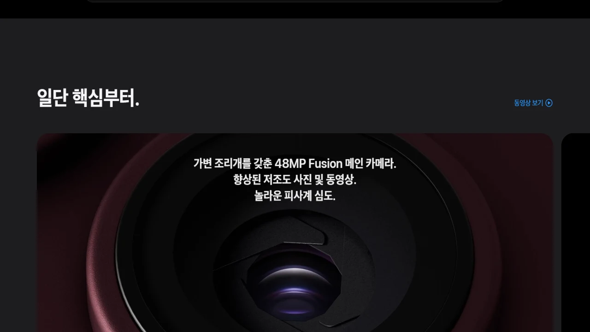

## 1. 2026 플래그십 카메라 하드웨어: 48MP 트리플 vs 듀얼 렌즈의 구조적 분기점

2026년 9월 10일 공개된 애플의 차세대 라인업은 폼팩터의 물리적 한계와 광학 설계 사이에서 뚜렷한 기술적 분기점을 보여줍니다. 전통적인 바(Bar) 형태를 유지한 **iPhone 18 Pro**는 두께 8.25mm의 내부 용적을 온전히 광학 부품에 할당했습니다. 반면 두께 5.4mm(펼쳤을 때 기준, 추정치)로 설계된 첫 폴더블 **iPhone Duo**는 힌지 메커니즘과 듀얼 배터리 배치로 인해 렌즈 모듈 공간을 대폭 압축했습니다. 두 기기 모두 2나노미터 공정 기반의 **A20 Pro 칩셋**과 초당 45조 회 연산을 수행하는 듀얼 16코어 뉴럴 엔진을 장착해 이미지 처리 파이프라인의 기반은 동일하지만, 센서 자체에 들어오는 물리적 광량과 초점거리 확보 방식에서는 완전히 다른 길을 택했습니다.

### iPhone 18 Pro: 물리 가변 조리개와 대구경 메인 센서
* **물리 가변 조리개 메인 렌즈**: 48MP 메인 Fusion 카메라에 **f/1.48부터 f/4.0까지 조절되는 하드웨어 조동 날개 메커니즘**을 탑재했습니다. 광량이 부족한 야간 실내나 암부 촬영 시 f/1.48로 개방하여 노이즈를 억제하고, 강한 직사광선 환경이나 단체 인물 촬영 시 f/4.0으로 조여 주변부 왜곡을 줄이고 피사계 심도를 확보합니다.
* **1/1.14인치 대형 센서 규격**: 전작 대비 약 18% 넓어진 센서 수광 면적을 통해 소프트웨어 블러 처리에 의존하지 않고도 자연스러운 광학 보케를 만듭니다.
* **18MP Center Stage 전면 카메라**: 전면 펀치홀 다이내믹 아일랜드 영역을 25% 축소하면서도 18MP 고화소 센서와 위상차 검출 AF를 결합해 피사체 추적 반응 속도를 끌어올렸습니다.

### iPhone Duo: 슬림 힌지 구조로 인한 물리 렌즈의 타협
* **48MP 메인 + 48MP 초광각 듀얼 구성**: 내부 공간의 물리적 한계로 인해 망원 모듈을 배제하고 2개의 후면 센서만 배치했습니다.
* **고정 조리개(f/1.6) 채택**: 얇은 섀시 두께를 확보하기 위해 가변 조리개 모듈 대신 고정식 f/1.6 렌즈를 유지했습니다.
* **센서 크기의 제약**: 메인 센서는 1/1.3인치 급으로 18 Pro 대비 작으며, 수광량의 격차를 A20 Pro 칩셋의 멀티 프레임 합성 알고리즘과 포토닉 엔진으로 보완합니다.

---

## 2. 광학 줌과 영상 촬영 규격: 원거리 압축감 vs 센서 크롭 한계

망원 화각의 유무는 단순한 배율 차이를 넘어 인물 사진의 공간 압축감과 피사체 분리 능력을 갈라놓습니다. iPhone 18 Pro는 120mm 상당의 초점거리를 물리적으로 지원하는 반면, iPhone Duo는 48MP 메인 센서 중앙부를 잘라내는 인센서 크롭 기술로 줌 기능을 대체합니다. 야외 콘서트, 스포츠 경기, 원거리 풍경 기록에서 두 기기의 결과물은 확대 배율 5배를 넘어서는 순간 뚜렷한 해상력 격차를 드러냅니다.

### 망원 렌즈 유무에 따른 해상도 격차
* **iPhone 18 Pro의 48MP 테트라프리즘 망원**: 5배 광학 줌(120mm 상당)과 최대 30배 디지털 줌을 지원합니다. 2세대 3D 센서 시프트 손떨림 보정(OIS) 모듈을 결합해 핸드헬드 5배율 촬영 시에도 미세 떨림을 제어합니다.
* **iPhone Duo의 2배 광학급 인센서 크롭**: 망원 렌즈가 없기 때문에 48MP 메인 센서의 중앙 12MP 영역을 잘라내 48mm 상당 화각을 구성합니다. 5배 이상 영역부터는 순수 디지털 줌으로 전환되어 텍스처 뭉개짐 현상이 발생합니다.
* **공간 압축감의 차이**: 물리 망원 렌즈 특유의 배경 압축 효과는 소프트웨어 인물 사진 모드가 모사하기 어려운 심도를 만듭니다.

> "원거리 피사체의 윤곽선과 질감 표현에서 물리 렌즈 기반 5배 광학 줌과 2배 인센서 크롭은 크롭 배율이 커질수록 되돌릴 수 없는 디테일 손실을 유발합니다."

### 전문가용 영상 규격: 4K 120fps Dolby Vision과 ProRes RAW
* **iPhone 18 Pro 영상 제원**: 전 포맷 4K 120fps Dolby Vision 촬영 및 외장 SSD 직결 시 4K 120fps ProRes Log 녹화를 지원합니다. 3단계 가변 조리개를 이용해 ND 필터 없이 셔터 스피드를 확보할 수 있습니다.
* **iPhone Duo 영상 제원**: 4K 60fps Dolby Vision 촬영을 지원하며, ProRes 포맷은 4K 30fps로 제한됩니다. 내부 방열 면적 제약으로 인해 고비트레이트 연속 촬영 시 스로틀링 발생 주기가 18 Pro 대비 약 1.5배 빠릅니다.

---

## 3. 폴더블 폼팩터의 촬영 편의성: Duo만의 독점 인터페이스

화질이라는 순수 광학 잣대에서는 iPhone 18 Pro가 앞서지만, 촬영 환경의 기동성과 앵글의 자유도 측면에서는 iPhone Duo가 우수한 실용성을 보여줍니다. 힌지를 임의의 각도로 고정하는 프리스탑 메커니즘과 외부 커버 화면(13.6cm) 및 메인 폴딩 화면(19.3cm)의 유기적 연동은 삼각대나 외부 보조 모니터 없이도 1인 크리에이터에게 효율적인 작업 환경을 제공합니다.

### Duo Preview 및 듀얼 디스플레이 뷰파인더
* **외부 화면 동시 송출**: 촬영자가 메인 디스플레이를 보며 구도를 잡는 동시에 피사체는 커버 스크린으로 자신의 포즈와 표정을 실시간(지연 시간 16ms 이하)으로 확인합니다.
* **19.3cm 대화면 뷰파인더**: 내부 화면을 펼치면 아이패드 미니 급 화면 전체를 모니터로 활용해 초점 맞춤 영역과 암부 클리핑을 정밀하게 점검할 수 있습니다.

### 플렉스 모드 거치와 듀얼 캡처 브이로그 시스템
* **삼각대 없는 자립 촬영**: 힌지를 75도에서 115도 사이로 꺾어 바닥이나 테이블에 올려두면 전면 및 후면 카메라를 흔들림 없이 고정할 수 있습니다. 타임랩스나 야간 장노출 촬영 시 별도 거치 장비가 필요하지 않습니다.
* **듀얼 카메라 동시 녹화**: 전면 12MP 카메라와 후면 48MP 메인 카메라를 동시에 구동하여 진행자의 리액션과 전방 풍경을 4K 30fps 독립 트랙으로 저장합니다.

---

## 4. 가격, 출시일, 그리고 사용자 유형별 최종 구매 가이드

iPhone 18 시리즈는 2026년 9월 12일 사전 예약을 개시했으며, 2026년 9월 18일 국내 공식 출시됩니다. 기본 출고가 기준 두 기기의 가격 차이는 130만 원에 달합니다. 지출 대비 얻을 수 있는 가치가 최고 수준의 광학 성능인지, 아니면 대화면 멀티태스킹과 폼팩터 혁신인지에 따라 명확하게 선택지를 분리해야 합니다.

### 출고가 및 주요 스펙 비교
* **iPhone 18 Pro (256GB)**: 1,990,000원 (Pro Max: 2,190,000원)
* **iPhone Duo (256GB, 추정)**: 3,290,000원
* **무게**: iPhone 18 Pro 188g vs iPhone Duo 242g (추정치)
* **디스플레이 주사율**: 두 기기 모두 1-120Hz ProMotion 기술 탑재

### 사용자 환경에 따른 선택 기준
* **iPhone 18 Pro를 선택해야 하는 사용자**:
  * 스튜디오 조명 환경이나 야외 풍경을 정밀하게 통제하며 촬영하는 상업 포토그래퍼 및 영상 제작자
  * f/1.48 물리 가변 조리개를 통한 얕은 심도와 5배 광학 줌을 활용한 원거리 인물 촬영 비중이 60% 이상인 사용자
  * 300만 원대 지출을 지양하고 200만 원 안팎에서 완성형 플래그십 성능을 원하는 사용자
* **iPhone Duo를 선택해야 하는 사용자**:
  * 외부 미팅, 주식 차트 분석, 문서 작업 등 대화면 멀티태스킹과 스마트폰 기능을 기기 하나로 끝내야 하는 비즈니스 실무자
  * 삼각대 없이 브이로그, 숏폼 콘텐츠를 매일 혼자 기획하고 촬영하는 1인 크리에이터
  * 최상급 망원 화질을 다소 양보하더라도 애플 최초의 폴더블 폼팩터가 주는 생산성을 경험하려는 얼리어답터

#아이폰Duo #iPhone18Pro #폴더블폰 #아이폰카메라비교 #가변조리개 #망원카메라 #A20Pro #애플신제품 #아이폰18출시일