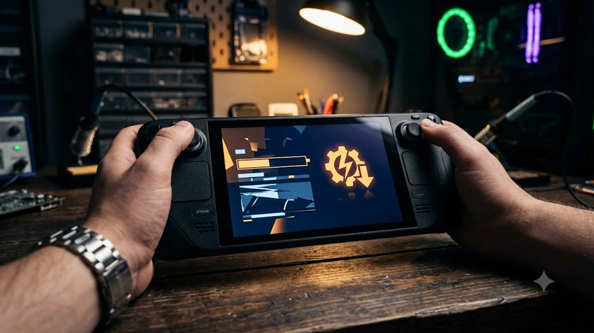

최근 레노버의 인기 UMPC 게이밍 기기에서 최신 BIOS 업데이트 배포 직후 화면이 켜지지 않는 심각한 장애가 지속적으로 보고되고 있습니다. 많은 사용자가 **리전고 BIOS** 업데이트 후 전원 LED만 들어오고 화면이 검게 먹통이 되는 **벽돌 현상**을 경험하며 긴급 조치법을 찾고 있습니다. 서비스센터를 찾기 전 집에서 바로 시도할 수 있는 복구 방법과 예방법을 정리했습니다.

## 레노버 리전고 최신 BIOS 업데이트 먹통 현상 개요

### 최신 BIOS(N3CN42WW) 배포 직후 발생한 블랙스크린 이슈
2026년 8월 초 배포된 레노버 리전고(Legion Go)의 최신 펌웨어 N3CN42WW 버전 적용 직후, 기기가 정상적으로 부팅되지 않는 블랙스크린 현상이 국내외 테크 커뮤니티에서 동시다발적으로 터져 나왔습니다. 전원 버튼의 LED 링에는 불이 들어오고 팬도 정상 회전하지만, 디스플레이에는 아무런 화면도 들어오지 않는 증상이 대표적입니다.

### 전원 및 LED 작동 중 화면 불통 현상의 주요 원인
이번 장애는 BIOS 업그레이드 과정에서 디스플레이 컨트롤러 초기화 시퀀스에 오류가 발생하거나, NVRAM 가상 메모리 데이터가 제대로 갱신되지 않아 일어나는 메모리 트레이닝 실패가 주원인으로 분석됩니다. 시스템 내부적으로는 정상 동작을 시도하지만 디스플레이 출력이 차단되는 상태가 유지되는 것입니다.

### 무상 보증 기간 만료 사용자들의 피해 현황 및 이슈 크기
리전고 초기 구매자들의 경우 이미 1년의 무상 보증 기간이 끝난 경우가 많아, 단순 소프트웨어 업데이트 오류임에도 유상 메인보드 교체 판정을 받을까 우려하는 목소리가 커지고 있습니다. 사설 수리업체나 자가 복구를 시도하는 사용자가 급증하는 배경입니다.

## BIOS 업데이트 전후 주요 변화 및 위험 요소 분석

### 기존 BIOS 버전 대비 주요 업데이트 수정을 한눈에 보기
* **v32 대비 주요 변경점:** VRAM 할당 메모리 최적화, 고주파 팬 소음 조절 알고리즘 추가
* **안정성 이슈:** 시스템 세팅이 커스텀된 상태(VRAM 6GB 이상 변경 유저)에서 덮어쓰기 업데이트 시 높은 확률로 부팅 오류 발생
* **펌웨어 체인 문제:** 기존 드라이버와의 패치 불일치로 인한 디스플레이 출력 타이밍 에러

### 자동 업데이트(Windows Update)를 통해 강제 적용되는 문제점
사용자가 직접 레노버 전용 프로그램(Legion Space)을 통해 설치하지 않더라도, 윈도우 선택적 업데이트 항목이나 자동 드라이버 업데이트 기능을 통해 자신도 모르게 BIOS가 업데이트되어 먹통이 되는 사례가 늘고 있습니다. 고성능 게이밍 환경을 유지하기 위한 네트워크 세팅도 고려 대상이지만, 이처럼 시스템 안정성을 위협하는 자동 업데이트는 미리 차단하는 편이 안전합니다. 차세대 고속 네트워크 설정에 관한 자세한 정보는 [Wi-Fi 8 공유기 진짜 살까? 2026 차세대 네트워크 완전 정리](/posts/it-devices/wifi-8-next-gen-router-trend-2026/) 글에서도 참고할 수 있습니다.

### 현시점 업데이트를 반드시 보류해야 하는 이유와 장단점
> **경고:** 현재 배포된 N3CN42WW 패치는 레노버 측의 공식 픽스 버전이 새로 나오기 전까지 절대로 업데이트해서는 안 됩니다.

- **장점:** 최신 게임 실행 시 미세한 스터터링 개선 효과
- **단점:** 시스템 완전 먹통(Brick) 위험, 복구 과정에서 데이터 손실 가능성 존재

## 리전고 화면 먹통 발생 시 실제 대응 경험 및 조치 흐름

### 업데이트 직후 벽돌 현상을 겪은 실제 유저들의 증상 공통점
실제 피해 사용자들의 공통된 증상은 업데이트 완료 후 재부팅 과정에서 화면에 'Lenovo' 로고조차 떠오르지 않는다는 점입니다. 디스플레이 백라이트조차 들어오지 않아 마치 전원이 완전히 꺼진 것처럼 보이지만, 우측 상단 팬은 최대 속도로 돌며 발열이 심하게 발생합니다.

### 외부 모니터 출력 및 강제 리셋 시도 시 유의사항
C타입 포트를 통해 외부 모니터나 포터블 디스플레이에 연결해도 DP 신호 없음(No Signal) 메시지만 출력됩니다. 이는 단순 디스플레이 패널 불량이 아닌 메인보드 단의 POST(Power-On Self-Test) 과정에서 시스템이 걸려 있음을 의미합니다.

### 센터 방문 전 사용자가 직접 확인했던 단계별 조치 경과
1. **1단계:** 전원 버튼 30초 이상 눌러 강제 종료 후 재부팅 시도 (대부분 실패)
2. **2단계:** 충전 케이블을 뽑고 잔여 전력 완충 방전 후 전원 인가 (일부 성공)
3. **3단계:** 하드웨어 키 조합을 활용한 BIOS 초기화 및 백플래시 진행 (성공률 높음)

## 서비스센터 방문 전 실천하는 3가지 긴급 복구 튜토리얼

### 1. CMOS 완전 방전 및 전원 버튼 롱 프레스 리셋 절차
가장 쉽고 기기에 손상을 주지 않는 1차 복구법입니다.

- **작업 방법:**
  1. 충전기를 기기에서 완전히 분리합니다.
  2. 전원 버튼을 60초 동안 계속 누르고 있습니다. (내부 잔여 전력 배출)
  3. 버튼에서 손을 떼고 약 5분간 기기를 방치합니다.
  4. 정품 충전기를 다시 연결하고 전원 버튼을 눌러 부팅 여부를 확인합니다. 첫 부팅 시 메모리 재훈련으로 인해 화면이 들어오기까지 최대 3분 정도 소요될 수 있으므로 기다려야 합니다.

### 2. 레노버 공식 복구 툴을 이용한 BIOS 백플래시(Downgrade) 시도법
화면은 나오지 않지만 내부적으로 BIOS 진입 키 입력을 인식하는 경우 사용할 수 있는 이전 버전 원복 방법입니다.

- **작업 방법:**
  1. 전원이 꺼진 상태에서 **[볼륨 +]** 버튼을 누른 채 **[전원 버튼]**을 눌러 Novo Menu 진입을 시도합니다.
  2. 화면에 불이 들어오지 않더라도 방향키 아래(↓) 2회, 엔터(Enter)를 눌러 BIOS Setup으로 들어갑니다.
  3. 구형 BIOS 파일(N3CN29WW 등)을 FAT32 포맷된 USB에 담아 C타입 포트에 연결한 후, **[Fn + R]** 또는 기기 복구 키 조합을 통해 자동 롤백을 유도합니다.

### 3. 윈도우 드라이버 자동 업데이트 차단 설정 가이드
정상 복구에 성공했거나 아직 업데이트를 하지 않은 사용자라면 재발 방지를 위해 윈도우의 장치 드라이버 자동 갱신을 차단해야 합니다.

- **작업 방법:**
  1. 단축키 `Win + R`을 눌러 `sysdm.cpl` (시스템 속성)을 실행합니다.
  2. **[하드웨어]** 탭으로 이동하여 **[장치 설치 설정]**을 클릭합니다.
  3. "제조업체 앱 및 시스템에 사용할 수 있는 지정된 아이콘을 자동으로 다운로드하시겠습니까?" 질문에서 **[아니요]**를 선택하고 저장합니다.
  4. 레노버 설정 앱(Legion Space) 내에서도 '자동 업데이트' 항목을 반드시 비활성화합니다.

기타 최신 IT 스마트 기기 이슈와 관련된 정보가 궁금하다면 [IT기기 전체 글 보기](/posts/it-devices/)를 참고하세요.

#리전고 #리전고BIOS #레노버리전고 #리전고벽돌 #BIOS업데이트오류 #리전고복구 #리전고블랙스크린 #UMPC