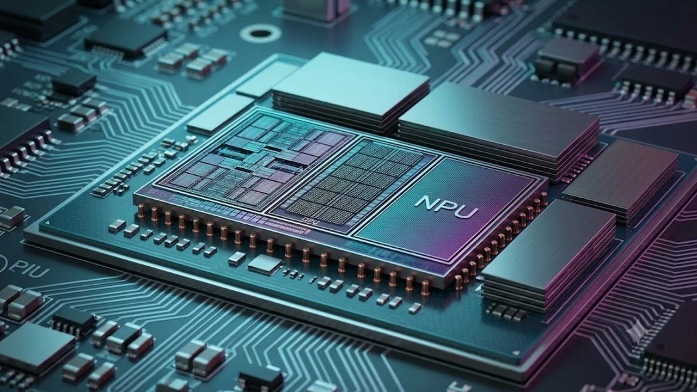

애플이 TSMC 2나노 공정을 적용한 **M5 맥북 프로** 시험 양산 라인을 전격 가동하면서 하이엔드 랩톱 시장이 다시금 들썩이고 있습니다. 차세대 실리콘 칩셋의 공정 미세화와 아키텍처 혁신 소식이 전해지자 현역 M4 라인업 구매를 망설이는 대기 수요자들의 셈법도 복잡해졌습니다. 최신 공급망 보도를 토대로 성능 변화폭과 현시점 구매 실익을 냉정하게 짚어봅니다.

## TSMC 2나노 공정 가동, M5 맥북 프로 양산 속보 총정리

### 대만 공급망 및 블룸버그발 시험 양산 돌입 팩트체크
대만 IT 전문 매체 디지타임스와 블룸버그 등 주요 외신에 따르면, TSMC는 2나노(N2) 공정 팹에서 애플 차세대 실리콘 웨이퍼의 시험 생산(Tape-out)을 시작했습니다. 2026년 4분기 초입에 들어선 현시점의 시험 양산은 2027년 상반기 상용화를 염두에 둔 정규 로드맵의 핵심 단계입니다. 이번 양산 물량의 1차 목표치는 전문가용 14인치 및 16인치 폼팩터에 들어갈 고성능 다이로 확인됩니다.

### TSMC 2나노(N2) 도입과 SoIC-X 2.5D 패키징의 기술적 의미
기존 3나노 공정과 비교해 N2 공정은 전력 효율을 25% 이상 끌어올리면서 동일 전력 대비 동작 클럭을 큰 폭으로 높입니다. 여기에 차세대 2.5D 어드밴스드 패키징 기술인 SoIC-X가 적용되어 CPU, GPU, 메모리 컨트롤러 사이의 물리적 배선 길이를 획기적으로 줄였습니다. 데이터가 칩 내부를 이동할 때 발생하는 병목과 지연 시간을 물리적으로 억제하는 구조입니다.

### 출시 예상 타임라인과 글로벌 공개 일정 시나리오
과거 M 시리즈의 전환 주기와 파운드리 수율 안정화 일정을 감안하면, 실제 완제품 출시는 2027년 봄 특별 이벤트 또는 WWDC 시점으로 좁혀집니다. 초기 수율 관리와 서버용 칩 생산 우선순위 탓에 일반 소비자용 기본형보다는 프로 및 맥스 칩이 탑재된 고급형 모델부터 순차적으로 시장에 풀릴 가능성이 높습니다.

## M5 칩셋 주요 스펙 유출: CPU·GPU와 독립 NPU의 진화

### 분리형 뉴럴 엔진 탑재와 온디바이스 AI 처리 성능 폭증
가장 큰 구조적 변화는 뉴럴 엔진(NPU)의 독립 블록화입니다. 거대언어모델(LLM)과 확산 모델 구동 비중이 폭증하면서 [텍스트 AI의 한계와 진화](/posts/it-devices/text-based-ai-limits-and-evolution/)에서 대두된 연산 부하를 하드웨어 수준에서 분담하도록 설계되었습니다. NPU 처리 역량은 기존 대비 1.8배 이상 늘어난 80 TOPS 수준에 육박할 것으로 관측됩니다.

### 통합 메모리 아키텍처 개선 및 대역폭 혁신 비교
통합 메모리 인터페이스 역시 한 단계 도약합니다. 차세대 고대역폭 LPDDR6 규격 채택이 유력해지면서 메모리 버스 대역폭이 30% 이상 넓어집니다. 8K ProRes 영상의 멀티스트림 편집이나 로컬 LLM 파인튜닝 시 메모리 스왑으로 인한 지연 현상이 눈에 띄게 줄어듭니다.

### 발열 제어 구조 개편과 배터리 타임 추가 확보 분석
2나노 공정 특유의 저발열 구조는 섀시 내부 열 설계에도 직접적인 여유를 제공합니다. 쿨링팬이 회전하기 시작하는 임계 온도가 상향 조정되어 일상적인 코드 빌드나 그래픽 작업 수준에서는 팬리스에 준하는 정숙성을 유지합니다. 실사용 배터리 구동 시간 역시 이전 세대 대비 1.5~2시간가량 추가 확보됩니다.

## M4 vs M5 맥북 프로 스펙 비교: 체감 격차와 장단점 분석

### 실사용 렌더링·컴파일 속도 차이와 워크플로우 변화
단순 벤치마크 점수 놀음을 넘어 실제 작업 공간에서의 체감 격차는 특정 고부하 영역에 집중됩니다. XCode 대규모 프로젝트 빌드나 Blender 3D 렌더링 환경에서는 15~20% 안팎의 시간 단축 효과를 냅니다. 다만 문서 작업, 웹 서핑, 단순 4K 컷 편집 위주의 일반 용도라면 체감 가능한 성능 차이는 매우 미미합니다.

> "미세 공정 전환의 최대 수혜자는 극한의 컴퓨팅 자원을 상시 소모하는 개발자와 3D 모션 아티스트이며, 일상 워크플로우에서는 체감하기 어렵다."

### 가격 인상 불가피론: 2나노 파운드리 단가 상승의 파장
차세대 공정 도입에는 필연적인 비용 부담이 따릅니다. TSMC의 2나노 웨이퍼 단가는 기존 대비 약 20~25% 비싸게 책정되어 출고가 압박이 상당합니다. 기본형 모델의 시작 가격이 최소 20만 원에서 30만 원가량 뛸 확률이 높아 체감 가성비는 오히려 하락할 수 있습니다.

### 신규 폼팩터 변화 유무와 포트 구성 변경 가능성
외형적인 알루미늄 유니바디 디자인은 기존 폼팩터의 틀을 대부분 유지합니다. 썬더볼트 5 기본 적용과 SD 카드 슬롯, HDMI 포트의 전송 대역폭 규격 개선 등 실속형 입출력 업그레이드가 중심입니다.

## 지금 M4 구매할까 M5 존버할까? 사용자 유형별 가이드

###작성할 주제나 키워드, 필수 포함 내용 등을 알려주시면 지정해주신 형식에 맞춰 바로 완성된 마크다운 본문을 출력해 드리겠습니다.