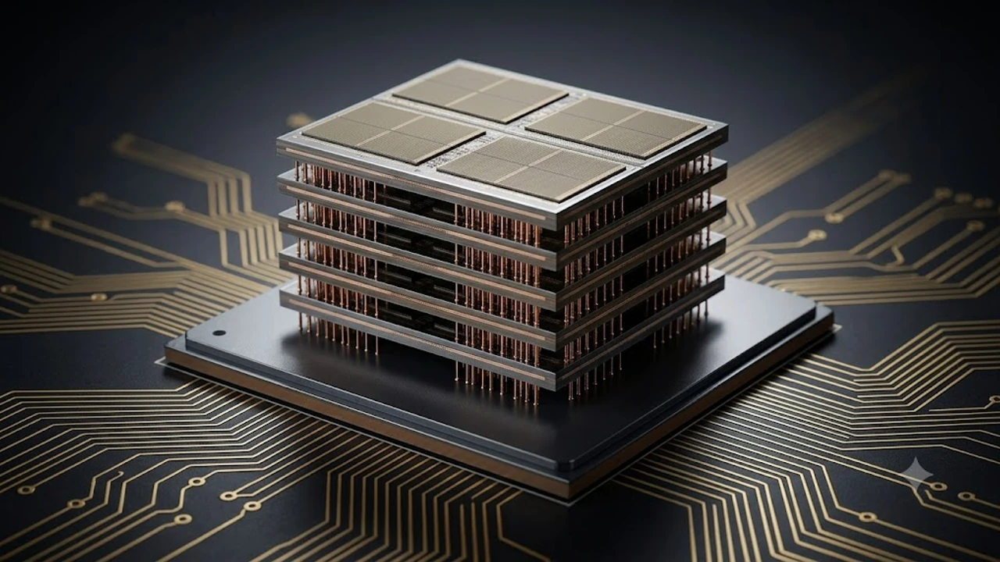

인공지능(AI) 가속기 시장의 폭발적인 성장과 함께 차세대 고대역폭 메모리 **HBM4** 기술 경쟁이 반도체 업계의 최전선으로 떠올랐습니다. 연산 장치와 메모리 사이의 데이터 전송 병목 현상을 해결할 핵심 열쇠로 꼽히는 6세대 고대역폭 메모리는 단순한 D램 적층을 넘어 첨단 파운드리 공정과의 직접적인 결합을 요구합니다. 초거대 언어 모델 인프라 구축의 판도를 바꿀 핵심 구조와 기술적 진화를 구체적으로 분석합니다.

## 차세대 HBM4가 가져온 설계 구조의 대전환

### 베이스 다이 파운드리 전환과 공정 혁신
HBM4의 가장 두드러진 변화는 최하단 베이스 다이(Base Die)를 기존 D램 공정이 아닌 선단 파운드리 로직 공정으로 제작한다는 점입니다. TSMC의 3nm·4nm 공정이나 삼성전자 파운드리의 FinFET 및 GAA 공정을 활용해 베이스 다이를 설계함으로써 전력 효율을 대폭 끌어올립니다.

* **로직 공정 접목**: 메모리 컨트롤러와 맞춤형 IP를 베이스 다이에 직접 통합
* **발열 제어**: 초고속 데이터 전송 시 발생하는 열 집중 현상을 하부 회로에서 효과적으로 분산
* **초미세 배선**: 인터포저와의 물리적 연결 밀도를 극대화해 신호 무결성 확보

### 2048비트 인터페이스 확장의 기술적 파급력
기존 HBM3E까지 유지되던 1024비트 버스 폭이 HBM4에 이르러 2048비트로 2배 확장되었습니다. 인터페이스 폭이 넓어지면서 핀(Pin)당 전송 속도를 극단적으로 높이지 않고도 총 대역폭을 비약적으로 끌어올리는 설계적 이점을 확보했습니다.

> 데이터 입출력 통로가 2배로 넓어짐에 따라 동일 전력 소모 기준 데이터 처리 용량이 대폭 향상되어 초거대 AI 모델의 추론 및 학습 지연 시간이 눈에 띄게 단축됩니다.

## 글로벌 반도체 연합 구도와 공급망 재편

### SK하이닉스와 TSMC 원팀 연합의 대응 전략
SK하이닉스는 어드밴스드 MR-MUF(Mass Reflow Molded Underfill) 패키징 노하우를 바탕으로 TSMC와의 긴밀한 파운드리 동맹을 구축했습니다. 엔비디아 루빈(Rubin) 플랫폼 공급망 주도권을 굳히기 위해 커스텀 HBM 설계 역량을 결합하고 있습니다.

* **협력 체계**: SK하이닉스 D램 적층 기술과 TSMC CoWoS 패키징의 결합
* **양산 검증**: 16단 적층 시제품을 조기 공급하여 고객사 검증 기간 단축
* **맞춤형 설계**: 대형 클라우드 서비스 제공업체(CSP) 전용 특화 기능 탑재

### 삼성전자의 턴키 솔루션과 맞춤형 수주 공세
삼성전자는 메모리, 파운드리, 첨단 패키징(AVP)을 한 번에 제공하는 턴키(Turn-key) 전략을 전면에 내세웠습니다. 모든 공정을 단일 기업 내부에서 일괄 처리함으로써 공급 리드타임을 줄이고 단가 경쟁력을 확보하는 접근법을 취합니다.

* **원스톱 서비스**: 설계부터 베이스 다이 생산, D램 적층, 패키징까지 일원화
* **하이브리드 본딩**: 16단 이상 고적층 구조에서 두께 제약을 극복할 비접촉 본딩 기술 적용
* **공급망 단순화**: 복수 파운드리 조율이 불필요한 단일 계약 구조 제시

### 마이크론의 틈새 공략과 수율 안정화 과제
마이크론은 1베타(1b) 공정 기반 HBM3E 양산 경험을 발판 삼아 차세대 규격 진입 속도를 올리고 있습니다. 다만 자체 파운드리 부재로 인해 외부 제조사와의 협력 최적화 및 양산 수율 확보가 시장 점유율 확대를 가르는 핵심 변수로 작용합니다.

## 데이터센터 AI 하드웨어 인프라에 미치는 영향

### 차세대 AI 가속기와 메모리 병목 현상 해소
GPU와 NPU의 연산 능력이 급증함에 따라 메모리 대역폭 부족으로 가속기가 유휴 상태에 머무는 메모리 월(Memory Wall) 현상이 심화되었습니다. HBM4는 초당 테라바이트급 이상의 전송 속도를 안정적으로 제공해 대규모 언어 모델(LLM) 구동 효율을 최적화합니다.

* **초거대 모델 연산**: 매개변수 1조 개 이상의 모델 분산 처리 최적화
* **TCO 절감**: 전력 소모 대비 연산 처리량 증대로 데이터센터 운영 비용 절감
* **서버 랙 밀도**: 단일 모듈 용량 확대로 동일 랙 공간 내 컴퓨팅 밀도 향상

### 고성능 IT 기기 시장의 하드웨어 수급 변동
엔터프라이즈 메모리 수요가 첨단 라인에 집중되면서 일반 소비자용 IT 기기 및 콘솔 시장의 D램 공급망에도 연쇄 반응이 나타나고 있습니다. 첨단 패키징 라인과 D램 웨이퍼 생산량이 AI 메모리에 우선 배정되는 흐름은 전반적인 시장 판도에 큰 영향을 미칩니다.

* 관련 기술 동향: [PS6 출시일 연기? AI 대란이 바꾼 3가지](/posts/it-devices/sony-ps6-release-delay-ai-ram-crisis-2026/)

## 차세대 메모리 기술 로드맵과 시장 전망

### 16단 적층과 하이브리드 본딩 기술의 상용화
초기 12단 구조를 넘어 16단 적층으로 넘어가면서 기존 마이크로 범프 방식은 높이 제한과 열 방출 한계에 부딪히고 있습니다. 이를 해결하기 위해 구리와 구리를 직접 맞닿게 연결하는 하이브리드 본딩(Cu-Cu Direct Bonding) 기술이 표준으로 자리잡는 추세입니다.

* **두께 최소화**: 범프 층을 없애 동일 패키지 규격 내 적층 수 극대화
* **신호 손실 억제**: 배선 길이 단축으로 고주파수 영역 전송 손실 최소화
* **방열 효율성**: 접촉 면적 확대로 수직 열 전도율 대폭 개선

### 커스텀 HBM 시장 확대와 소프트웨어 최적화
표준화된 범용 메모리를 넘어 특정 AI 워크로드에 맞춰 최적화된 커스텀(Custom) HBM 수요가 급증하고 있습니다. 빅테크 기업들이 자체 개발 칩(ASIC)을 채택함에 따라 메모리 내부 연산(PIM) 기술이 결합된 맞춤형 솔루션이 시장의 주류로 부상합니다.

[고성능 AI 노트북 및 스마트기기 쿠팡에서 보기](https://www.coupang.com/np/search?q=%EC%8A%A4%EB%A7%88%ED%8A%B8%EA%B8%B0%EA%B8%B0%20%EB%85%B8%ED%8A%B8%EB%B6%81&sourceType=affiliate&trackingCode=AF8691300)

#HBM4 #고대역폭메모리 #SK하이닉스 #삼성전자반도체 #AI가속기 #반도체트렌드 #차세대D램