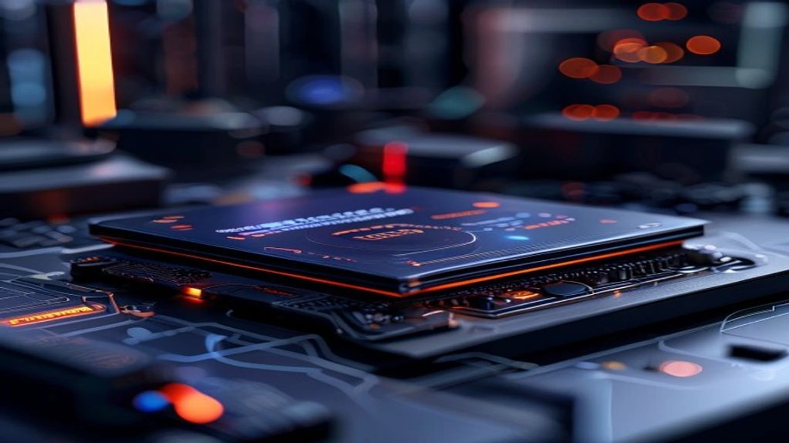

최근 스마트 홈 시장에서 가장 뜨겁게 떠오르는 화두는 단연 **AI 가전 NPU** 기술의 도입입니다. 과거의 스마트 홈 기기들이 대형 서버나 클라우드를 거쳐 느리게 반응했다면, 이제는 기기 내부에 탑재된 인공지능 칩셋이 스스로 생각하고 판단합니다. 가전 교체 주기를 맞이한 소비자들이 왜 일반 가전이 아닌 온디바이스 인공지능 가전에 지갑을 여는지 그 진짜 장점을 명확하게 정리했습니다.

## 2026년 AI 가전의 핵심, 온디바이스 NPU란 무엇인가?

### 온디바이스 NPU의 정의와 작동 원리
온디바이스 NPU(Neural Processing Unit, 신경망처리장치)는 가전제품 본체 내부에서 인간의 뇌 신경망처럼 복잡한 인공지능 연산을 초고속으로 처리하는 전용 반도체입니다. 중앙처리장치(CPU)가 일반적인 시스템 제어를 담당한다면, NPU는 오직 딥러닝과 데이터 추론에만 특화되어 설계되었습니다. 외부 인터넷망을 통하지 않고 가전제품 내부에서 자체적으로 데이터를 수집하고 연산하기 때문에, 명령 입력부터 기기 작동까지 걸리는 지연 시간이 제로에 가깝게 줄어듭니다.

### 클라우드 AI 가전 vs 온디바이스 NPU 가전 차이점
기존의 스마트 가전은 사용자의 음성 명령이나 센서 데이터를 수집하면 반드시 기업의 대형 클라우드 서버로 데이터를 전송해야 했습니다. 이 과정에서 서버 트래픽이 몰리면 반응이 느려지거나 인터넷 연결이 끊겼을 때 스마트 기능이 통째로 먹통이 되는 치명적인 한계가 존재했습니다. 반면 **AI 가전 NPU** 탑재 모델은 서버를 거치지 않고 기기 독립적으로 작동하므로 트래픽 병목 현상이 발생하지 않고 일관된 고성능을 유지합니다.

### 왜 2026년 현재 대세 기술로 주목받는가?
2026년 현재 글로벌 가전 기업들이 NPU 탑재에 사활을 거는 이유는 가전제품의 에너지 효율 등급 기준이 과거보다 훨씬 까다로워졌기 때문입니다. 가전제품 스스로 실시간 전력 소비를 제어하려면 수 밀리초(ms) 단위의 빠른 판단이 필요한데, 이는 기존 하드웨어로는 불가능에 가깝습니다. 더불어 개인정보 보호에 대한 소비자들의 눈높이가 높아지면서 거실이나 침실에서 발생하는 생활 데이터를 외부로 송출하지 않는 온디바이스 기술이 시장의 표준으로 자리 잡았습니다.

## NPU 가전이 가져온 일상의 변화와 진짜 장점

### 전기세 절감의 일등 공신, 실시간 전력 최적화 제어
온디바이스 NPU 가전의 가장 강력한 무기는 매달 청구되는 고정 비용을 줄여준다는 점입니다. 예를 들어 NPU 가 탑재된 에어컨은 단순히 설정 온도를 맞추는 것을 넘어, 집안의 단열 상태와 실내 인원수, 심지어 가구 배치에 따른 공기 흐름까지 실시간으로 추론합니다. 한국전력공사의 주택용 전력 단가 가이드를 기반으로 누진세 구간을 넘지 않도록 실외기 모터 속도를 1Hz 단위로 미세 제어함으로써, 구형 인버터 에어컨 대비 최대 35% 이상의 전력 소비를 감축하는 탁월한 효율을 보여줍니다.

### 인터넷 연결 없이도 완벽한 오프라인 음성 인식 및 자동화
와이파이 공유기가 고장 나거나 통신사 네트워크 장해 발생 시 기존 스마트 가전은 무용지물로 전락했습니다. 하지만 NPU 가 탑재된 스마트 세탁기와 냉장고는 인터넷선이 뽑힌 상태에서도 "세탁 시작해줘", "보관 중인 우유 유통기한 언제까지야?" 같은 자연어 명령을 정확하게 인식합니다. 기기 내부에 수십만 가지의 생활 언어 데이터베이스와 음성 인식 모델이 내장되어 있어 고속 로컬 연산이 가능하기 때문입니다.

> **현장 실사용자 피드백:** 인터넷망이 자주 불안정해지는 고층 아파트나 외곽 지역 단독주택에서 온디바이스 AI 가전을 가동했을 때, 통신 끊김으로 인한 오작동이 단 한 차례도 발생하지 않아 가전 본연의 신뢰도가 크게 상승했습니다.

### 개인정보 유출 걱정 없는 로컬 데이터 처리의 안전성
집안 내부를 촬영하는 스마트 로봇청소기나 방 안의 소리를 인식하는 스마트 허브를 사용할 때 사생활 노출 우려는 늘 따라다니는 문제였습니다. 실제로 해외 유출 사례 중 상당수가 클라우드 서버 해킹이나 전송 과정에서 발생했습니다. NPU 기반 가전은 카메라와 마이크로 입력된 공간 정보, 사용자 음성, 생활 패턴 데이터를 가전 기기 밖으로 절대 내보내지 않고 내부 칩셋 안에서 암호화하여 소비한 뒤 파기하므로 보안성이 매우 뛰어납니다.

[관련 글 보기](/posts/it-devices/)

## 기존 스마트 가전 vs NPU 탑재 AI 가전 전격 비교

### 삼성 비스포크 AI vs LG 오브제컬렉션 AI의 NPU 활용법
국내 가전 양대 산맥인 삼성전자와 LG전자는 NPU를 활용하는 방향성에서 뚜렷한 기술적 차이를 드러냅니다. 
- **삼성 비스포크 AI:** 기기 간의 초연결성에 집중합니다. 냉장고에 탑재된 NPU가 내장 카메라 영상을 분석하여 식재료 리스트를 생성하면, 이 데이터를 기반으로 인덕션과 오븐이 최적의 조리 온도를 내부 칩셋끼리 직접 통신하며 동기화합니다.
- **LG 오브제컬렉션 AI:** 단일 기기의 완벽한 최적화와 내구성에 집중합니다. 세탁기 내 NPU가 투입된 의류의 무게와 재질을 100만 개 이상의 빅데이터와 대조하여 실시간으로 판별한 뒤, 옷감 손상을 최소화하는 전용 드럼 회전 패턴을 실시간으로 생성하여 가동합니다.

### 구형 가전과 비교한 초기 구매 비용 대비 장기적 가성비 분석
NPU 탑재 AI 가전은 일반형 가전이나 1세대 스마트 가전에 비해 초기 구입 비용이 약 15%에서 25%가량 비싸게 책정되어 있습니다. 그러나 실제 소비 전력 감소량과 가전제품 수명 연장 효과를 고려하면 3년 이내에 초기 투자 비용을 완전히 회수할 수 있습니다. 

| 가전 분류 | 초기 구매 비용 | 월평균 전기요금 (누진세 반영) | 기기 오작동률 | 패턴 학습 속도 |
| :--- | :--- | :--- | :--- | :--- |
| **구형/일반 가전** | 낮음 | 높음 (제어 불가능) | 낮음 | 없음 (정적 기능) |
| **1세대 클라우드 가전** | 보통 | 보통 (서버 제어) | 보통 (망 상태 의존) | 느림 (서버 전송 필요) |
| **2026 NPU AI 가전** | 높음 | **최소화 (실시간 로컬 제어)** | **극도로 낮음** | **즉시 (실시간 자체 추론)** |

### 사용자 맞춤형 패턴 학습 속도 및 정확도 비교
클라우드 기반 가전은 가구원들의 생활 패턴을 학습하여 자동화 규칙을 제안하기까지 최소 수주일에서 한 달 이상의 데이터 누적이 필요했습니다. 반면 고성능 로컬 NPU를 장착한 최신 가전은 단 3회에서 5회 정도의 반복 행동만으로도 사용자의 출근 시간, 선호하는 실내 습도, 주로 사용하는 세탁 코스를 정확하게 파악합니다. 외부 변수를 배제하고 오직 해당 주거 공간의 데이터만 집중적으로 연산하기 때문에 맞춤형 자동화의 정확도가 압도적으로 높습니다.

## AI NPU 가전 구매 시 꼭 확인해야 할 체크리스트와 단점

### 아직은 아쉬운 점: 소프트웨어 업데이트 지원 주기 문제
하드웨어 내부에 탑재된 NPU 칩셋의 연산 성능은 고정되어 있는 반면, 소프트웨어 인공지능 알고리즘은 매년 빠른 속도로 진화합니다. 제조사가 구매 후 지속적으로 전용 가전 운영체제(OS)를 업데이트해주지 않는다면 최신 AI 기능을 온전히 누리지 못하고 기기가 빠르게 도태될 위험성이 큽니다. 제품을 고를 때는 단순한 스펙 외에도 해당 제조사가 최소 5년 이상의 소프트웨어 사후 지원(OS 업그레이드)을 보장하는지 반드시 확인해야 합니다.

### "진짜 NPU가 맞을까?" 무늬만 AI인 가전 걸러내는 방법
시장이 급성장하면서 기존의 단순 타이머 기능이나 고정된 센서 제어 방식에 'AI' 이름만 붙여 허위 과장 광고를 하는 제품들이 다수 적발되고 있습니다. 진짜 온디바이스 NPU 가전을 구별하려면 카탈로그의 상세 스펙 표를 면밀히 따져봐야 합니다. 

- 제품 상세 설명에 **'로컬 자체 연산 프로세서 명칭'**이 정확히 명시되어 있는지 확인합니다.
- 인터넷 공유기를 완전히 끈 상태에서도 핵심 자동화 기능이나 음성 명령이 정상 작동하는지 오프라인 구동 여부를 매장 점원에게 직접 교차 검증하는 과정이 필수적입니다.

### 내 라이프스타일에 맞는 AI 가전 용량 및 기능 선택 가이드
가족 구성원 수와 주거 형태에 따라 NPU의 효용성은 판이하게 달라집니다. 1인 가구나 외부 활동이 많아 집을 자주 비우는 환경이라면 고가의 NPU 가전이 제공하는 실시간 제어 기능이 과스펙이 될 수 있습니다. 반면 아이가 있어 가전 가동 횟수가 많고 24시간 내내 일정한 실내 환경을 유지해야 하는 다인 가구, 혹은 가전제품 오작동 시 빠른 대처가 어려운 고령층이 거주하는 가정에서는 온디바이스 AI 가전이 제공하는 자동 위험 감지 및 자가 진단 기능이 비용 이상의 확실한 가치를 제공합니다.

**함께 읽으면 좋은 글**
- [GaN 충전기, 2026년 진짜 사야 할 숨은 꿀템 3선](/posts/it-devices/supertiny-gan-charger-travel-tech-2026/)
- [Z폴드8 울트라 진짜 바뀐 3가지! 사야 할까?](/posts/it-devices/galaxy-z-fold8-ultra-unpacked-specs-2026/)

#AI가전 #온디바이스AI #NPU칩셋 #스마트가전 #삼성비스포크AI #LG오브제컬렉션 #전기세절감 #스마트홈2026