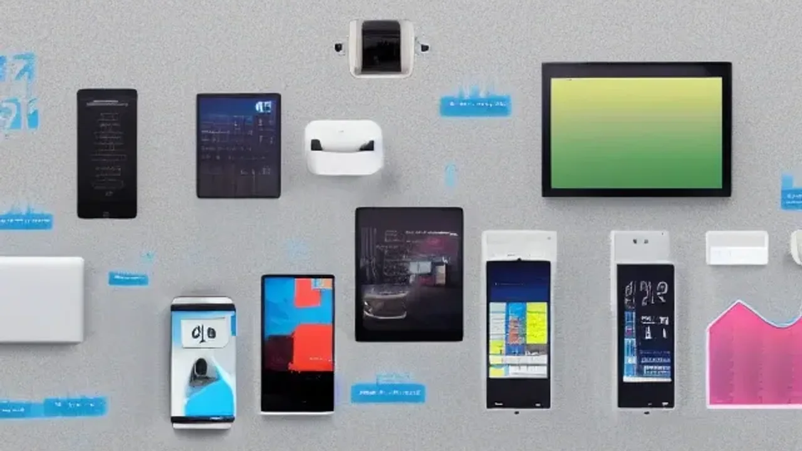

2026년 글로벌 IT 시장의 중심축이 소프트웨어에서 하드웨어로 급격히 이동하고 있습니다. 특히 화면 속 대화형 챗봇을 넘어 스스로 판단하고 움직이는 **피지컬 AI 가전** 트렌드는 가전 시장의 생태계를 통째로 흔드는 중입니다. 단순한 원격 제어를 넘어 사용자 맥락을 실시간으로 학습하는 이 혁신적인 디바이스들이 우리 일상을 어떻게 바꾸고 있는지 구체적인 사례와 함께 분석합니다.

## 2026년 가전의 패러다임 전환: 왜 지금 '피지컬 AI'인가?

### 화면 속 챗봇에서 움직이는 로봇으로, 피지컬 AI의 정의
기존의 인공지능이 모니터나 스마트폰 액정 안에서 텍스트와 이미지로 답변하는 형태에 머물렀다면, 피지컬 AI(Physical AI)는 **물리적인 하드웨어 몸체와 결합하여 실제 환경을 변화시키는 기술**을 뜻합니다. 가상 세계에 갇혀 있던 인공지능에 '눈'이 되는 비전 센서와 '발'이 되는 자율주행 모듈, '손'이 되는 액추에이터를 달아준 셈입니다. 2026년 현재 이 기술은 가전제품과 로보틱스의 경계를 완전히 허물며 가구 성원의 역할을 대행하는 수준까지 진화했습니다.

### 기존 스마트 가전 vs 온디바이스 피지컬 AI 가전 차이점 분석
과거의 '스마트 가전'은 단순히 와이파이(Wi-Fi)를 연결해 스마트폰 앱으로 전원을 켜고 끄거나, 정해진 스케줄에 따라 작동하는 일차원적 제어에 그쳤습니다. 반면 온디바이스(On-Device) 연산 장치를 탑재한 피지컬 AI 기기는 **클라우드 서버를 거치지 않고 기기 자체에서 실시간 데이터를 처리**합니다. 

> * **기존 스마트 가전:** 사용자의 수동 명령 기반, 단순 원격 제어, 네트워크 지연 발생
> * **피지컬 AI 가전:** 센서 데이터 기반의 자율적 판단, 사용자 행동 패턴 학습, 즉각적인 오프라인 연산

### Computex 2026에서 입증된 글로벌 빅테크의 하드웨어 내재화 트렌드
지난 6월 대만에서 개최된 Computex 2026에서 엔비디아와 글로벌 제조사들은 '피지컬 AI 파트너십'을 전면에 내세웠습니다. 엔비디아의 로보틱스 플랫폼인 '젯슨(Jetson)'과 '오린(Orin)' 칩셋이 대기업의 가전 라인업에 대거 이식된 것이 핵심입니다. 텍스트를 이해하는 거대언어모델(LLM)을 넘어, 시각 정보와 물리적 역학을 동시에 이해하는 거대행동모델(LMM)이 가전제품의 메인 프로세서로 자리 잡았음을 전 세계에 입증했습니다.

## 내 일상을 바꾸는 피지컬 AI 가전 핵심 제품 및 장단점

### 스스로 카펫을 세탁하는 3세대 AI 로봇 청소기 분석
가장 먼저 혁신이 일어난 분야는 로봇 청소기 시장입니다. 2026년형 3세대 모델들은 바닥의 재질을 감지하는 수준을 넘어섰습니다. 전면 3D 비전 카메라와 ToF 센서로 카펫의 오염도를 실시간 측정하고, 오염이 심할 경우 스스로 내부 세제 탱크에서 전용 세제를 분사해 물걸레질과 흡입, 건조까지 단독으로 수행합니다. 고질적인 문제였던 반려동물의 배설물이나 가느다란 전선줄을 99.8% 확률로 회피하는 정밀함을 보여줍니다. 다만 고성능 센서와 연산 장치가 대거 추가되면서 초기 구매 비용이 200만 원대를 호가한다는 점은 명백한 진입 장벽입니다.

### 비전 카메라로 식재료를 인식하고 조리하는 스마트 오븐의 혁신
주방 가전 역시 완전히 새로운 국면을 맞이했습니다. 최신 스마트 오븐 내부에 탑재된 고온 견딤 비전 카메라는 투입된 식재료가 생선인지, 소고기인지, 냉동 피자인지 스스로 판별합니다. 두께와 신선도까지 체크하여 최적의 온도와 조리 시간을 자율적으로 설정합니다. 사용자가 레시피를 검색하고 예열 온도를 맞추는 번거로움이 통째로 사라진 셈입니다. 하지만 먼지나 기름때가 카메라 렌즈를 가릴 경우 인식률이 급격히 떨어지며, 주기적으로 내부 센서류를 관리해야 하는 번거로움이 존재합니다.

### 집안의 대소사를 관리하는 자율주행 홈 에이전트 허브의 실제 성능
바퀴가 달린 이동형 디스플레이 형태의 홈 에이전트 허브는 거실纹방을 자유롭게 이동하며 집안 전체를 모니터링합니다. 거주자의 안색이나 걸음걸이를 분석해 건강 이상 징후를 감지하고, "약 먹을 시간입니다"와 같은 맞춤형 비서 역할을 수행합니다. 실내 공기질이 나빠지면 공기청정기를 가동하라는 명령을 다른 가전에 전달하는 가전 제어 타워 역할도 맡습니다. 그러나 상시 자율주행으로 인한 배터리 소모가 극심해 대기 타임이 생각보다 짧고, 턱이 많은 한국형 아파트 구조에서는 이동 제약이 발생한다는 한계가 명확합니다.

[관련 글 보기](/posts/it-devices/)

## 테크 리뷰어가 직접 써본 피지컬 AI 가전 3개월 리얼 사용기

### "귀찮은 설정이 사라졌다" – 사용자의 맥락을 읽는 자동화 경험
실제 거실과 주방에 관련 기기들을 배치하고 3개월간 생활하면서 가장 크게 체감한 변화는 '수동 설정의 종말'이었습니다. 퇴근 후 집에 돌아왔을 때 스마트폰을 켜서 조명을 맞추고 에어컨을 켤 필요가 없습니다. 홈 에이전트가 현관문이 열리는 소리와 사용자의 피로 섞인 걸음걸이를 인식해 은은한 간접 조명을 켜고 스마트 오븐에 미리 넣어둔 밀키트를 해동하기 시작합니다. 기술이 인간의 행동을 먼저 예측해 움직이는 경험은 극도의 편리함을 선사합니다.

### 프라이버시와 보안 이슈: 집안을 촬영하는 카메라와 데이터 안전성
편리함의 이면에는 날카로운 칼날이 숨어 있습니다. 기기들이 집안을 돌아다니며 사방을 카메라로 촬영하고 음성을 수집하기 때문에 프라이버시 침해에 대한 공포가 상존합니다. 거실의 소파 배치, 개인의 활동 시간대, 심지어 옷을 벗고 다니는 사적인 모습까지 데이터화될 수 있습니다. 2026년형 제품들은 이를 방지하기 위해 핵심 연산을 외부 서버로 보내지 않는 '완전 온디바이스 방식'을 채택하고 있지만, 해킹에 대한 심리적 불안감을 완전히 지우기는 어렵습니다.

### 높은 가격대와 초기 세팅의 진입 장벽: 진짜 돈값을 할까?
피지컬 AI 시스템을 제대로 누리기 위해서는 단일 기기 구매만으로는 부족합니다. 메인 허브와 로봇 청소기, 주방 가전이 서로 호환되는 생태계를 구축해야 하므로 수백만 원에서 천만 원 단위의 비용이 지출됩니다. 게다가 최초 설치 시 집안 공간의 3D 맵핑을 정밀하게 진행해야 하고, 가전 간의 통신 프로토콜을 매칭하는 과정에서 기계에 익숙하지 않은 고령층이나 일반 소비자들은 심각한 두통을 겪을 수밖에 없습니다. 스마트 홈 구축에 열정이 있는 얼리어답터가 아니라면 비용 대비 만족도가 기대에 못 미칠 가능성이 존재합니다.

## 실패 없는 피지컬 AI 스마트홈 구축 가이드 및 구매 팁

### 우리 집 구조와 라이프스타일에 맞는 필수 AI 가전 우선순위 정하기
모든 가전을 한 번에 바꾸는 무모한 지출은 피해야 합니다. 본인의 하루 일과 중 가장 많은 시간을 빼앗는 가사 노동이 무엇인지 파악하는 과정이 선행되어야 합니다. 청소에 투여되는 시간이 아깝다면 3D 비전 센서가 달린 최고급형 로봇 청소기에 예산을 집중하는 것이 현명합니다. 맞벌이 부부이거나 요리에 서툴다면 스마트 오븐이나 AI 인덕션 같은 주방 라인업을 우선순위에 두는 전략이 효율적입니다. 원룸이나 소형 빌라에 거주한다면 자율주행 홈 허브보다는 고정형 스마트 스피커 허브로도 충분한 효과를 냅니다.

### 기존 가전과 피지컬 AI 기기를 매끄럽게 연동하는 생태계 설정법
새로 구매한 인공지능 가전이 기존에 쓰던 구형 가전들과 따로 논다면 반쪽짜리 스마트홈에 불과합니다. 글로벌 표준 스마트홈 프로토콜인 **'매터(Matter) 2.0' 지원 여부를 반드시 확인**해야 합니다. 매터 인증을 받은 기기들은 제조사가 다르더라도 하나의 허브 앱에서 통합 제어가 가능합니다. 구형 가전의 경우 스마트 플러그나 IR(적외선) 리피터를 중간에 연결해 피지컬 AI 허브의 명령을 받을 수 있도록 가상 생태계를 구축해 주는 작업이 필수적입니다.

### 가성비와 프리미엄 사이, 2026 하반기 현명한 소비를 위한 체크리스트
하반기 가전 구매를 앞두고 있다면 무조건 최신형 칩셋 이름에 현혹되지 말고 세 가지 핵심 지표를 따져야 합니다. 첫째, 클라우드 연결 없이 작동하는 온디바이스 NPU(신경망처리장치) 연산 속도가 최소 40 TOPS 이상인지 확인해야 답답함 없는 실시간 처리가 가능합니다. 둘째, 제조사가 지속적인 행동 모델 업데이트(OTA)를 보장하는지 체크해야 기기가 바보가 되는 현상을 막을 수 있습니다. 셋째, 물리적 오작동 발생 시 하드웨어 출장 AS가 신속하게 지원되는 대기업 생태계 제품인지 검증하는 과정이 안전합니다.

**함께 읽으면 좋은 글**
- [화면 자동화 AI 기기 진짜 바뀔까 완전 정리](/posts/it-devices/screen-automation-ai-agentic-device-2026/)
- [GaN 충전기, 2026년 진짜 사야 할 숨은 꿀템 3선](/posts/it-devices/supertiny-gan-charger-travel-tech-2026/)

#피지컬AI가전 #스마트홈로봇 #2026가전트렌드 #온디바이스AI #로봇청소기추천 #스마트가전 #테크트렌드 #매터프로토콜 #Computex2026