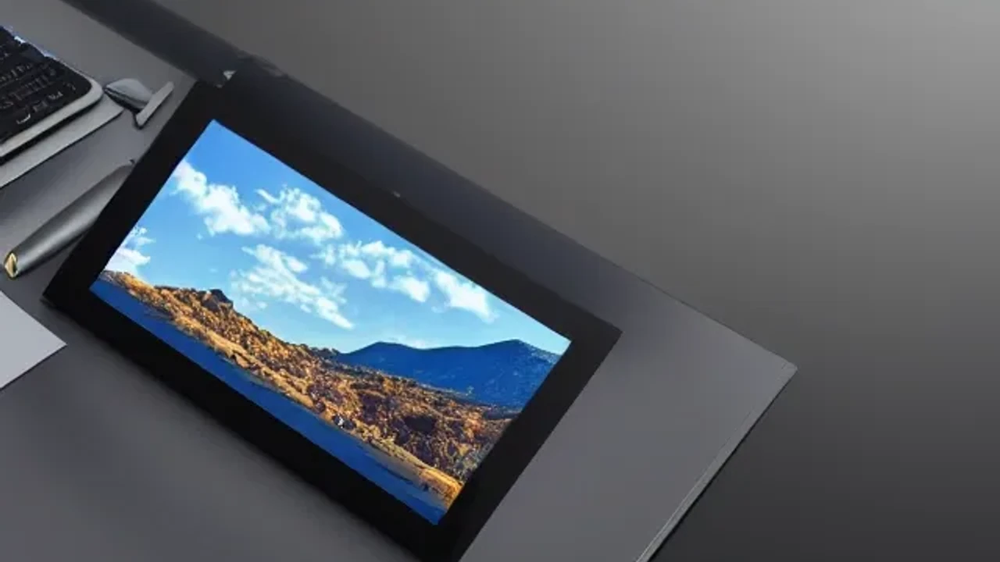
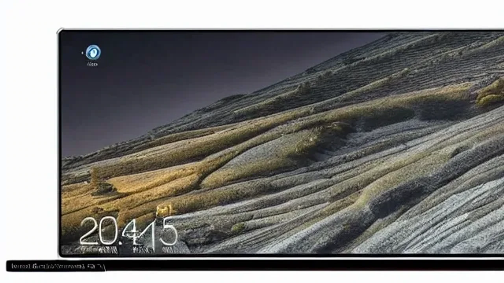

최근 모바일과 PC 생태계는 사용자가 직접 화면을 터치하거나 클릭하지 않아도 AI가 알아서 앱을 조작하는 시대로 진입했습니다. 이러한 흐름 속에서 **화면 자동화 AI 기기**는 인간의 복잡한 UI 학습 과정을 생략하고 말 한마디로 모든 복잡한 디지털 태스크를 대행하는 혁신을 보여줍니다. 스마트폰을 사용하는 방식을 근본적으로 바꾸어 놓을 이 기술의 실체와 핵심 기능을 아래에서 명확히 짚어봅니다.

## 손 안 대고 끝내는 화면 자동화 AI 기기의 핵심 개념과 구동 원리

### LAM(대형 액션 모델)이 화면을 인식하고 제어하는 방식
기존의 AI가 텍스트나 이미지를 생성하는 데 그쳤다면, 최근 등장한 대형 액션 모델(Large Action Model, LAM)은 디스플레이에 표시된 픽셀 데이터를 실시간으로 분석합니다. 화면 속 버튼의 위치, 텍스트 입력창, 체크박스의 의미를 인간처럼 정확하게 시각적으로 이해한 뒤 가상의 터치 및 스크롤 이벤트를 발생시킵니다. API 연동이 되어 있지 않은 일반 앱이라도 AI가 화면 자체를 눈으로 보고 직접 누르는 방식으로 구동되므로 확장성이 무한합니다.

### 기존 대화형 챗봇 및 스마트폰 매크로와의 결정적 차이점
기존 챗봇은 맛집을 찾아달라는 요청에 링크나 텍스트 결과만 제공했습니다. 반면 스마트폰 매크로는 정해진 좌표만 기계적으로 반복하여 터치하므로 화면 레이아웃이 조금만 바뀌어도 에러가 발생합니다. 이와 달리 화면 자동화 기술은 앱의 UI 변경이나 팝업창 발생 같은 돌발 상황을 실시간으로 추론하여 스스로 대응 경로를 수정하는 유연성을 가집니다.

### 보안과 개인정보 보호: 내 화면을 AI에게 맡겨도 안전할까?
사용자의 실시간 디스플레이 화면을 AI가 계속 모니터링해야 하므로 금융 정보나 개인 메시지 유출에 대한 우려가 필연적으로 따릅니다. 이를 해결하기 위해 최신 기기들은 민감한 화면 캡처 데이터를 외부 클라우드로 전송하지 않고 기기 내부의 독립된 보안 영역(Secure Enclave)에서만 처리하는 방식을 채택합니다. 개인정보 식별 구간에서는 AI의 화면 캡처가 자동으로 일시 정지되는 온디바이스 필터링 기술이 필수적으로 적용됩니다.

## 2026년 대세로 떠오른 화면 자동화 지원 기기 및 OS 비교 분석

### 애플 시리(Siri) 대개편과 iOS 19가 보여주는 스크린 오토메이션
애플은 온디바이스 AI 칩셋의 성능을 극한으로 끌어올려 사용자가 보고 있는 화면의 맥락을 시리가 온전히 이해하도록 설계했습니다. 친한 지인이 문자로 보낸 주소를 복사해서 내비게이션 앱에 넣고 경로 지정을 하라고 명령하면, 시리가 백그라운드에서 메시지 앱과 지도 앱의 화면을 직접 넘겨가며 조작합니다. 강력한 하드웨어 통제력을 기반으로 앱 간 데이터 이동과 화면 제어가 부드럽게 연결되는 장점을 가집니다.

### 안드로이드 생태계의 AI 에이전트와 전용 하드웨어의 등장
안드로이드 진영은 개방형 생태계를 무기로 서드파티 앱 조작에서 압도적인 우위를 점합니다. 구글 제미나이 아키텍처를 기반으로 작동하는 에이전트는 배달 앱, 쇼핑 앱, 은행 앱을 넘나들며 최저가 상품을 장바구니에 담고 결제 직전 단계까지 화면을 자동으로 넘겨줍니다. 이외에도 폼팩터 자체를 AI 에이전트 구동에 최적화한 전용 포터블 하드웨어들이 시장에 출시되며 얼리어답터들의 시선을 사로잡고 있습니다.

### 어떤 플랫폼을 선택해야 할까? 나에게 맞는 생태계 진단
개인정보 보호와 부드러운 앱 간 연동을 원한다면 독자적인 보안 칩셋을 갖춘 OS 기반의 기기가 유리합니다. 반면 배달, 쇼핑, 예약 등 실생활에서 자주 쓰는 외부 앱들을 제약 없이 자동화하고 싶다면 오픈소스 기반의 안드로이드 에이전트 기기가 적합합니다. 자신이 주로 사용하는 핵심 작업이 시스템 내부 제어인지, 외부 서비스 활용인지에 따라 선택 방향이 갈립니다.

## 실생활이 통째로 바뀌는 스크린 에이전트 활용 가이드와 장단점

### 복잡한 앱 결제부터 예약까지 말 한마디로 끝내는 실제 시나리오
> "이번 주 토요일 저녁 7시 강남역 근처 이탈리안 레스토랑 4명 예약하고, 예약 완료되면 단체 카톡방에 공지해줘."

사용자가 이 한마디만 던지면 AI 에이전트는 맛집 예약 앱을 켜서 필터를 설정하고 빈자리를 조회합니다. 인원수와 시간을 선택한 뒤 예약 확정 직전의 화면을 띄워 유저의 최종 승인을 확인합니다. 승인이 떨어지면 결제를 마무리하고 카카오톡을 열어 대화방에 예약 내역을 텍스트로 타이핑해 전송하는 일련의 과정을 터치 한 번 없이 완료합니다.

### 업무 생산성 200% 올리기: 반복적인 데이터 입력 및 서류 작업 자동화
직장인이나 마케터가 겪는 반복적인 엑셀 데이터 입력 작업도 스크린 오토메이션의 핵심 활용 영역입니다. 웹 브라우저에 띄워진 수십 개의 고객 문의 내역을 인식하여 사내 인트라넷 시스템의 정해진 양식 칸에 맞추어 자동으로 타이핑하고 저장 버튼을 누르는 프로세스를 구축할 수 있습니다. 수작업으로 3시간 이상 걸리던 단순 반복 업무를 단 몇 분 만에 에러 없이 끝내도록 돕습니다.

[관련 글 보기](/posts/it-devices/)

### 아직은 아쉬운 점: 화면 인식 오류와 음성 명령의 한계
네트워크 연결 상태가 불안정하거나 앱이 예기치 못한 업데이트를 진행하여 버튼의 위치·디자인이 완전히 바뀌었을 때 AI가 순간적으로 길을 잃는 현상이 일어납니다. 또한 음성 인식의 미세한 오차로 인해 엉뚱한 메뉴를 클릭하거나 대기 시간이 길어지는 병목 현상도 간혹 관찰됩니다. 완벽한 자율 주행처럼 백그라운드에서 100% 신뢰하기에는 아직 사용자 개입과 모니터링이 일부 필요하다는 한계가 존재합니다.

## 화면 자동화 AI 시대를 준비하는 스마트폰 및 테크 기기 구매 팁

### 온디바이스 에이전트를 원활하게 구동하기 위한 필수 하드웨어 스펙
화면의 모든 픽셀을 초당 수십 번씩 캡처하고 추론 모델을 돌려야 하므로 하드웨어 스펙 요구치가 매우 높습니다. 최소 12GB 이상의 고대역폭 RAM과 강력한 NPU(신경망처리장치) 성능을 보장하는 최신 프로세서 탑재 여부를 반드시 체크해야 합니다. 고성능 칩셋이 부재한 보급형 기기에서는 화면 분석 속도가 느려져 자동화 과정에서 심한 버벅임이 발생합니다.

### 기존에 쓰던 구형 기기에서도 화면 자동화 기능을 쓸 수 있을까?
과거에 출시된 구형 스마트폰이나 태블릿은 하드웨어 자체 성능 한계로 인해 완전한 형태의 실시간 화면 제어를 온디바이스로 처리하기 어렵습니다. 다만 일부 제조사들은 클라우드 서버에 화면 데이터를 전송하여 연산하는 하이브리드 방식으로 구형 기기 지원을 확대하고 있습니다. 그러나 이는 데이터 전송 지연 시간이 발생하고 보안 측면에서 불리하므로 쾌적한 사용을 원한다면 신형 하드웨어 교체가 권장됩니다.

### 2026년 하반기 주목해야 할 스크린 오토메이션 지원 출시 예정 기기 리스트
올해 하반기에는 화면 제어 전용 전면 디스플레이를 장착한 차세대 미니멀 AI 단말기와 롤러블 형태의 스마트 기기들이 대거 대기 중입니다. 기존 스마트폰 바(Bar) 형태를 탈피하여 오직 음성과 화면 자동화 에이전트 구동만을 위해 무게를 대폭 줄인 웨어러블 디바이스 진영의 신제품들도 출시를 앞두고 있어 시장의 판도를 바꿀 준비를 마쳤습니다.

**함께 읽으면 좋은 글**
- [갤럭시 글라스 출시일과 가격 스펙 총정리](/posts/it-devices/galaxy-glass-unpacked-specs-release-date-2026/)
- [코파일럿 플러스 PC 온디바이스 AI 노트북 선택 기준](/posts/it-devices/copilot-plus-pc-laptop-guide-2026/)

#화면자동화AI기기 #AI에이전트 #LAM #대형액션모델 #스크린오토메이션 #온디바이스AI #테크트렌드 #스마트폰에이전트 #생산성IT기기