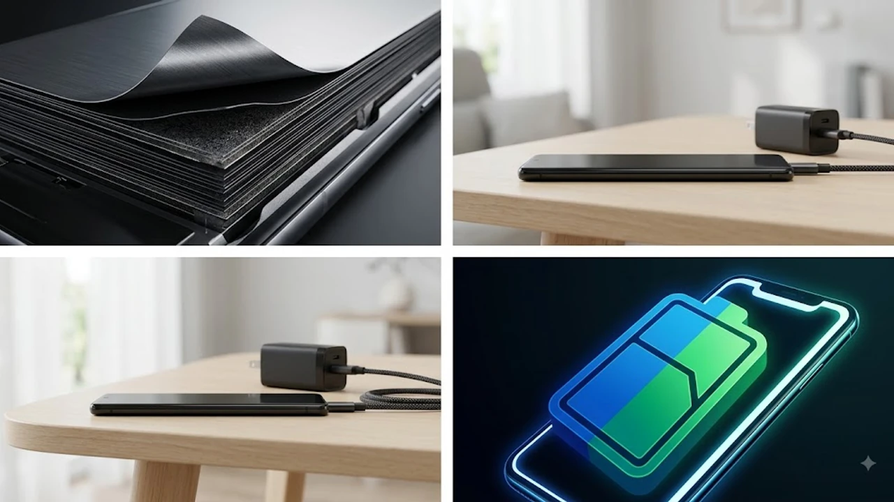

스마트폰 화면을 켜둘 때마다 빠르게 줄어드는 잔여 배터리 수치를 보며 불안을 느끼는 일은 일상적입니다. 차세대 **실리콘 배터리 스마트폰**은 기존 흑연 음극재 기반 배터리의 물리적 한계를 깨부수고 동일한 부피에서 용량을 비약적으로 끌어올리는 차세대 에너지 밀도 설계를 핵심 축으로 삼고 있습니다. 두께 8mm 안팎의 얇은 폼팩터를 유지하면서도 무려 9,000mAh를 넘어서는 압도적 전력량을 담아내는 기술적 변곡점이 눈앞에 다가왔습니다.

## 9,000mAh 스마트폰 등장과 실리콘-탄소 음극재 기술의 실체

### 5,000mAh 한계를 깬 실리콘-카본 배터리의 에너지 밀도 혁신
기존 리튬 이온 배터리에 쓰이던 흑연 음극재는 이론상 저장 용량이 그램당 약 372mAh 수준에 머물렀습니다. 반면 실리콘 소재는 이론상 그램당 4,200mAh라는 압도적인 리튬 이온 저장 능력을 지닙니다. 제조사들은 팽창 문제를 억제하기 위해 실리콘과 다공성 탄소를 나노 단위로 합성한 실리콘-탄소(Si/C) 복합체를 상용화했습니다. 전극 부피를 늘리지 않고도 리튬 이온 흡장량을 3배 이상 확보하며 단일 셀 9,000mAh 장착을 현실화했습니다.

### 온디바이스 AI 전력 소모 급증이 앞당긴 배터리 세대교체
최근 스마트폰에 탑재되는 거대언어모델(LLM)과 온디바이스 NPU 연산은 막대한 전력을 순간적으로 소비합니다. 화면이 꺼져 있는 대기 상태에서도 백그라운드 AI 에이전트가 작동하면서 기존 5,000mAh 배터리로는 하루를 버티기 어려워졌습니다. 하드웨어 전력 최적화만으로는 고사양 AI 기능을 뒷받침하기 어렵기에, 물리적인 배터리 밀도를 대폭 끌어올리는 방식이 유일한 해법으로 자리 잡았습니다.

### 기존 흑연 배터리 대비 무게와 두께 변화 분석
과거 7,000mAh 이상 고용량 기기들은 두께가 10mm를 훌쩍 넘고 무게가 240g에 달해 벽돌폰이라는 오명을 벗지 못했습니다. 그러나 6% 이상의 실리콘 함량을 적용한 차세대 셀은 부피당 에너지 밀도 800Wh/L 이상을 달성했습니다. 그 결과 9,000mAh 대용량을 탑재하고도 제품 두께는 8.4mm, 무게는 215g 수준으로 억제되어 플래그십 특유의 얇고 매끄러운 그립감을 온전히 유지합니다.

## 실리콘 배터리 탑재 기기 현황과 폼팩터 변화

### 플래그십과 중상급 라인업의 용량별 탑재 현황
주요 제조사들은 고성능 칩셋과 대화면을 갖춘 플래그십 모델부터 7,000~9,000mAh급 배터리를 우선 배치하고 있습니다. 특히 게이밍 특화 폰과 울트라 라인업에서 9,210mAh 듀얼 셀 구조를 선제적으로 채택했습니다. 중상급형 가성비 모델 역시 6,500mAh 수준을 기본 사양으로 맞추며 보조배터리 없는 외출 환경을 표준으로 만들어가는 추세입니다.

### 두께 8mm대 슬림 폼팩터를 유지한 제조사별 패키징 기술
단순히 셀 용량만 늘린 것이 아니라 내부 메인보드를 적층형(SLP)으로 재설계하고 방열 챔버 두께를 0.3mm 수준으로 박막화했습니다. [GaN 충전기, 2026년 진짜 사야 할 숨은 꿀템 3선](/posts/it-devices/supertiny-gan-charger-travel-tech-2026/) 글에서 다룬 초소형 전력 소자 기술처럼, 내부 기판 면적을 극단적으로 줄여 배터리가 차지할 물리적 공간을 40% 이상 추가 확보한 결과입니다.

### 실사용자가 체감하는 하루 배터리 사용 시간 및 화면 켜짐 변화
실제 테스트 기준 화면 켜짐(SoT) 시간은 기존 7~8시간에서 16시간 이상으로 2배 이상 늘어났습니다. 5G 통신과 120Hz 고주사율, 최고 밝기를 고정한 상태로 고사양 3D 게임을 4시간 연속 플레이해도 잔여 배터리가 60% 이상 남습니다. 1박 2일 일정의 출장이나 여행에서도 충전 케이블 연결 없이 온전히 스마트폰을 활용할 수 있습니다.

## 고용량 실리콘 배터리가 해결해야 할 3대 현실적 딜레마

### 충·방전 반복 시 발생하는 실리콘 팽창과 기기 내구성 영향
실리콘 음극재는 리튬 이온을 흡수할 때 최대 300%까지 부피가 팽창하는 고유 특성이 있습니다. 반복된 팽창과 수축은 전극 구조를 붕괴시키고 스웰링(배터리 부풀림) 현상을 유발할 수 있습니다. 이를 막기 위해 3차원 탄소 나노튜브(CNT) 바인더와 미세 탄소 코팅을 적용해 부피 팽창률을 15% 이내로 제어하는 캡슐화 공정이 필수적입니다.

### 100W 이상 초고속 충전 지원 여부와 발열 제어 수준
에너지 밀도가 극단적으로 높아지면 급속 충전 시 내부 저항으로 인한 열 발생량이 급증합니다. 9,000mAh를 30분 만에 완충하려면 120W 이상의 고출력이 필요하지만, 과열로 인한 배터리 열화를 막기 위해 초기 70%까지만 최고 출력을 유지하고 이후 전류를 낮추는 가변 전압 제어가 적용됩니다. 고효율 냉각 베이퍼 챔버의 장착 유무가 충전 속도 유지의 핵심 변수로 작용합니다.

### 장기 배터리 수명과 교체 주기 변화
> "배터리 용량이 2배로 늘어나면 완충 횟수 자체가 절반으로 줄어들어 장기 수명 방어에 훨씬 유리합니다."

초기 실리콘 배터리는 500사이클 후 용량이 80%로 떨어지는 한계가 있었으나, 4세대 실리콘-탄소 복합체는 1,000사이클 이상을 보장합니다. 하루 한 번 충전하던 환경에서 이틀에 한 번 충전하는 패턴으로 바뀌면서, 실질적인 기기 배터리 교체 주기는 기존 2년에서 4년 이상으로 대폭 연장되었습니다.

## 실리콘 음극재 스마트폰 구매 전 필수 체크포인트

### 보조배터리가 필요 없는 라이프스타일 적합 대상
외부 활동이 잦은 야외 근무자, 내비게이션 사용량이 많은 운전자, 고사양 모바일 게임 유저에게 가장 확실한 체감을 제공합니다. 무거운 외장 배터리와 충전 케이블을 가방에서 완전히 덜어낼 수 있어 일상 휴대성이 극적으로 개선됩니다.

- 잦은 출장과 외근으로 콘센트 확보가 어려운 사용자
- 이동 중 실시간 고화질 영상 촬영과 편집을 병행하는 크리에이터
- 화면 밝기를 최대로 설정하고 야외 시인성을 중시하는 사용자

### 신기술 도입 초기 모델 구매와 개선판 대기 비교
초기 1세대 실리콘 배터리 기기는 급속 충전 속도가 65W 수준으로 제한되거나 영하권 저온 환경에서 방전 속도가 빨라지는 현상이 일부 보고되었습니다. 그러나 2026년 하반기 출시 모델부터는 저온 전해액 첨가제를 적용해 영하 20도에서도 85% 이상의 출력을 유지하도록 개선되었습니다. 완성도가 무르익은 최신 양산형 모델을 선택하는 것이 안정적입니다.

### 고용량 배터리 스마트폰 충전기 및 액세서리 선택 요령
9,000mAh를 안정적으로 충전하려면 최소 65W, 권장 100W 이상의 USB-PD PPS 규격을 지원하는 충전기를 구비해야 합니다. 5A 전류를 온전히 통과시킬 수 있는 E-Marker 칩셋 내장 고스펙 C to C 케이블을 함께 사용해야 발열 없이 안정적인 최고 충전 속도를 확보할 수 있습니다.

#실리콘배터리 #스마트폰배터리 #9000mAh #배터리혁신 #실리콘음극재 #스마트폰추천 #테크트렌드 #고용량배터리