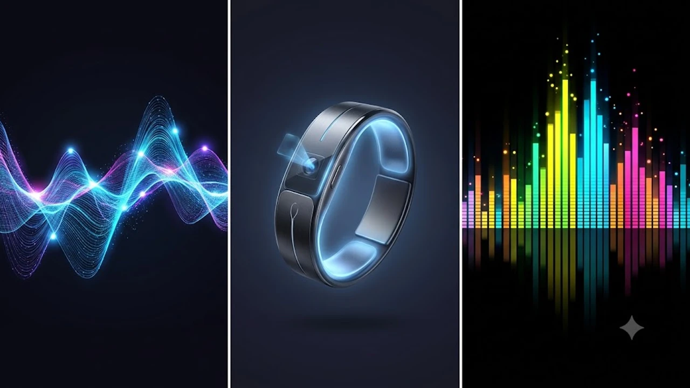

무선 이어폰 시장이 음질과 노이즈 캔슬링 경쟁을 넘어 인공지능 기술의 새로운 격전지로 진화하고 있습니다. 최근 글로벌 테크 가젯 트렌드의 중심에 선 **AI 이어폰 케이스** 제품들은 디스플레이와 AI 연산 칩을 본체에 직접 탑재하며 스마트폰의 보조 역할을 탈피하는 추세입니다. 본 글에서는 2026년 하반기 가장 뜨거운 IT 아이템으로 부상한 스마트 스크린 탑재 무선 이어폰의 성능과 기술적 가치를 분석합니다.

## AI 이어폰 케이스 등장 배경과 시장 동향

### 주요 브랜드의 컴퓨텍스 혁신 기술
대만에서 열린 컴퓨텍스 컨퍼런스에서 앤커 사운드코어와 JBL 등 글로벌 오디오 브랜드는 자체 신경망처리장치(NPU)를 내장한 스마트 무선 이어폰 라인업을 대거 공개했습니다. 과거의 이어폰 본체가 단순히 음악을 재생하고 전원을 공급하는 배터리 팩에 불과했다면, 신형 모델들은 기기 자체에서 인공지능 알고리즘을 구동하는 독립 디바이스의 형태를 갖추었습니다. 스마트폰 앱을 거치지 않고 오디오 신호를 실시간 처리하는 제어 기술이 핵심 기술로 제시되었습니다.

### 일반 무선 이어폰과의 스펙 차이
기존 블루투스 이어폰이 고음질 코덱과 액티브 노이즈 캔슬링(ANC) 유무로 급을 나누었다면, 스마트 스크린 기반 가젯은 내장 칩셋의 연산 성능과 메모리 용량이 선택의 기준이 됩니다. 초저전력 디스플레이와 함께 약 2~4GB 수준의 플래시 메모리가 내장되어, 오디오 파일이나 번역용 언어 팩 데이터를 로컬 환경에 직접 저장하는 구조를 취합니다. 마이크 하드웨어 역시 주변 소음 제거용뿐만 아니라 360도 공간 음성을 수집하는 다채널 마이크 배열로 업그레이드되었습니다.

### 화면 탑재 인프라가 주는 사용자 경험 변화
사용자는 스마트폰 화면을 켜고 터치하는 번거로움 없이 이어폰 본체의 OLED 터치스크린을 통해 모든 명령을 내립니다. 운동 중이나 대중교통 이용 시 주머니나 가방에서 핸드폰을 꺼내지 않아도 되므로 디지털 디톡스와 높은 편의성을 동시에 확보합니다. 화면 UI/UX 또한 스마트워치와 유사한 위젯 형태로 구성되어 직관적인 제어가 가능합니다.

## 핵심 기능 분석: 실시간 통역부터 AI 요약까지

### 미팅 실시간 녹음 및 화자 분리 요약 활용법
비즈니스 미팅이나 대학 강의실에서 본체 케이스의 전원 버튼을 두 번 누르면 즉시 고음질 녹음이 시작됩니다. 수집된 음성 데이터는 내장된 오디오 텍스트 변환(STT) 엔진을 통해 실시간으로 기록되며, 문맥을 분석하여 발화자가 누구인지 '참석자 A', '참석자 B' 형태로 정확하게 갈라냅니다. 회의가 끝남과 동시에 디스플레이 화면에 3줄 요약본과 핵심 액션 아이템이 도출되어 곧바로 텍스트 파일로 전송할 수 있습니다.

### 온디바이스 번역 프로세스
클라우드 서버와 통신하지 않는 온디바이스(On-Device) 방식으로 구동되므로 통신 인프라가 열악한 해외 출장지나 비행기 기내에서도 즉각적인 통역 리포트를 제공합니다. 상대방이 말하는 외국어 음성이 이어폰 마이크로 입력되면, 본체 내부의 경량형 거대언어모델(sLLM)이 이를 해석하여 사용자의 귀로 한국어 번역본을 실시간 송출합니다. 동시에 케이스 전면 스크린에는 텍스트 가이드가 표시되어 시각적 이해를 돕습니다.

### 스마트 케이스 스크린 위젯 제어 방법
독립적인 운영체제(OS)가 탑재된 덕분에 이퀄라이저 설정, 노이즈 캔슬링 강도 조절은 물론 날씨 확인, 타이머, 스마트폰 카메라 셔터 원격 제어 기능까지 활용 범위가 넓습니다. 사용자가 자주 쓰는 기능을 즐겨찾기 위젯으로 배치하면 단 한 번의 터치로 환경을 전환합니다. 스마트폰으로 들어오는 문자나 메신저 알림의 핵심 요약본도 케이스 화면에서 바로 읽을 수 있습니다.

[관련 글 보기](/posts/it-devices/)

## 직접 써보니 느껴지는 치명적인 장단점 리포트

### 스마트폰 의존도를 낮춰주는 압도적인 생산성
실제 업무 환경에서 업무 전화를 받거나 회의록을 작성할 때 스마트폰의 간섭을 원천 차단한다는 점이 가장 훌륭한 장점입니다. 핸드폰 화면을 보다가 SNS나 웹서핑으로 시선이 분산되는 아날로그적 집중력 저하 문제를 완벽히 방어합니다. 오직 대화와 기록이라는 본질적인 생산성 작업에만 몰입할 수 있도록 돕는 독립형 가젯의 가치를 톡톡히 증명합니다.

### 배터리 소모 가속화와 주머니 속 오작동 가능성
터치스크린과 내부 연산 프로세서가 상시 구동되기 때문에 기존 무선 이어폰 본체 대비 배터리 소모 속도가 매우 빠릅니다. 통상 일주일 이상 가던 충전 주기가 2~3일로 단축되는 현상이 발생합니다. 아울러 옷 주머니나 가방 안에서 스크린이 마찰에 의해 제멋대로 눌리면서 원치 않는 녹음이 시작되거나 이퀄라이저 값이 바뀌는 물리적 터치 오류 현상이 잦아 홀드 버튼 활용이 필수적입니다.

### 디스플레이 탑재로 인한 무게 증가와 내구성 이슈
액정이 추가되면서 본체의 물리적 부피가 커지고 무게가 약 15~20g 무거워져 바지 주머니에 넣었을 때 묵직한 이물감이 듭니다. 콘크리트 바닥에 본체를 떨어뜨렸을 때 일반 플라스틱 케이스는 약간의 흠집으로 끝나지만, 이 제품군은 스크린 파손으로 이어져 고액의 수리비 지출을 감수해야 하는 심리적 부담감이 존재합니다.

## 내게 맞는 AI 무선 이어폰 구매 가이드 및 추천

### 직장인 미팅용 vs 학생 강의 녹음용 체크리스트
본인의 주된 사용 환경이 어디인지 명확히 구별해야 지출의 낭비를 막을 수 있습니다. 계약서 작성이나 클라이언트 미팅이 잦은 직장인은 보안성이 강화된 고성능 온디바이스 요약 기능과 화자 분리 정확도가 높은 플래시 메모리 고용량 모델을 선택하는 편이 이롭습니다. 반면 어학 공부나 대학 강의 청취가 주 목적이라면 요약 기능보다는 다국어 언어 팩 지원 범위와 장시간 재생이 가능한 배터리 효율성에 초점을 맞추어야 만족도가 높습니다.

### 하반기 주목해야 할 브랜드별 추천 모델
오디오 명가로서의 튜닝 노하우와 스마트 기술을 접목한 JBL의 투어(Tour) 시리즈 최신작은 직관적인 UI 스크린과 강력한 노이즈 캔슬링 성능으로 전문 비즈니스맨들에게 좋은 선택지입니다. 가성비를 지향한다면 앤커 사운드코어의 리버티(Liberty) 스크린 에디션이 합리적인 가격대에 온디바이스 번역 핵심 기능을 충실히 구현하여 훌륭한 대안이 됩니다.

### 1세대 모델 구매와 차기 버전 대기 기준
얼리어답터 성향이 강하고 매일 반복되는 회의록 작성 업무에서 해방되고 싶은 유저라면 지금 당장 구매해도 돈값을 톡톡히 해내는 충분한 장비입니다. 다만 주머니에 넣기 좋은 컴팩트한 크기를 원하거나 최소 일주일 이상의 긴 배터리 수명을 원한다면, 칩셋 공정이 개선되고 폼팩터가 경량화될 차세대 2세대 라인업 출시를 느긋하게 기다리는 편을 권장합니다.

#AI이어폰케이스 #스마트무선이어폰 #컴퓨텍스2026 #온디바이스AI #실시간통역이어폰 #테크트렌드 #생산성IT기기 #사운드코어 #스마트케이스이어폰