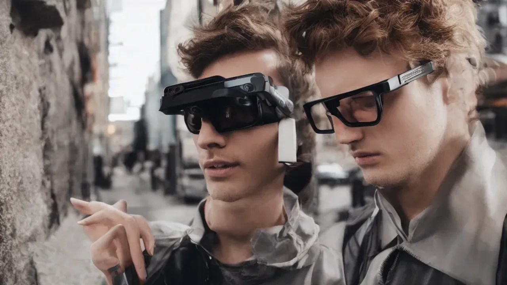
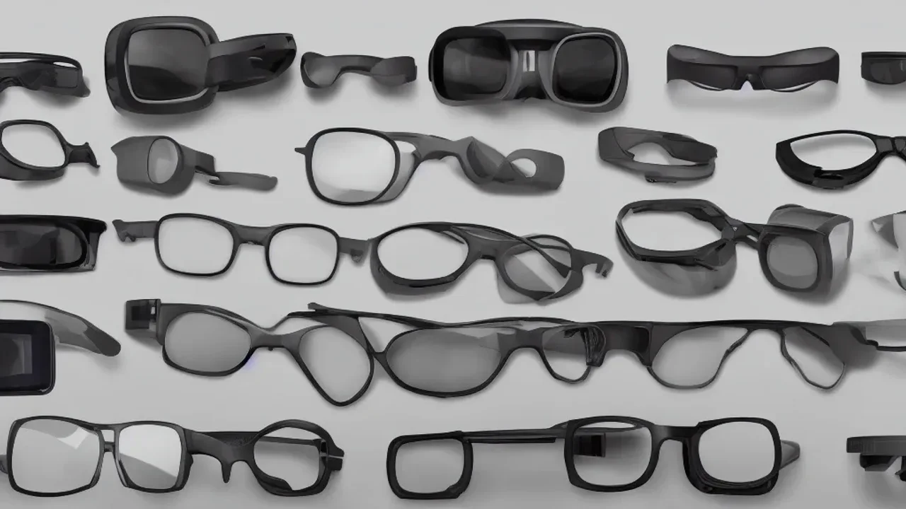

Markdown
2026년 가전 및 모바일 시장의 가장 뜨거운 화두는 단연 스마트 글래스 기술의 급격한 진화입니다. 스마트폰의 화면을 들여다보는 기존의 방식에서 벗어나 시선이 닿는 현실 세계에 인공지능을 투사하는 차세대 AI 웨어러블 디바이스가 대중화의 길목에 접어들었습니다. 스마트 글래스 기기가 단순한 얼리어답터의 장난감을 넘어 실제 돈값을 하는 수준까지 올라왔는지 정밀하게 분석합니다.

## 온디바이스 AI가 바꾼 일상

과거의 스마트 안경은 스마트폰의 알림을 눈앞에 띄워주거나 단순한 카메라 촬영 기능을 제공하는 폰의 액세서리에 그쳤습니다. 그러나 올해 출시되는 신제품들은 기기 자체에서 인공지능 연산을 처리하는 **온디바이스 AI(On-Device AI)** 칩셋을 대거 탑재하며 완전히 새로운 국면을 맞이했습니다.

길거리를 걸어가며 낯선 외국어 간판을 바라보면 0.5초 만에 사용자의 모국어로 실시간 번역된 텍스트가 시야에 자연스럽게 겹쳐 보입니다. 클라우드 서버를 거치지 않고 초소형 신경망처리장치(NPU)가 안경 내부에서 데이터를 즉시 처리하므로 통신 지연이 거의 발생하지 않습니다.

> **실제 비즈니스 현장 활용 예시**
> 해외 바이어와의 미팅에서 상대방의 음성을 실시간으로 인식해 눈앞에 자막처럼 번역을 띄워주는 기능은 통역사 없이도 자연스러운 시선 교환과 대화를 가능하게 만듭니다.

## 독립형 디바이스로의 진화

이제 스마트 글래스는 스마트폰 앱 연동 없이 자체 LTE 또는 Wi-Fi 7을 지원하며 완전한 독립형 디바이스로 거듭나고 있습니다. 주머니나 가방 속 스마트폰을 꺼내지 않고도 오직 음성 명령과 가벼운 템플 터치(안경다리 조작), 그리고 눈동자의 움직임(시선 추적)만으로 메신저를 보내고 정보를 검색합니다.

* **음성 비서와의 자연스러운 대화:** "지금 내가 보고 있는 건물 이름과 역사에 대해 알려줘"라고 나직하게 말하면 안경에 내장된 지향성 스피커가 사용자에게만 또렷한 음성으로 답을 들려줍니다.
* **시각 인지(Vision AI)의 결합:** 전면 카메라는 단순한 촬영용이 아니라 거대언어모델(LLM)이 현실 공간의 맥락을 이해하는 눈의 역할을 수행합니다.

사용자는 복잡한 UI를 터치하는 수고로움 대신 일상적인 시선의 흐름 속에서 자연스럽게 디지털 정보와 상호작용하는 혁신을 경험하게 됩니다.

## 1세대 유저들이 말하는 진짜 편리함

실제 제품을 구매해 수개월간 출퇴근길과 업무 환경에서 사용해 온 얼리어답터들은 기대 이상으로 높은 만족감을 표시합니다. 가장 빈번하게 언급되는 피드백은 '스마트폰 좀비' 탈출과 관련된 부분입니다.

고개를 숙인 채 위험하게 화면을 보며 걸을 일이 사라져 거북목 증상 완화와 보행 안전에 큰 도움이 되었다는 경험담이 지배적입니다. 아침 조깅을 하거나 자전거 라이딩을 할 때 눈앞에 내비게이션 경로가 가상 화살표로 직관적으로 표시되는 기능 역시 직관적인 만족감을 선사합니다. 양손에 짐을 가득 들고 있는 상태에서 통화를 수신하고 가벼운 텍스트 메모를 남기는 핸즈프리 환경은 한 번 적응하면 이전으로 돌아가기 힘들 만큼 강력한 중독성을 발휘합니다.

[관련 글 보기](/posts/it-devices/)

## 시장을 흔드는 대표 스마트 글래스 3종 스펙 비교

### 메타·오클리 연합의 최신작

현재 시장에서 선두를 달리는 모델은 메타와 글로벌 광학 기업 오클리(Oakley)가 협업해 내놓은 3세대 플래그십 라인업입니다. 일반 패션 뿔테안경과 구별하기 힘들 정도로 가벼운 52g의 무게를 실현했음에도 전면 초광각 카메라와 맞춤형 스마트 어시스턴트를 완벽하게 내장했습니다.

* **무게:** 52g (일반 안경과 유사한 착용감)
* **배터리 성능:** 연속 대화 및 번역 기준 약 4.5시간 구동
* **기술적 특징:** 레이반 연합 시절의 아쉬움을 극복하고 왜곡 없는 AR 오버레이 디스플레이 기술을 탑재하여 야외 시인성을 대폭 개선함

오클리의 세련된 프레임 디자인 덕분에 일상생활에서 착용해도 주변의 거부감이 없다는 점이 시장에서 가장 크게 스포트라이트를 받는 요인입니다.

### 한국형 AI 생태계 최적화 모델

국내 제조사가 선보인 안경형 웨어러블은 한국어 자연어 처리와 국내 도심 가이드에 특화된 로컬라이징 전략으로 정면 승부를 걸었습니다. 토종 거대언어모델(LLM)을 기반으로 구동되기 때문에 한국어 은어나 줄임말, 맥락을 정확하게 파악해 실시간 비서 업무를 수행합니다.

배달 앱과의 연동을 통해 특정 음식점 앞을 지나갈 때 해당 매장의 사용자 평점과 시그니처 메뉴, 할인 쿠폰을 시야 우측 상단에 팝업으로 띄워주는 고유한 기능을 자랑합니다. 국내 공공 데이터맵과 정밀하게 연동되는 대중교통 환승 알림 시스템은 복잡한 수도권 출퇴근러들에게 최적의 편의성을 보장합니다.

### 가성비로 승부하는 글로벌 다크호스

하이엔드 제품들의 70만~100만 원대 가격이 부담스러운 유저들을 겨냥한 30만 원대 보급형 라인업의 성장세도 매섭습니다. 디스플레이 오버레이 기능을 과감하게 제외하고 골전도 및 지향성 오디오와 카메라 비전 AI 기능에만 집중해 단가를 혁신적으로 낮춘 형태입니다.

시각적인 가상 화면은 보이지 않지만 이어폰을 귀에 꽂지 않고도 인공지능과 실시간으로 대화하며 이메일을 읽고 요약본을 음성으로 브리핑받는 핵심적인 경험은 고스란히 챙길 수 있습니다. 배터리 소모량이 적어 최대 8시간 이상 지속되는 효율성을 확보해 가성비를 추구하는 실용주의 유저들 사이에서 입소문을 타고 급속도로 판매량이 늘고 있습니다.

## 손이 자유로운 멀티태스킹과 실시간 시각 통번역

가장 명확한 이점은 신체적 자유도에서 비롯됩니다. 요리 유튜버의 영상을 보면서 양손으로 식재료를 손질하거나, 가구 조립 설명서를 눈앞에 띄워둔 채 드라이버를 쥐고 작업하는 물리적인 멀티태스킹 능력이 비약적으로 상승합니다. 

해외여행이나 글로벌 비즈니스 상황에서 발휘되는 실시간 자막 번역 기능은 언어의 장벽을 허무는 파괴력을 지닙니다. 텍스트를 읽기 힘든 저시력자나 청각 장애인에게 주변 상황을 음성이나 시각 신호로 묘사해 주는 보조 공학 기기로서의 가치도 높게 평가받고 있습니다.

### 짧은 배터리 타임과 실외 발열 이슈

매력적인 장점 뒤에는 경량화를 위해 타협해야 했던 하드웨어적 한계가 명확히 존재합니다. 배터리 용량이 안경다리 내부 공간으로 제한되다 보니 프로세서를 풀가동하는 AR 네비게이션이나 실시간 번역 기능을 지속해서 사용하면 3~4시간 만에 방전되는 약점이 있습니다.

> **하드웨어 이슈 요약**
> 고성능 온디바이스 연산이 지속될 때 귀와 관자놀이가 닿는 힌지 부근에서 발생하는 미열은 민감한 피부를 가진 사용자에게 불쾌감을 유발할 여지가 있습니다. 한여름 실외 착용 시 발열 제어 능력이 떨어지는 저가형 모델의 경우 기기가 스스로 다운되는 현상이 보고되기도 하므로 주의해야 합니다.

### 도심 착용 시 마주하는 개인정보 및 카메라 촬영 문제

가장 민감한 영역은 사회적 시선과 프라이버시 침해 문제입니다. 전면에 고성능 카메라가 상시 노출되어 있기 때문에 타인의 얼굴이나 번호판, 사생활 영역이 무단으로 녹화될 수 있다는 불신감이 여전히 팽배합니다. 

프라이버시 인디케이터 LED 램프가 촬영 중임을 강제로 표시하도록 법제화되어 있으나 초소형 모듈 특성상 멀리서는 식별하기 어렵다는 지적이 잇따릅니다. 공공 화장실, 피트니스클럽 탈의실, 보안이 필수적인 연구소 등 특정 구역에서는 착용 자체를 금지하는 내부 규칙이 확산하는 추세여서 일상적인 상시 착용을 가로막는 걸림돌로 작용합니다.

## 나에게 맞는 AI 스마트 글래스 선택 및 세팅 가이드

### 비즈니스 생산성 vs 일상 콘텐츠 소비

스마트 글래스를 선택할 때는 본인의 라이프스타일과 주된 사용 환경을 명확히 정의해야 중복 지출을 막을 수 있습니다. 업무 중 텍스트 문서 확인, 이메일 수신, 프레젠테이션 스크립트 리딩 등 대량의 텍스트 정보 처리가 핵심이라면 가상 디스플레이 해상도가 높고 텍스트 가독성이 우수한 고가형 AR 모델을 선택하는 것이 정답입니다.

반면 출퇴근길 음악 감상, 간단한 음성 통화, 일상적인 대화형 AI 검색과 사진 촬영 정도만 가볍게 즐기고 싶다면 디스플레이 모듈이 빠져 가볍고 배터리가 오래가는 오디오 중심의 엔트리급 제품으로 시작하는 편이 심리적·경제적 부담을 줄이는 지름길입니다.

### 시력 교정자를 위한 도수 렌즈 맞춤 제작 팁

평소 안경이나 콘택트렌즈를 착용하는 시력 교정자라면 제품 구매 시 도수 렌즈 장착 가능 여부를 제일 먼저 체크해야 합니다. 최신 스마트 글래스들은 프레임 내부에 자석식으로 탈부착이 가능한 특수 도수 클립을 지원하거나 공식 파트너 안경점을 통해 전용 처방 렌즈 교체 서비스를 제공합니다.

* **처방전 준비:** 안과나 전문 안경원에서 본인의 정확한 난시, 원시 수치가 기재된 처방전을 발급받아야 합니다.
* **주의사항:** 디스플레이가 내장된 스마트 글래스는 초점 위치(PD)가 어긋나면 심한 어지러움이나 두통을 유발할 수 있으므로 정밀 장비를 갖춘 지정 안경 매장에서 렌즈를 가공해야 피로감을 최소화할 수 있습니다.

### 스마트폰 연동 및 초기 AI 비서 음성 설정

기기를 언박싱한 후 전용 모바일 애플리케이션을 다운로드해 블루투스 페어링을 진행합니다. 초기 세팅 과정에서 가장 핵심적인 단계는 사용자의 고유한 목소리 톤을 인식시키는 **보이스 트레이닝(Voice Profile)** 과정입니다. 

시끄러운 카페나 도심 한복판에서도 내 목소리만 정확히 필터링해 명령을 수행할 수 있도록 조용한 공간에서 음성 프로필 등록을 완료해야 인식률이 극대화됩니다. 개인정보 보호를 위해 기기를 벗어두었을 때는 터치 패드나 카메라 기능이 자동으로 잠기는 생체 인식 스마트 잠금 설정을 활성화해 두는 것이 분실 및 도난으로 인한 데이터 유출을 방지하는 안전한 방법입니다.

#스마트글래스 #AI안경 #온디바이스AI #웨어러블디바이스 #테크트렌드2026 #스마트안경 #AR글래스