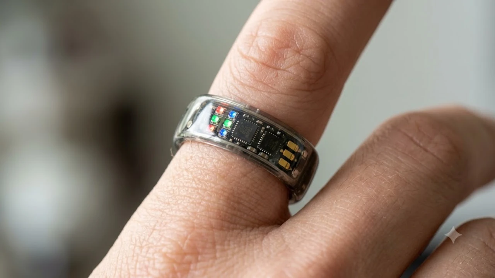
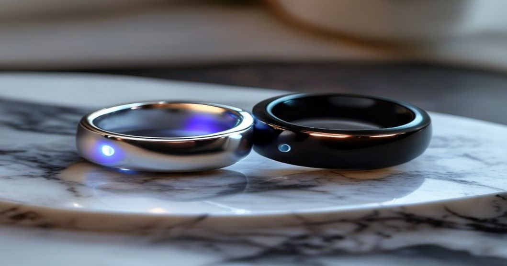

잠자리에 들 때 손목을 짓누르는 스마트워치의 묵직함, 누구나 한 번쯤 답답함을 느꼈을 겁니다. 특히 헬스케어 트렌드가 정밀한 수면 질 분석으로 이동하면서, 가볍고 이물감 없는 초소형 웨어러블 기기의 필요성이 급증했습니다. 2026 스마트 링 시장은 바로 이 틈새를 파고들며 폭발적인 성장을 기록 중입니다. 손가락에 가볍게 끼우기만 하면 AI가 나의 24시간 생체 데이터를 분석하고 하루의 컨디션을 예측하는 시대가 도래한 것입니다.

## 2026 스마트 링, 스마트워치의 한계를 어떻게 극복했나

웨어러블 폼팩터의 진화는 결코 우연이 아닙니다. 손목에서 손가락으로 착용 위치를 옮긴 것만으로도 실사용자가 체감하는 일상 속 혁신은 상당한 수준입니다.

### 수면 측정의 압도적인 편안함과 밀착도

기존 스마트워치의 가장 치명적인 단점은 실리콘 밴드에 땀이 차거나 새벽에 뒤척일 때 몹시 거슬린다는 점입니다. 반면 최신 2026 스마트 링 제품들은 항공우주 등급의 티타늄 소재를 정밀 가공하여 무게가 2\~3g 내외에 불과합니다. 반지를 착용했는지조차 잊게 만드는 가벼움 덕분에 밤새 뒤척이더라도 숙면에 전혀 방해가 되지 않습니다. 깊은 수면, 렘(REM) 수면, 무호흡증 패턴을 측정하는 센서의 밀착도 역시 손가락 안쪽 모세혈관을 360도로 직접 스캔하므로 손목 기기보다 훨씬 정교한 데이터를 추출해 냅니다.

### 충전 스트레스를 지워버린 초절전 배터리 기술

매일 저녁 시계를 풀어 충전기에 올려두어야 하는 번거로움은 웨어러블 기기 이탈률을 높이는 주범이었습니다. 최근 출시된 스마트 링 기기들은 초저전력 칩셋과 고밀도 미세 배터리 설계 기술을 적용하여 한 번의 완충으로 최대 10일에서 14일까지 구동됩니다. 매일 충전 압박에 시달릴 필요가 없고, 장기 해외 출장이나 여행 중에도 충전 크래들을 챙겨야 하는 강박에서 완전히 벗어날 수 있습니다.

## 양대 산맥 전격 비교: 갤럭시 링 2세대 vs 오라 링 5세대

현재 2026 스마트 링 생태계의 주도권을 쥐고 있는 두 브랜드의 치열한 기술 경쟁은 소비자에게 즐거운 고민을 안겨줍니다.

### 무적의 갤럭시 생태계 통합, 갤럭시 링 2세대

삼성전자는 자사 생태계의 '매끄러운 연결성'을 강력한 무기로 내세웠습니다. 스마트폰, 갤럭시 워치, 스마트싱스(SmartThings) 기반 가전제품과도 즉각적으로 연동되는 시스템이 특징입니다. 손가락을 가볍게 두 번 튕기는 '더블 핀치' 제스처만으로 스마트폰 카메라 셔터를 누르거나 아침 알람을 끄는 기능은 일상의 소소한 번거로움을 단번에 해소합니다. 삼성 헬스 앱과 실시간 연동되어 식단·운동량·수면 점수를 단일 대시보드에서 통합 관리할 수 있으며, 기존 갤럭시 스마트폰 사용자에게는 완벽한 호환성을 자랑합니다.

### 독보적 헬스케어 알고리즘의 결정체, 오라 링 5세대

수년 전부터 방대한 글로벌 생체 데이터를 축적해 온 오라(Oura) 링 5세대는 '초정밀 예방 의학' 분야에서 독보적인 위치를 점하고 있습니다. 체온 변화와 심박 변이도(HRV)를 복합 분석하여 여성 사용자의 생리 주기 예측이나 감기 전조 증상을 실제로 경험하기 하루 이틀 전에 먼저 경고해주는 기능이 가장 차별화된 경쟁력입니다. 다만 월정액 구독료가 발생한다는 점은 장기 사용 시 총비용 측면에서 반드시 감안해야 합니다.

## 실제 착용 시 체감되는 장점과 의외의 단점 분석

### 패션 아이템으로도 손색없는 완성도 높은 디자인

무광 골드, 브러시드 실버, 매트 블랙 등 고급스러운 표면 마감 처리는 일반 귀금속 반지와 레이어드하여 착용해도 전혀 위화감이 없습니다. 수심 100m 방수를 지원하는 10ATM 등급 덕분에 설거지, 샤워, 수영장에서도 굳이 반지를 뺄 필요가 없습니다.

### 디스플레이 부재가 가져오는 즉각적 피드백의 한계

가장 큰 호불호가 갈리는 지점은 화면이 없다는 사실입니다. 카카오톡 메시지나 긴급한 전화가 걸려오면 미세한 햅틱 진동으로 수신을 알려주지만, 누가 연락했는지 확인하려면 결국 스마트폰을 꺼내야 합니다. 심박수를 모니터링하며 페이스 조절을 해야 하는 달리기나 자전거 라이딩 매니아에게는 스마트워치가 여전히 우위에 있습니다.

## 초소형 폼팩터에 탑재된 차세대 AI 기술력

단순히 만보계 역할이나 심박수만 재던 과거의 헬스 트래커를 벗어나, 2026 스마트 링 기기들은 온디바이스 생성형 AI와 결합하여 '개인 주치의' 역할을 수행합니다.

### 온디바이스 AI 기반 초개인화 행동 가이드

기기 내부에 초소형 NPU(신경망 처리 장치)가 탑재되어, 수개월간 누적된 사용자의 건강 패턴을 스스로 학습합니다. "어젯밤 깊은 수면이 평소보다 부족했으니, 오늘은 커피 섭취를 오후 2시 이전에 마무리하고 밤 10시 30분에 취침하는 것을 권장합니다"와 같이 매우 구체적이고 실천 가능한 조언을 아침마다 푸시 알림으로 전달합니다.

### 스트레스 지수 실시간 감지와 회복 가이드

심박 변이도(HRV)와 피부 전기 반응 데이터를 실시간으로 분석해 스트레스 수준을 0\~100 지수로 수치화합니다. 지수가 임계치를 넘으면 1분 호흡 가이드나 스트레칭 알림을 즉각 전송합니다. 장기간 누적 데이터를 바탕으로 본인의 만성 스트레스 패턴을 시각화한 주간 리포트도 제공해, 직장인과 수험생 등 고강도 일정을 소화하는 사용자에게 특히 유용합니다.

## 나에게 꼭 맞는 2026 스마트 링 현명한 선택 가이드

스마트워치 대신 2026 스마트 링 구매를 결심했다면, 본인의 디지털 라이프스타일과 현재 사용 중인 스마트폰 생태계가 가장 핵심적인 판단 기준이 됩니다.

### 안드로이드 생태계 중심 유저의 합리적 대안

현재 갤럭시 스마트폰을 주력으로 사용 중이거나 추후 갤럭시 폰으로 기변할 의사가 있다면, 갤럭시 링 2세대가 가장 합리적인 선택지입니다. 기기 구매 비용 외에 별도의 정기 구독료 지불 없이 모든 삼성 헬스 AI 기능을 평생 무료로 누릴 수 있으며, 폰·워치·링을 아우르는 촘촘한 연동성은 타 브랜드가 단기간에 흉내 내기 힘든 편리함을 제공합니다.

### 최고 수준의 정밀 건강 분석이 필요한 유저

스마트폰 기종에 얽매이지 않고, 현존하는 가장 깊이 있는 수면 데이터 분석과 질병 예측 시스템을 경험하고 싶다면 오라 링 5세대가 정답입니다. 매월 구독료가 심리적 장벽으로 작용할 수 있지만, 전문 수면 클리닉에 버금가는 상세한 리포트와 예방 의학 차원의 건강 코칭을 매일 제공받는다는 점에서 충분한 가치가 있습니다. 구매 전에는 반드시 손가락 사이즈를 측정 키트로 정확히 확인하고 주문하는 것을 추천해요.

> 삼성 생태계 기기 더 알아보고 싶다면 [갤럭시 S26 AI 기능 완전 정리](/posts/it-devices/galaxy-s26-ai-features-2026/)를 확인해보세요.

#스마트링 #2026스마트링 #갤럭시링2세대 #오라링5세대 #웨어러블기기 #수면분석기기 #AI헬스케어
