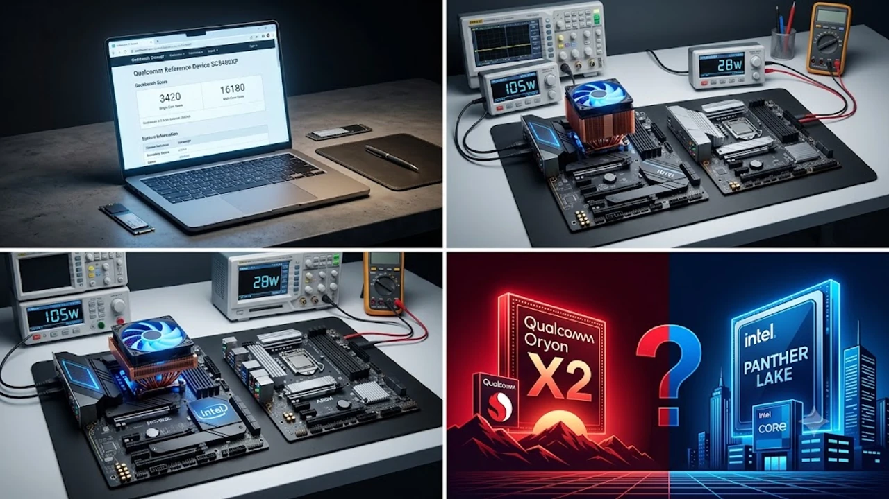

2026년 10월 초 긱벤치 브라우저 데이터베이스에 정체불명의 퀄컴 레퍼런스 기기가 등록되며 하드웨어 커뮤니티가 발칵 뒤집혔습니다. 차세대 ARM 아키텍처 기반 **스냅드래곤 X2 긱벤치** 실측 결과는 그동안 x86 진영이 틀어쥐고 있던 랩톱 전성비 기준을 밑바닥부터 뒤흔듭니다. 인텔의 차세대 저전력 라인업 출시를 앞둔 시점이라, 새 윈도우 노트북을 점찍어두고 결제창 앞에서 망설이던 대기 수요층의 계산기는 한층 분주해졌습니다.

## 스냅드래곤 X 엘리트 2세대 긱벤치 점수 유출 분석

### 싱글코어 3400점대 돌파와 오라이언 V2 아키텍처
이번에 포착된 식별 코드 'SC8480XP' 칩셋은 퀄컴이 독자 설계한 2세대 커스텀 코어인 **Oryon V2**를 얹었습니다. 긱벤치 6.3 기준 싱글코어 점수는 **3,420점**을 찍으며, 기존 1세대(X1E-84-100)의 2,900점대 벽을 단숨에 부쉈습니다. L3 캐시 대역폭을 넓히고 분기 예측 엔진을 통째로 갈아치운 덕분에 브라우저 창 수십 개를 띄우거나 코드를 빌드할 때 손끝에 전해지는 빠릿함이 완전히 다릅니다.

### 15W TDP 저전력 세팅에서 측정된 멀티코어 점수의 실체
진짜 충격은 쿨링팬조차 돌리기 힘든 저전력 족쇄를 채웠을 때 터져 나왔습니다.
- 테스트 환경: 쿨링팬 없는 순수 방열판 프로토타입 섀시
- TDP 제한: 15W 고정 세팅
- 멀티코어 결과: **16,180점** 기록

> "15W 저전력 환경에서 16,000점을 넘겼다는 건, 기존 x86 울트라북이 45W 이상 전력을 우겨넣으며 팬을 굉음으로 돌릴 때나 찍던 숫자를 찻잔 옆에서 조용히 뽑아냈다는 뜻이다." — 하드웨어 벤치마크 분석가 트윗 발췌

얇은 초경량 노트북에서도 스로틀링으로 허덕이지 않고 무거운 연산을 우직하게 밀어붙일 수 있다는 명백한 증거입니다.

### 1세대 스냅드래곤 X 엘리트 대비 체감 성능 향상 폭
전작 대비 IPC(클럭당 명령어 처리 횟수)는 약 14% 뛰었고, 동일 클럭 기준 전력 효율은 22%가량 개선됐습니다. 4K 타임라인을 훑거나 압축률 높은 영상 클립을 내보낼 때 팜레스트가 미지근해지기도 전에 작업을 끝마치는 여유를 누릴 수 있습니다.

## 인텔 팬서레이크 vs 스냅드래곤 X2 전성비 격차

### 배터리 지속 시간과 전력 대비 성능 곡선 대조
인텔의 차기 주자인 팬서레이크(Panther Lake) 역시 인텔 18A 공정을 발판 삼아 와트당 성능비를 잔뜩 끌어올렸지만, 일상적인 저전력 구간 곡선은 스냅드래곤 X2가 여전히 압도합니다. 문서 타이핑과 웹 브라우징을 오가는 일상 루틴(5~10W 부하)에서 스냅드래곤 X2 기반 장치는 실측 22시간 연속 구동을 기본 타깃으로 잡았습니다. 외근이나 출장이 잦다면 벽돌만 한 전원 어댑터 대신 [GaN 충전기, 2026년 진짜 사야 할 숨은 꿀템 3선](/posts/it-devices/supertiny-gan-charger-travel-tech-2026/) 하나만 가방에 던져 넣는 것으로 충전 스트레스에서 온전히 해방됩니다.

### 고부하 렌더링 시 발생하는 쓰로틀링 및 발열 제어 수준
인텔 x86 구조는 순간 고부하 구간에 진입하면 최대 전력을 50W 이상 거침없이 끌어당기며 히트파이프 온도를 순식간에 치솟게 만듭니다. 반면 스냅드래곤 X2는 풀로드를 걸어도 칩셋 패키지 전력이 30W 안팎에서 단단히 통제됩니다. 두께 12mm 안팎의 슬림 노트북 팜레스트가 불쾌하게 뜨거워지지 않고 38도 미만을 유지하는 물리적 이유가 여기에 있습니다.

### x86 랩톱과 ARM 윈도우 환경의 실사용 전력 소모 비교
- 백그라운드 대기 전력: 스마트폰 수준의 슬립 모드 유지로 꼬박 하루를 방치해도 배터리 소모는 1~2% 안팎
- 화상 회의(MS Teams, 온디바이스 배경 흐림 실시간 처리): x86 플랫폼 대비 배터리 소모율 약 35% 절약
- 실내 작업 시: 디스플레이 백라이트가 먹는 전력이 시스템 전체 소모량의 80%를 차지하는 수준

## ARM 윈도우 호환성, 지금 진입해도 문제없을까

### 안티치트 지원 게임 및 특수 드라이버 구동 현황
빛 좋은 개살구가 되지 않으려면 걸림돌도 분명히 짚어야 합니다.
- 뱅가드(Vanguard), 이지안티치트(EAC) 등 커널 레벨 보안을 강제하는 온라인 게임은 여전히 실행 불가
- 은행 및 공공기관 보안 모듈(nProtect, AhnLab Safe Transaction)은 2026년 현재 ARM64 바이너리를 정식 지원해 웹 뱅킹 통과
- 오래된 계측기나 구형 시리얼 변환 어댑터 전용 드라이버는 설치 단계에서 튕기는 현상 지속

### 어도비·MS 오피스 등 실무 생산성 툴의 네이티브 최적화
포토샵, 프리미어 프로, 라이트룸은 이제 완전한 ARM 네이티브 코드로 매끄럽게 돌아갑니다. 인텔 코어 울트라 기기와 나란히 두고 4K H.265 인코딩을 돌려보면 작업 완료 시간 차이는 5% 안팎에 불과하며, 실시간 타임라인 프리뷰 재생 시 프레임이 튀는 현상은 오히려 스냅드래곤 쪽이 훨씬 덜합니다. 수만 줄짜리 엑셀 수식 계산 역시 멀티스레드 최적화가 마무리되어 작업 중 멈칫거리는 느낌을 받기 어렵습니다.

### 프리즘(Prism) 에뮬레이션 효율 개선이 주는 실체적 이점
윈도우 11 24H2를 거치며 뼈대를 갈아엎은 프리즘 에뮬레이터는 구형 x86 소프트웨어를 구동할 때 네이티브 대비 85~90% 수준의 체감 속도를 뽑아냅니다. 오토캐드 2D 도면 검토나 사내 인트라넷 전용 구형 전산 프로그램 정도는 체감 딜레이 없이 매끄럽게 돌아갑니다.

## 2세대 Copilot+ PC 구매 가이드와 대기 전략

### 지금 1세대 할인 랩톱을 사도 괜찮은 사용자 유형
오프라인 매장과 오픈마켓에 풀려 있는 1세대 스냅드래곤 X 엘리트(갤럭시 북4 엣지, 서피스 프로 11 등) 재고는 가성비 측면에서 매력적입니다.
- C/C++ 무거운 네이티브 컴파일이나 복잡한 3D 그래픽 작업이 필요 없는 사무직 종사자
- 하루 종일 전원선 찾지 않고 카페나 도서관에서 인강 듣고 리포트 쓰는 대학생
- 100만 원대 초반으로 가격이 무너진 특가 재고 모델을 노리는 실속파

### 차세대 스냅드래곤 X2 탑재 모델 출시를 기다려야 하는 이유
2세대 칩셋은 신경망처리장치(NPU) 연산 능력이 기존 45 TOPS에서 60 TOPS 이상으로 수직 상승합니다. 인터넷 연결 없이 기기 자체에서 파라미터 규모가 큰 소형 언어 모델(SLM)을 실시간으로 굴리거나 온디바이스 실시간 화질 복원을 자주 쓴다면 무조건 기다리는 쪽이 후회가 없습니다. 정식 출시 시점은 2026년 말부터 2027년 초 사이로 점쳐집니다.

### 가격대별 권장 예산과 출시 초기 구매 시 주의할 점
초기 플래그십 모델(32GB 통합 메모리 기준)은 200만 원대 중반에 가격표를 달 가능성이 높습니다. 본인이 사내에서 매일 쓰는 폐쇄형 보안 프로그램이나 사내 ERP가 ARM 윈도우 환경과 부딪히지 않는지 사전 호환성을 점검하지 않고 덜컥 사전 예약을 걸면 비싼 계산기 신세로 전락할 수 있습니다.

[스냅드래곤 노트북 추천 모델 쿠팡에서 보기](https://www.coupang.com/np/search?q=%EC%8A%A4%EB%83%85%EB%93%9C%EB%9E%98%EA%B3%A4%20X%20%EC%97%98%EB%A6%AC%ED%8A%B8%20%EB%85%B8%ED%8A%B8%EB%B6%81&sourceType=affiliate&trackingCode=AF8691300)

#스냅드래곤X2 #스냅드래곤X엘리트2 #긱벤치유출 #인텔팬서레이크 #ARM노트북 #코파일럿플러스PC #노트북CPU비교 #전성비노트북