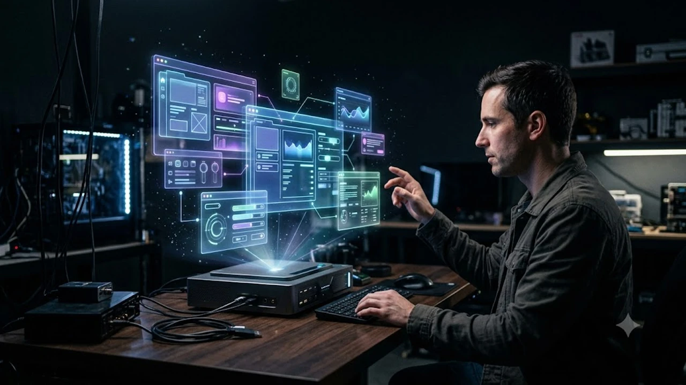
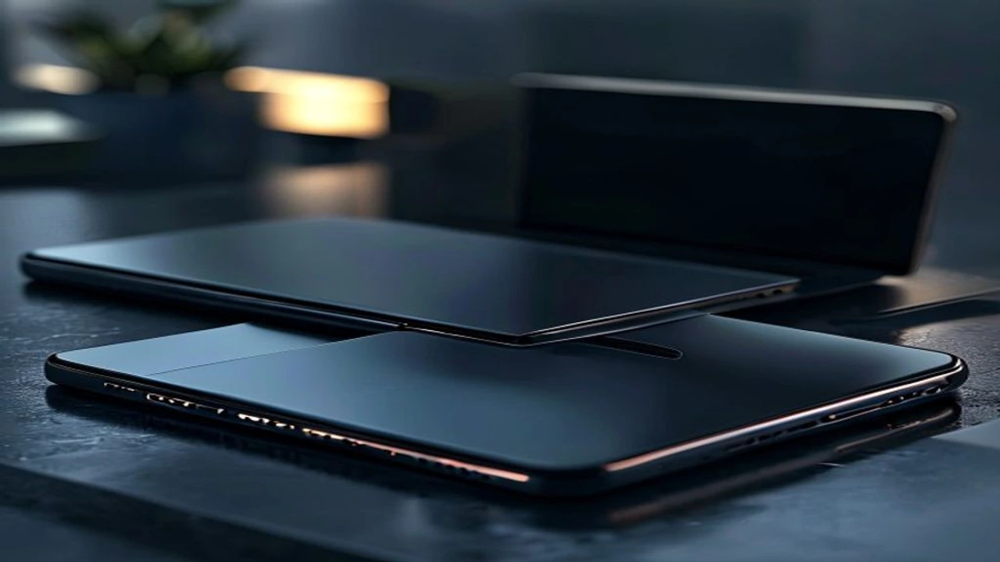

2026년 가상현실 테크 시장은 기존의 한계를 완전히 뛰어넘는 거대한 변곡점을 맞이했습니다. 공간 컴퓨팅 기술이 급격히 고도화되면서 하드웨어 생태계 자체가 혁신적인 변화를 겪는 중입니다. 특히 스마트폰과 모니터를 이을 **차세대 XR 기기** 플랫폼은 대중의 일상과 업무 방식을 근본적으로 바꾸는 기폭제 역할을 해내고 있습니다.

## 고글을 벗은 공간 컴퓨팅, 무안경 3D 디스플레이란?

### 고글 없는 해방감과 디스플레이의 진화
기존 가상현실 기기는 무겁고 거추장스러운 고글이나 전용 안경을 필수적으로 착용해야만 했습니다. 이로 인해 유저들은 안구 건조증, 안면 압박감, 어지러움 등의 불편함을 호소하며 장시간 사용에 어려움을 겪었습니다. 무안경 3D 디스플레이는 이러한 진입 장벽을 근본적으로 해결하기 위해 등장한 혁신 기술입니다. 사용자의 눈 위치를 실시간으로 추적하는 **아이 트래킹(Eye Tracking) 카메라**와 특수 렌티큘러 렌즈 구조를 결합하여, 맨눈으로도 완벽한 입체감과 깊이감을 경험하도록 지원합니다.

### 메타, 삼성, 애플의 2026년 XR 디바이스 핵심 전략 비교
글로벌 빅테크 3사는 독자적인 아키텍처를 바탕으로 시장 주도권을 쥐기 위한 치열한 경쟁을 펼치고 있습니다. 
* **메타(Meta)**: 대중성에 초점을 맞춰 100만 원 이하의 보급형 기기를 공격적으로 보급하며 생태계 확장에 집중합니다.
* **애플(Apple)**: 고성능 듀얼 프로세서와 독보적인 최고해상도 디스플레이를 내세워 전문가 영역을 타깃으로 삼는 초프리미엄 전략을 고수합니다.
* **삼성전자**: 자체 하드웨어 제조 역량을 바탕으로 구글, 퀄컴과 결성한 'XR 동맹' 체제를 가동하며 오픈 생태계의 중심축을 담당합니다.

### 디스플레이 시장의 패러다임 변화가 우리에게 주는 의미
2차원 평면에 갇혀 있던 화면 영역이 3차원 공간으로 확장되는 현상은 단순한 시각적 재미를 넘어섭니다. 물리적인 모니터 개수의 제한이 사라지며, 거실 전체나 책상 위 공중 전체를 거대한 작업 공간으로 변모시킬 수 있습니다. 마우스와 키보드라는 전통적인 입력 장치 대신, 사용자의 눈동자 움직임과 가벼운 손짓만으로 디지털 데이터를 직관적으로 제어하는 진정한 **공간 컴퓨팅(Spatial Computing)** 시대가 열린 셈입니다.

## 주요 제조사별 차세대 XR 기기 스펙 및 장단점

### 삼성 스페이셜 사이니지와 차세대 XR 헤드셋의 강점
삼성전자가 공개한 스페이셜 사이니지는 상업용 디스플레이 시장뿐 아니라 개인 작업 환경의 기준을 다시 썼습니다. 특수 패널을 통해 3D 그래픽 모델링이나 CAD 도면을 별도의 뷰어 장비 없이 입체 가공할 수 있어 산업 현장의 생산성을 획기적으로 끌어올렸습니다. 다만 일반 소비자용 하이엔드 모니터 라인업에 비해 초기 도입 비용이 매우 높은 편이며, 완벽한 입체감을 시청할 수 있는 좌우 시야각의 한계 영역이 존재한다는 점은 아쉬운 요소로 꼽힙니다.

### 독주를 이어가는 애플 비전 프로 차기작의 하드웨어 변화
애플의 2세대 비전 프로는 1세대 모델의 가장 큰 단점이었던 **배터리 무게와 발열**을 대폭 개선했습니다. 외부 배터리 팩의 밀도를 높여 부피를 줄였고, 본체 프레임에 마그네슘 합금을 도입해 안면이 느끼는 하중을 약 15% 경감시켰습니다. 8K급 초고화질 마이크로 OLED 패널 덕분에 텍스트 가독성이 압도적이지만, 여전히 수백만 원을 호가하는 가격 장벽 탓에 일반 사용자가 취미용으로 접근하기에는 상당한 부담이 따릅니다.

### 가성비와 대중성을 무기로 한 메타 퀘스트 신형의 한계와 기회
메타의 최신 퀘스트 라인업은 독보적인 가성비를 앞세워 글로벌 게이밍 시장을 빠르게 잠식하고 있습니다. PC 연결 없이 독립 구동이 가능한 단독형 기기 중 가장 방대한 가상현실 콘텐츠 라이브러리를 보유하고 있다는 점이 최대 무기입니다. 반면 단가 절감을 위해 패널 해상도와 카메라 센서 정밀도를 타협하면서, 애플이나 삼성의 하이엔드 기기와 비교했을 때 패스스루(외부 현실 화면 보기) 화면의 왜곡이나 노이즈가 다소 눈에 띄는 편입니다.

## 실물로 경험한 공간 컴퓨팅 디바이스 솔직 후기

### 안경 없이 느끼는 압도적인 입체감, 실제 몰입도는 어느 정도일까?
> "모니터 화면 안의 캐릭터가 문자 그대로 허공으로 튀어나오는 듯한 생생함을 느꼈습니다. 처음에만 잠깐 신기하다 말 줄 알았는데, 고개를 좌우로 돌려도 원근감이 완벽하게 유지되어 공간 자체가 확장된 기분이 듭니다."

실제 무안경 3D 디스플레이를 사용해 본 유저들은 SF 영화 속 홀로그램이 눈앞에 구현된 듯한 충격을 받았다고 증언합니다. 마이크로 RGB 소자의 깊은 명암비 표현력 덕분에 허상이 아닌 실물이 공중에 떠 있는 듯한 착각을 불러일으킬 정도로 몰입감이 뛰어납니다.

### 무게감과 어지러움증, 기존 XR 기기의 고질병은 해결되었나?
과거 가상현실 헤드셋을 30분만 착용해도 찾아오던 'VR 멀미' 현상은 프레임 레이트의 비약적인 상승으로 눈에 띄게 줄었습니다. 초당 120프레임 이상을 안정적으로 뿜어내는 프로세서와 나노초 단위의 모션 센서 추적 덕분에 시각 정보와 신체 감각의 불일치가 최소화되었습니다. 거추장스러운 고글 형태를 벗어난 거치형 디스플레이 제품군의 경우, 신체 착용 자체가 없으므로 물리적 피로감이나 압박감으로부터 완벽히 자유로워졌다는 평가를 받습니다.

### 일상과 업무 환경을 바꾼 3D 디스플레이 활용 사례
[관련 글 보기](/posts/it-devices/)
원격 협업을 진행할 때 3D 디바이스의 진가가 여실히 드러납니다. 화상 회의를 켜면 상대방의 모습이 평면 사각형 안에 갇혀 있는 것이 아니라, 내 책상 맞은편에 실제 앉아 있는 듯한 부피감으로 구현됩니다. 건축 설계나 자동차 디자인을 업으로 삼는 전문가 그룹에서는 가상 공간에 실물 크기의 렌더링 모델을 띄워놓고 부품을 조립하거나 수정하는 방식으로 작업 리드 타임을 기존 대비 40% 이상 단축시키는 성과를 거두고 있습니다.

## 나에게 맞는 차세대 XR 기기 선택 및 구매 가이드

### 용도별(게이밍, 영상 시청, 전문 작업) 디바이스 추천 테크트리
* **오직 가상현실 게임이 목적이라면**: 굳이 초고가 장비로 직행할 필요 없이, 풍부한 게임 타이틀과 유저 커뮤니티가 형성된 메타의 최신 보급형 라인업이 현명한 선택지입니다.
* **넷플릭스, 유튜브 등 고화질 영상 시청 중심이라면**: 1인용 초대형 영화관을 그대로 구현해 주는 애플 비전 프로 시리즈가 시각적 만족도가 가장 높습니다.
* **3D 모델링, 디자인, 설계 등 생산성 업무가 위주라면**: 착용 피로감이 전혀 없고 즉각적인 공간 편집이 가능한 삼성의 무안경 3D 모니터 라인업이 생산성을 극대화합니다.

### 예산별로 살펴보는 무안경 3D 모니터 및 XR 기기 가성비 라인업
진입 장벽이 낮은 50만 원\~100만 원대 구간에서는 단독형 VR 헤드셋이 유일한 대안이며, 입문자들에게 가장 권장되는 코스입니다. 본격적인 전문가용 스펙을 체감하고자 한다면 200만 원\~400만 원대 예산이 책정되어야 하며, 이 구간부터 고정밀 아이 트래킹 기술이 탑재된 무안경 3D 모니터를 선택할 수 있습니다. 그 이상의 초고가 하이엔드 영역은 하드웨어 성능을 한계까지 끌어다 써야 하는 엔터프라이즈 기업이나 최첨단 테크 매니아들의 전유물에 가깝습니다.

### 구매 전 반드시 확인해야 할 호환성 및 AS 체크리스트
새로운 폼팩터의 IT 기기를 들일 때는 현재 본인이 사용 중인 컴퓨터의 그래픽카드 스펙을 반드시 확인해야 합니다. 3차원 공간 연산과 고해상도 출력을 동시에 처리해야 하므로 고성능 GPU 연산력이 뒷받침되지 않으면 주사율이 저하되어 심한 멀미를 유발할 수 있습니다. 더불어 디스플레이 패널이나 센서류 부품은 미세한 충격에도 민감하므로, 국내 직영 서비스센터를 통해 신속한 부품 교체와 무상 워런티 기간을 보장받을 수 있는지 점검하는 과정이 필수적입니다.

**함께 읽으면 좋은 글**
- [스마트 글래스 2026 진짜 쓸만할까? 완전 정리](/posts/it-devices/smart-glasses-ar-wearable-trend-2026/)
- [화면 자동화 AI 기기 진짜 바뀔까 완전 정리](/posts/it-devices/screen-automation-ai-agentic-device-2026/)

#차세대XR기기 #공간컴퓨팅 #무안경3D #애플비전프로 #삼성스페이셜 #메타퀘스트 #IT기기트렌드 #테크리뷰 #미래디스플레이 #온디바이스AI