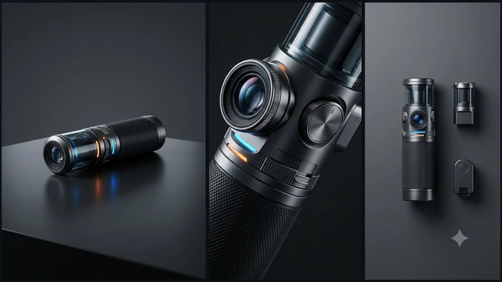

휴대용 게이밍 PC 시장의 표준을 세운 밸브(Valve)의 차세대 UMPC인 **스팀덱 2 출시** 일정이 2027년 전후로 조율되었다는 소식이 전해지며 유저들의 고민이 깊어졌습니다. 현역 플래그십인 스팀덱 OLED를 당장 집어 들어야 할지, 아니면 차세대 핸드헬드 콘솔이 나올 때까지 인내해야 할지 셈법이 갈립니다. 기기 교체 주기와 하드웨어 전력 효율 관점에서 스팀덱 2 출시 지연 배경과 똑똑한 소비 기준을 짚어봅니다.

## 밸브가 스팀덱 2 출시를 서두르지 않는 이유

### 전력 효율 중심의 세대교체 철학
밸브 하드웨어 엔지니어링 팀은 무리하게 클럭을 쥐어짜 배터리와 발열을 희생시키는 개발 방식을 철저히 경계합니다. 폼팩터 특성상 15W 안팎의 TDP(열설계전력) 구간에서 눈에 띄는 체감 성능 도약이 일어나야 진정한 후속작 넘버링을 붙이겠다는 방침입니다. 클럭을 끌어올려 벤치마크 점수만 부풀린 반쪽짜리 신제품 대신, 배터리 타임을 해치지 않는 온전한 도약을 목표로 둡니다.

### 콘솔급 단일 아키텍처 생태계 유지
스팀덱 흥행을 견인한 일등 공신은 하드웨어 파편화를 억누르고 구축한 '스팀덱 완벽 호환(Deck Verified)' 인증 체계입니다. 섣부른 후속작 투입은 최적화 기준점을 흐려 장기적인 개발사 지원 동력을 떨어뜨립니다. 밸브는 단일 스펙 보급률을 바탕으로 최적화 라이브러리를 두텁게 쌓는 기간을 전략적으로 확보하는 그림을 그립니다.

### 아키텍처 전환기의 관망세
AMD RDNA 3.5 기반 칩셋이나 모바일용 RDNA 4 루머가 돌고 있으나, 휴대용 저전력 구간에서의 전성비 비약은 여전히 물음표가 붙습니다. 밸브는 실사용 배터리와 렌더링 효율이 실질적으로 2배 이상 뛰는 기술적 특이점을 기다리고 있습니다.

## 스팀덱 2 출시 연기 속 현행 OLED 모델의 경쟁력

### 전성비와 디스플레이 완성도
스팀덱 OLED는 6nm 공정 세피로스(Sephiroth) APU를 얹어 기존 구형 LCD 버전의 조루 배터리 문제를 말끔히 씻어냈습니다. 90Hz 주사율과 1,000니트 피크 밝기를 뿜어내는 HDR OLED 패널은 7.4인치 화면에서 대체 불가능한 암부 표현력을 뽐냅니다.

> AAA급 타이틀 구동 시 15W TDP 안에서 팬 소음과 섀시 발열을 이 정도로 억누른 휴대용 PC는 여전히 손에 꼽힙니다.

이동 중 장시간 플레이할 때 휴대용 충전 장비와의 합도 매끄럽습니다. 군더더기 없는 모바일 게이밍 환경을 짤 때는 손가락만 한 초소형 고속 충전기가 필수인데, 관련 세팅 팁은 [GaN 충전기, 2026년 진짜 사야 할 숨은 꿀템 3선](/posts/it-devices/supertiny-gan-charger-travel-tech-2026/) 글에서 참고할 수 있습니다.

### 스팀OS의 압도적인 슬립 모드 안정성
윈도우 UMPC 진영이 끝내 완벽히 풀어내지 못한 숙제가 바로 휴대용 콘솔 특유의 '즉각 절전 및 복귀(Suspend/Resume)' 기능입니다. 스팀OS는 리눅스 커널 기반 프로톤(Proton) 호환 레이어를 바탕으로 게임 한가운데서 전원 버튼을 딸깍 눌러 재우고, 몇 초 만에 원래 플레이 화면으로 정확히 복귀합니다.

- 대기 상태 전력 누수 억제
- 백그라운드 윈도우 업데이트로 인한 튕김 원천 차단
- 닌텐도 스위치에 필적하는 즉시 구동 쾌적함

### 중고 감가 방어율과 서드파티 액세서리 생태계
글로벌 단일 규격으로 깔린 기기 대수가 워낙 방대해 전용 케이스, 독(Dock), 홀 이펙트 교체용 아날로그 스틱 모듈 등 서드파티 생태계가 촘촘합니다. 차세대 기기 출시가 2027년으로 늦춰진 덕분에 중고 장터 감가 방어선 역시 윈도우 계열 기기들보다 훨씬 견고합니다.

## 경쟁 핸드헬드 기기와의 현실적인 선택 비교

### 윈도우 UMPC와의 하드웨어 격차
ROG Ally X나 리전 고 같은 윈도우 기기들은 Z1 익스트림 칩셋을 품고 25W 이상 고전력 모드에서 스팀덱보다 높은 프레임을 뽑아냅니다. 엑스박스 게임패스, 에픽게임즈, 독자 안티치트가 걸린 온라인 FPS를 돌리려면 윈도우 환경이 필수적입니다. 다만 충전기를 뽑는 순간 급격히 녹아내리는 배터리 타임과 묵직한 무게는 감수해야 할 몫입니다.

### 클라우드 스트리밍과 홈 리모트 플레이
고사양 데스크톱 본체를 갖추고 있다면 스팀덱의 성능 상한선은 문라이트(Moonlight)나 스팀 인홈 스트리밍으로 가볍게 뚫어냅니다. Wi-Fi 6E를 지원하는 스팀덱 OLED의 무선 모듈 덕에 지연 시간을 거의 느끼지 않고 풀옵션 그래픽을 손안에서 즐길 수 있습니다. 미래 무선 통신 규격 흐름이 궁금하다면 [Wi-Fi 8 공유기 진짜 살까? 2026 차세대 네트워크 완전 정리](/posts/it-devices/wifi-8-next-gen-router-trend-2026/) 내용을 함께 확인해 보는 것도 좋습니다.

## 구매 가이드와 라이프스타일별 최적의 선택

### 지금 바로 스팀덱 OLED를 사야 하는 유형
- 인디 게임, 로그라이크, JRPG, 에뮬레이터 위주로 서재를 채운 게이머
- 윈도우 드라이버 충돌이나 복잡한 설정 없이 눕자마자 게임을 켜고 싶은 유저
- 비행기나 기차 안에서 팬 굉음 없이 정숙한 플레이를 원하는 이용자

### 스팀덱 2 혹은 차세대 기기를 기다려야 하는 유형
언리얼 엔진 5 기반의 최신 고사양 오픈월드 게임을 오직 기기 자체 연산만으로 60프레임 방어하길 원한다면 지금 스팀덱은 갈증을 남길 수밖에 없습니다. 발로란트나 FC 25처럼 전용 안티치트가 필수인 멀티플레이 게임을 주력으로 삼는다면 차세대 칩셋의 전성비 도약이나 윈도우 UMPC 라인업의 전력 개선을 지켜보는 선택이 현명합니다.

스팀덱 OLED는 1세대 폼팩터의 완성판에 가까운 하드웨어이며, 차세대 출시까지 최소 수분기 이상 공백이 남은 만큼 현시점 입문 가치는 여전히 탄탄합니다.

[스팀덱 OLED 및 휴대용 게이밍 기기 쿠팡에서 보기](https://www.coupang.com/np/search?q=%EC%8A%A4%ED%8C%80%EB%8D%B1%20OLED%20%EA%B2%8C%EC%9D%B4%EB%B0%8D%20UMPC&sourceType=affiliate&trackingCode=AF8691300)

#스팀덱2 #스팀덱출시일 #스팀덱OLED #UMPC추천 #휴대용게임기 #스팀OS #스팀덱배터리 #핸드헬드콘솔